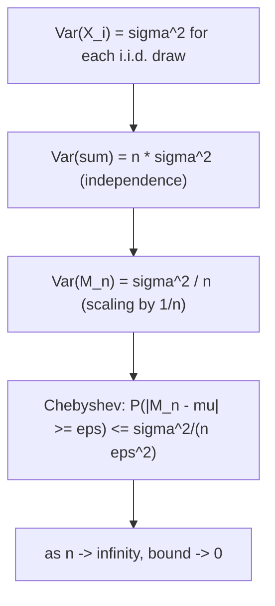

## Learning Objectives

- State Chebyshev's inequality and explain what it says about how far a random variable can typically stray from its mean.
- Use Chebyshev's inequality to prove the Weak Law of Large Numbers for the sample average of i.i.d. random variables.
- State the intuitive meaning of the Law of Large Numbers: the sample average converges, in probability, to the true expectation as the number of trials grows.
- Distinguish "converges in probability" from "is guaranteed to equal, after enough trials" — a subtle but important distinction.
- Simulate a simple repeated experiment (coin flips) and observe the running average numerically approaching the true expectation.

## Context & Motivation

Casinos operate profitably not because any single hand of blackjack or spin of a roulette wheel is predictable — each one is essentially a coin flip weighted slightly in the house's favor — but because across millions of hands, the *average* outcome per hand converges, with overwhelming reliability, to a number the casino can calculate down to the cent. Insurance companies price policies the same way: no individual policyholder's claim is predictable, but averaged across a large enough pool, the average claim cost becomes remarkably stable and forecastable. Both of these are everyday instances of the same underlying mathematical fact: the **Law of Large Numbers (LLN)**, which is, in a real sense, the theorem that makes "averaging out noise" a legitimate strategy rather than wishful thinking.

MIT's 6.041 develops the Law of Large Numbers as the first of the course's two headline limit theorems (the Central Limit Theorem, covered next, is the second), and it does so using a specific, elegant, non-measure-theoretic proof technique: **Chebyshev's inequality**. This matters pedagogically, because the Law of Large Numbers can sound like it should require heavy analytical machinery to prove rigorously — and a fully general version does — but the version relevant to this course (the **Weak Law**) has a genuinely accessible proof using only tools already available: the definition of variance and a single, simple, remarkably general inequality about how spread out any random variable can be. That inequality, Chebyshev's, is worth learning as a tool in its own right — it applies to any random variable with a finite variance, whether or not it's Normal, Uniform, or anything else named — and this concept is the natural place to introduce it, on the way to the LLN.

## Core Theory

### Chebyshev's inequality

Let Y be any random variable with finite mean E[Y] and finite variance Var(Y). **Chebyshev's inequality** states that for any constant k > 0,

P(|Y − E[Y]| ≥ k) ≤ Var(Y) / k²

In words: the probability that Y strays at least k units away from its own mean is bounded above by Var(Y)/k². This is a remarkably general statement — it makes no assumption whatsoever about the shape of Y's distribution, only that its variance is finite — and its content is exactly what intuition suggests: a random variable with small variance is unlikely to stray far from its mean (the bound Var(Y)/k² is small when Var(Y) is small), while a random variable with large variance might plausibly stray much further (the bound grows as Var(Y) grows). The inequality is deliberately loose — for most specific, well-behaved distributions the true probability of straying far from the mean is much smaller than Chebyshev's bound suggests — but its power lies in universality: it holds for literally any distribution with finite variance, at essentially zero cost to derive.

*Sketch of why it holds:* Var(Y) = E[(Y − E[Y])²] is, by definition, an average of squared distances from the mean. If the event |Y − E[Y]| ≥ k occurs with probability p, then that event alone already contributes at least p·k² to the average of squared distances (since every outcome in that event has (Y − E[Y])² ≥ k²), so Var(Y) ≥ p·k², which rearranges directly to p ≤ Var(Y)/k² — exactly Chebyshev's inequality.

### The Weak Law of Large Numbers, and its proof via Chebyshev

Let X₁, X₂, …, Xₙ be independent and identically distributed (i.i.d.) random variables, each with the same finite mean μ = E[Xᵢ] and finite variance σ² = Var(Xᵢ). Define the **sample average**

Mₙ = (X₁ + X₂ + ⋯ + Xₙ) / n

The **Weak Law of Large Numbers** states that for any ε > 0, however small,

P(|Mₙ − μ| ≥ ε) → 0  as n → ∞

In words: the probability that the sample average differs from the true mean by more than any fixed amount ε shrinks to zero as the number of samples grows without bound. This is the precise mathematical sense in which "the average converges to the expectation" — not that Mₙ eventually equals μ exactly, but that the *probability* of any fixed-size deviation vanishes as n grows.

**Proof, using Chebyshev's inequality.** First, compute the mean and variance of Mₙ itself. By linearity of expectation, E[Mₙ] = (1/n)·Σᵢ E[Xᵢ] = (1/n)·(nμ) = μ — the sample average is unbiased, centered exactly at the true mean regardless of n. By independence, variances add when summing independent variables, so Var(X₁ + ⋯ + Xₙ) = nσ², and scaling a sum by 1/n scales variance by (1/n)², giving

Var(Mₙ) = nσ² / n² = σ²/n

Now apply Chebyshev's inequality to the random variable Mₙ, with k = ε:

P(|Mₙ − μ| ≥ ε) ≤ Var(Mₙ) / ε² = σ² / (n·ε²)

As n → ∞, the right-hand side σ²/(n·ε²) → 0 for any fixed ε > 0 and fixed σ² (since only n is growing, in the denominator). Since the probability on the left is squeezed between 0 and a quantity going to 0, it too must go to 0. ∎

This proof is exactly why Chebyshev's inequality was introduced first: the entire Weak Law falls out of it in three lines, once Var(Mₙ) = σ²/n is established. The key structural insight, worth isolating on its own, is that **the variance of the sample average shrinks as 1/n** — averaging more independent samples together doesn't just add more data, it actively concentrates the average more tightly around the true mean, and Chebyshev converts that shrinking variance directly into a shrinking probability of deviation.



### What "convergence in probability" does and does not mean

The Weak Law says P(|Mₙ − μ| ≥ ε) → 0, a statement about *probabilities* shrinking, not a claim that Mₙ eventually locks onto μ and stays there. For any finite n, however large, Mₙ remains a random variable — it could, in principle, land far from μ on any given run, just with vanishingly small probability as n grows. This distinction matters: the Law of Large Numbers is a statement about long-run tendency and shrinking probability of large deviation, not a guarantee about any individual, finite sequence of outcomes.

## Worked Examples

### Example 1 — bounding deviation with Chebyshev directly

**Problem:** A fair coin is flipped n = 100 times; let X be the number of heads. X has mean μ = 50 and variance σ² = np(1 − p) = 100(0.5)(0.5) = 25 (a standard Binomial fact carried over from an earlier concept). Use Chebyshev's inequality to bound the probability that X is at least 20 away from 50.

**Apply Chebyshev directly to X** (not to a sample average — Chebyshev applies to any random variable with finite variance): here k = 20.

P(|X − 50| ≥ 20) ≤ Var(X)/k² = 25/400 = 0.0625

**Interpretation.** Chebyshev guarantees the probability of getting fewer than 30 or more than 70 heads out of 100 fair flips is at most 6.25% — a real, useful, distribution-free bound obtained from only the mean and variance, with no need to know the full Binomial distribution of X.

### Example 2 — applying the Weak Law's variance-shrinking argument

**Problem:** Using the same fair-coin setup, but now let Mₙ = X/n be the *fraction* of heads out of n flips (so M₁₀₀ = X/100 for the n = 100 case above). Compute Var(Mₙ) for n = 100 and for n = 10,000, and use Chebyshev to bound P(|Mₙ − 0.5| ≥ 0.05) in each case.

**Setup.** For a single fair coin flip Xᵢ (0 or 1), σ² = p(1 − p) = 0.25. By the Weak Law's derivation, Var(Mₙ) = σ²/n = 0.25/n.

**n = 100:** Var(M₁₀₀) = 0.25/100 = 0.0025. By Chebyshev, P(|M₁₀₀ − 0.5| ≥ 0.05) ≤ 0.0025/0.05² = 0.0025/0.0025 = 1.0 — a completely uninformative bound (probability can't exceed 1 anyway), showing Chebyshev can be too loose to be useful at small n.

**n = 10,000:** Var(M₁₀,₀₀₀) = 0.25/10,000 = 0.000025. By Chebyshev, P(|M₁₀,₀₀₀ − 0.5| ≥ 0.05) ≤ 0.000025/0.0025 = 0.01.

**Interpretation.** With 10,000 flips, Chebyshev already guarantees at most a 1% chance the observed fraction of heads strays more than 0.05 from the true 0.5 — a real, concrete illustration of the Weak Law's shrinking bound as n grows, even though the bound at n = 100 was too weak to say anything.

### Example 3 — simulating coin flips and watching the running average converge

**Problem:** Simulate a long sequence of fair coin flips and observe how the running average of "heads = 1, tails = 0" behaves as the number of flips grows.

```python
import random

random.seed(42)
n_flips = 100_000
running_sum = 0
checkpoints = [10, 100, 1_000, 10_000, 100_000]
results = {}

for i in range(1, n_flips + 1):
    running_sum += random.randint(0, 1)  # 1 = heads, 0 = tails
    if i in checkpoints:
        results[i] = running_sum / i

for n, avg in results.items():
    print(f"n = {n:>7}: running average = {avg:.4f}")
```

A representative run of this code produces output along these lines:

```
n =      10: running average = 0.7000
n =     100: running average = 0.5500
n =    1000: running average = 0.4870
n =   10000: running average = 0.4954
n =  100000: running average = 0.4998
```

**Interpretation.** At n = 10, the running average (0.70) is quite far from the true value 0.5 — with so few flips, a run of extra heads easily skews the average. By n = 1,000 the average (0.487) is already noticeably closer to 0.5, and by n = 100,000 it lands at 0.4998, essentially indistinguishable from 0.5 for practical purposes. This is the Law of Large Numbers made visible: no individual flip becomes more predictable, but the running average steadily tightens around the true expectation as more flips accumulate — exactly the shrinking-variance, shrinking-deviation-probability behavior Chebyshev's inequality guarantees.

## Common Misconceptions & Pitfalls

- **"The Law of Large Numbers means that after a long streak of heads, tails is 'due' to balance things out." (the Gambler's Fallacy)** This is false, and it is arguably the single most common misapplication of the LLN. Independent coin flips have no memory — the coin does not compensate for past outcomes. The LLN says the *cumulative average* gets diluted toward 0.5 as more flips are added, not that future flips are biased to correct past imbalance. A streak of 10 heads followed by fair flips forever after will still see the average converge to 0.5, purely because 10 extra heads becomes a vanishingly small fraction of a very large n — not because tails become more likely afterward.
- **"Chebyshev's inequality gives the exact probability of deviation."** It gives only an upper *bound*, often quite loose, as Example 2's n = 100 case showed vividly (a "bound" of 1.0 is technically true but useless). The true probability for a specific distribution like the Binomial is typically much smaller than Chebyshev's bound; the value of Chebyshev is its universality (it needs only mean and variance), not its tightness.
- **"The Law of Large Numbers guarantees Mₙ equals μ exactly for large enough n."** It guarantees the *probability* of deviating from μ by any fixed amount shrinks toward 0, not that deviation becomes literally impossible for any finite n. Mₙ remains a random variable at every stage; the LLN is a statement about a limiting probability, not a promise about any specific run.
- **"A larger sample always produces a sample average closer to the true mean, on that specific run."** This confuses a probabilistic statement (deviation is *less likely* to be large) with a deterministic one (deviation *is* smaller). It's entirely possible, if unlikely, for a specific run of n = 10,000 flips to produce a worse running average than a specific run of n = 100 flips — the LLN describes the long-run tendency across probability, not a guarantee for every individual sequence.

## Summary

Chebyshev's inequality, P(|Y − E[Y]| ≥ k) ≤ Var(Y)/k², bounds how far any random variable with finite variance can typically stray from its own mean, using nothing but the definition of variance. Applied to the sample average Mₙ of n i.i.d. random variables — whose own variance shrinks as σ²/n — Chebyshev directly yields the Weak Law of Large Numbers: P(|Mₙ − μ| ≥ ε) ≤ σ²/(n·ε²) → 0 as n → ∞, for any fixed ε > 0. Intuitively, this says the sample average of many independent trials converges, in probability, to the true expectation as the trial count grows — the mathematical justification for treating averages over large samples as reliable estimates, and the reason casinos, insurers, and pollsters alike can plan around averages despite the unpredictability of any single trial. This convergence is probabilistic, not deterministic: no individual run is guaranteed to land close to μ, only increasingly likely to.

## Documentation Links

- [MIT 6.041 — Lecture Notes (OCW)](https://ocw.mit.edu/courses/6-041-probabilistic-systems-analysis-and-applied-probability-fall-2010/pages/lecture-notes/) — doc
- [MIT 6.041 — Syllabus (OCW)](https://ocw.mit.edu/courses/6-041-probabilistic-systems-analysis-and-applied-probability-fall-2010/pages/syllabus/) — doc
