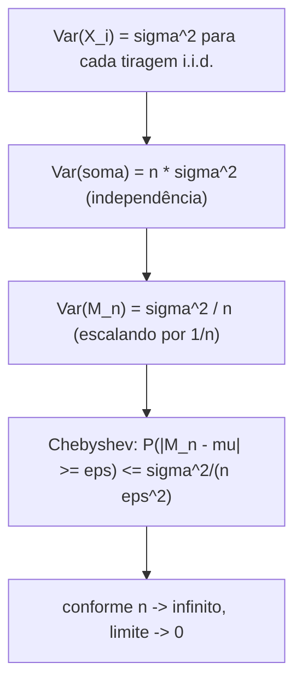

## Objetivos de Aprendizagem

- Declarar a desigualdade de Chebyshev e explicar o que ela diz sobre quão longe uma variável aleatória tipicamente pode se desviar de sua média.
- Usar a desigualdade de Chebyshev para provar a Lei Fraca dos Grandes Números para a média amostral de variáveis aleatórias i.i.d.
- Declarar o significado intuitivo da Lei dos Grandes Números: a média amostral converge, em probabilidade, para a verdadeira esperança conforme o número de tentativas cresce.
- Distinguir "converge em probabilidade" de "é garantido ser igual, depois de tentativas suficientes", uma distinção sutil mas importante.
- Simular um experimento repetido simples (lançamentos de moeda) e observar a média corrente se aproximando numericamente da verdadeira esperança.

## Contexto e Motivação

Cassinos operam lucrativamente não porque qualquer mão individual de blackjack ou giro de roleta seja previsível (cada um é essencialmente um lançamento de moeda ponderado levemente a favor da casa), mas porque através de milhões de mãos, o resultado *médio* por mão converge, com confiabilidade esmagadora, para um número que o cassino consegue calcular até o centavo. Seguradoras precificam apólices da mesma forma: o sinistro de nenhum segurado individual é previsível, mas médio através de um conjunto grande o suficiente, o custo médio de sinistro se torna notavelmente estável e previsível. Ambos são instâncias do dia a dia do mesmo fato matemático subjacente: a **Lei dos Grandes Números (LGN)**, que é, num sentido real, o teorema que torna "tirar a média do ruído" uma estratégia legítima em vez de pensamento positivo sem base.

O 6.041 do MIT desenvolve a Lei dos Grandes Números como o primeiro dos dois teoremas de limite principais do curso (o Teorema Central do Limite, coberto a seguir, é o segundo), e faz isso usando uma técnica de prova específica, elegante e não baseada em teoria da medida: a **desigualdade de Chebyshev**. Isso importa pedagogicamente, porque a Lei dos Grandes Números pode soar como se devesse exigir maquinaria analítica pesada para provar rigorosamente, e uma versão totalmente geral exige, mas a versão relevante para este curso (a **Lei Fraca**) tem uma prova genuinamente acessível usando só ferramentas já disponíveis: a definição de variância e uma única desigualdade simples e notavelmente geral sobre quão espalhada qualquer variável aleatória pode ser. Essa desigualdade, a de Chebyshev, vale a pena aprender como ferramenta em si mesma (se aplica a qualquer variável aleatória com variância finita, seja Normal, Uniforme, ou qualquer outra nomeada), e este conceito é o lugar natural para introduzi-la, a caminho da LGN.

## Teoria Central

### A desigualdade de Chebyshev

Seja Y qualquer variável aleatória com média finita E[Y] e variância finita Var(Y). A **desigualdade de Chebyshev** declara que para qualquer constante k > 0,

P(|Y − E[Y]| ≥ k) ≤ Var(Y) / k²

Em palavras: a probabilidade de Y se desviar pelo menos k unidades de sua própria média é limitada superiormente por Var(Y)/k². Esta é uma afirmação notavelmente geral, não faz suposição alguma sobre a forma da distribuição de Y, só que sua variância é finita, e seu conteúdo é exatamente o que a intuição sugere: uma variável aleatória com variância pequena é improvável de se desviar muito de sua média (o limite Var(Y)/k² é pequeno quando Var(Y) é pequena), enquanto uma variável aleatória com variância grande poderia plausivelmente se desviar muito mais (o limite cresce conforme Var(Y) cresce). A desigualdade é deliberadamente frouxa (para a maioria das distribuições específicas e bem comportadas a probabilidade verdadeira de se desviar muito da média é muito menor do que o limite de Chebyshev sugere), mas seu poder está na universalidade: vale para literalmente qualquer distribuição com variância finita, a essencialmente custo zero para derivar.

*Esboço de por que vale:* Var(Y) = E[(Y − E[Y])²] é, por definição, uma média de distâncias quadradas da média. Se o evento |Y − E[Y]| ≥ k ocorre com probabilidade p, então esse evento sozinho já contribui pelo menos p·k² para a média das distâncias quadradas (já que todo resultado naquele evento tem (Y − E[Y])² ≥ k²), então Var(Y) ≥ p·k², que se rearranja diretamente para p ≤ Var(Y)/k², exatamente a desigualdade de Chebyshev.

### A Lei Fraca dos Grandes Números, e sua prova via Chebyshev

Sejam X₁, X₂, …, Xₙ variáveis aleatórias independentes e identicamente distribuídas (i.i.d.), cada uma com a mesma média finita μ = E[Xᵢ] e a mesma variância finita σ² = Var(Xᵢ). Defina a **média amostral**

Mₙ = (X₁ + X₂ + ⋯ + Xₙ) / n

A **Lei Fraca dos Grandes Números** declara que para qualquer ε > 0, por menor que seja,

P(|Mₙ − μ| ≥ ε) → 0  conforme n → ∞

Em palavras: a probabilidade de a média amostral diferir da verdadeira média por mais que qualquer quantidade fixa ε encolhe para zero conforme o número de amostras cresce sem limite. Esse é o sentido matemático preciso em que "a média converge para a esperança": não que Mₙ eventualmente se iguale a μ exatamente, mas que a *probabilidade* de qualquer desvio de tamanho fixo desaparece conforme n cresce.

**Prova, usando a desigualdade de Chebyshev.** Primeiro, compute a média e a variância da própria Mₙ. Por linearidade da esperança, E[Mₙ] = (1/n)·Σᵢ E[Xᵢ] = (1/n)·(nμ) = μ, a média amostral é não viesada, centrada exatamente na verdadeira média independentemente de n. Por independência, variâncias somam ao somar variáveis independentes, então Var(X₁ + ⋯ + Xₙ) = nσ², e escalar uma soma por 1/n escala a variância por (1/n)², dando

Var(Mₙ) = nσ² / n² = σ²/n

Agora aplique a desigualdade de Chebyshev à variável aleatória Mₙ, com k = ε:

P(|Mₙ − μ| ≥ ε) ≤ Var(Mₙ) / ε² = σ² / (n·ε²)

Conforme n → ∞, o lado direito σ²/(n·ε²) → 0 para qualquer ε > 0 fixo e σ² fixo (já que só n está crescendo, no denominador). Como a probabilidade no lado esquerdo está espremida entre 0 e uma quantidade indo para 0, ela também precisa ir para 0. ∎

Esta prova é exatamente por que a desigualdade de Chebyshev foi introduzida primeiro: a Lei Fraca inteira decorre dela em três linhas, uma vez que Var(Mₙ) = σ²/n é estabelecida. A percepção estrutural chave, valendo a pena isolar sozinha, é que **a variância da média amostral encolhe como 1/n**: fazer a média de mais amostras independentes juntas não só adiciona mais dados, ativamente concentra a média mais firmemente ao redor da verdadeira média, e Chebyshev converte essa variância encolhendo diretamente numa probabilidade de desvio encolhendo.



### O que "convergência em probabilidade" significa e não significa

A Lei Fraca diz P(|Mₙ − μ| ≥ ε) → 0, uma afirmação sobre *probabilidades* encolhendo, não uma afirmação de que Mₙ eventualmente trava em μ e fica ali. Para qualquer n finito, por maior que seja, Mₙ permanece uma variável aleatória; poderia, em princípio, cair longe de μ em qualquer execução dada, só com probabilidade cada vez menor conforme n cresce. Essa distinção importa: a Lei dos Grandes Números é uma afirmação sobre tendência de longo prazo e probabilidade de grande desvio encolhendo, não uma garantia sobre qualquer sequência individual e finita de resultados.

## Exemplos Resolvidos

### Exemplo 1: limitando desvio com Chebyshev diretamente

**Problema:** uma moeda justa é lançada n = 100 vezes; seja X o número de caras. X tem média μ = 50 e variância σ² = np(1 − p) = 100(0,5)(0,5) = 25 (um fato Binomial padrão trazido de um conceito anterior). Use a desigualdade de Chebyshev para limitar a probabilidade de X estar pelo menos 20 longe de 50.

**Aplica Chebyshev diretamente a X** (não a uma média amostral, Chebyshev se aplica a qualquer variável aleatória com variância finita): aqui k = 20.

P(|X − 50| ≥ 20) ≤ Var(X)/k² = 25/400 = 0,0625

**Interpretação.** Chebyshev garante que a probabilidade de obter menos de 30 ou mais de 70 caras em 100 lançamentos justos é no máximo 6,25%, um limite real e útil, livre de distribuição, obtido só da média e variância, sem precisar saber a distribuição Binomial completa de X.

### Exemplo 2: aplicando o argumento de variância encolhendo da Lei Fraca

**Problema:** usando a mesma configuração de moeda justa, mas agora seja Mₙ = X/n a *fração* de caras em n lançamentos (então M₁₀₀ = X/100 para o caso n = 100 acima). Compute Var(Mₙ) para n = 100 e para n = 10.000, e use Chebyshev para limitar P(|Mₙ − 0,5| ≥ 0,05) em cada caso.

**Configuração.** Para um único lançamento de moeda justa Xᵢ (0 ou 1), σ² = p(1 − p) = 0,25. Pela derivação da Lei Fraca, Var(Mₙ) = σ²/n = 0,25/n.

**n = 100:** Var(M₁₀₀) = 0,25/100 = 0,0025. Por Chebyshev, P(|M₁₀₀ − 0,5| ≥ 0,05) ≤ 0,0025/0,05² = 0,0025/0,0025 = 1,0, um limite completamente não informativo (probabilidade não pode exceder 1 de qualquer forma), mostrando que Chebyshev pode ser frouxo demais para ser útil em n pequeno.

**n = 10.000:** Var(M₁₀.₀₀₀) = 0,25/10.000 = 0,000025. Por Chebyshev, P(|M₁₀.₀₀₀ − 0,5| ≥ 0,05) ≤ 0,000025/0,0025 = 0,01.

**Interpretação.** Com 10.000 lançamentos, Chebyshev já garante no máximo 1% de chance de a fração observada de caras se desviar mais que 0,05 do verdadeiro 0,5, uma ilustração real e concreta do limite encolhendo da Lei Fraca conforme n cresce, mesmo que o limite em n = 100 fosse fraco demais para dizer qualquer coisa.

### Exemplo 3: simulando lançamentos de moeda e observando a média corrente convergir

**Problema:** simule uma longa sequência de lançamentos de moeda justa e observe como a média corrente de "cara = 1, coroa = 0" se comporta conforme o número de lançamentos cresce.

```python
import random

random.seed(42)
n_lancamentos = 100_000
soma_corrente = 0
pontos_de_checagem = [10, 100, 1_000, 10_000, 100_000]
resultados = {}

for i in range(1, n_lancamentos + 1):
    soma_corrente += random.randint(0, 1)  # 1 = cara, 0 = coroa
    if i in pontos_de_checagem:
        resultados[i] = soma_corrente / i

for n, media in resultados.items():
    print(f"n = {n:>7}: média corrente = {media:.4f}")
```

Uma execução representativa deste código produz saída ao longo destas linhas:

```
n =      10: média corrente = 0.7000
n =     100: média corrente = 0.5500
n =    1000: média corrente = 0.4870
n =   10000: média corrente = 0.4954
n =  100000: média corrente = 0.4998
```

**Interpretação.** Em n = 10, a média corrente (0,70) está bem longe do valor verdadeiro 0,5; com tão poucos lançamentos, uma sequência de caras extras facilmente enviesa a média. Em n = 1.000 a média (0,487) já está notavelmente mais perto de 0,5, e em n = 100.000 cai em 0,4998, essencialmente indistinguível de 0,5 para propósitos práticos. Isso é a Lei dos Grandes Números tornada visível: nenhum lançamento individual se torna mais previsível, mas a média corrente firma constantemente ao redor da verdadeira esperança conforme mais lançamentos se acumulam, exatamente o comportamento de variância encolhendo e probabilidade de desvio encolhendo que a desigualdade de Chebyshev garante.

## Equívocos Comuns e Armadilhas

- **"A Lei dos Grandes Números significa que depois de uma longa sequência de caras, coroa está 'devida' para equilibrar as coisas." (a Falácia do Apostador)** Isso é falso, e é indiscutivelmente a aplicação incorreta mais comum da LGN. Lançamentos de moeda independentes não têm memória; a moeda não compensa resultados passados. A LGN diz que a *média cumulativa* é diluída em direção a 0,5 conforme mais lançamentos são adicionados, não que lançamentos futuros são enviesados para corrigir o desequilíbrio passado. Uma sequência de 10 caras seguida de lançamentos justos para sempre depois ainda vai ver a média convergir para 0,5, puramente porque 10 caras extras se torna uma fração cada vez menor de um n muito grande, não porque coroa se torna mais provável depois.
- **"A desigualdade de Chebyshev dá a probabilidade exata de desvio."** Ela dá só um *limite* superior, frequentemente bem frouxo, como o caso n = 100 do Exemplo 2 mostrou vividamente (um "limite" de 1,0 é tecnicamente verdadeiro mas inútil). A probabilidade verdadeira para uma distribuição específica como a Binomial é tipicamente muito menor que o limite de Chebyshev; o valor de Chebyshev é sua universalidade (só precisa de média e variância), não sua precisão.
- **"A Lei dos Grandes Números garante que Mₙ é igual a μ exatamente para n suficientemente grande."** Ela garante que a *probabilidade* de se desviar de μ por qualquer quantidade fixa encolhe em direção a 0, não que o desvio se torna literalmente impossível para qualquer n finito. Mₙ permanece uma variável aleatória em todo estágio; a LGN é uma afirmação sobre uma probabilidade limite, não uma promessa sobre qualquer execução específica.
- **"Uma amostra maior sempre produz uma média amostral mais perto da verdadeira média, naquela execução específica."** Isso confunde uma afirmação probabilística (desvio é *menos provável* de ser grande) com uma determinística (desvio *é* menor). É inteiramente possível, ainda que improvável, que uma execução específica de n = 10.000 lançamentos produza uma média corrente pior que uma execução específica de n = 100 lançamentos; a LGN descreve a tendência de longo prazo através de probabilidade, não uma garantia para toda sequência individual.

## Resumo

A desigualdade de Chebyshev, P(|Y − E[Y]| ≥ k) ≤ Var(Y)/k², limita quão longe qualquer variável aleatória com variância finita tipicamente pode se desviar de sua própria média, usando nada além da definição de variância. Aplicada à média amostral Mₙ de n variáveis aleatórias i.i.d., cuja própria variância encolhe como σ²/n, Chebyshev produz diretamente a Lei Fraca dos Grandes Números: P(|Mₙ − μ| ≥ ε) ≤ σ²/(n·ε²) → 0 conforme n → ∞, para qualquer ε > 0 fixo. Intuitivamente, isso diz que a média amostral de muitas tentativas independentes converge, em probabilidade, para a verdadeira esperança conforme a contagem de tentativas cresce, a justificativa matemática para tratar médias sobre grandes amostras como estimativas confiáveis, e a razão pela qual cassinos, seguradoras e pesquisadores igualmente podem planejar em torno de médias apesar da imprevisibilidade de qualquer tentativa única. Essa convergência é probabilística, não determinística: nenhuma execução individual é garantida cair perto de μ, só cada vez mais provável de o fazer.

## Documentation Links

- [MIT 6.041 — Lecture Notes (OCW)](https://ocw.mit.edu/courses/6-041-probabilistic-systems-analysis-and-applied-probability-fall-2010/pages/lecture-notes/) — doc
- [MIT 6.041 — Syllabus (OCW)](https://ocw.mit.edu/courses/6-041-probabilistic-systems-analysis-and-applied-probability-fall-2010/pages/syllabus/) — doc
