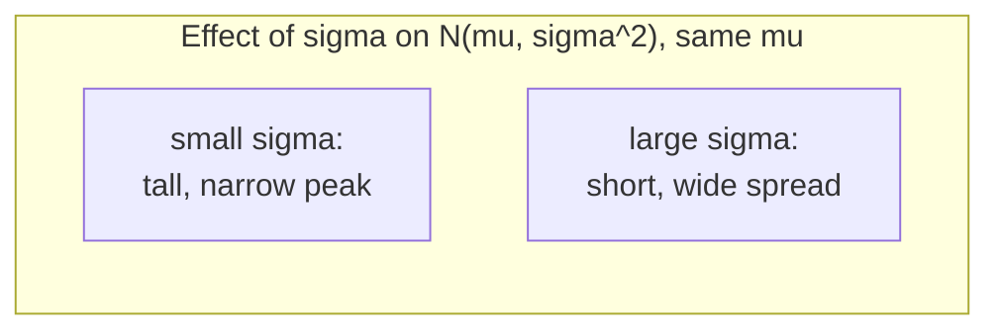

## Learning Objectives

- State the PDF of the Normal distribution N(μ, σ²) and identify the role of μ (center) and σ (spread) in its shape.
- Apply the empirical 68-95-99.7 rule to estimate probabilities without a Z-table.
- Standardize any Normal random variable via Z = (X − μ)/σ and use a Z-table (or its symmetry) to compute probabilities.
- Explain, at a preview level, why the Normal distribution appears so pervasively in natural and statistical phenomena.
- Recognize the Normal distribution's symmetry and use it to compute probabilities for values below the mean without re-deriving them from scratch.

## Context & Motivation

Open almost any dataset of naturally occurring measurements — heights of adult humans, measurement errors in a physics experiment, standardized test scores, blood pressure readings — and, plotted as a histogram, an uncanny number of them settle into the same unmistakable bell shape: a single peak at the center, falling off symmetrically and smoothly on both sides, with extreme values becoming rapidly rarer the further they sit from the center. This shape is the **Normal distribution** (also called the **Gaussian distribution**, after Carl Friedrich Gauss, though it was independently studied by others), and it is, without serious competition, the single most important continuous distribution in all of probability and statistics. Both Stanford's CS109 and Harvard's Stat 110 treat the Normal distribution as a load-bearing topic for exactly this reason: an extraordinary fraction of applied statistics — confidence intervals, hypothesis tests, quality control charts, standardized scoring — is built directly on Normal-distribution machinery.

It is worth being upfront about *why* the Normal distribution shows up so relentlessly across such wildly different domains, even though the full explanation is the very next concept in this course: the **Central Limit Theorem**. The short preview is that when a quantity results from adding up many small, independent, roughly comparable effects — human height from countless genetic and environmental factors, a measurement error from countless tiny sources of noise, an exam score from countless individually-answered questions — the *sum* of all those effects tends toward a Normal shape almost automatically, regardless of what any one individual effect looked like on its own. That is a genuinely deep and useful mathematical fact, and this concept intentionally sets up all the vocabulary and mechanics — the PDF, the empirical rule, standardization — needed to state and use that theorem cleanly once it's introduced properly.

For now, treat the Normal distribution as a known, extremely well-studied shape: a distribution completely characterized by exactly two parameters, its mean μ and its standard deviation σ, which together dictate everything about where it's centered and how spread out it is.

## Core Theory

### The Normal PDF

A continuous random variable X is **Normally distributed** with mean μ and variance σ² — written X ~ N(μ, σ²) — if its probability density function is

f(x) = (1 / (σ√(2π))) · e^(−(x − μ)² / (2σ²))

for all real x. This formula is stated here, not derived — deriving it from first principles requires tools beyond this course's prerequisites — but its shape is worth reading carefully even without a derivation. The exponent is a negative multiple of (x − μ)², which is zero exactly at x = μ and grows without bound as x moves away from μ in either direction; since the exponent sits with a negative sign, f(x) is *largest* at x = μ (where the exponent is 0, giving e⁰ = 1) and shrinks rapidly, symmetrically, on both sides. The parameter σ controls how quickly that shrinkage happens: a small σ produces a tall, narrow peak concentrated tightly around μ, while a large σ produces a short, wide, spread-out curve. The constant out front, 1/(σ√(2π)), exists purely to make the total area under the curve equal exactly 1, as any valid PDF requires.

Two structural facts follow directly from the formula and are worth stating explicitly: the curve is perfectly symmetric about x = μ (since (x − μ)² is unaffected by flipping the sign of x − μ), and μ is simultaneously the mean, median, and mode of the distribution — the point of highest density, the point splitting the area exactly in half, and the long-run average all coincide, a consequence of that symmetry.

### The empirical 68-95-99.7 rule

For any Normal random variable, regardless of the specific values of μ and σ, the following approximate rule always holds, measuring distance from the mean in units of standard deviation:

- About 68% of the probability mass lies within 1σ of μ, i.e., P(μ − σ ≤ X ≤ μ + σ) ≈ 0.68.
- About 95% lies within 2σ of μ, i.e., P(μ − 2σ ≤ X ≤ μ + 2σ) ≈ 0.95.
- About 99.7% lies within 3σ of μ, i.e., P(μ − 3σ ≤ X ≤ μ + 3σ) ≈ 0.997.

This is called the **empirical rule** (or the "68-95-99.7 rule"), and its enormous practical value is that it lets you estimate probabilities for any Normal distribution instantly, without consulting a table or doing any calculation, as long as the question is phrased in whole-standard-deviation terms. It also gives an immediate, intuitive sense of scale: an observation more than 3 standard deviations from the mean is a genuinely rare event under a Normal model (roughly a 0.3% chance total, split between both tails), which is precisely why "3-sigma event" has entered common usage as shorthand for something unusual.

### Standardization: the Z-score and the standard Normal

Since every Normal distribution has the same underlying shape, just stretched and shifted by μ and σ, any Normal random variable can be converted into a common reference distribution by a linear transformation called **standardization**:

Z = (X − μ)/σ

If X ~ N(μ, σ²), then Z ~ N(0, 1) — the **standard Normal distribution**, with mean 0 and standard deviation 1. This works because subtracting μ re-centers the distribution at 0, and dividing by σ rescales it so one unit of Z corresponds to exactly one standard deviation of the original X. The value of standardization is that a single table of probabilities for N(0, 1) — a **Z-table** — suffices to answer probability questions for *any* Normal distribution whatsoever, no matter its μ and σ: convert the boundary values of interest into Z-scores first, then look up (or compute) the corresponding standard Normal probability.

Because the standard Normal is symmetric about 0, a useful shortcut follows directly: P(Z ≤ −z) = P(Z ≥ z) for any z ≥ 0, so a Z-table that only lists probabilities for positive z-values is not actually missing anything — negative-z probabilities are obtained by subtracting the positive-z probability from 1, or by symmetry directly.

## Worked Examples

### Example 1 — applying the empirical rule directly

**Problem:** Adult male height in a population is modeled as Normal with μ = 175 cm and σ = 7 cm. Estimate the probability that a randomly selected man is between 161 cm and 189 cm tall, and separately, the probability he is taller than 196 cm.

**First interval.** 161 = 175 − 2(7) and 189 = 175 + 2(7), so this interval is exactly [μ − 2σ, μ + 2σ]. By the empirical rule, P(161 ≤ X ≤ 189) ≈ 0.95.

**Second interval.** 196 = 175 + 3(7) = μ + 3σ. The empirical rule states P(μ − 3σ ≤ X ≤ μ + 3σ) ≈ 0.997, so the probability of being *outside* that range (in either tail) is about 1 − 0.997 = 0.003, split symmetrically between the two tails. So P(X > 196) ≈ 0.003/2 = 0.0015 — a genuinely rare event, matching intuition that being taller than μ + 3σ should be unusual.

### Example 2 — standardizing to use a Z-table

**Problem:** Using the same height model X ~ N(175, 7²), find P(X ≤ 180) (without relying on the empirical rule, since 180 doesn't land on a whole multiple of σ).

**Standardize.** Z = (X − μ)/σ = (180 − 175)/7 ≈ 0.71.

**Reduce to the standard Normal.** P(X ≤ 180) = P(Z ≤ 0.71). Looking this value up in a standard Z-table gives approximately 0.7611.

**Interpretation.** About 76.1% of men in this population are 180 cm tall or shorter — a value between 0.5 (the probability of being below the mean, 175) and 0.977 (below μ + 2σ = 189, per the empirical rule), which is exactly the right ballpark since 180 sits closer to μ than to μ + 2σ. This cross-check against the empirical rule is a good habit: an answer wildly outside the range the empirical rule suggests is a sign of an arithmetic error.

### Example 3 — going the other direction: finding a cutoff value

**Problem:** A standardized exam has scores modeled as X ~ N(500, 100²). What score is required to be in the top 10% of test-takers?

**Reformulate in Z terms.** "Top 10%" means finding a cutoff c such that P(X ≥ c) = 0.10, equivalently P(X ≤ c) = 0.90, equivalently P(Z ≤ z) = 0.90 for the corresponding z-score.

**Look up the Z-value.** A Z-table (used in reverse) shows that P(Z ≤ 1.28) ≈ 0.90, so z ≈ 1.28.

**Undo the standardization.** Since z = (c − μ)/σ, solve for c: c = μ + z·σ = 500 + 1.28(100) = 500 + 128 = 628.

**Interpretation.** A score of about 628 or higher places a test-taker in the top 10%. This "reverse lookup" pattern — go from a probability, to a Z-value, to an original-scale value — is exactly the mechanic that later underlies computing confidence intervals.

## Common Misconceptions & Pitfalls

- **"The peak height of the Normal PDF is the probability of the mean."** As with every continuous distribution, P(X = μ) = 0 exactly — the height 1/(σ√(2π)) at the peak is a density value, not a probability, and can exceed 1 for small σ (e.g., σ = 0.1 gives a peak height around 3.99). Only areas under stretches of the curve are probabilities.
- **"The empirical rule is an exact law, always giving exactly 68%, 95%, 99.7%."** It's an approximation — the true values are closer to 68.27%, 95.45%, and 99.73%, and it applies specifically to Normal (or extremely close to Normal) distributions; applying "68-95-99.7" to a distribution that isn't approximately Normal (e.g., a heavily skewed one) gives meaningless numbers.
- **"Z-scores only make sense for Normal distributions."** Standardization, Z = (X − μ)/σ, is a valid linear transformation for *any* distribution with a finite mean and variance, and always produces a variable with mean 0 and variance 1. What is special to the Normal case is that the *resulting distribution* is itself another named distribution (the standard Normal) whose probabilities are tabulated — for a non-Normal X, Z still has mean 0 and variance 1, but its shape is whatever the original distribution's shape was, and a Z-table doesn't apply to it.
- **"A negative Z-score means something went wrong."** A negative Z-score simply means the observation is below the mean — entirely expected for roughly half of all observations. Z = −1.5, for instance, just means "1.5 standard deviations below average," not an error.
- **"Since N(μ, σ²) has two parameters, two Normal distributions with the same σ but different μ have different shapes."** They have the identical shape, just shifted — changing μ slides the whole bell curve left or right without altering its width or height at any relative position; only σ changes the actual shape (narrower or wider).

## Summary

The Normal distribution N(μ, σ²) is a symmetric, bell-shaped continuous distribution fully determined by its mean μ (center) and standard deviation σ (spread), with PDF f(x) = (1/(σ√(2π)))·e^(−(x − μ)²/(2σ²)). The empirical 68-95-99.7 rule gives fast, table-free probability estimates for outcomes within 1, 2, or 3 standard deviations of the mean. Standardization, Z = (X − μ)/σ, converts any Normal variable into the standard Normal N(0, 1), letting a single Z-table answer probability questions for every possible μ and σ combination — and the same transformation runs in reverse to convert a target probability back into a cutoff value on the original scale. The Normal distribution's ubiquity across so many unrelated real-world measurements is not a coincidence: it is a direct consequence of the Central Limit Theorem, taken up next, which explains why sums of many independent effects tend toward exactly this shape.

## Documentation Links

- [Stanford CS109 — Course Schedule](http://web.stanford.edu/class/cs109/schedule.html) — doc
- [Harvard Stat 110 — Course Home](https://stat110.hsites.harvard.edu/) — doc
