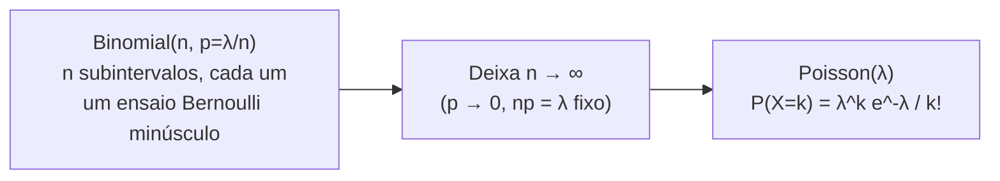

## Objetivos de Aprendizagem

- Declarar a FMP de Poisson, P(X=k) = (λᵏ·e⁻λ)/k!, e identificar o que o único parâmetro λ representa.
- Derivar a FMP de Poisson como o caso limite da distribuição Binomial(n,p) conforme n→∞ e p→0 com np=λ mantido fixo.
- Reconhecer cenários do mundo real (eventos raros sobre um intervalo fixo de tempo, espaço ou oportunidade) bem modelados por uma distribuição de Poisson.
- Declarar e justificar E[X] = Var(X) = λ para uma variável aleatória de Poisson, e explicar por que essa igualdade é uma assinatura distintiva da distribuição.
- Decidir, dada uma descrição de um cenário de contagem, se um modelo Binomial ou de Poisson é o mais apropriado.

## Contexto e Motivação

Muitos problemas de contagem reais não vêm com um número natural e fixo de ensaios do jeito que um modelo Binomial exige. O número de erros de digitação numa página, o número de e-mails chegando numa caixa de entrada numa hora, o número de eventos de decaimento radioativo numa janela de tempo fixa, o número de defeitos de manufatura por metro de cabo, em cada um desses, não há um enquadramento limpo de "n ensaios independentes, cada um tendo sucesso com probabilidade p" na superfície. Não há n fixo: um e-mail poderia, em princípio, chegar em literalmente qualquer instante dentro da hora, e não há forma óbvia de dividir "a hora" num número fixo de ensaios sim/não discretos. A **distribuição de Poisson** é construída exatamente para tratar essa classe de problema (contar o número de ocorrências de algum evento raro e independente sobre um intervalo fixo), e acaba, notavelmente, não sendo uma ideia nova e independente de forma alguma, mas um caso limite da distribuição Binomial já desenvolvida, obtido imaginando aquele intervalo fixo fatiado num número enorme de subintervalos cada vez menores.

Essa derivação (Poisson como o limite n→∞, p→0 de Binomial(n,p), com o produto np mantido fixo numa constante λ) é uma das derivações mais genuinamente esclarecedoras na probabilidade introdutória, e tanto o 6.041 do MIT quanto o CS109 de Stanford a tratam como essencial precisamente porque explica *por que* o termo de aparência estranha e⁻λ aparece na fórmula de Poisson (decorre diretamente do limite bem conhecido (1 − λ/n)ⁿ → e⁻λ do cálculo) e *por que* a distribuição de Poisson é a ferramenta certa exatamente quando o n de um modelo Binomial é impraticavelmente grande e o p correspondentemente pequeno, que é exatamente a situação com o raciocínio de "um e-mail poderia chegar em qualquer instante": imagine dividir a hora em n subintervalos minúsculos tão finos que no máximo um e-mail poderia plausivelmente chegar em qualquer subintervalo único, trate cada subintervalo como um ensaio Bernoulli com pequena probabilidade de sucesso p, e deixe n crescer sem limite.

O alcance prático de Poisson é enorme uma vez que essa derivação está em mãos: aplicações em Ciência da Computação incluem modelar taxas de chegada de requisição num servidor, chegadas de pacote num link de rede, cache misses por unidade de memória acessada, e contagens de eventos raros em engenharia de confiabilidade; em qualquer lugar onde "quantas vezes uma coisa rara e aproximadamente independente acontece numa janela fixa" é a pergunta real sendo feita, um modelo de Poisson é muito frequentemente a ferramenta apropriada a buscar primeiro.

## Teoria Central

### A FMP de Poisson e seu parâmetro

**Definição.** Uma variável aleatória X segue uma distribuição **Poisson(λ)**, para um parâmetro fixo λ > 0, se

P(X=k) = (λᵏ · e⁻λ) / k!,   para k = 0, 1, 2, 3, …

sem limite superior em k (diferente da Binomial, cujo k nunca poderia exceder o número fixo de ensaios n, uma contagem distribuída por Poisson pode em princípio ser qualquer inteiro não negativo, por mais improváveis que os maiores se tornem).

O único parâmetro λ representa a **taxa média de ocorrência** sobre o intervalo fixo sendo modelado; λ = 4 poderia significar "em média, 4 e-mails chegam por hora", e a distribuição Poisson(4) então descreve a probabilidade completa de ver exatamente 0, 1, 2, 3, … e-mails em qualquer hora dada, dada essa taxa média.

### Derivando Poisson como um limite da Binomial

**Configuração.** Tome o intervalo fixo (digamos, uma hora) sendo modelado, e divida-o em n subintervalos iguais, para n muito grande. Assuma:

1. Cada subintervalo independentemente ou tem uma ocorrência ("sucesso", probabilidade p) ou não tem (probabilidade 1−p), tratando cada subintervalo como um ensaio Bernoulli(p).
2. n é grande o suficiente que no máximo uma ocorrência poderia plausivelmente acontecer dentro de qualquer subintervalo único (isso se torna exatamente verdadeiro no limite n→∞).
3. O número médio geral de ocorrências através de todo o intervalo é mantido fixo em λ, significando np = λ, isto é, p = λ/n; conforme n cresce e os subintervalos encolhem, p precisa encolher correspondentemente para manter a contagem esperada total constante.

Sob essas suposições, a contagem total de ocorrências através de todo o intervalo é exatamente Binomial(n, p) com p = λ/n, e a afirmação é que conforme n→∞ (com λ fixo), a FMP Binomial converge para a FMP de Poisson.

**A derivação.** Comece pela FMP Binomial com p = λ/n:

P(X=k) = C(n,k) · pᵏ · (1−p)ⁿ⁻ᵏ = [n! / (k!(n−k)!)] · (λ/n)ᵏ · (1 − λ/n)ⁿ⁻ᵏ

Rearranje em quatro fatores separados, cada um com um limite limpo conforme n→∞ com k e λ mantidos fixos:

P(X=k) = [n(n−1)(n−2)⋯(n−k+1) / nᵏ] · [λᵏ/k!] · (1 − λ/n)ⁿ · (1 − λ/n)⁻ᵏ

Examine o limite de cada fator conforme n→∞:

- **Primeiro fator**, n(n−1)⋯(n−k+1)/nᵏ: este é um produto de k termos, cada um da forma (n−i)/n = 1 − i/n → 1 conforme n→∞ (para i, k fixos). Então o produto inteiro → 1·1⋯1 = **1**.
- **Segundo fator**, λᵏ/k!: não depende de n de forma alguma, permanece exatamente **λᵏ/k!**.
- **Terceiro fator**, (1 − λ/n)ⁿ: este é precisamente o limite padrão de cálculo que define a função exponencial, (1 − λ/n)ⁿ → **e⁻λ** conforme n→∞.
- **Quarto fator**, (1 − λ/n)⁻ᵏ: conforme n→∞, λ/n → 0, então este fator → (1−0)⁻ᵏ = **1**.

Multiplicando os quatro limites juntos:

P(X=k) → 1 · (λᵏ/k!) · e⁻λ · 1 = **λᵏ e⁻λ / k!**

que é exatamente a FMP de Poisson. Todo termo na fórmula Binomial foi contabilizado e traçado até sua contribuição limite; o fator combinatório C(n,k) não contribui nada extra no limite (converge para 1 uma vez dividido por nᵏ), e o termo distintivo e⁻λ inteiro da distribuição de Poisson vem diretamente do fator "sem ocorrência" (1−p)ⁿ⁻ᵏ da Binomial, via a definição de limite padrão de e.



### Média e variância

Em vez de rederivar E[X] e Var(X) da soma da FMP de Poisson diretamente, as duas podem ser lidas do próprio processo limite: uma Binomial(n,p) tem E[X] = np e Var(X) = np(1−p). Substituindo p = λ/n:

E[X] = np = n·(λ/n) = **λ**

Var(X) = np(1−p) = n·(λ/n)·(1 − λ/n) = λ·(1 − λ/n) → **λ**   conforme n→∞ (já que λ/n → 0)

Então para uma variável aleatória Poisson(λ), **E[X] = Var(X) = λ**, tanto a média quanto a variância são iguais ao mesmíssimo parâmetro que define a distribuição. Esta é uma assinatura distintiva e facilmente checável de dados distribuídos por Poisson: se a média amostral e a variância amostral de um conjunto de dados real são notavelmente diferentes uma da outra, isso é evidência contra tratá-lo como distribuído por Poisson, já que um processo de Poisson genuíno força essas duas quantidades a concordarem exatamente.

### Quando usar Poisson versus Binomial

Poisson é o modelo apropriado quando:

- Não há um número fixo natural de ensaios n (eventos podem ocorrer, em princípio, em qualquer ponto num intervalo contínuo de tempo, espaço, ou outro continuum).
- Ocorrências são raras em relação ao tamanho do intervalo, e aproximadamente independentes umas das outras.
- Só a taxa média λ (ocorrências por intervalo) é conhecida ou assumida, em vez de uma contagem de ensaios e probabilidade por ensaio.

Binomial permanece o modelo certo quando genuinamente há um número fixo e conhecido de ensaios discretos n, cada um com sua própria probabilidade de sucesso p bem definida; Poisson é melhor entendida não como uma competidora da Binomial mas como seu caso limite extremo, útil precisamente quando n é impraticavelmente grande (ou nem mesmo significativamente definível) e p correspondentemente pequeno.

## Exemplos Resolvidos

### Exemplo 1: aplicação direta da FMP de Poisson

**Problema:** um call center recebe, em média, 3 chamadas por minuto (λ=3). Qual é a probabilidade de que exatamente 5 chamadas cheguem num minuto dado?

**Aplica a fórmula diretamente.**

P(X=5) = (3⁵ · e⁻³) / 5! = (243 · e⁻³) / 120

Usando e⁻³ ≈ 0,0498:

P(X=5) ≈ (243 × 0,0498) / 120 ≈ 12,10 / 120 ≈ 0,1008

Então há aproximadamente 10,1% de chance de exatamente 5 chamadas num minuto dado, uma aplicação totalmente mecânica uma vez que λ e k são identificados, sem fator combinatório necessário (diferente da Binomial), já que a FMP de Poisson já tem a contagem completamente absorvida em sua derivação.

### Exemplo 2: verificando a convergência Binomial-para-Poisson numericamente

**Problema:** confirme a derivação limite concretamente: compute P(X=2) sob Binomial(n=1000, p=0,005) e compare a P(X=2) sob Poisson(λ=np=5).

**Valor de Poisson.** λ = 1000 × 0,005 = 5.

P(X=2) = (5² · e⁻⁵) / 2! = (25 × e⁻⁵) / 2

Usando e⁻⁵ ≈ 0,006738:

P(X=2) ≈ (25 × 0,006738)/2 ≈ 0,16845/2 ≈ 0,08422

**Valor Binomial.** P(X=2) = C(1000,2)·(0,005)²·(0,995)⁹⁹⁸.

C(1000,2) = (1000×999)/2 = 499500. (0,005)² = 0,000025. (0,995)⁹⁹⁸ ≈ e^(998·ln(0,995)) ≈ e^(998×(−0,0050125)) ≈ e^(−5,0025) ≈ 0,006706.

P(X=2) ≈ 499500 × 0,000025 × 0,006706 ≈ 12,4875 × 0,006706 ≈ 0,08375

**Compara.** Binomial dá ≈0,0838, Poisson dá ≈0,0842, concordando dentro de cerca de meio por cento, com n=1000 nem perto do infinito ainda. Esta é uma confirmação numérica direta da derivação acima: mesmo um n "meramente grande", não um limite literal, já torna Binomial(n, λ/n) e Poisson(λ) quase indistinguíveis, que é exatamente por que Poisson é usada como uma aproximação prática de Binomial sempre que n é grande e p é pequeno, sem precisar levar n literalmente ao infinito.

```python
import math

def fmp_binomial(n, p, k):
    return math.comb(n, k) * p**k * (1 - p)**(n - k)

def fmp_poisson(lam, k):
    return (lam**k * math.exp(-lam)) / math.factorial(k)

n, p, k = 1000, 0.005, 2
print(fmp_binomial(n, p, k))   # ≈ 0.08383
print(fmp_poisson(n * p, k))   # ≈ 0.08422
```

### Exemplo 3: usando a assinatura E[X]=Var(X)=λ para checar a sanidade de uma suposição de modelagem

**Problema:** um site registra o número de tentativas de login falhadas por hora durante 100 horas. A média amostral é 4,1 e a variância amostral é 4,05. Um modelo de Poisson é plausível? Um segundo conjunto de dados (número de logins falhados sob um ataque coordenado) tem média amostral 4,1 mas variância amostral 38,7, Poisson ainda é plausível ali?

**Primeiro conjunto de dados.** Média ≈4,1 e variância ≈4,05 estão bem próximas uma da outra, consistentes com o requisito teórico de Poisson E[X]=Var(X)=λ. Um modelo Poisson(λ≈4,1) é inteiramente plausível aqui; esse é exatamente o padrão esperado de eventos raros, independentes e com tempo aleatório (logins falhados comuns de erros de digitação e senhas esquecidas, aproximadamente sem memória e independentes uns dos outros).

**Segundo conjunto de dados.** Média ≈4,1 mas variância ≈38,7, muito maior que a média, uma discrepância séria com a assinatura E[X]=Var(X). Isso é forte evidência *contra* um modelo de Poisson: um ataque coordenado provavelmente produz logins falhados em rajadas (muitas tentativas agrupadas em janelas curtas, seguidas de períodos quietos) em vez de independentemente e uniformemente através da hora, violando a suposição de independência embutida na derivação de Poisson. Esse tipo de padrão de "variância muito maior que a média" (chamado sobredispersão) é uma bandeira vermelha diagnóstica padrão de que um modelo de Poisson ingênuo está perdendo estrutura real, aqui, a dependência entre tentativas de login sucessivas durante um ataque.

## Equívocos Comuns e Armadilhas

- **"Poisson exige saber n e p, assim como Binomial exige."** Poisson exige só um único parâmetro, λ, a taxa média; deliberadamente não exige (e frequentemente nem consegue nem definir) uma contagem de ensaios específica n ou probabilidade por ensaio p. Essa é precisamente sua vantagem em situações, como e-mails chegando continuamente, onde n e p não têm significado natural.
- **"e⁻λ aparece na fórmula sem razão particular, é só parte da definição."** Como derivado acima, e⁻λ não é arbitrário: decorre diretamente do limite padrão (1 − λ/n)ⁿ → e⁻λ, que é exatamente o fator "sem ocorrência nesse subintervalo minúsculo" do modelo Binomial subjacente, levado a seu limite. Ver essa derivação uma vez desmistifica por que e aparece numa distribuição de contagem discreta de forma alguma.
- **"Já que Poisson vem de Binomial com p→0, Poisson só se aplica a eventos 'improváveis' num sentido vago."** A condição precisa é que a derivação exige muitos (n→∞) ensaios cada um com pequena probabilidade p, mantendo np=λ fixo; "raro por subintervalo, mas com uma contagem total média bem definida, possivelmente grande, λ" é a leitura correta, não "um evento improvável no geral". O próprio λ pode ser grande (por exemplo, λ=1000 e-mails por dia é um parâmetro de Poisson perfeitamente bom), mesmo que cada subintervalo infinitesimal tenha uma probabilidade minúscula por subintervalo.
- **"Se a média amostral e a variância amostral de alguns dados de contagem são iguais, os dados precisam ser distribuídos por Poisson."** E[X]=Var(X)=λ é uma consequência necessária do modelo de Poisson, não uma prova suficiente dele; o diagnóstico do Exemplo 3 funciona bem como evidência *contra* Poisson quando os dois discordam fortemente, mas uma correspondência próxima é só de apoio, não conclusiva; outras distribuições podem ocasionalmente produzir concordância similar de média/variância por coincidência.
- **"Uma variável aleatória de Poisson é limitada superiormente, do mesmo jeito que uma Binomial é limitada por n."** Poisson não tem limite superior em k de forma alguma; todo inteiro não negativo tem probabilidade estritamente positiva, por menor que seja para k grande, já que não há n finito limitando a contagem na formulação de Poisson (n foi enviado ao infinito precisamente para remover esse limite).

## Resumo

A distribuição Poisson(λ), P(X=k) = λᵏe⁻λ/k!, modela a contagem de ocorrências raras e aproximadamente independentes sobre um intervalo fixo, e é derivada rigorosamente como o limite de Binomial(n, p=λ/n) conforme n→∞; todo termo na fórmula de Poisson, incluindo o e⁻λ de outra forma misterioso, remonta diretamente a um termo na FMP Binomial levado a seu limite. Diferente da Binomial, Poisson exige só um único parâmetro de taxa λ e não coloca limite superior na contagem, tornando-a a ferramenta certa exatamente quando uma contagem fixa de ensaios n não tem significado natural. E[X] = Var(X) = λ é uma consequência de assinatura da derivação (as duas quantidades herdadas diretamente de np e np(1−p) conforme p→0), e serve como um diagnóstico prático: dados reais de contagem cuja média amostral e variância amostral divergem fortemente provavelmente estão violando as suposições de independência ou taxa fixa das quais o modelo de Poisson depende.

## Documentation Links

- [MIT 6.041 — Lecture Notes (OCW)](https://ocw.mit.edu/courses/6-041-probabilistic-systems-analysis-and-applied-probability-fall-2010/pages/lecture-notes/) — doc
- [Stanford CS109 — Course Schedule](http://web.stanford.edu/class/cs109/schedule.html) — doc
