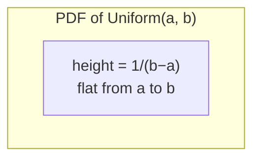

## Learning Objectives

- State the PDF of a Uniform(a, b) random variable and explain why it must equal 1/(b − a) on the interval for the total area to come out to 1.
- Compute P(c ≤ X ≤ d) for a Uniform(a, b) variable as the area of a rectangle, for any subinterval [c, d] ⊆ [a, b].
- State and apply the formulas E[X] = (a + b)/2 and Var(X) = (b − a)²/12.
- Recognize real-world scenarios (rounding error, random arrival within a window, random number generators) that are naturally modeled as Uniform.
- Contrast the continuous Uniform distribution with its discrete cousin (e.g., a fair die) and explain why P(X = x) = 0 for every single point in the continuous case.

## Context & Motivation

The continuous Uniform distribution is the simplest possible continuous random variable, and that simplicity is exactly why it belongs first among the named continuous distributions. The previous concept, continuous random variables and PDFs, established the core idea that a probability density function's height is not itself a probability — only the *area* under a stretch of the curve is — but that idea was introduced somewhat abstractly. The Uniform distribution is where it becomes concrete and mechanical: the density is a flat, constant line, so every probability calculation reduces to computing the area of a plain rectangle. There is no curve to integrate, no calculus machinery to invoke — just base times height. This makes Uniform the ideal proving ground for the "area under the curve" intuition before moving on to a PDF that actually changes shape.

Beyond its pedagogical convenience, the Uniform distribution shows up constantly in real modeling. If you know a bus arrives sometime in the next 10 minutes but have no information favoring an earlier or later arrival within that window, modeling your wait time as Uniform(0, 10) is the natural choice — it encodes "no preference" as literally as a probability distribution can. Measurement or rounding error is often modeled as Uniform: if a scale reports weight rounded to the nearest gram, the true weight relative to the reported value is well modeled as Uniform(−0.5, 0.5). And at a more computational level, every pseudo-random number generator in every programming language is fundamentally built around producing samples from Uniform(0, 1) — literally every other distribution used in simulation (Normal, exponential, Poisson, you name it) is typically generated by transforming draws from a Uniform source. MIT's 6.041 (Probabilistic Systems Analysis) introduces the Uniform distribution for exactly this reason: it is the bridge between the discrete-world PMF intuition students already have and the genuinely new mechanics of densities and integration that continuous random variables require.

## Core Theory

### The PDF of Uniform(a, b)

A continuous random variable X is **Uniform on the interval [a, b]**, written X ~ Uniform(a, b), if its probability density function is constant on [a, b] and zero everywhere else:

f(x) = 1/(b − a)  for a ≤ x ≤ b
f(x) = 0      for x < a or x > b

The constant value 1/(b − a) is not a free choice — it is forced by the requirement that every valid PDF must integrate to exactly 1 (total probability = 1) over its support. Since f is constant on an interval of length (b − a), the total area under the curve is simply

(height) × (width) = f(x) × (b − a) = 1/(b − a) × (b − a) = 1

which checks out for any choice of a and b, provided a < b. This is the entire content of "uniform": every outcome in [a, b] is exactly as likely as every other, in the density sense — no value is favored, no value is penalized, the graph of f is a flat horizontal line sitting at height 1/(b − a) from a to b and at height 0 everywhere else.

### Computing probabilities as rectangle areas

Because the density is flat, computing P(c ≤ X ≤ d) for any subinterval [c, d] ⊆ [a, b] requires no integral in the calculus sense — it is literally the area of a rectangle of height 1/(b − a) and width (d − c):

P(c ≤ X ≤ d) = (d − c) × 1/(b − a) = (d − c)/(b − a)

This single formula is the entire computational toolkit for the Uniform distribution. Notice that it depends only on the *length* of the subinterval, not on its location within [a, b] — sliding [c, d] anywhere inside [a, b] without changing its width leaves the probability unchanged. This is the precise mathematical expression of "uniform": likelihood is proportional to length, and nothing else.

As with any continuous random variable, P(X = x) = 0 for any single point x, since a single point has zero width and therefore zero area beneath the density there. This means it makes no difference whether endpoints are included or excluded: P(c ≤ X ≤ d), P(c < X ≤ d), P(c ≤ X < d), and P(c < X < d) are all equal for a continuous Uniform variable — a fact that surprises students coming straight from discrete random variables, where inclusive versus exclusive endpoints routinely change the answer.

### Expectation and variance

For X ~ Uniform(a, b), the expectation and variance are:

E[X] = (a + b)/2
Var(X) = (b − a)²/12

The expectation formula is intuitive without any computation: since every value in [a, b] is equally weighted, the "center of mass" of a uniform density is exactly the midpoint of the interval, just as the balance point of a physical rectangular bar is its geometric center. The variance formula is less immediately obvious from intuition alone, but its shape is worth noting: Var(X) scales as the *square* of the interval's width — doubling the width of the interval quadruples the variance, reflecting how a wider interval spreads probability mass over a proportionally larger range around the mean. (Both formulas can be derived directly from the definitions E[X] = ∫x·f(x)dx and Var(X) = E[X²] − (E[X])², but this course treats them as stated facts, consistent with the informal treatment of continuous random variables established already.)

### Contrast with the discrete Uniform distribution

It is worth explicitly separating the continuous Uniform distribution from the discrete Uniform distribution students have already met informally (e.g., a fair six-sided die, which takes each of the values {1, 2, 3, 4, 5, 6} with probability 1/6). In the discrete case, each individual outcome carries positive probability mass — P(X = 3) = 1/6, not zero. In the continuous case, no individual point carries any probability mass at all; only intervals do. The two distributions share the word "uniform" because both encode "no outcome is favored over another," but the mechanics of computing probabilities from them (summing PMF values versus computing areas under a PDF) are genuinely different, and conflating them is a common source of error, covered further below.

## Worked Examples

### Example 1 — bus arrival time

**Problem:** A commuter knows a bus arrives at some uniformly random time in the next 20 minutes: X ~ Uniform(0, 20), measured in minutes. What is the probability the bus arrives within the first 5 minutes? Within the last 5 minutes? Between minute 8 and minute 12?

**Setup.** Here a = 0, b = 20, so the density is f(x) = 1/(20 − 0) = 1/20 for 0 ≤ x ≤ 20.

**Within the first 5 minutes:** P(0 ≤ X ≤ 5) = (5 − 0)/20 = 5/20 = 0.25.

**Within the last 5 minutes:** this is P(15 ≤ X ≤ 20) = (20 − 15)/20 = 5/20 = 0.25 — the same answer as the first interval, since both have the same width (5 minutes), consistent with the fact that Uniform probability depends only on interval length, not location.

**Between minute 8 and minute 12:** P(8 ≤ X ≤ 12) = (12 − 8)/20 = 4/20 = 0.20.

Each of these is literally "width of the window divided by width of the whole interval" — the rectangle-area computation made concrete.

### Example 2 — expectation, variance, and a sanity check

**Problem:** For the bus arrival time X ~ Uniform(0, 20) from Example 1, compute E[X] and Var(X), and verify that P(X ≤ E[X]) is exactly what you'd expect.

**Expectation.** E[X] = (a + b)/2 = (0 + 20)/2 = 10 minutes — the commuter should expect to wait 10 minutes on average, the exact midpoint of the window, matching the "center of mass" intuition.

**Variance.** Var(X) = (b − a)²/12 = 20²/12 = 400/12 ≈ 33.33 minutes². Taking a square root gives a standard deviation of about 5.77 minutes, meaning wait times are fairly spread out relative to the 20-minute window — unsurprising, since Uniform is about as spread out as a bounded distribution can be.

**Sanity check.** P(X ≤ 10) = (10 − 0)/20 = 0.5 exactly. This is expected: since the mean sits at the exact midpoint of a symmetric interval, half the probability mass necessarily lies on each side. This also illustrates that for Uniform(a, b), the mean and the median coincide exactly at (a + b)/2, a fact that will look distinctly different once the (also symmetric, but not flat) Normal distribution is introduced next.

### Example 3 — rounding error and choosing the right interval

**Problem:** A digital scale displays weight rounded to the nearest 0.1 kg. A package is displayed as 2.3 kg. Assuming the true weight, given the displayed value, is Uniform on the interval of values that would round to 2.3, what is the probability the true weight exceeds 2.32 kg?

**Setup.** Rounding to the nearest 0.1 kg means any true weight in [2.25, 2.35) rounds to 2.3. Model the rounding error (or equivalently the true weight) as X ~ Uniform(2.25, 2.35), so a = 2.25, b = 2.35, and the interval width is b − a = 0.10.

**Compute.** P(X > 2.32) = P(2.32 ≤ X ≤ 2.35) = (2.35 − 2.32)/0.10 = 0.03/0.10 = 0.30.

**Interpretation.** There's a 30% chance the true weight is more than 2.32 kg, given only that it displayed as 2.3 kg — a direct, practical application of treating rounding error as a Uniform random variable, one of the standard real-world uses of this distribution.

## Common Misconceptions & Pitfalls

- **"The height of the PDF, 1/(b − a), is itself a probability."** It is a density, not a probability, and nothing stops it from exceeding 1 — for instance, Uniform(0, 0.5) has height 1/0.5 = 2 everywhere on its support. A density of 2 is perfectly valid; what must equal 1 is the *total area*, not the height at any single point. Only areas (over intervals) are probabilities.
- **"Since P(X = x) = 0 for every point, every outcome is impossible."** This is the classic zero-probability-but-not-impossible confusion inherited from continuous random variables generally. Some value in [a, b] is certainly realized when X is sampled — it's just that no single value can be assigned positive probability without violating the fact that there are infinitely many equally likely points to choose from. Only intervals of positive width can have positive probability.
- **"Uniform(a, b) probabilities depend on where in the interval you look, not just the width."** They don't — P(c ≤ X ≤ d) = (d − c)/(b − a) depends only on d − c. Example 1 above deliberately picked two intervals of equal width in different locations (first 5 minutes vs. last 5 minutes) precisely to make this concrete: both give 0.25.
- **"Continuous Uniform and discrete Uniform work the same way."** They don't: for a discrete Uniform variable (like a fair die), individual outcomes carry positive probability mass and you sum PMF values; for continuous Uniform, individual outcomes carry zero probability and you compute an area. Applying "just add up 1/n for each outcome" reasoning to a continuous Uniform variable is a category error.
- **"Doubling the width of the interval doubles the variance."** It quadruples it, since Var(X) = (b − a)²/12 scales with the *square* of the width. Going from Uniform(0, 10) to Uniform(0, 20) does not just spread things out proportionally more — it spreads them out quadratically more in variance terms (though only twice as much in standard-deviation terms, since standard deviation is the square root of variance).

## Summary

The continuous Uniform distribution, X ~ Uniform(a, b), has a constant density f(x) = 1/(b − a) on [a, b] and 0 elsewhere, with the constant height forced by the requirement that total area under the density equal 1. Because the density is flat, any probability P(c ≤ X ≤ d) for a subinterval reduces to a rectangle-area calculation: (d − c)/(b − a), depending only on the width of the interval in question, never its location. Its expectation, E[X] = (a + b)/2, is the interval's midpoint by symmetry, and its variance, Var(X) = (b − a)²/12, scales with the square of the interval's width. The Uniform distribution models "no preference among outcomes in a range" — bus arrival times, rounding error, and the raw output of random number generators are all natural fits — and serves as the cleanest possible entry point into computing probabilities from a PDF as literal geometric area, before more complex densities like the Normal distribution are introduced.

## Documentation Links

- [MIT 6.041 — Lecture Notes (OCW)](https://ocw.mit.edu/courses/6-041-probabilistic-systems-analysis-and-applied-probability-fall-2010/pages/lecture-notes/) — doc
- [ACM/IEEE CS2013 — Full Curriculum Guidelines](https://www.acm.org/binaries/content/assets/education/cs2013_web_final.pdf) — doc
