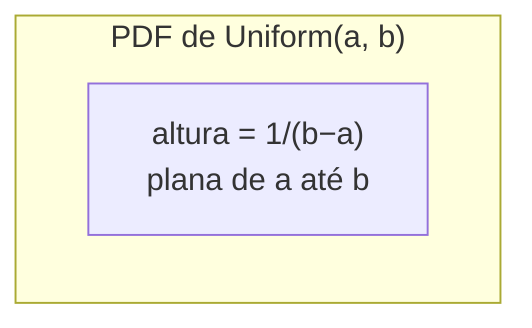

## Objetivos de Aprendizagem

- Enunciar a PDF de uma variável aleatória Uniform(a, b) e explicar por que ela deve ser igual a 1/(b − a) no intervalo para a área total resultar em 1.
- Calcular P(c ≤ X ≤ d) para uma variável Uniform(a, b) como a área de um retângulo, para qualquer subintervalo [c, d] ⊆ [a, b].
- Enunciar e aplicar as fórmulas E[X] = (a + b)/2 e Var(X) = (b − a)²/12.
- Reconhecer cenários do mundo real (erro de arredondamento, chegada aleatória dentro de uma janela, geradores de números aleatórios) que são naturalmente modelados como Uniforme.
- Contrastar a distribuição Uniforme contínua com sua prima discreta (por exemplo, um dado justo) e explicar por que P(X = x) = 0 para cada ponto individual no caso contínuo.

## Contexto e Motivação

A distribuição Uniforme contínua é a variável aleatória contínua mais simples possível, e essa simplicidade é exatamente por que ela pertence em primeiro lugar entre as distribuições contínuas nomeadas. O conceito anterior, variáveis aleatórias contínuas e PDFs, estabeleceu a ideia central de que a altura de uma função de densidade de probabilidade não é ela mesma uma probabilidade, apenas a *área* sob um trecho da curva é, mas essa ideia foi introduzida de forma um tanto abstrata. A distribuição Uniforme é onde ela se torna concreta e mecânica: a densidade é uma linha plana e constante, então todo cálculo de probabilidade se reduz a calcular a área de um retângulo comum. Não há curva para integrar, nenhum maquinário de cálculo a invocar, apenas base vezes altura. Isso torna a Uniforme o campo de prova ideal para a intuição de "área sob a curva" antes de avançar para uma PDF que de fato muda de formato.

Além de sua conveniência pedagógica, a distribuição Uniforme aparece constantemente na modelagem real. Se você sabe que um ônibus chega em algum momento nos próximos 10 minutos mas não tem informação favorecendo uma chegada mais cedo ou mais tarde dentro dessa janela, modelar seu tempo de espera como Uniform(0, 10) é a escolha natural, ela codifica "sem preferência" tão literalmente quanto uma distribuição de probabilidade pode. Erro de medição ou arredondamento é frequentemente modelado como Uniforme: se uma balança relata o peso arredondado para o grama mais próximo, o peso verdadeiro em relação ao valor relatado é bem modelado como Uniform(−0,5, 0,5). E em um nível mais computacional, todo gerador de números pseudoaleatórios em toda linguagem de programação é fundamentalmente construído em torno de produzir amostras de Uniform(0, 1), literalmente toda outra distribuição usada em simulação (Normal, exponencial, Poisson, qualquer uma) é tipicamente gerada transformando sorteios de uma fonte Uniforme. O 6.041 do MIT (Probabilistic Systems Analysis) introduz a distribuição Uniforme exatamente por essa razão: é a ponte entre a intuição de PMF do mundo discreto que os estudantes já têm e a mecânica genuinamente nova de densidades e integração que variáveis aleatórias contínuas exigem.

## Teoria Central

### A PDF da Uniform(a, b)

Uma variável aleatória contínua X é **Uniforme no intervalo [a, b]**, escrita X ~ Uniform(a, b), se sua função de densidade de probabilidade é constante em [a, b] e zero em qualquer outro lugar:

f(x) = 1/(b − a)  para a ≤ x ≤ b
f(x) = 0      para x < a ou x > b

O valor constante 1/(b − a) não é uma escolha livre, ele é forçado pela exigência de que toda PDF válida deve integrar exatamente a 1 (probabilidade total = 1) sobre seu suporte. Como f é constante em um intervalo de comprimento (b − a), a área total sob a curva é simplesmente

(altura) × (largura) = f(x) × (b − a) = 1/(b − a) × (b − a) = 1

o que se confirma para qualquer escolha de a e b, desde que a < b. Este é todo o conteúdo de "uniforme": todo resultado em [a, b] é exatamente tão provável quanto qualquer outro, no sentido de densidade, nenhum valor é favorecido, nenhum valor é penalizado, o gráfico de f é uma linha horizontal plana situada na altura 1/(b − a) de a até b e na altura 0 em qualquer outro lugar.

### Calculando probabilidades como áreas de retângulo

Como a densidade é plana, calcular P(c ≤ X ≤ d) para qualquer subintervalo [c, d] ⊆ [a, b] não exige nenhuma integral no sentido de cálculo, é literalmente a área de um retângulo de altura 1/(b − a) e largura (d − c):

P(c ≤ X ≤ d) = (d − c) × 1/(b − a) = (d − c)/(b − a)

Esta única fórmula é todo o kit de ferramentas computacional da distribuição Uniforme. Note que ela depende apenas do *comprimento* do subintervalo, não de sua localização dentro de [a, b], deslizar [c, d] para qualquer lugar dentro de [a, b] sem mudar sua largura deixa a probabilidade inalterada. Esta é a expressão matemática precisa de "uniforme": a probabilidade é proporcional ao comprimento, e nada mais.

Como com qualquer variável aleatória contínua, P(X = x) = 0 para qualquer ponto único x, já que um único ponto tem largura zero e portanto área zero sob a densidade ali. Isso significa que não faz diferença se os pontos finais são incluídos ou excluídos: P(c ≤ X ≤ d), P(c < X ≤ d), P(c ≤ X < d), e P(c < X < d) são todos iguais para uma variável Uniforme contínua, um fato que surpreende estudantes vindos diretamente de variáveis aleatórias discretas, onde pontos finais inclusivos versus exclusivos rotineiramente mudam a resposta.

### Esperança e variância

Para X ~ Uniform(a, b), a esperança e a variância são:

E[X] = (a + b)/2
Var(X) = (b − a)²/12

A fórmula da esperança é intuitiva sem nenhum cálculo: já que todo valor em [a, b] tem o mesmo peso, o "centro de massa" de uma densidade uniforme é exatamente o ponto médio do intervalo, assim como o ponto de equilíbrio de uma barra retangular física é seu centro geométrico. A fórmula da variância é menos imediatamente óbvia a partir da intuição sozinha, mas seu formato vale a pena notar: Var(X) escala com o *quadrado* da largura do intervalo, dobrar a largura do intervalo quadruplica a variância, refletindo como um intervalo mais largo espalha massa de probabilidade sobre uma faixa proporcionalmente maior em torno da média. (Ambas as fórmulas podem ser derivadas diretamente das definições E[X] = ∫x·f(x)dx e Var(X) = E[X²] − (E[X])², mas este curso as trata como fatos enunciados, consistente com o tratamento informal de variáveis aleatórias contínuas já estabelecido.)

### Contraste com a distribuição Uniforme discreta

Vale a pena separar explicitamente a distribuição Uniforme contínua da distribuição Uniforme discreta que os estudantes já conheceram informalmente (por exemplo, um dado justo de seis lados, que assume cada um dos valores {1, 2, 3, 4, 5, 6} com probabilidade 1/6). No caso discreto, cada resultado individual carrega massa de probabilidade positiva, P(X = 3) = 1/6, não zero. No caso contínuo, nenhum ponto individual carrega qualquer massa de probabilidade, apenas intervalos carregam. As duas distribuições compartilham a palavra "uniforme" porque ambas codificam "nenhum resultado é favorecido em relação a outro", mas a mecânica de calcular probabilidades a partir delas (somar valores de PMF versus calcular áreas sob uma PDF) é genuinamente diferente, e confundi-las é uma fonte comum de erro, coberta mais adiante abaixo.

## Exemplos Resolvidos

### Exemplo 1 — horário de chegada do ônibus

**Problema:** Um passageiro sabe que um ônibus chega em algum momento uniformemente aleatório nos próximos 20 minutos: X ~ Uniform(0, 20), medido em minutos. Qual é a probabilidade de o ônibus chegar nos primeiros 5 minutos? Nos últimos 5 minutos? Entre o minuto 8 e o minuto 12?

**Configuração.** Aqui a = 0, b = 20, então a densidade é f(x) = 1/(20 − 0) = 1/20 para 0 ≤ x ≤ 20.

**Nos primeiros 5 minutos:** P(0 ≤ X ≤ 5) = (5 − 0)/20 = 5/20 = 0,25.

**Nos últimos 5 minutos:** isso é P(15 ≤ X ≤ 20) = (20 − 15)/20 = 5/20 = 0,25, a mesma resposta do primeiro intervalo, já que ambos têm a mesma largura (5 minutos), consistente com o fato de que a probabilidade Uniforme depende apenas do comprimento do intervalo, não da localização.

**Entre o minuto 8 e o minuto 12:** P(8 ≤ X ≤ 12) = (12 − 8)/20 = 4/20 = 0,20.

Cada um desses é literalmente "largura da janela dividida pela largura do intervalo todo", o cálculo de área de retângulo tornado concreto.

### Exemplo 2 — esperança, variância, e uma verificação de sanidade

**Problema:** Para o tempo de chegada do ônibus X ~ Uniform(0, 20) do Exemplo 1, calcule E[X] e Var(X), e verifique que P(X ≤ E[X]) é exatamente o que você esperaria.

**Esperança.** E[X] = (a + b)/2 = (0 + 20)/2 = 10 minutos, o passageiro deveria esperar esperar 10 minutos em média, o ponto médio exato da janela, correspondendo à intuição de "centro de massa".

**Variância.** Var(X) = (b − a)²/12 = 20²/12 = 400/12 ≈ 33,33 minutos². Tirando a raiz quadrada dá um desvio padrão de cerca de 5,77 minutos, significando que os tempos de espera são razoavelmente dispersos em relação à janela de 20 minutos, o que não é surpreendente, já que a Uniforme é praticamente o quanto uma distribuição limitada pode se dispersar.

**Verificação de sanidade.** P(X ≤ 10) = (10 − 0)/20 = 0,5 exatamente. Isso é esperado: já que a média está exatamente no ponto médio de um intervalo simétrico, metade da massa de probabilidade necessariamente está de cada lado. Isso também ilustra que para Uniform(a, b), a média e a mediana coincidem exatamente em (a + b)/2, um fato que parecerá distintamente diferente quando a distribuição Normal (também simétrica, mas não plana) for introduzida a seguir.

### Exemplo 3 — erro de arredondamento e escolhendo o intervalo certo

**Problema:** Uma balança digital exibe o peso arredondado para o 0,1 kg mais próximo. Um pacote é exibido como 2,3 kg. Assumindo que o peso verdadeiro, dado o valor exibido, é Uniforme no intervalo de valores que arredondariam para 2,3, qual é a probabilidade de o peso verdadeiro exceder 2,32 kg?

**Configuração.** Arredondar para o 0,1 kg mais próximo significa que qualquer peso verdadeiro em [2,25, 2,35) arredonda para 2,3. Modele o erro de arredondamento (ou equivalentemente o peso verdadeiro) como X ~ Uniform(2,25, 2,35), então a = 2,25, b = 2,35, e a largura do intervalo é b − a = 0,10.

**Calcule.** P(X > 2,32) = P(2,32 ≤ X ≤ 2,35) = (2,35 − 2,32)/0,10 = 0,03/0,10 = 0,30.

**Interpretação.** Há 30% de chance de o peso verdadeiro ser maior que 2,32 kg, dado apenas que ele foi exibido como 2,3 kg, uma aplicação direta e prática de tratar erro de arredondamento como uma variável aleatória Uniforme, um dos usos padrão do mundo real dessa distribuição.

## Equívocos Comuns e Armadilhas

- **"A altura da PDF, 1/(b − a), é ela mesma uma probabilidade."** É uma densidade, não uma probabilidade, e nada impede que ela exceda 1, por exemplo, Uniform(0, 0,5) tem altura 1/0,5 = 2 em todo o seu suporte. Uma densidade de 2 é perfeitamente válida; o que deve ser igual a 1 é a *área total*, não a altura em qualquer ponto único. Apenas áreas (sobre intervalos) são probabilidades.
- **"Já que P(X = x) = 0 para todo ponto, todo resultado é impossível."** Esta é a confusão clássica de probabilidade-zero-mas-não-impossível herdada de variáveis aleatórias contínuas em geral. Algum valor em [a, b] certamente é realizado quando X é amostrada, apenas que nenhum valor único pode receber probabilidade positiva sem violar o fato de que há infinitos pontos igualmente prováveis para escolher. Apenas intervalos de largura positiva podem ter probabilidade positiva.
- **"Probabilidades Uniform(a, b) dependem de onde no intervalo você olha, não apenas da largura."** Não dependem, P(c ≤ X ≤ d) = (d − c)/(b − a) depende apenas de d − c. O Exemplo 1 acima deliberadamente escolheu dois intervalos de largura igual em localizações diferentes (primeiros 5 minutos vs. últimos 5 minutos) precisamente para tornar isso concreto: ambos dão 0,25.
- **"Uniforme contínua e Uniforme discreta funcionam da mesma forma."** Não funcionam: para uma variável Uniforme discreta (como um dado justo), resultados individuais carregam massa de probabilidade positiva e você soma valores de PMF; para Uniforme contínua, resultados individuais carregam probabilidade zero e você calcula uma área. Aplicar o raciocínio "apenas some 1/n para cada resultado" a uma variável Uniforme contínua é um erro categórico.
- **"Dobrar a largura do intervalo dobra a variância."** Quadruplica, já que Var(X) = (b − a)²/12 escala com o *quadrado* da largura. Ir de Uniform(0, 10) para Uniform(0, 20) não apenas espalha as coisas proporcionalmente mais, espalha-as quadraticamente mais em termos de variância (embora apenas duas vezes mais em termos de desvio padrão, já que o desvio padrão é a raiz quadrada da variância).

## Resumo

A distribuição Uniforme contínua, X ~ Uniform(a, b), tem densidade constante f(x) = 1/(b − a) em [a, b] e 0 em qualquer outro lugar, com a altura constante forçada pela exigência de que a área total sob a densidade seja igual a 1. Como a densidade é plana, qualquer probabilidade P(c ≤ X ≤ d) para um subintervalo se reduz a um cálculo de área de retângulo: (d − c)/(b − a), dependendo apenas da largura do intervalo em questão, nunca de sua localização. Sua esperança, E[X] = (a + b)/2, é o ponto médio do intervalo por simetria, e sua variância, Var(X) = (b − a)²/12, escala com o quadrado da largura do intervalo. A distribuição Uniforme modela "sem preferência entre resultados em uma faixa", horários de chegada de ônibus, erro de arredondamento, e a saída bruta de geradores de números aleatórios são todos ajustes naturais, e serve como o ponto de entrada mais limpo possível para calcular probabilidades a partir de uma PDF como área geométrica literal, antes de densidades mais complexas como a distribuição Normal serem introduzidas.

## Documentation Links

- [MIT 6.041 — Lecture Notes (OCW)](https://ocw.mit.edu/courses/6-041-probabilistic-systems-analysis-and-applied-probability-fall-2010/pages/lecture-notes/) — doc
- [ACM/IEEE CS2013 — Full Curriculum Guidelines](https://www.acm.org/binaries/content/assets/education/cs2013_web_final.pdf) — doc
