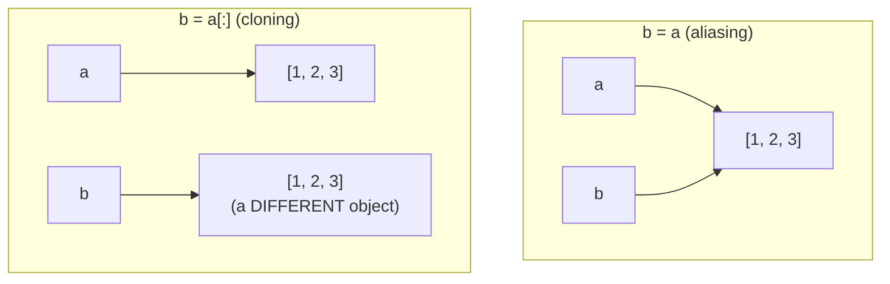

## Learning Objectives

- Explain what assignment (`b = a`) actually does to a mutable object, in terms of names and objects rather than "copying."
- Predict, for a given sequence of statements, whether a mutation performed through one name is visible through another.
- Use `is` correctly to check object identity, and distinguish it from `==`, which checks equality of contents.
- Implement a genuine clone of a list using slicing, `list()`, or `.copy()`, and explain why each produces an independent object.
- Identify the specific failure mode of a shallow copy when a list contains nested mutable objects.

## Context & Motivation

The previous lesson established that a list is mutable — its contents can change in place after it's created. This lesson asks the question that mutability makes urgent and unavoidable: what happens when *two different variables* both refer to the same list? With an immutable value like an integer, the question barely matters — if `a = 5` and `b = a`, there is no operation that could make "changing `b`" affect `a`, because integers can't be changed in place at all; the only thing you can ever do is rebind `b` to a *different* integer, which leaves `a` untouched by definition. But once the value being assigned is a mutable list, that immunity disappears, and the exact same statement — `b = a` — produces a categorically different situation: two names now referring to one shared object, where a mutation performed through either name is visible through both.

This is aliasing, and it is arguably the single concept in an introductory course that most reliably produces bugs that feel, to the person experiencing them, like the language itself is broken — a variable that was never touched "changes on its own," a function that was only supposed to *read* a list silently corrupts the caller's data, a bug that reproduces inconsistently depending on what other code ran earlier. None of this is actually mysterious once the underlying model is clear: Python's data model states plainly that assignment binds a name to an object, and never, under any circumstances, copies the object being assigned. `b = a` always means "`b` now refers to whatever `a` refers to" — for an immutable value this is invisible because nothing can act differently through the new name, and for a mutable value this is the entire ballgame, because now *anything* done through `b` is also, silently, done to the exact same object `a` still refers to.

The remedy — cloning — is conceptually simple (construct a genuinely new, independent list with the same current contents) but the mechanics deserve real care, because "copy" is not one operation with one guarantee. A shallow copy, which is what Python's list-copying idioms produce by default, duplicates the outer list but not any mutable objects nested inside it — a distinction that matters enormously the moment a list of lists, or a list of dictionaries, enters the picture. This lesson works through both halves carefully: recognizing when aliasing is happening (often the harder half, since it produces no error and no warning) and choosing, deliberately, when to break it.

## Core Theory

### Two names, one object

```python
a = [1, 2, 3]
b = a              # b is now ANOTHER NAME for the SAME list -- not a copy
b.append(4)
print(a)           # [1, 2, 3, 4] -- a "changed" too
print(a is b)      # True -- confirms they are the identical object
```

`is` checks *object identity* — are these two names referring to the same object in memory — while `==` checks *equality of contents* — do these two objects (whether the same one or not) currently hold equal values. Two entirely distinct lists that happen to hold the same elements are `==` but not `is`:

```python
x = [1, 2, 3]
y = [1, 2, 3]
print(x == y)   # True -- same contents
print(x is y)   # False -- two separate objects that happen to look alike
```



### Aliasing is only visible through mutation, never through reassignment

A critical, easily-missed detail: aliasing only becomes apparent when a *mutation* happens to the shared object — a plain reassignment of one of the names does not affect the other, because reassignment just makes that one name point somewhere else entirely.

```python
a = [1, 2, 3]
b = a
b = [9, 9, 9]     # this REASSIGNS b to a brand-new list -- doesn't touch the shared object
print(a)            # [1, 2, 3] -- completely untouched
print(b)            # [9, 9, 9] -- b now points elsewhere
```

Distinguishing "mutating the object a name refers to" (`b.append(...)`, `b[0] = ...`) from "rebinding the name itself to a different object" (`b = [...]`) is the single most important skill in reasoning correctly about aliasing. The first affects every name aliased to that object; the second affects only the one name being reassigned.

### Cloning breaks the alias

```python
a = [1, 2, 3]
b = a[:]            # slicing the WHOLE list builds a genuinely new, independent list
# equivalent alternatives: b = list(a)   or   b = a.copy()
b.append(4)
print(a)             # [1, 2, 3] -- untouched
print(b)             # [1, 2, 3, 4]
print(a is b)         # False -- two distinct objects
```

All three cloning idioms — full-slice (`a[:]`), the `list()` constructor, and the `.copy()` method — produce the same kind of result: a new list object holding the same elements the original had *at the moment of copying*. From that point forward, the two lists are entirely independent; nothing done to one is visible through the other.

### Why this matters immediately: passing a list to a function

Python passes arguments by handing the callee a reference to the same object the caller has — it never automatically clones a list argument. This means a function that mutates a parameter mutates the caller's original list too, unless a clone was made somewhere, either inside the function or by the caller before the call:

```python
def add_bonus(scores):
    scores.append(100)      # mutates the CALLER's list -- no copy was ever made

original = [88, 92]
add_bonus(original)
print(original)              # [88, 92, 100] -- the caller's list changed, whether intended or not

def add_bonus_safely(scores):
    local_copy = scores[:]   # clone FIRST, then mutate the clone
    local_copy.append(100)
    return local_copy

original2 = [88, 92]
result = add_bonus_safely(original2)
print(original2)   # [88, 92] -- untouched
print(result)         # [88, 92, 100] -- a new, separate list
```

### Shallow copies: the limit of `a[:]`, `list(a)`, and `.copy()`

Every one of the standard cloning idioms produces a *shallow* copy: the outer list is a new object, but if any of its elements are themselves mutable objects (most commonly, nested lists), those inner objects are *not* copied — the new outer list and the old outer list end up holding references to the exact same inner objects.

```python
a = [[1, 2], [3, 4]]
b = a[:]                # a shallow copy: NEW outer list, SAME inner lists
b[0].append(99)
print(a)                 # [[1, 2, 99], [3, 4]] -- the shared inner list changed!
print(a is b)             # False -- the outer lists are different objects
print(a[0] is b[0])        # True -- but the inner lists are the SAME object
```

`a is b` correctly reports `False`, because slicing did create a new outer list — but `a[0] is b[0]` reports `True`, revealing that the first *element* of each outer list is still the identical inner object. A shallow copy only protects against mutations to the outer structure (adding, removing, or reassigning top-level elements); it provides no protection at all against mutations reaching into a nested mutable object. A genuinely independent copy at every level — a *deep* copy — requires `copy.deepcopy()` from the standard library, which recursively clones every nested mutable object it encounters.

```python
import copy
a = [[1, 2], [3, 4]]
b = copy.deepcopy(a)
b[0].append(99)
print(a)   # [[1, 2], [3, 4]] -- fully untouched, even at the nested level
```

## Worked Examples

**Example 1 — tracing an aliasing bug step by step.** A student writes code to track a running list of "today's tasks" and a separate list meant to record "tasks completed so far," and is confused why completing a task seems to also remove it from today's list.

```python
today = ["email", "report", "meeting"]
completed = today          # BUG: this aliases, it does not clone

completed.remove("email")
print(today)                # ["report", "meeting"] -- "today" lost a task it shouldn't have!
print(completed)             # ["report", "meeting"]
print(today is completed)    # True -- the root cause, made visible
```

Walking through why: `completed = today` was intended, by the student, to mean "start `completed` as a copy of whatever's in `today` right now" — but that is not what assignment does. It makes `completed` another name for the *same* list, so `.remove()` on `completed` is indistinguishable, as far as Python is concerned, from calling `.remove()` directly on `today`. The fix is to clone at the point where independent lists were actually intended:

```python
today = ["email", "report", "meeting"]
completed = today.copy()    # a genuine clone -- independent from this point on

completed.remove("email")
print(today)                 # ["email", "report", "meeting"] -- untouched, correctly
print(completed)              # ["report", "meeting"]
print(today is completed)     # False
```

**Example 2 — using `is` and `==` together to diagnose a data structure.** Given two variables suspected of referring to the same underlying list, verify precisely what's going on before assuming either "they're the same" or "they're different":

```python
def build_roster():
    return ["Ada", "Ben", "Cid"]

roster_a = build_roster()
roster_b = build_roster()
roster_c = roster_a

print(roster_a == roster_b)   # True -- same contents
print(roster_a is roster_b)    # False -- two SEPARATE calls, two separate list objects
print(roster_a is roster_c)    # True -- roster_c is an alias for roster_a's object
```

This example matters because `build_roster()` is called twice, and each call constructs and returns a brand-new list literal — even though the contents are identical, `roster_a` and `roster_b` are different objects, confirmed by `is` returning `False`. `roster_c`, on the other hand, was assigned directly from `roster_a`, making it a true alias, confirmed by `is` returning `True`. Relying on `==` alone would never reveal this distinction, since it only ever reports on contents.

**Example 3 — a function that needs to be safe against aliasing, built up deliberately.** Write a function `remove_duplicates(items)` that returns a new list with duplicates removed, without mutating or aliasing the caller's original list.

A first, buggy attempt aliases the input by accident:

```python
def remove_duplicates(items):
    result = items          # BUG: this is an alias of items, not a fresh list
    for item in items:
        while result.count(item) > 1:
            result.remove(item)
    return result
```

Because `result` is `items` itself, this function mutates the caller's original list while claiming only to "return" a cleaned-up version — a caller who still needs the original, untouched list has no way to get it back. The corrected version starts from an explicit clone:

```python
def remove_duplicates(items):
    result = []              # start from a genuinely NEW, empty list
    for item in items:
        if item not in result:
            result.append(item)
    return result

original = [1, 2, 2, 3, 1]
cleaned = remove_duplicates(original)
print(original)   # [1, 2, 2, 3, 1] -- untouched
print(cleaned)      # [1, 2, 3]
print(original is cleaned)   # False
```

Building `result` as a fresh empty list and appending into it (rather than starting from `items` itself, even via slicing) sidesteps aliasing entirely, and makes the function's contract — "I return something new; I never touch what you gave me" — true by construction rather than by careful bookkeeping.

## Common Misconceptions & Pitfalls

- **"`b = a` copies the list into `b`."** It does not, ever, for a mutable object — it binds `b` to the exact same object `a` already refers to. The only way to get an independent list is an explicit cloning operation (`a[:]`, `list(a)`, `.copy()`, or `copy.deepcopy(a)` for nested structures); assignment alone never performs one.

- **"If two variables hold `==` lists, they must be the same object."** `==` and `is` answer different questions. Two independently-constructed lists with identical contents are `==` but not `is` — proven directly in Example 2 above. Relying on `==` to infer aliasing (or its absence) is a category error; only `is` answers that question.

- **"A `.copy()` (or `a[:]`, or `list(a)`) protects a list completely from any future mutation reaching it through the original."** This is only true one level deep. If the list contains nested mutable objects — other lists, dictionaries — those inner objects are shared between the original and the shallow copy, and a mutation to a nested object is visible through both, as shown directly:

  ```python
  a = [[1, 2], [3, 4]]
  b = a.copy()
  b[0][0] = 999
  print(a)   # [[999, 2], [3, 4]] -- changed, even though b was "copied"
  ```

- **"Cloning is free, so it's always safer to clone defensively, everywhere."** Cloning costs memory and time proportional to the size of what's copied. Cloning a very large list on every single function call, purely out of caution, when that function never actually mutates its argument, is real, avoidable overhead. The right response to aliasing risk is to be deliberate about which functions mutate their arguments and to document or name them accordingly — not to reflexively clone every list that enters or leaves a function.

## Summary

Assignment never copies a mutable object — `b = a` makes `b` a second name for the identical list `a` already refers to, and any mutation performed through either name is visible through both, a phenomenon called aliasing. This is invisible until a mutation actually occurs; a plain reassignment of one name (`b = [...]`) never affects the other. `is` checks whether two names refer to the same object; `==` checks whether their contents are equal — two different objects with equal contents are `==` but not `is`, and confusing the two questions is a common source of misdiagnosed bugs. Cloning — via `a[:]`, `list(a)`, or `.copy()` — builds a genuinely separate object, breaking the alias, but only produces a *shallow* copy: any nested mutable objects inside the list remain shared with the original, and only `copy.deepcopy()` protects against that. Because Python passes list arguments by reference rather than by automatic copy, whether a function mutates its input or works on an independent clone is a design decision the function's author must make deliberately, not something the language decides on its own.

## Documentation Links

- [Python Data Model](https://docs.python.org/3/reference/datamodel.html) — doc
- [Python Tutorial — Data Structures](https://docs.python.org/3/tutorial/datastructures.html) — doc
