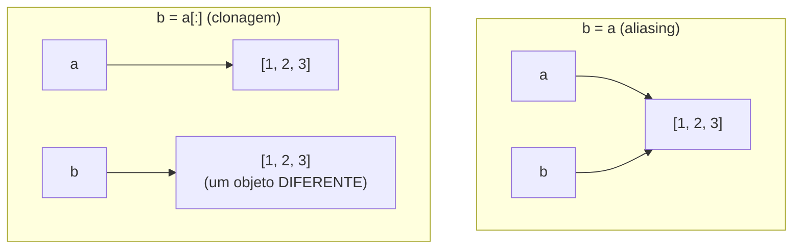

## Objetivos de Aprendizagem

- Explicar o que a atribuição (`b = a`) realmente faz a um objeto mutável, em termos de nomes e objetos, não de "cópia".
- Prever, para uma dada sequência de instruções, se uma mutação feita através de um nome é visível através de outro.
- Usar `is` corretamente para checar identidade de objeto, e distingui-lo de `==`, que checa igualdade de conteúdo.
- Implementar um clone genuíno de uma lista usando slicing, `list()` ou `.copy()`, e explicar por que cada um produz um objeto independente.
- Identificar o modo de falha específico de uma cópia rasa quando uma lista contém objetos mutáveis aninhados.

## Contexto e Motivação

A lição anterior estabeleceu que uma lista é mutável: seu conteúdo pode mudar no lugar depois de criada. Esta lição faz a pergunta que a mutabilidade torna urgente e inevitável: o que acontece quando *duas variáveis diferentes* se referem à mesma lista? Com um valor imutável como um inteiro, a pergunta quase não importa: se `a = 5` e `b = a`, não existe operação que possa fazer "mudar `b`" afetar `a`, porque inteiros não podem ser alterados no lugar de jeito nenhum; a única coisa possível é reatribuir `b` para um inteiro *diferente*, o que deixa `a` intocado por definição. Mas, uma vez que o valor atribuído é uma lista mutável, essa imunidade desaparece, e a mesma instrução exata (`b = a`) produz uma situação categoricamente diferente: agora dois nomes se referem a um único objeto compartilhado, no qual uma mutação feita através de qualquer um dos dois nomes é visível através dos dois.

Isso é aliasing, e é possivelmente o único conceito de um curso introdutório que mais confiavelmente produz bugs que, para quem os vive, dão a sensação de que a própria linguagem está quebrada: uma variável que nunca foi tocada "muda sozinha", uma função que só deveria *ler* uma lista corrompe silenciosamente os dados de quem a chamou, um bug que se reproduz de forma inconsistente dependendo de qual outro código rodou antes. Nada disso é realmente misterioso uma vez que o modelo subjacente esteja claro: o modelo de dados do Python afirma claramente que a atribuição vincula um nome a um objeto, e nunca, em nenhuma circunstância, copia o objeto sendo atribuído. `b = a` sempre significa "`b` agora se refere a tudo aquilo a que `a` se refere": para um valor imutável, isso é invisível, porque nada pode agir de forma diferente através do novo nome, e para um valor mutável isso é o jogo inteiro, porque agora *qualquer coisa* feita através de `b` também é, silenciosamente, feita ao exato mesmo objeto ao qual `a` ainda se refere.

O remédio (a clonagem) é conceitualmente simples: construir uma lista genuinamente nova e independente com o mesmo conteúdo atual. Mas a mecânica merece cuidado real, porque "cópia" não é uma única operação com uma única garantia. Uma cópia rasa, que é o que os idiomas de cópia de lista do Python produzem por padrão, duplica a lista externa, mas não nenhum objeto mutável aninhado dentro dela: uma distinção que importa enormemente no momento em que uma lista de listas, ou uma lista de dicionários, entra em cena. Esta lição percorre as duas metades com cuidado: reconhecer quando o aliasing está acontecendo (frequentemente a metade mais difícil, já que não produz erro nem aviso) e escolher, deliberadamente, quando quebrá-lo.

## Teoria Central

### Dois nomes, um objeto

```python
a = [1, 2, 3]
b = a              # b agora é OUTRO NOME para a MESMA lista -- não é uma cópia
b.append(4)
print(a)           # [1, 2, 3, 4] -- a "mudou" também
print(a is b)      # True -- confirma que são o objeto idêntico
```

`is` checa *identidade de objeto*: se esses dois nomes se referem ao mesmo objeto na memória, enquanto `==` checa *igualdade de conteúdo*: se esses dois objetos (sendo o mesmo ou não) atualmente têm valores iguais. Duas listas inteiramente distintas que por acaso têm os mesmos elementos são `==`, mas não `is`:

```python
x = [1, 2, 3]
y = [1, 2, 3]
print(x == y)   # True -- mesmo conteúdo
print(x is y)   # False -- dois objetos separados que por acaso se parecem
```



### Aliasing só é visível através de mutação, nunca através de reatribuição

Um detalhe crítico e facilmente esquecido: aliasing só fica aparente quando uma *mutação* acontece ao objeto compartilhado; uma simples reatribuição de um dos nomes não afeta o outro, porque a reatribuição apenas faz aquele nome apontar para outro lugar completamente diferente.

```python
a = [1, 2, 3]
b = a
b = [9, 9, 9]     # isso REATRIBUI b a uma lista totalmente nova -- não toca no objeto compartilhado
print(a)            # [1, 2, 3] -- completamente intocado
print(b)            # [9, 9, 9] -- b agora aponta para outro lugar
```

Distinguir "mutar o objeto ao qual um nome se refere" (`b.append(...)`, `b[0] = ...`) de "revincular o próprio nome a um objeto diferente" (`b = [...]`) é a habilidade mais importante para raciocinar corretamente sobre aliasing. A primeira afeta todo nome com alias para aquele objeto; a segunda afeta apenas o único nome sendo reatribuído.

### A clonagem quebra o alias

```python
a = [1, 2, 3]
b = a[:]            # fatiar a lista INTEIRA constrói uma lista genuinamente nova e independente
# alternativas equivalentes: b = list(a)   ou   b = a.copy()
b.append(4)
print(a)             # [1, 2, 3] -- intocado
print(b)             # [1, 2, 3, 4]
print(a is b)         # False -- dois objetos distintos
```

Os três idiomas de clonagem (o slice completo `a[:]`, o construtor `list()` e o método `.copy()`) produzem o mesmo tipo de resultado: um novo objeto lista contendo os mesmos elementos que o original tinha *no momento da cópia*. A partir daí, as duas listas são inteiramente independentes; nada feito a uma é visível através da outra.

### Por que isso importa imediatamente: passar uma lista para uma função

O Python passa argumentos entregando ao chamado uma referência ao mesmo objeto que o chamador tem; ele nunca clona automaticamente um argumento lista. Isso significa que uma função que muta um parâmetro também muta a lista original do chamador, a menos que um clone tenha sido feito em algum lugar, seja dentro da função ou pelo chamador antes da chamada:

```python
def add_bonus(scores):
    scores.append(100)      # muta a lista do CHAMADOR -- nenhuma cópia foi feita

original = [88, 92]
add_bonus(original)
print(original)              # [88, 92, 100] -- a lista do chamador mudou, intencional ou não

def add_bonus_safely(scores):
    local_copy = scores[:]   # clona PRIMEIRO, depois muta o clone
    local_copy.append(100)
    return local_copy

original2 = [88, 92]
result = add_bonus_safely(original2)
print(original2)   # [88, 92] -- intocado
print(result)         # [88, 92, 100] -- uma lista nova e separada
```

### Cópias rasas: o limite de `a[:]`, `list(a)` e `.copy()`

Cada um dos idiomas padrão de clonagem produz uma cópia *rasa*: a lista externa é um objeto novo, mas se algum de seus elementos é, ele próprio, um objeto mutável (mais comumente, listas aninhadas), esses objetos internos *não* são copiados: a nova lista externa e a antiga acabam guardando referências aos exatos mesmos objetos internos.

```python
a = [[1, 2], [3, 4]]
b = a[:]                # uma cópia rasa: NOVA lista externa, MESMAS listas internas
b[0].append(99)
print(a)                 # [[1, 2, 99], [3, 4]] -- a lista interna compartilhada mudou!
print(a is b)             # False -- as listas externas são objetos diferentes
print(a[0] is b[0])        # True -- mas as listas internas são o MESMO objeto
```

`a is b` corretamente relata `False`, porque o slicing de fato criou uma nova lista externa, mas `a[0] is b[0]` relata `True`, revelando que o primeiro *elemento* de cada lista externa ainda é o idêntico objeto interno. Uma cópia rasa só protege contra mutações na estrutura externa (adicionar, remover ou reatribuir elementos de nível superior); ela não oferece proteção nenhuma contra mutações que alcançam um objeto mutável aninhado. Uma cópia genuinamente independente em todo nível (uma cópia *profunda*) exige `copy.deepcopy()` da biblioteca padrão, que clona recursivamente todo objeto mutável aninhado que encontrar.

```python
import copy
a = [[1, 2], [3, 4]]
b = copy.deepcopy(a)
b[0].append(99)
print(a)   # [[1, 2], [3, 4]] -- totalmente intocado, mesmo no nível aninhado
```

## Exemplos Resolvidos

**Exemplo 1: rastreando um bug de aliasing passo a passo.** Um aluno escreve código para acompanhar uma lista corrente das "tarefas de hoje" e uma lista separada destinada a registrar as "tarefas concluídas até agora", e fica confuso por que concluir uma tarefa parece também removê-la da lista de hoje.

```python
today = ["email", "report", "meeting"]
completed = today          # BUG: isso cria alias, não clona

completed.remove("email")
print(today)                # ["report", "meeting"] -- "today" perdeu uma tarefa que não deveria!
print(completed)             # ["report", "meeting"]
print(today is completed)    # True -- a causa raiz, tornada visível
```

Explicando por quê: `completed = today` foi pensado pelo aluno para significar "comece `completed` como uma cópia do que está em `today` agora", mas não é isso que a atribuição faz. Ela faz de `completed` outro nome para a *mesma* lista, então `.remove()` em `completed` é indistinguível, do ponto de vista do Python, de chamar `.remove()` diretamente em `today`. A correção é clonar no ponto em que listas independentes eram de fato a intenção:

```python
today = ["email", "report", "meeting"]
completed = today.copy()    # um clone genuíno -- independente a partir daqui

completed.remove("email")
print(today)                 # ["email", "report", "meeting"] -- intocado, corretamente
print(completed)              # ["report", "meeting"]
print(today is completed)     # False
```

**Exemplo 2: usando `is` e `==` juntos para diagnosticar uma estrutura de dados.** Dadas duas variáveis suspeitas de se referirem à mesma lista subjacente, verifique com precisão o que está acontecendo antes de assumir "são a mesma" ou "são diferentes":

```python
def build_roster():
    return ["Ada", "Ben", "Cid"]

roster_a = build_roster()
roster_b = build_roster()
roster_c = roster_a

print(roster_a == roster_b)   # True -- mesmo conteúdo
print(roster_a is roster_b)    # False -- duas chamadas SEPARADAS, dois objetos lista separados
print(roster_a is roster_c)    # True -- roster_c é um alias do objeto de roster_a
```

Este exemplo importa porque `build_roster()` é chamada duas vezes, e cada chamada constrói e retorna um literal de lista totalmente novo; mesmo que o conteúdo seja idêntico, `roster_a` e `roster_b` são objetos diferentes, confirmado por `is` retornando `False`. `roster_c`, por outro lado, foi atribuída diretamente a partir de `roster_a`, tornando-a um alias verdadeiro, confirmado por `is` retornando `True`. Confiar apenas em `==` nunca revelaria essa distinção, já que ela só relata sobre conteúdo.

**Exemplo 3: uma função que precisa ser segura contra aliasing, construída deliberadamente.** Escreva uma função `remove_duplicates(items)` que retorne uma nova lista sem duplicatas, sem mutar nem criar alias para a lista original do chamador.

Uma primeira tentativa, com bug, cria alias para a entrada por acidente:

```python
def remove_duplicates(items):
    result = items          # BUG: isso é um alias de items, não uma lista nova
    for item in items:
        while result.count(item) > 1:
            result.remove(item)
    return result
```

Como `result` é o próprio `items`, essa função muta a lista original do chamador enquanto afirma apenas "retornar" uma versão limpa; um chamador que ainda precise da lista original, intocada, não tem como recuperá-la. A versão corrigida parte de um clone explícito:

```python
def remove_duplicates(items):
    result = []              # parte de uma lista genuinamente NOVA e vazia
    for item in items:
        if item not in result:
            result.append(item)
    return result

original = [1, 2, 2, 3, 1]
cleaned = remove_duplicates(original)
print(original)   # [1, 2, 2, 3, 1] -- intocado
print(cleaned)      # [1, 2, 3]
print(original is cleaned)   # False
```

Construir `result` como uma lista vazia nova e adicionar a ela (em vez de partir do próprio `items`, mesmo via slicing) evita o aliasing por completo, e torna o contrato da função ("eu retorno algo novo; nunca toco no que você me deu") verdadeiro por construção, e não por controle cuidadoso.

## Equívocos Comuns e Armadilhas

- **"`b = a` copia a lista para dentro de `b`."** Nunca, para um objeto mutável: isso vincula `b` ao exato mesmo objeto ao qual `a` já se refere. A única forma de obter uma lista independente é uma operação explícita de clonagem (`a[:]`, `list(a)`, `.copy()`, ou `copy.deepcopy(a)` para estruturas aninhadas); a atribuição sozinha nunca faz isso.

- **"Se duas variáveis têm listas `==`, elas devem ser o mesmo objeto."** `==` e `is` respondem perguntas diferentes. Duas listas construídas independentemente com conteúdo idêntico são `==`, mas não `is`, provado diretamente no Exemplo 2 acima. Confiar em `==` para inferir aliasing (ou sua ausência) é um erro de categoria; só `is` responde a essa pergunta.

- **"Um `.copy()` (ou `a[:]`, ou `list(a)`) protege completamente uma lista contra qualquer mutação futura que a alcance através do original."** Isso só é verdade um nível abaixo. Se a lista contém objetos mutáveis aninhados (outras listas, dicionários), esses objetos internos são compartilhados entre o original e a cópia rasa, e uma mutação a um objeto aninhado é visível através dos dois, como mostrado diretamente:

  ```python
  a = [[1, 2], [3, 4]]
  b = a.copy()
  b[0][0] = 999
  print(a)   # [[999, 2], [3, 4]] -- mudou, mesmo com b tendo sido "copiada"
  ```

- **"Clonar não custa nada, então é sempre mais seguro clonar defensivamente, em todo lugar."** Clonar custa memória e tempo proporcionais ao tamanho do que é copiado. Clonar uma lista muito grande a cada chamada de função, puramente por precaução, quando essa função nunca de fato muta seu argumento, é um custo real e evitável. A resposta correta ao risco de aliasing é ser deliberado sobre quais funções mutam seus argumentos e documentar ou nomeá-las de acordo, não clonar reflexivamente toda lista que entra ou sai de uma função.

## Resumo

A atribuição nunca copia um objeto mutável: `b = a` faz de `b` um segundo nome para a lista idêntica à qual `a` já se refere, e qualquer mutação feita através de qualquer um dos nomes é visível através dos dois, um fenômeno chamado aliasing. Isso é invisível até que uma mutação de fato ocorra; uma simples reatribuição de um nome (`b = [...]`) nunca afeta o outro. `is` checa se dois nomes se referem ao mesmo objeto; `==` checa se seus conteúdos são iguais: dois objetos diferentes com conteúdos iguais são `==`, mas não `is`, e confundir as duas perguntas é uma fonte comum de bugs mal diagnosticados. Clonar (via `a[:]`, `list(a)` ou `.copy()`) constrói um objeto genuinamente separado, quebrando o alias, mas só produz uma cópia *rasa*: quaisquer objetos mutáveis aninhados dentro da lista continuam compartilhados com o original, e só `copy.deepcopy()` protege contra isso. Como o Python passa argumentos de lista por referência em vez de por cópia automática, se uma função muta sua entrada ou trabalha sobre um clone independente é uma decisão de design que quem escreve a função precisa tomar deliberadamente, não algo que a linguagem decide sozinha.

## Documentation Links

- [Python Data Model](https://docs.python.org/3/reference/datamodel.html) (doc)
- [Python Tutorial: Data Structures](https://docs.python.org/3/tutorial/datastructures.html) (doc)
