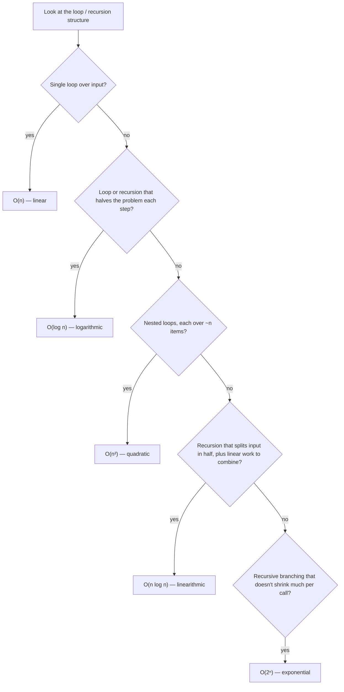

## Learning Objectives

- Explain what Big-O notation formally bounds — worst-case growth rate, with constants and lower-order terms deliberately ignored.
- Identify common growth rates (constant, logarithmic, linear, linearithmic, quadratic, exponential) by reading a function's loop and recursion structure.
- Implement a small analysis of a given function's Big-O by counting nested loops, halving steps, or recursive branching.
- Compare two growth rates and predict which one "wins" for large enough input, even when the losing one is faster on small input.
- Distinguish worst-case complexity from best-case and average-case complexity, and recognize when Big-O alone gives a misleading picture.

## Context & Motivation

The previous concept left off with two empirical tools — a clock and a counter — and one open problem: both are measurements on specific input sizes, and neither predicts what happens on an input far larger than anything actually tested. Big-O notation is the answer to that problem. It describes how an algorithm's running time grows as its input size grows, in the worst case, while deliberately ignoring machine-specific constants — it answers "if I double the input, roughly how much longer does this take?" rather than "how many seconds did it take on this laptop." This is exactly the abstraction that the previous concept's operation-counting was building toward: once it's established that an operation count *grows* in a particular pattern as `n` increases, Big-O gives that pattern a name and a notation that's stable across every machine that will ever run the code.

This isn't a niche concern reserved for algorithm specialists. The ACM/IEEE CS2013 curriculum guidelines — the standard that accredited computer science programs are built against — list algorithmic complexity analysis as a required competency within the Software Development Fundamentals knowledge area, precisely because the ability to look at a piece of code and predict how its cost scales is treated as a foundational skill, not an advanced elective. A function that is "correct" by every test case available today can become unusable the moment real-world input grows past what was ever tested — and Big-O is the tool for catching that *before* it happens in production, by reasoning about the code's structure rather than waiting to measure the failure.

## Core Theory

### The formal definition

A function `f(n)` is `O(g(n))` if there exist positive constants `c` and `n₀` such that `f(n) ≤ c · g(n)` for every `n ≥ n₀`. In plain language: past some starting point `n₀`, `f(n)` never exceeds some fixed multiple of `g(n)` — `g(n)` is an upper bound on `f(n)`'s growth, up to a constant factor, once `n` is large enough. This is what makes constants "not matter": if an algorithm does `3n + 7` operations, that function is `O(n)`, because a constant `c = 10` and starting point `n₀ = 1` satisfy the definition — for every `n ≥ 1`, `3n + 7 ≤ 10n` (this reduces to `7 ≤ 7n`, true for all `n ≥ 1`). The `3` and the `7` are absorbed into the constant `c`; what the definition is protecting is the *shape* of the growth, the `n` itself.

### Reading growth rate off the code

```python
def contains(items, target):        # O(n)
    for item in items:               # runs at most n times
        if item == target:
            return True
    return False

def has_duplicate(items):            # O(n^2)
    for i in range(len(items)):
        for j in range(len(items)):
            if i != j and items[i] == items[j]:   # inner loop runs n times, for each of n outer iterations
                return True
    return False
```

`contains` does at most `n` comparisons for a list of `n` items — doubling the list roughly doubles the worst-case work, which is what "O(n)," linear time, means. `has_duplicate` runs the inner loop fully for every iteration of the outer loop — roughly `n * n` comparisons — so doubling the list roughly *quadruples* the worst-case work, which is what "O(n²)," quadratic time, means.

### A catalog of common growth rates

Most code encountered at this stage falls into a small number of recognizable shapes. Ordered from cheapest to most expensive growth, for a problem of size `n`:

| Notation | Name | Example | n = 10 | n = 100 |
|---|---|---|---|---|
| O(1) | constant | dictionary lookup by key | 1 | 1 |
| O(log n) | logarithmic | bisection search | ~3.3 | ~6.6 |
| O(n) | linear | `contains` above | 10 | 100 |
| O(n log n) | linearithmic | merge sort (a later concept) | ~33 | ~664 |
| O(n²) | quadratic | `has_duplicate` above | 100 | 10,000 |
| O(2ⁿ) | exponential | naive recursive Fibonacci without memoization | 1,024 | ~1.27 × 10³⁰ |

The gap between these rows is the entire reason Big-O matters in practice: at `n = 10` every row in this table is a small number, and the difference between them is invisible. At `n = 100`, the exponential row has already become a number with 30 digits, while the logarithmic row has barely moved past 6. No amount of faster hardware closes a gap that grows like this — a faster machine shifts every row down by the same constant factor, but the *shape* of the gap between rows is untouched.

A simple decision process for reading which row a piece of code falls into:



### Why the constant factor doesn't matter, but the shape does

```python
def slow_but_linear(items):     # does 100 * n operations — still O(n)
    total = 0
    for item in items:
        for _ in range(100):
            total += 1
    return total
```

`slow_but_linear` does 100 times more work than `contains` for the same input, and will be measurably slower in wall-clock time — but both are O(n): doubling the input still roughly doubles the work for *either* one. The concrete crossover between a "big-constant linear" algorithm and a genuinely quadratic one is easy to compute directly from the formal definition: compare `100n` against `n²`. They're equal exactly when `n = 100` (since `n² = 100n ⟺ n = 100`). For `n < 100`, `n²` is actually the smaller number — the "worse" algorithm looks better on small input. For `n > 100`, `100n` is smaller, and the gap only widens from there: at `n = 10,000`, `100n = 1,000,000` while `n² = 100,000,000`, a hundred-fold difference. Big-O is deliberately blind to the constant factor because it's describing how the algorithm *scales*, not how fast any one run is — for a large enough input, an O(n) algorithm always eventually outpaces an O(n²) one, no matter how large the O(n) algorithm's hidden constant is. The same reasoning applies even more sharply to `O(n)` versus `O(n log n)`: an `O(n)` algorithm with a constant as large as 1,000 only becomes slower than an `n log n` algorithm once `log₂ n > 1000`, i.e. once `n > 2¹⁰⁰⁰` — a number with over 300 digits, far beyond any input that will ever actually occur. In every input size that arises in practice, the "worse" `O(n log n)` algorithm wins.

## Worked Examples

**Example 1 — proving `3n + 7` is `O(n)` from the formal definition.** The claim to prove: there exist constants `c > 0` and `n₀` such that `3n + 7 ≤ c·n` for all `n ≥ n₀`. Pick `c = 10`. The inequality `3n + 7 ≤ 10n` rearranges to `7 ≤ 7n`, which is true exactly when `n ≥ 1`. So the pair `c = 10, n₀ = 1` satisfies the definition, and `3n + 7` is `O(n)`. (Other valid pairs exist too — `c = 4, n₀ = 7` also works, since `3n + 7 ≤ 4n ⟺ 7 ≤ n`. Big-O only requires *some* valid pair, not a unique one.)

**Example 2 — analyzing a "triangular" nested loop that isn't a full `n²` grid.** Consider:

```python
def count_triangular(items):
    n = len(items)
    total = 0
    for i in range(n):
        for j in range(i):          # inner loop range depends on the outer index!
            total += 1
    return total
```

The inner loop doesn't run `n` times on every outer iteration — it runs `i` times, where `i` is the *current* outer index. Summing the inner loop's iteration counts across every outer iteration gives `0 + 1 + 2 + ... + (n-1) = n(n-1)/2`. That's roughly `n²/2` — half the work of a full `n × n` grid — but `n²/2` is still `O(n²)`: the constant factor of `1/2` is exactly the kind of thing Big-O discards. This is the case bullet-pointed in the misconceptions below: eyeballing "two nested loops" and assuming `O(n²)` gets the right *order* here, but only because the reasoning happens to still land on the same growth rate — a case where the inner bound depends on the outer index needs the sum worked out explicitly to be sure.

**Example 3 — best case, worst case, and average case for `contains`.** Trace `contains([5, 2, 8, 1, 9], target)` for three different targets. If `target = 5` (the first element), the loop finds it and returns on the very first comparison — one operation, regardless of how long the list is: this is the *best case*, `O(1)` for this particular input. If `target = 9` (the last element), or if `target` isn't in the list at all, the loop must compare against every element before it can return — `n` operations: this is the *worst case*, `O(n)`. If `target` is picked uniformly at random from among the list's elements (or from outside it, with some probability), the *average case* sits somewhere in between — roughly `n/2` comparisons if the target is present and uniformly likely to be at any position, still `O(n)` since a constant factor of `1/2` doesn't change the order, but a genuinely different number from either extreme. Big-O as usually quoted for `contains` refers to the worst case — because a guarantee that holds no matter what the input looks like is the guarantee usually worth having.

## Common Misconceptions & Pitfalls

**"Big-O tells me exactly how this algorithm behaves on my input."** Big-O (as conventionally used) describes the *worst case* — the input that makes the algorithm work hardest. That can be pessimistic for typical, well-behaved input: `contains` is `O(n)` in the worst case, but as Worked Example 3 showed directly, it finishes in a single step if the target happens to be first. An algorithm quoted as "O(n²) worst case" might run much closer to linear on inputs that are already mostly sorted or otherwise favorable — Big-O alone, without also asking "worst case, best case, or average case?", doesn't capture that nuance.

**"A better Big-O always means a faster program."** Dropping constant factors is deliberate, and it's exactly why this isn't true in general: as shown above, an `O(n)` algorithm with a large hidden constant (say, 1,000) needs `n > 2¹⁰⁰⁰` before an `O(n log n)` algorithm actually overtakes it — a threshold far beyond any input that will ever occur, meaning the "asymptotically worse" `O(n log n)` algorithm is faster on literally every input size anyone will ever run. Big-O predicts what happens *eventually*, for large enough `n` — it says nothing about which algorithm wins at the sizes that actually occur, without also knowing (or measuring) the constants involved.

**"Nested loops always mean O(n²)."** As Worked Example 2 showed, an inner loop whose range depends on the outer loop's current position (`range(i)` instead of `range(n)`) still produces `O(n²)` total work here, because summing `0 + 1 + ... + (n-1)` is still proportional to `n²` — but that conclusion required actually summing the series, not just spotting two nested `for` keywords. A nested loop structure can just as easily produce something else entirely — for example, an inner loop whose range *halves* on each outer iteration produces `O(n log n)`, not `O(n²)`. Reading growth rate off nested loops correctly requires looking at what bounds each loop, not just counting how many loops are nested.

**"More lines of code, or more loops written out, means worse complexity."** A function with three separate, sequential `for` loops that each scan the input once is still `O(n)` — three passes over `n` items is `3n`, and the constant `3` is absorbed exactly as in `3n + 7` above. What determines the growth rate is whether loops are *nested* (multiplying their costs) or *sequential* (adding their costs), not how many `for` keywords appear in the source.

## Summary

Big-O gives operation counting a name: `f(n)` is `O(g(n))` when, past some starting point, `f(n)` never exceeds a fixed constant multiple of `g(n)` — which is precisely what lets constant factors and lower-order terms be discarded while the true growth *shape* is kept. That shape sorts into a small number of recognizable rates — constant, logarithmic, linear, linearithmic, quadratic, exponential — whose gap widens explosively as `n` grows, even though they can look indistinguishable on small input. Reading the right rate off code takes more than counting loops: a nested loop's true cost depends on what bounds the inner loop, not merely on how many loops are nested, and a triangular or halving inner range can change the answer. Because the notation describes worst-case growth by design, it can be pessimistic for typical input and silent about which of two same-order (or even different-order, at practical sizes) algorithms actually runs faster — for that, the constants Big-O deliberately discards have to be measured, not assumed away.

## Documentation Links

- [MIT 6.100L — Materials by Lecture](https://ocw.mit.edu/courses/6-100l-introduction-to-cs-and-programming-using-python-fall-2022/pages/material-by-lecture/) — doc
- [ACM/IEEE CS2013 — Software Development Fundamentals KA](https://csed.acm.org/wp-content/uploads/2023/09/SDF-Version-Gamma.pdf) — doc
