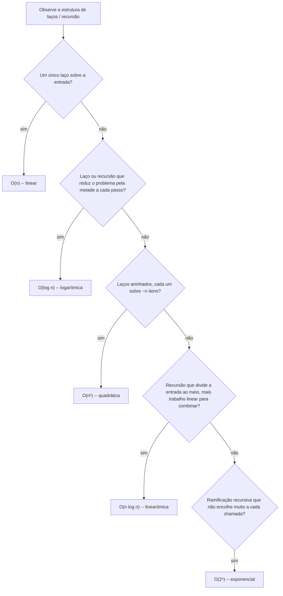

## Objetivos de Aprendizagem

- Explicar o que a notação Big-O formalmente delimita: a taxa de crescimento de pior caso, com constantes e termos de ordem inferior deliberadamente ignorados.
- Identificar taxas de crescimento comuns (constante, logarítmica, linear, linearítmica, quadrática, exponencial) lendo a estrutura de laços e recursão de uma função.
- Realizar uma pequena análise do Big-O de uma função dada, contando laços aninhados, passos de bisseção, ou ramificação recursiva.
- Comparar duas taxas de crescimento e prever qual delas "vence" para uma entrada suficientemente grande, mesmo quando a perdedora é mais rápida em entradas pequenas.
- Distinguir complexidade de pior caso de complexidade de melhor caso e caso médio, e reconhecer quando o Big-O sozinho dá uma imagem enganosa.

## Contexto e Motivação

O conceito anterior parou em duas ferramentas empíricas (um cronômetro e um contador) e um problema em aberto: as duas são medições em tamanhos de entrada específicos, e nenhuma prevê o que acontece numa entrada muito maior do que qualquer coisa realmente testada. A notação Big-O é a resposta para esse problema. Ela descreve como o tempo de execução de um algoritmo cresce conforme o tamanho da entrada cresce, no pior caso, ignorando deliberadamente constantes específicas de máquina: ela responde "se eu dobrar a entrada, aproximadamente quanto mais tempo isso leva?" em vez de "quantos segundos isso levou neste laptop." Essa é exatamente a abstração para a qual a contagem de operações do conceito anterior estava se encaminhando: uma vez estabelecido que uma contagem de operações *cresce* segundo um padrão específico à medida que `n` aumenta, o Big-O dá a esse padrão um nome e uma notação estáveis em qualquer máquina que algum dia rodar o código.

Essa não é uma preocupação de nicho reservada a especialistas em algoritmos. As diretrizes curriculares CS2013 da ACM/IEEE (o padrão sobre o qual programas de ciência da computação credenciados são construídos) listam a análise de complexidade algorítmica como uma competência exigida dentro da área de conhecimento de Fundamentos de Desenvolvimento de Software, precisamente porque a capacidade de olhar para um trecho de código e prever como seu custo escala é tratada como uma habilidade fundamental, não uma optativa avançada. Uma função "correta" segundo todo caso de teste disponível hoje pode se tornar inutilizável no momento em que a entrada do mundo real cresce além de qualquer coisa já testada, e o Big-O é a ferramenta para pegar isso *antes* que aconteça em produção, raciocinando sobre a estrutura do código em vez de esperar para medir a falha.

## Teoria Central

### A definição formal

Uma função `f(n)` é `O(g(n))` se existem constantes positivas `c` e `n₀` tais que `f(n) ≤ c · g(n)` para todo `n ≥ n₀`. Em linguagem simples: passado algum ponto de partida `n₀`, `f(n)` nunca ultrapassa algum múltiplo fixo de `g(n)`; `g(n)` é um limite superior para o crescimento de `f(n)`, a menos de um fator constante, uma vez que `n` seja grande o suficiente. É isso que faz as constantes "não importarem": se um algoritmo faz `3n + 7` operações, essa função é `O(n)`, porque uma constante `c = 10` e um ponto de partida `n₀ = 1` satisfazem a definição: para todo `n ≥ 1`, `3n + 7 ≤ 10n` (isso se reduz a `7 ≤ 7n`, verdadeiro para todo `n ≥ 1`). O `3` e o `7` são absorvidos na constante `c`; o que a definição está protegendo é o *formato* do crescimento, o próprio `n`.

### Lendo a taxa de crescimento a partir do código

```python
def contains(items, target):        # O(n)
    for item in items:               # roda no máximo n vezes
        if item == target:
            return True
    return False

def has_duplicate(items):            # O(n^2)
    for i in range(len(items)):
        for j in range(len(items)):
            if i != j and items[i] == items[j]:   # laço interno roda n vezes, para cada uma das n iterações externas
                return True
    return False
```

`contains` faz no máximo `n` comparações para uma lista de `n` itens: dobrar a lista aproximadamente dobra o trabalho de pior caso, que é o que "O(n)", tempo linear, significa. `has_duplicate` roda o laço interno inteiro a cada iteração do laço externo (aproximadamente `n * n` comparações), então dobrar a lista aproximadamente *quadruplica* o trabalho de pior caso, que é o que "O(n²)", tempo quadrático, significa.

### Um catálogo de taxas de crescimento comuns

A maior parte do código encontrado nesta fase se encaixa num pequeno número de formatos reconhecíveis. Ordenados do crescimento mais barato ao mais caro, para um problema de tamanho `n`:

| Notação | Nome | Exemplo | n = 10 | n = 100 |
|---|---|---|---|---|
| O(1) | constante | busca em dicionário por chave | 1 | 1 |
| O(log n) | logarítmica | busca por bisseção | ~3,3 | ~6,6 |
| O(n) | linear | `contains` acima | 10 | 100 |
| O(n log n) | linearítmica | merge sort (um conceito posterior) | ~33 | ~664 |
| O(n²) | quadrática | `has_duplicate` acima | 100 | 10.000 |
| O(2ⁿ) | exponencial | Fibonacci recursivo ingênuo sem memoização | 1.024 | ~1,27 × 10³⁰ |

A diferença entre essas linhas é a razão inteira pela qual o Big-O importa na prática: em `n = 10`, toda linha nesta tabela é um número pequeno, e a diferença entre elas é invisível. Em `n = 100`, a linha exponencial já se tornou um número com 30 dígitos, enquanto a linha logarítmica mal passou de 6. Nenhuma quantidade de hardware mais rápido fecha uma diferença que cresce assim: uma máquina mais rápida desloca cada linha para baixo pelo mesmo fator constante, mas o *formato* da diferença entre as linhas não é afetado.

Um processo de decisão simples para ler em que linha um trecho de código se encaixa:



### Por que o fator constante não importa, mas o formato importa

```python
def slow_but_linear(items):     # faz 100 * n operações -- ainda O(n)
    total = 0
    for item in items:
        for _ in range(100):
            total += 1
    return total
```

`slow_but_linear` faz 100 vezes mais trabalho que `contains` para a mesma entrada, e será mensuravelmente mais lenta em tempo de relógio, mas ambas são O(n): dobrar a entrada ainda aproximadamente dobra o trabalho de qualquer uma delas. O ponto de cruzamento concreto entre um algoritmo "linear com constante grande" e um genuinamente quadrático é fácil de calcular diretamente a partir da definição formal: compare `100n` com `n²`. São iguais exatamente quando `n = 100` (já que `n² = 100n ⟺ n = 100`). Para `n < 100`, `n²` é na verdade o número menor: o algoritmo "pior" parece melhor em entrada pequena. Para `n > 100`, `100n` é menor, e a diferença só aumenta a partir daí: em `n = 10.000`, `100n = 1.000.000` enquanto `n² = 100.000.000`, uma diferença de cem vezes. O Big-O é deliberadamente cego ao fator constante porque está descrevendo como o algoritmo *escala*, não quão rápida é qualquer execução específica: para uma entrada grande o suficiente, um algoritmo O(n) sempre acaba ultrapassando um O(n²), não importa quão grande seja a constante escondida do algoritmo O(n). O mesmo raciocínio se aplica de forma ainda mais acentuada a `O(n)` versus `O(n log n)`: um algoritmo `O(n)` com uma constante tão grande quanto 1.000 só se torna mais lento que um algoritmo `n log n` quando `log₂ n > 1000`, ou seja, quando `n > 2¹⁰⁰⁰`, um número com mais de 300 dígitos, muito além de qualquer entrada que algum dia realmente ocorrerá. Em todo tamanho de entrada que surge na prática, o algoritmo "pior" `O(n log n)` vence.

## Exemplos Resolvidos

**Exemplo 1: provando que `3n + 7` é `O(n)` a partir da definição formal.** A afirmação a provar: existem constantes `c > 0` e `n₀` tais que `3n + 7 ≤ c·n` para todo `n ≥ n₀`. Escolha `c = 10`. A desigualdade `3n + 7 ≤ 10n` se rearranja para `7 ≤ 7n`, que é verdadeira exatamente quando `n ≥ 1`. Então o par `c = 10, n₀ = 1` satisfaz a definição, e `3n + 7` é `O(n)`. (Outros pares válidos também existem: `c = 4, n₀ = 7` também funciona, já que `3n + 7 ≤ 4n ⟺ 7 ≤ n`. O Big-O só exige *algum* par válido, não um único.)

**Exemplo 2: analisando um laço aninhado "triangular" que não é uma grade `n²` completa.** Considere:

```python
def count_triangular(items):
    n = len(items)
    total = 0
    for i in range(n):
        for j in range(i):          # o alcance do laço interno depende do índice externo!
            total += 1
    return total
```

O laço interno não roda `n` vezes em toda iteração externa: ele roda `i` vezes, onde `i` é o índice externo *atual*. Somar as contagens de iteração do laço interno ao longo de toda iteração externa dá `0 + 1 + 2 + ... + (n-1) = n(n-1)/2`. Isso é aproximadamente `n²/2`, metade do trabalho de uma grade `n × n` completa, mas `n²/2` ainda é `O(n²)`: o fator constante de `1/2` é exatamente o tipo de coisa que o Big-O descarta. Este é o caso listado nos equívocos abaixo: olhar de relance "dois laços aninhados" e assumir `O(n²)` acerta a *ordem* de grandeza aqui, mas só porque o raciocínio por acaso chega na mesma taxa de crescimento; um caso em que o limite interno depende do índice externo precisa da soma calculada explicitamente para ter certeza.

**Exemplo 3: melhor caso, pior caso e caso médio para `contains`.** Trace `contains([5, 2, 8, 1, 9], target)` para três alvos diferentes. Se `target = 5` (o primeiro elemento), o laço o encontra e retorna já na primeira comparação: uma operação, independentemente de quão longa seja a lista; este é o *melhor caso*, `O(1)` para esta entrada específica. Se `target = 9` (o último elemento), ou se `target` não está na lista de forma alguma, o laço precisa comparar contra todo elemento antes de poder retornar: `n` operações; este é o *pior caso*, `O(n)`. Se `target` for escolhido uniformemente ao acaso entre os elementos da lista (ou de fora dela, com alguma probabilidade), o *caso médio* fica em algum lugar entre os dois: aproximadamente `n/2` comparações se o alvo estiver presente e com igual probabilidade de estar em qualquer posição, ainda `O(n)` já que um fator constante de `1/2` não muda a ordem, mas um número genuinamente diferente de qualquer um dos extremos. O Big-O como normalmente citado para `contains` se refere ao pior caso, porque uma garantia que vale independentemente de como a entrada se pareça costuma ser a garantia que vale a pena ter.

## Equívocos Comuns e Armadilhas

**"O Big-O me diz exatamente como este algoritmo se comporta na minha entrada."** O Big-O (como convencionalmente usado) descreve o *pior caso*: a entrada que faz o algoritmo trabalhar mais duro. Isso pode ser pessimista para uma entrada típica e bem-comportada: `contains` é `O(n)` no pior caso, mas, como o Exemplo Resolvido 3 mostrou diretamente, termina em um único passo se o alvo por acaso for o primeiro. Um algoritmo citado como "O(n²) pior caso" pode rodar muito mais próximo de linear em entradas já quase ordenadas ou de outra forma favoráveis: o Big-O sozinho, sem também perguntar "pior caso, melhor caso, ou caso médio?", não captura essa nuance.

**"Um Big-O melhor sempre significa um programa mais rápido."** Descartar fatores constantes é deliberado, e é exatamente por isso que isso não é verdade em geral: como mostrado acima, um algoritmo `O(n)` com uma constante escondida grande (digamos, 1.000) precisa de `n > 2¹⁰⁰⁰` antes que um algoritmo `O(n log n)` de fato o ultrapasse, um limiar muito além de qualquer entrada que algum dia vá ocorrer, o que significa que o algoritmo "assintoticamente pior" `O(n log n)` é mais rápido em literalmente todo tamanho de entrada que alguém algum dia vai rodar. O Big-O prevê o que acontece *eventualmente*, para `n` grande o suficiente; ele não diz nada sobre qual algoritmo vence nos tamanhos que de fato ocorrem, sem também conhecer (ou medir) as constantes envolvidas.

**"Laços aninhados sempre significam O(n²)."** Como o Exemplo Resolvido 2 mostrou, um laço interno cujo alcance depende da posição atual do laço externo (`range(i)` em vez de `range(n)`) ainda produz `O(n²)` de trabalho total aqui, porque somar `0 + 1 + ... + (n-1)` ainda é proporcional a `n²`, mas essa conclusão exigiu de fato somar a série, não apenas identificar dois `for` aninhados. Uma estrutura de laços aninhados pode perfeitamente produzir algo inteiramente diferente: por exemplo, um laço interno cujo alcance *cai pela metade* a cada iteração externa produz `O(n log n)`, não `O(n²)`. Ler corretamente a taxa de crescimento em laços aninhados exige olhar o que limita cada laço, não apenas contar quantos laços estão aninhados.

**"Mais linhas de código, ou mais laços escritos, significa complexidade pior."** Uma função com três laços `for` separados e sequenciais, cada um percorrendo a entrada uma vez, ainda é `O(n)`: três passagens sobre `n` itens é `3n`, e a constante `3` é absorvida exatamente como em `3n + 7` acima. O que determina a taxa de crescimento é se os laços estão *aninhados* (multiplicando seus custos) ou *sequenciais* (somando seus custos), não quantas palavras-chave `for` aparecem no código-fonte.

## Resumo

O Big-O dá um nome à contagem de operações: `f(n)` é `O(g(n))` quando, passado algum ponto de partida, `f(n)` nunca ultrapassa um múltiplo constante fixo de `g(n)`, o que é precisamente o que permite descartar fatores constantes e termos de ordem inferior enquanto o verdadeiro *formato* do crescimento é mantido. Esse formato se organiza num pequeno número de taxas reconhecíveis (constante, logarítmica, linear, linearítmica, quadrática, exponencial) cuja diferença se alarga explosivamente conforme `n` cresce, mesmo que possam parecer indistinguíveis em entrada pequena. Ler a taxa certa a partir do código exige mais do que contar laços: o custo verdadeiro de um laço aninhado depende do que limita o laço interno, não meramente de quantos laços estão aninhados, e um alcance interno triangular ou que cai pela metade pode mudar a resposta. Como a notação descreve crescimento de pior caso por design, ela pode ser pessimista para entrada típica e silenciosa sobre qual entre dois algoritmos de mesma ordem (ou até de ordens diferentes, em tamanhos práticos) de fato roda mais rápido; para isso, as constantes que o Big-O deliberadamente descarta precisam ser medidas, não presumidas.

## Documentation Links

- [MIT 6.100L: Materials by Lecture](https://ocw.mit.edu/courses/6-100l-introduction-to-cs-and-programming-using-python-fall-2022/pages/material-by-lecture/) (doc)
- [ACM/IEEE CS2013: Software Development Fundamentals KA](https://csed.acm.org/wp-content/uploads/2023/09/SDF-Version-Gamma.pdf) (doc)
