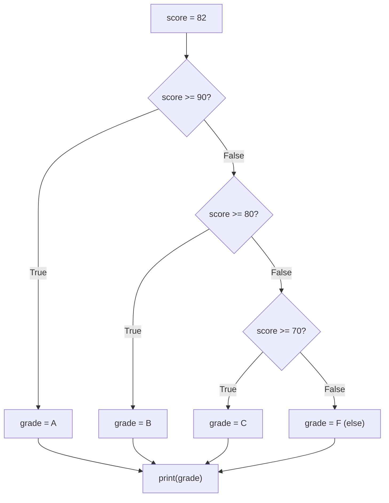

## Learning Objectives

- Explain why a program that only runs top-to-bottom cannot express a decision, and what "control flow" means as a result.
- Implement branching logic in Python using `if`, `elif`, and `else`, including chains that test more than two cases.
- Predict, for a given `if`/`elif`/else` chain and a given input, exactly which single branch will execute.
- Identify when a chain of conditions is ordered incorrectly, producing a branch that can never be reached.
- Compare a flat `elif` chain against deeply nested `if` statements and judge which is more readable for a given case.

## Context & Motivation

Every program you have written up to this point has run the same sequence of statements in the same order every single time, regardless of what values the variables held. That is a very limited kind of program. A calculator that always adds two numbers, or a report generator that always prints the same three lines, is not much more than a fixed script — it cannot react to its own data. The moment a program needs to behave differently depending on *what it sees* — an order over a certain amount gets a discount, a score in a certain range gets a certain letter grade, a password that doesn't match gets rejected — the program needs a way to choose between two or more possible futures.

This is the first genuinely new capability introduced in this course: control flow that is not simply "next line." Up to now, computational thinking (the first concept of this track) was mostly manifested as decomposition and naming. Conditional control flow is where the "algorithm" part of "algorithmic thinking" actually starts to show teeth, because for the first time, the *sequence of steps executed* is not fixed at the moment you write the code — it is decided while the program runs, based on data the programmer may not even know in advance. CS50's own weekly structure (see the references below) introduces conditions immediately after variables and expressions for exactly this reason: nearly every useful program needs to make at least one decision, and most make many.

It helps to notice that a condition in Python is not a special kind of syntax bolted onto `if` — it is just an ordinary expression that happens to evaluate to a `bool`, `True` or `False`. `score >= 90` is not fundamentally different from `2 + 2`; it is an expression, evaluated to produce a value, and that value happens to be a boolean rather than a number. Once you see conditions this way, the leap from "expressions and assignment" (the concept immediately before this one) to "conditional control flow" is smaller than it looks: you already know how to write expressions; `if` is simply the first place Python does something with the *result* of an expression other than store it in a variable.

## Core Theory

### The single-branch `if`

The simplest form of conditional control flow has only one possible extra path:

```python
temperature = 35
if temperature > 30:
    print("Heat warning")
```

If `temperature > 30` evaluates to `True`, the indented line runs; if it evaluates to `False`, Python skips straight past the indented block to whatever comes after it. There is no "else" here — the absence of a matching condition simply means nothing extra happens. This is worth internalizing before moving to more complex chains: an `if` with no `else` is not an error and not incomplete on its own; it is just a decision with only one interesting outcome.

### `if` / `elif` / `else` chains

Most real decisions have more than two outcomes. Python lets you chain conditions with `elif` ("else if"):

```python
score = 82

if score >= 90:
    grade = "A"
elif score >= 80:
    grade = "B"
elif score >= 70:
    grade = "C"
else:
    grade = "F"

print(grade)   # "B"
```

The critical mechanical fact, and the one students most often misjudge, is this: Python evaluates the conditions **top to bottom** and stops at the very first one that is `True`. Here, `score >= 90` is checked first and is `False` (82 is not ≥ 90), so Python moves on. `score >= 80` is checked next and is `True` — so `grade` is set to `"B"`, and **the remaining `elif` and `else` branches are never even evaluated**, regardless of whether they would also have matched. `elif score >= 70` is not tested at all in this run; it doesn't need to be, because a branch already fired. `else` is optional, and it catches whatever no earlier condition matched — if you omit it entirely and none of the `elif` conditions are `True`, the whole chain simply does nothing.

The following diagram makes the "stop at the first match" behavior explicit, because it is exactly the part that a linear reading of the code can obscure:



### Combining conditions with `and`, `or`, `not`

A condition is not limited to a single comparison. Boolean operators let you combine several expressions into one condition:

```python
age = 20
has_ticket = True

if age >= 18 and has_ticket:
    print("Allowed in")
```

`and` is only `True` when both sides are `True`; `or` is `True` when at least one side is; `not` flips a boolean. These combine the same way arithmetic operators combine numbers, and they follow their own precedence rules (`not` binds tighter than `and`, which binds tighter than `or`), so when a condition mixes more than one of these operators, using parentheses to make the intended grouping explicit is usually worth the extra characters — `not a or b` and `not (a or b)` are genuinely different conditions.

### Indentation is not decoration

In many languages, curly braces or `begin`/`end` keywords mark which statements belong to which branch, and whitespace is just for humans. Python has no such braces — indentation itself is what delimits a branch's body. This is a structural fact about the language, not a style guideline:

```python
if score >= 80:
    grade = "B"
    print("Nice job")   # still inside the if — runs only when the branch matches
print("Done")           # outside the if — runs regardless
```

A misaligned line either raises an `IndentationError` immediately (if the misalignment is inconsistent enough for Python to notice) or, more dangerously, silently attaches to the wrong block if the misalignment is consistent — the code runs without crashing, but not where you thought it would.

## Worked Examples

**Example 1 — validating input with a single-branch decision.** Suppose a function needs to guard against a negative input before doing any real work:

```python
n = -5

if n < 0:
    print("Error: n must be non-negative")
else:
    result = n ** 2
    print(result)
```

Walk through it: `n < 0` evaluates `-5 < 0`, which is `True`, so the `if` branch runs and prints the error message; the `else` branch — where the actual computation lives — is skipped entirely. Change `n` to `5` and trace it again: `5 < 0` is `False`, so the `if` branch is skipped and the `else` branch runs, printing `25`. Notice that exactly one of the two branches runs on any given execution — never both, never neither — because `if`/`else` (with no `elif`) always partitions every possible boolean value into exactly two cases.

**Example 2 — an `elif` chain with a subtle ordering bug, found and fixed.** Suppose someone writes a grading chain like this:

```python
score = 85

if score >= 70:
    grade = "C"
elif score >= 80:      # this branch can NEVER run
    grade = "B"
elif score >= 90:      # neither can this one
    grade = "A"
else:
    grade = "F"

print(grade)   # "C" -- wrong! 85 should be a "B"
```

Trace it by hand: `score >= 70` is checked first. `85 >= 70` is `True`. Python assigns `grade = "C"` and stops — the chain never even reaches the `elif score >= 80` line, because the first matching branch already fired. The bug is not in the comparison operators themselves; it's in the **order** the conditions were written. Because `score >= 70` is broader than `score >= 80` and `score >= 90` (every score that satisfies the narrower conditions also satisfies the broad one), placing it first means the narrower, more specific branches are unreachable — dead code that will never execute for any input. The fix is to order the chain from most specific to least specific, exactly as in the Core Theory example: check `>= 90` first, then `>= 80`, then `>= 70`, then fall back to `else`. This kind of bug is especially dangerous because Python gives no warning at all — the code runs, produces an answer, and the answer is simply wrong.

**Example 3 — combining conditions to validate a range.** Suppose a program accepts a percentage and must reject anything outside `0`–`100`:

```python
value = 105

if value < 0 or value > 100:
    print("Out of range")
else:
    print("Valid:", value)
```

Trace it: `value < 0` is `105 < 0`, which is `False`. Because the operator is `or`, Python still must check the other side: `value > 100` is `105 > 100`, which is `True`. `False or True` is `True`, so the `if` branch runs and prints `"Out of range"`. Now trace `value = 50`: `50 < 0` is `False`, `50 > 100` is `False`, `False or False` is `False`, so the `else` branch runs, printing `"Valid: 50"`. This pattern — using `or` to reject anything *outside* a range, rather than `and` to accept anything inside it — is common enough that mixing the two up (writing `and` where `or` was needed, or vice versa) is one of the most frequent bugs in exactly this kind of validation code.

## Common Misconceptions & Pitfalls

- **"Python checks every condition in the chain, not just the first match."** This is false, and it is the single most consequential misunderstanding of `elif`. Once a branch's condition is `True`, every remaining `elif`/`else` in that chain is skipped, even if a later condition would also have evaluated to `True`. This is exactly what makes the ordering bug in Worked Example 2 possible — it is not a bug in evaluating individual conditions, it is a bug in *reachability* caused by chain order.

  ```python
  x = 15
  if x > 10:
      print("big")
  elif x > 5:
      print("medium")   # never printed for x = 15, even though 15 > 5 is True
  ```
- **"An `if` with no matching `elif`/`else` must be an incomplete program."** Sometimes a decision genuinely only has one interesting outcome, and doing nothing in every other case is the correct behavior, not a missing piece. Whether an `else` is needed depends on whether "no action" is actually the right thing to do for every case the `if`/`elif` conditions don't cover — that's a design question, not a rule to apply mechanically.
- **"Omitting `else` when every case is supposed to be handled is harmless."** In practice, this is where silent bugs hide. If a variable is meant to be set in every branch of a chain but the `else` is missing, and no `elif` condition happens to match a given input, that variable is never assigned at all — and the program may not fail until much later, when something else tries to use a variable that was never set, often with a confusing `NameError` far from the actual mistake.
- **"Nesting `if` inside `if` inside `if` is the natural way to check several related conditions."** It is possible, but three or four levels of nested `if` are usually harder to read than the equivalent flattened `elif` chain, and harder still to verify are covering every case correctly. This specific pitfall is a readability judgment rather than a correctness rule — deeply nested conditionals aren't wrong, they're just a common source of confusion once the nesting gets deep enough that it's not obvious which `else` belongs to which `if`.

## Summary

Conditional control flow is the first place a Python program's execution path depends on its data rather than always following the same line-by-line sequence. A condition is nothing more than a boolean-valued expression, and an `if`/`elif`/`else` chain evaluates its conditions strictly top to bottom, running exactly the body of the *first* branch whose condition is `True` and skipping every branch after it — even ones that would also have matched. This "first match wins, then stop" rule is what makes chain *ordering* matter: a broad condition placed before a narrower one can silently make the narrower branch unreachable. Boolean operators (`and`, `or`, `not`) let a single condition combine multiple checks, and Python's indentation-based syntax means the visual layout of a branch's body is not cosmetic — it is the mechanism that determines which statements belong to which branch.

## Documentation Links

- [Python Tutorial — More Control Flow Tools](https://docs.python.org/3/tutorial/controlflow.html) — doc
- [CS50x 2025 — Weeks](https://cs50.harvard.edu/x/2025/weeks/) — doc
