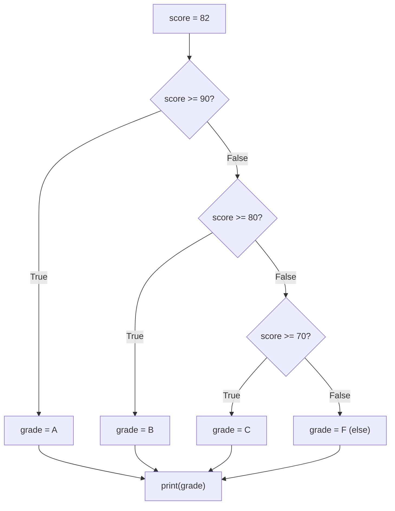

## Objetivos de Aprendizagem

- Explicar por que um programa que só roda de cima para baixo não consegue expressar uma decisão, e o que "fluxo de controle" significa como consequência.
- Implementar lógica de ramificação em Python usando `if`, `elif` e `else`, incluindo cadeias que testam mais de dois casos.
- Prever, para uma dada cadeia `if`/`elif`/`else` e uma dada entrada, exatamente qual único ramo será executado.
- Identificar quando uma cadeia de condições está ordenada incorretamente, produzindo um ramo que nunca pode ser alcançado.
- Comparar uma cadeia `elif` plana com instruções `if` profundamente aninhadas e julgar qual é mais legível para um dado caso.

## Contexto e Motivação

Todo programa que você escreveu até este ponto rodou a mesma sequência de instruções, na mesma ordem, todas as vezes, independentemente dos valores que as variáveis continham. Esse é um tipo de programa muito limitado. Uma calculadora que sempre soma dois números, ou um gerador de relatório que sempre imprime as mesmas três linhas, não é muito mais que um script fixo: ele não consegue reagir aos próprios dados. No momento em que um programa precisa se comportar de forma diferente dependendo *do que ele vê* (um pedido acima de certo valor ganha um desconto, uma nota numa certa faixa recebe uma certa letra de conceito, uma senha que não confere é rejeitada), o programa precisa de uma forma de escolher entre dois ou mais futuros possíveis.

Essa é a primeira capacidade genuinamente nova apresentada neste curso: um fluxo de controle que não é simplesmente "próxima linha". Até agora, o pensamento computacional (o primeiro conceito desta trilha) se manifestava principalmente como decomposição e nomeação. O fluxo de controle condicional é onde a parte "algoritmo" de "pensamento algorítmico" realmente começa a mostrar seus dentes, porque, pela primeira vez, a *sequência de passos executados* não é fixada no momento em que você escreve o código: ela é decidida enquanto o programa roda, com base em dados que o programador talvez nem conheça de antemão. A própria estrutura semanal do CS50 (veja as referências abaixo) apresenta condições logo depois de variáveis e expressões exatamente por esse motivo: quase todo programa útil precisa tomar pelo menos uma decisão, e a maioria toma várias.

Ajuda perceber que uma condição em Python não é um tipo especial de sintaxe grudada ao `if`: é apenas uma expressão comum que por acaso é avaliada para um `bool`, `True` ou `False`. `score >= 90` não é fundamentalmente diferente de `2 + 2`; é uma expressão, avaliada para produzir um valor, e esse valor por acaso é um booleano em vez de um número. Uma vez que você enxerga condições dessa forma, o salto de "expressões e atribuição" (o conceito imediatamente anterior a este) para "fluxo de controle condicional" é menor do que parece: você já sabe escrever expressões; `if` é simplesmente o primeiro lugar em que o Python faz algo com o *resultado* de uma expressão além de guardá-lo numa variável.

## Teoria Central

### O `if` de ramo único

A forma mais simples de fluxo de controle condicional tem apenas um caminho extra possível:

```python
temperature = 35
if temperature > 30:
    print("Heat warning")
```

Se `temperature > 30` for avaliada como `True`, a linha indentada roda; se for avaliada como `False`, o Python pula direto o bloco indentado para o que vier depois dele. Não há "else" aqui: a ausência de uma condição correspondente simplesmente significa que nada extra acontece. Vale a pena internalizar isso antes de partir para cadeias mais complexas: um `if` sem `else` não é um erro nem está incompleto por si só; é apenas uma decisão com apenas um resultado interessante.

### Cadeias `if` / `elif` / `else`

A maioria das decisões reais tem mais de dois resultados. O Python permite encadear condições com `elif` ("else if"):

```python
score = 82

if score >= 90:
    grade = "A"
elif score >= 80:
    grade = "B"
elif score >= 70:
    grade = "C"
else:
    grade = "F"

print(grade)   # "B"
```

O fato mecânico crítico, e o que os alunos mais frequentemente julgam mal, é este: o Python avalia as condições **de cima para baixo** e para na primeiríssima que for `True`. Aqui, `score >= 90` é checada primeiro e é `False` (82 não é ≥ 90), então o Python segue adiante. `score >= 80` é checada em seguida e é `True`: então `grade` recebe `"B"`, e **os ramos `elif` e `else` restantes nem chegam a ser avaliados**, independentemente de eles também combinarem ou não. `elif score >= 70` não é testada de forma alguma nesta execução; não precisa ser, porque um ramo já disparou. `else` é opcional, e captura o que nenhuma condição anterior combinou; se você o omitir completamente e nenhuma condição `elif` for `True`, a cadeia inteira simplesmente não faz nada.

O diagrama a seguir torna explícito o comportamento "para na primeira combinação", porque é exatamente a parte que uma leitura linear do código pode ofuscar:



### Combinando condições com `and`, `or`, `not`

Uma condição não se limita a uma única comparação. Operadores booleanos permitem combinar várias expressões numa única condição:

```python
age = 20
has_ticket = True

if age >= 18 and has_ticket:
    print("Allowed in")
```

`and` só é `True` quando os dois lados são `True`; `or` é `True` quando pelo menos um lado é; `not` inverte um booleano. Esses operadores se combinam do mesmo jeito que operadores aritméticos combinam números, e seguem suas próprias regras de precedência (`not` se liga mais forte que `and`, que se liga mais forte que `or`), então, quando uma condição mistura mais de um desses operadores, usar parênteses para deixar explícito o agrupamento pretendido costuma valer os caracteres extras: `not a or b` e `not (a or b)` são condições genuinamente diferentes.

### A indentação não é decoração

Em muitas linguagens, chaves ou palavras-chave `begin`/`end` marcam quais instruções pertencem a qual ramo, e os espaços em branco são só para os humanos. O Python não tem chaves assim: a própria indentação é o que delimita o corpo de um ramo. Isso é um fato estrutural da linguagem, não uma diretriz de estilo:

```python
if score >= 80:
    grade = "B"
    print("Nice job")   # ainda dentro do if -- roda só quando o ramo combina
print("Done")           # fora do if -- roda de qualquer forma
```

Uma linha desalinhada ou dispara um `IndentationError` imediatamente (se o desalinhamento for inconsistente o bastante para o Python perceber) ou, mais perigosamente, se prende silenciosamente ao bloco errado se o desalinhamento for consistente: o código roda sem travar, mas não onde você pensava que rodaria.

## Exemplos Resolvidos

**Exemplo 1: validando uma entrada com uma decisão de ramo único.** Suponha que uma função precise se proteger contra uma entrada negativa antes de fazer qualquer trabalho real:

```python
n = -5

if n < 0:
    print("Error: n must be non-negative")
else:
    result = n ** 2
    print(result)
```

Percorrendo o código: `n < 0` avalia `-5 < 0`, que é `True`, então o ramo `if` roda e imprime a mensagem de erro; o ramo `else`, onde de fato mora o cálculo, é inteiramente pulado. Mude `n` para `5` e trace de novo: `5 < 0` é `False`, então o ramo `if` é pulado e o ramo `else` roda, imprimindo `25`. Note que exatamente um dos dois ramos roda em qualquer execução dada, nunca os dois, nunca nenhum, porque `if`/`else` (sem `elif`) sempre particiona todo valor booleano possível em exatamente dois casos.

**Exemplo 2: uma cadeia `elif` com um bug sutil de ordenação, encontrado e corrigido.** Suponha que alguém escreva uma cadeia de conceito assim:

```python
score = 85

if score >= 70:
    grade = "C"
elif score >= 80:      # este ramo NUNCA pode rodar
    grade = "B"
elif score >= 90:      # nem este
    grade = "A"
else:
    grade = "F"

print(grade)   # "C" -- errado! 85 deveria ser um "B"
```

Trace na mão: `score >= 70` é checada primeiro. `85 >= 70` é `True`. O Python atribui `grade = "C"` e para: a cadeia nem chega à linha `elif score >= 80`, porque o primeiro ramo que combina já disparou. O bug não está nos operadores de comparação em si; está na **ordem** em que as condições foram escritas. Como `score >= 70` é mais abrangente que `score >= 80` e `score >= 90` (toda nota que satisfaz as condições mais estreitas também satisfaz a abrangente), colocá-la primeiro torna os ramos mais estreitos e específicos inalcançáveis: código morto que nunca vai executar para nenhuma entrada. A correção é ordenar a cadeia da mais específica para a menos específica, exatamente como no exemplo da Teoria Central: checar `>= 90` primeiro, depois `>= 80`, depois `>= 70`, e cair no `else` por último. Esse tipo de bug é especialmente perigoso porque o Python não dá aviso nenhum: o código roda, produz uma resposta, e a resposta é simplesmente errada.

**Exemplo 3: combinando condições para validar uma faixa.** Suponha que um programa aceite uma porcentagem e precise rejeitar qualquer coisa fora de `0` a `100`:

```python
value = 105

if value < 0 or value > 100:
    print("Out of range")
else:
    print("Valid:", value)
```

Trace: `value < 0` é `105 < 0`, que é `False`. Como o operador é `or`, o Python ainda precisa checar o outro lado: `value > 100` é `105 > 100`, que é `True`. `False or True` é `True`, então o ramo `if` roda e imprime `"Out of range"`. Agora trace `value = 50`: `50 < 0` é `False`, `50 > 100` é `False`, `False or False` é `False`, então o ramo `else` roda, imprimindo `"Valid: 50"`. Este padrão (usar `or` para rejeitar qualquer coisa *fora* de uma faixa, em vez de `and` para aceitar qualquer coisa dentro dela) é comum o suficiente que trocar os dois (escrever `and` onde `or` era necessário, ou vice-versa) é um dos bugs mais frequentes exatamente nesse tipo de código de validação.

## Equívocos Comuns e Armadilhas

- **"O Python checa toda condição na cadeia, não só a primeira combinação."** Isso é falso, e é o mal-entendido mais consequente sobre `elif`. Uma vez que a condição de um ramo é `True`, todo `elif`/`else` restante naquela cadeia é pulado, mesmo que uma condição posterior também fosse avaliar como `True`. É exatamente isso que torna possível o bug de ordenação no Exemplo Resolvido 2: não é um bug ao avaliar condições individuais, é um bug de *alcançabilidade* causado pela ordem da cadeia.

  ```python
  x = 15
  if x > 10:
      print("big")
  elif x > 5:
      print("medium")   # nunca é impresso para x = 15, mesmo que 15 > 5 seja True
  ```
- **"Um `if` sem `elif`/`else` correspondente deve ser um programa incompleto."** Às vezes uma decisão genuinamente só tem um resultado interessante, e não fazer nada em todos os outros casos é o comportamento correto, não uma peça faltando. Se um `else` é necessário depende de se "nenhuma ação" é de fato a coisa certa a fazer para todo caso que as condições `if`/`elif` não cobrem: essa é uma questão de design, não uma regra a aplicar mecanicamente.
- **"Omitir o `else` quando todo caso deveria ser tratado é inofensivo."** Na prática, é exatamente aí que bugs silenciosos se escondem. Se uma variável deveria ser definida em todo ramo de uma cadeia, mas o `else` está faltando, e nenhuma condição `elif` por acaso combina com uma dada entrada, essa variável nunca é atribuída de forma alguma, e o programa pode não falhar até bem mais tarde, quando outra coisa tenta usar uma variável que nunca foi definida, frequentemente com um `NameError` confuso e longe do erro real.
- **"Aninhar `if` dentro de `if` dentro de `if` é a forma natural de checar várias condições relacionadas."** É possível, mas três ou quatro níveis de `if` aninhado costumam ser mais difíceis de ler que a cadeia `elif` equivalente e achatada, e mais difíceis ainda de verificar se cobrem todo caso corretamente. Essa armadilha específica é um julgamento de legibilidade, não uma regra de corretude: condicionais profundamente aninhados não estão errados, são apenas uma fonte comum de confusão uma vez que o aninhamento fica profundo o suficiente para não ficar óbvio a qual `if` cada `else` pertence.

## Resumo

O fluxo de controle condicional é o primeiro lugar em que o caminho de execução de um programa Python depende de seus dados, em vez de sempre seguir a mesma sequência linha por linha. Uma condição não é nada mais que uma expressão de valor booleano, e uma cadeia `if`/`elif`/`else` avalia suas condições estritamente de cima para baixo, rodando exatamente o corpo do *primeiro* ramo cuja condição é `True` e pulando todo ramo depois dele, mesmo os que também combinariam. Essa regra de "a primeira combinação vence, depois para" é o que faz a *ordem* da cadeia importar: uma condição abrangente colocada antes de uma mais estreita pode silenciosamente tornar o ramo mais estreito inalcançável. Operadores booleanos (`and`, `or`, `not`) permitem que uma única condição combine múltiplas checagens, e a sintaxe do Python baseada em indentação significa que o layout visual do corpo de um ramo não é cosmético: é o mecanismo que determina quais instruções pertencem a qual ramo.

## Documentation Links

- [Python Tutorial: More Control Flow Tools](https://docs.python.org/3/tutorial/controlflow.html) (doc)
- [CS50x 2025: Weeks](https://cs50.harvard.edu/x/2025/weeks/) (doc)
