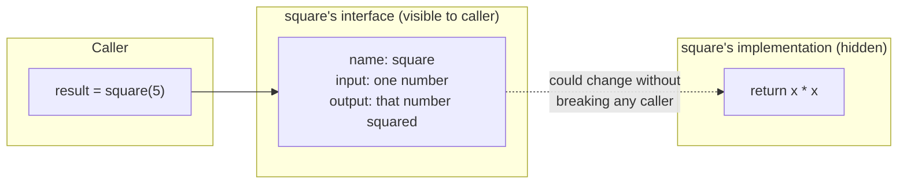

## Learning Objectives

- Explain the distinction between a function's interface (its name, inputs, and outputs) and its implementation, and why a caller only needs the former.
- Implement a multi-step task by decomposing it into several named functions, each with a single, clear responsibility.
- Predict what a program prints by tracing which function is called, in what order, with what arguments.
- Identify when a function's body can be rewritten without changing any of its callers, and explain why that's possible.
- Compare an appropriately decomposed program against one that is either a single undivided block or split into needlessly many tiny pieces.

## Context & Motivation

Every technique introduced so far in this track — expressions, conditionals, loops — lets you build a program that does more, but it does nothing to keep that program *organized* as it grows. A report generator that formats a title, then loops over items printing each one, then perhaps computes a total, all in one undivided block of code, becomes harder to read, harder to test, and harder to fix with every line added — not because any individual line is complicated, but because there is no boundary anywhere inside it. A function is the first tool in this course for drawing that boundary deliberately: it packages a block of logic behind a name, so that calling the name hides *how* the work happens and exposes only *what* it does.

This is worth connecting explicitly back to the very first concept in this track, computational thinking's four pillars — decomposition, pattern recognition, abstraction, and algorithm design. Functions are not a fifth, unrelated idea; they are the first concrete *mechanism* Python gives you for two of those four pillars at once. Decomposition is breaking a large problem into smaller, named pieces — and a function is exactly a named piece. Abstraction is hiding a detail behind an interface so that the rest of the program doesn't need to know it — and a function's whole reason for existing is to let a caller use `square(x)` without knowing or caring whether it's implemented as `x * x` or as a loop that adds `x` to itself `x` times. ACM/IEEE CS2013's Software Development Fundamentals knowledge area places exactly this — decomposing a problem into procedures — at the center of an introductory course for precisely this reason: it is the first tool that lets a program grow past a few dozen lines without becoming unreadable, and everything more advanced later in a computer science curriculum (recursion, algorithms, data structures encapsulated behind an interface) builds on the same underlying idea of separating what something does from how it does it.

It's also worth being honest about what a function is *not*, at this stage: it is not yet an object, a class, or anything with internal state of its own beyond what its parameters and body describe on each call. It is, at its core, just a name attached to a reusable block of code — deliberately the simplest possible version of "hide an implementation behind an interface," which is exactly why it's the right place to introduce the idea before anything more elaborate.

## Core Theory

### Defining and calling a function

```python
def square(x):
    return x * x

result = square(5)   # 25
```

`def` introduces a new function named `square`. Critically, the code between `def` and the end of the indented block does not run when Python reaches the `def` line — it only runs later, when `square` is actually *called*. This distinction — definition time versus call time — trips up many learners at first: writing `def square(x): return x * x` on its own does nothing observable at all; it just teaches Python the name `square` and what to do when that name is called with an argument. The call `square(5)` is what actually executes the body, with `x` bound to `5` for the duration of that call.

The caller, `result = square(5)`, does not need to know the body is `x * x`. It could be rewritten entirely — as a loop that adds `x` to itself `x` times, or as a call to a built-in exponentiation operator — and every existing caller of `square` would keep working completely unchanged, because none of them ever looked inside the function to begin with. That is abstraction in concrete, mechanical practice: the *interface* (a name, plus what goes in and what comes back out) stays stable even when the *implementation* underneath it changes.



### Decomposing a bigger task into cooperating functions

The real payoff of functions shows up once a task has more than one moving part. Consider printing a simple report: a title, then a formatted line per item. Written as one undivided block, the logic for formatting a title and the logic for formatting an item line are tangled together in a single stretch of code with no boundary between them. Split by responsibility instead:

```python
def print_title(title):
    print("=" * len(title))
    print(title)
    print("=" * len(title))

def print_item(name, price):
    print(f"{name:<20}{price:>8.2f}")

def print_report(title, items):
    print_title(title)
    for name, price in items:
        print_item(name, price)

print_report("Groceries", [("Milk", 3.5), ("Bread", 2.25)])
```

`print_report` reads almost like the pseudocode plan for the whole task: print the title, then print each item. That readability is not an accident — it's the direct payoff of decomposing first and letting well-chosen names do the explaining, rather than writing all the formatting logic inline where the higher-level structure of the task gets buried in it. Each of the three functions can also be understood, tested, and debugged in isolation: if item lines are misformatted, the bug is in `print_item`, and nowhere else needs to be reread to find it.

### Reading a call chain: who calls whom, and in what order

Tracing a program built from several functions means tracking not just *what* each function does but the *order* in which they're invoked. For the `print_report` example, the call sequence is: `print_report` runs first and immediately calls `print_title` (which runs completely, printing three lines, before returning control back to `print_report`); then `print_report`'s `for` loop calls `print_item` once per item, in order, each call running to completion before the next begins. Nothing in `print_title` or `print_item` runs "at the same time" as anything else — Python executes one function call fully before resuming whatever called it. This matters because a common early mistake is assuming a function "runs in the background" once called; in reality, calling a function pauses the caller exactly at the call site until the callee finishes and (possibly) returns a value.

## Worked Examples

**Example 1 — tracing a call chain by hand.** Given:

```python
def double(n):
    return n * 2

def add_one(n):
    return n + 1

def transform(n):
    return add_one(double(n))

print(transform(3))
```

Trace it inside-out, the way Python actually evaluates it: `transform(3)` is called first, and its body is `add_one(double(n))` — before `add_one` can be called, its argument, `double(n)`, must be evaluated first. `double(3)` runs, returning `3 * 2 = 6`. That `6` becomes the argument to `add_one`: `add_one(6)` runs, returning `6 + 1 = 7`. That `7` is what `transform` returns, so `print(transform(3))` prints `7`. The key mechanical fact this trace demonstrates: an inner function call (`double(n)`) always completes and produces its return value *before* the outer call (`add_one(...)`) that uses that value can proceed — Python cannot call `add_one` with an argument that hasn't been computed yet.

**Example 2 — decomposing a task versus leaving it undivided, and seeing the payoff of decomposition when a bug shows up.** Suppose a program needs to validate a list of ages, printing whether each is a valid adult age (`18` to `120` inclusive). Written as one block:

```python
ages = [25, -3, 150, 40]
for a in ages:
    if a >= 18 and a <= 120:
        print(a, "is valid")
    else:
        print(a, "is invalid")
```

This works, but suppose the validity rule changes later — say, the upper bound needs to become `130`. In the undivided version, that means finding the exact comparison buried inside the loop. Decomposed instead:

```python
def is_valid_age(age):
    return age >= 18 and age <= 120

def report_age(age):
    if is_valid_age(age):
        print(age, "is valid")
    else:
        print(age, "is invalid")

for a in ages:
    report_age(a)
```

Now the validity rule lives in exactly one place, `is_valid_age`, named clearly enough that its purpose doesn't need a comment. Updating the upper bound means changing one line inside one function whose job is unambiguous from its name — and every caller of `is_valid_age`, including ones that might be added later elsewhere in the program, automatically picks up the fix, because they all go through the same named function rather than each having their own inline copy of the comparison.

**Example 3 — a function's interface staying stable while its implementation changes.** Suppose `square` is first written the "obvious" way:

```python
def square(x):
    return x * x

print(square(4), square(-3))   # 16 9
```

Now rewrite its implementation to use repeated addition instead of multiplication — perhaps as an exercise in expressing the same computation a different way:

```python
def square(x):
    total = 0
    count = abs(x)
    for _ in range(count):
        total += count
    return total

print(square(4), square(-3))   # 16 9
```

Every call site — `square(4)`, `square(-3)`, and any other place in a larger program that calls `square` — produces identical results before and after this rewrite, and none of those call sites needed to change at all. This is the direct, hands-on demonstration of what "the interface is stable even when the implementation changes" actually means in practice, rather than as an abstract claim.

## Common Misconceptions & Pitfalls

- **"Writing `def function_name(...):` runs the code inside it immediately."** It does not. The body of a function only executes when the function is *called* — `def` merely teaches Python the name and what to do when that name is invoked later. A common beginner confusion is expecting a `print` statement inside a function body to appear in the program's output the moment the `def` block is written, when in fact nothing happens until a corresponding call, like `square(5)`, actually occurs.
- **"A function call happens 'in parallel' with the code that called it."** Python runs one function call to completion — including everything inside it — before returning control to whatever called it. There is no concurrent execution implied by a function call in the code covered here; `transform(3)` in Worked Example 1 fully finishes computing `double(3)` before `add_one` can even begin.
- **"Splitting logic into functions always costs meaningful performance, so it should be avoided when speed matters."** A function call does have some overhead compared to writing the same code inline, but at this level of program, that overhead is negligible next to the cost of the actual work being done, and trading away readability to avoid it is very rarely a good trade. Performance concerns like this only become worth reasoning about carefully once Big-O and asymptotic complexity, covered later, give a vocabulary for which costs actually scale with input size and which don't.
- **"More functions is always better decomposition."** Splitting logic into so many tiny functions that understanding a single operation requires jumping between five one-line definitions can cost more in readability than it saves — deciding how finely to decompose a task is a judgment call informed by what groups of steps form one coherent responsibility, not a rule where "smaller is always better."
- **"Because a function hides its implementation, calling it is automatically safe."** Hiding implementation is exactly the point of a function, but it also means a caller cannot tell from the call site alone whether the function is correct, efficient, or handles edge cases properly — trusting a function's name and its interface is only well-founded once the function has actually been tested, which is the subject of the later testing-and-debugging concept in this track.

## Summary

A function packages a block of logic behind a name, separating its *interface* — what goes in, what comes back out, and what it's called — from its *implementation*, the actual steps that produce the result. This is the concrete, hands-on mechanism behind two of computational thinking's four pillars: decomposition (breaking a task into smaller named pieces) and abstraction (hiding how each piece works behind what it does). A well-decomposed program reads close to its own pseudocode plan, and each piece can be understood, tested, fixed, and even completely rewritten in isolation, so long as its interface to callers stays the same. Tracing a program built from several functions means tracking not just what each one computes but the order calls actually happen in — an inner call always finishes and produces its value before the outer call using that value can proceed. Decomposition is a judgment call, not a rule to maximize: too little, and a program becomes an unreadable undivided block; too much, and following a single operation means chasing it through too many tiny pieces.

## Documentation Links

- [Wing, "Computational Thinking" — Communications of the ACM (2006)](https://dl.acm.org/doi/10.1145/1118178.1118215) — doc
- [ACM/IEEE CS2013 — Software Development Fundamentals KA](https://csed.acm.org/wp-content/uploads/2023/09/SDF-Version-Gamma.pdf) — doc
