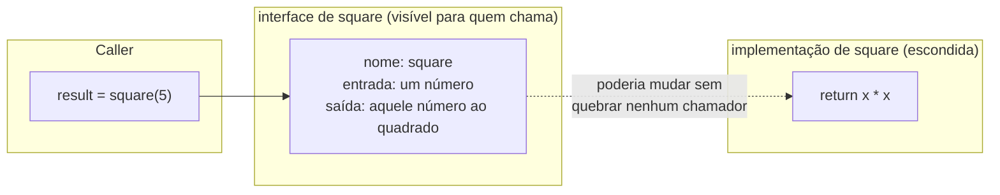

## Objetivos de Aprendizagem

- Explicar a distinção entre a interface de uma função (seu nome, entradas e saídas) e sua implementação, e por que quem a chama só precisa da primeira.
- Implementar uma tarefa de múltiplos passos decompondo-a em várias funções nomeadas, cada uma com uma única responsabilidade clara.
- Prever o que um programa imprime traçando qual função é chamada, em que ordem, com quais argumentos.
- Identificar quando o corpo de uma função pode ser reescrito sem alterar nenhum de seus chamadores, e explicar por que isso é possível.
- Comparar um programa adequadamente decomposto com um que é ou um único bloco indiviso ou dividido em pedaços desnecessariamente pequenos.

## Contexto e Motivação

Toda técnica apresentada até agora nesta trilha (expressões, condicionais, laços) permite construir um programa que faz mais coisas, mas não faz nada para manter esse programa *organizado* conforme ele cresce. Um gerador de relatório que formata um título, depois percorre itens imprimindo cada um, depois talvez calcula um total, tudo num único bloco indiviso de código, fica mais difícil de ler, mais difícil de testar e mais difícil de corrigir a cada linha adicionada, não porque nenhuma linha individual seja complicada, mas porque não existe fronteira nenhuma dentro dele. Uma função é a primeira ferramenta deste curso para desenhar essa fronteira deliberadamente: ela empacota um bloco de lógica atrás de um nome, de forma que chamar o nome esconde *como* o trabalho acontece e expõe apenas *o que* ele faz.

Vale conectar isso explicitamente de volta ao primeiríssimo conceito desta trilha, os quatro pilares do pensamento computacional: decomposição, reconhecimento de padrões, abstração e design de algoritmos. Funções não são uma quinta ideia, sem relação com as outras; elas são o primeiro *mecanismo* concreto que o Python oferece para dois desses quatro pilares ao mesmo tempo. Decomposição é quebrar um problema grande em pedaços menores e nomeados, e uma função é exatamente um pedaço nomeado. Abstração é esconder um detalhe atrás de uma interface para que o resto do programa não precise conhecê-lo, e a razão de existir inteira de uma função é permitir que quem a chama use `square(x)` sem saber ou se importar se ela é implementada como `x * x` ou como um laço que soma `x` a si mesmo `x` vezes. A área de conhecimento de Fundamentos de Desenvolvimento de Software do ACM/IEEE CS2013 coloca exatamente isso (decompor um problema em procedimentos) no centro de um curso introdutório precisamente por esse motivo: é a primeira ferramenta que permite a um programa crescer além de algumas dezenas de linhas sem se tornar ilegível, e tudo mais avançado depois num currículo de ciência da computação (recursão, algoritmos, estruturas de dados encapsuladas atrás de uma interface) se apoia na mesma ideia subjacente de separar o que algo faz de como faz.

Vale também ser honesto sobre o que uma função *não* é, nesta fase: ela ainda não é um objeto, uma classe, ou qualquer coisa com estado interno próprio além do que seus parâmetros e corpo descrevem a cada chamada. Ela é, no fundo, apenas um nome ligado a um bloco de código reutilizável, deliberadamente a versão mais simples possível de "esconder uma implementação atrás de uma interface", que é exatamente o motivo de ser o lugar certo para apresentar a ideia antes de algo mais elaborado.

## Teoria Central

### Definindo e chamando uma função

```python
def square(x):
    return x * x

result = square(5)   # 25
```

`def` introduz uma nova função chamada `square`. Criticamente, o código entre o `def` e o fim do bloco indentado não roda quando o Python chega na linha do `def`: ele só roda depois, quando `square` é de fato *chamada*. Essa distinção (tempo de definição versus tempo de chamada) confunde muitos aprendizes no início: escrever `def square(x): return x * x` sozinho não faz nada observável de forma alguma; apenas ensina ao Python o nome `square` e o que fazer quando esse nome é invocado com um argumento. A chamada `square(5)` é o que de fato executa o corpo, com `x` vinculado a `5` pela duração daquela chamada.

Quem chama, `result = square(5)`, não precisa saber que o corpo é `x * x`. Ele poderia ser reescrito inteiramente (como um laço que soma `x` a si mesmo `x` vezes, ou como uma chamada a um operador de exponenciação embutido) e todo chamador existente de `square` continuaria funcionando completamente sem mudanças, porque nenhum deles jamais olhou para dentro da função. Isso é abstração em prática concreta e mecânica: a *interface* (um nome, mais o que entra e o que sai) permanece estável mesmo quando a *implementação* por baixo dela muda.



### Decompondo uma tarefa maior em funções cooperantes

O verdadeiro ganho de funções aparece quando uma tarefa tem mais de uma parte móvel. Considere imprimir um relatório simples: um título, depois uma linha formatada por item. Escrita como um único bloco indiviso, a lógica de formatar um título e a lógica de formatar uma linha de item ficam emaranhadas num único trecho de código, sem fronteira entre elas. Em vez disso, divida por responsabilidade:

```python
def print_title(title):
    print("=" * len(title))
    print(title)
    print("=" * len(title))

def print_item(name, price):
    print(f"{name:<20}{price:>8.2f}")

def print_report(title, items):
    print_title(title)
    for name, price in items:
        print_item(name, price)

print_report("Groceries", [("Milk", 3.5), ("Bread", 2.25)])
```

`print_report` se lê quase como o plano em pseudocódigo da tarefa inteira: imprima o título, depois imprima cada item. Essa legibilidade não é acidente: é o ganho direto de decompor primeiro e deixar nomes bem escolhidos fazerem a explicação, em vez de escrever toda a lógica de formatação inline, onde a estrutura de mais alto nível da tarefa fica enterrada nela. Cada uma das três funções também pode ser entendida, testada e depurada isoladamente: se as linhas de item estiverem mal formatadas, o bug está em `print_item`, e nenhum outro lugar precisa ser relido para encontrá-lo.

### Lendo uma cadeia de chamadas: quem chama quem, e em que ordem

Traçar um programa construído a partir de várias funções significa acompanhar não apenas *o que* cada função faz, mas a *ordem* em que são invocadas. Para o exemplo do `print_report`, a sequência de chamadas é: `print_report` roda primeiro e imediatamente chama `print_title` (que roda completamente, imprimindo três linhas, antes de devolver o controle a `print_report`); em seguida, o laço `for` de `print_report` chama `print_item` uma vez por item, em ordem, cada chamada rodando até o fim antes que a próxima comece. Nada dentro de `print_title` ou `print_item` roda "ao mesmo tempo" que qualquer outra coisa: o Python executa uma chamada de função inteiramente antes de retomar o que a chamou. Isso importa porque um erro comum no início é assumir que uma função "roda em segundo plano" uma vez chamada; na realidade, chamar uma função pausa quem chamou exatamente no ponto da chamada até que a chamada termine e (possivelmente) retorne um valor.

## Exemplos Resolvidos

**Exemplo 1: traçando uma cadeia de chamadas na mão.** Dado:

```python
def double(n):
    return n * 2

def add_one(n):
    return n + 1

def transform(n):
    return add_one(double(n))

print(transform(3))
```

Trace de dentro para fora, do jeito que o Python de fato avalia: `transform(3)` é chamada primeiro, e seu corpo é `add_one(double(n))`: antes que `add_one` possa ser chamada, seu argumento, `double(n)`, precisa ser avaliado primeiro. `double(3)` roda, retornando `3 * 2 = 6`. Esse `6` se torna o argumento de `add_one`: `add_one(6)` roda, retornando `6 + 1 = 7`. Esse `7` é o que `transform` retorna, então `print(transform(3))` imprime `7`. O fato mecânico chave que este traço demonstra: uma chamada de função interna (`double(n)`) sempre completa e produz seu valor de retorno *antes* que a chamada externa (`add_one(...)`) que usa aquele valor possa prosseguir; o Python não pode chamar `add_one` com um argumento que ainda não foi calculado.

**Exemplo 2: decompondo uma tarefa versus deixá-la indivisa, e vendo o ganho da decomposição quando um bug aparece.** Suponha que um programa precise validar uma lista de idades, imprimindo se cada uma é uma idade adulta válida (`18` a `120` inclusive). Escrito como um bloco só:

```python
ages = [25, -3, 150, 40]
for a in ages:
    if a >= 18 and a <= 120:
        print(a, "is valid")
    else:
        print(a, "is invalid")
```

Isso funciona, mas suponha que a regra de validade mude depois: digamos, o limite superior precise virar `130`. Na versão indivisa, isso significa encontrar a comparação exata enterrada dentro do laço. Em vez disso, decomposto:

```python
def is_valid_age(age):
    return age >= 18 and age <= 120

def report_age(age):
    if is_valid_age(age):
        print(age, "is valid")
    else:
        print(age, "is invalid")

for a in ages:
    report_age(a)
```

Agora a regra de validade mora em exatamente um lugar, `is_valid_age`, nomeada com clareza suficiente para que seu propósito não precise de um comentário. Atualizar o limite superior significa mudar uma linha dentro de uma função cujo trabalho é inequívoco a partir do nome, e todo chamador de `is_valid_age`, incluindo os que podem ser adicionados depois em outro lugar do programa, automaticamente recebe a correção, porque todos passam pela mesma função nomeada em vez de cada um ter sua própria cópia inline da comparação.

**Exemplo 3: a interface de uma função permanecendo estável enquanto sua implementação muda.** Suponha que `square` seja escrita primeiro do jeito "óbvio":

```python
def square(x):
    return x * x

print(square(4), square(-3))   # 16 9
```

Agora reescreva sua implementação para usar adição repetida em vez de multiplicação, talvez como um exercício de expressar o mesmo cálculo de um jeito diferente:

```python
def square(x):
    total = 0
    count = abs(x)
    for _ in range(count):
        total += count
    return total

print(square(4), square(-3))   # 16 9
```

Todo ponto de chamada (`square(4)`, `square(-3)`, e qualquer outro lugar num programa maior que chame `square`) produz resultados idênticos antes e depois dessa reescrita, e nenhum desses pontos de chamada precisou mudar de forma alguma. Esta é a demonstração direta e prática do que "a interface é estável mesmo quando a implementação muda" de fato significa na prática, e não como uma afirmação abstrata.

## Equívocos Comuns e Armadilhas

- **"Escrever `def nome_da_funcao(...):` roda o código dentro dela imediatamente."** Não roda. O corpo de uma função só executa quando a função é *chamada*: `def` apenas ensina ao Python o nome e o que fazer quando esse nome for invocado depois. Uma confusão comum de iniciante é esperar que uma instrução `print` dentro do corpo de uma função apareça na saída do programa no momento em que o bloco `def` é escrito, quando na verdade nada acontece até que uma chamada correspondente, como `square(5)`, de fato ocorra.
- **"Uma chamada de função acontece 'em paralelo' com o código que a chamou."** O Python roda uma chamada de função até o fim, incluindo tudo dentro dela, antes de devolver o controle ao que a chamou. Não há execução concorrente implícita numa chamada de função no código coberto aqui; `transform(3)` no Exemplo Resolvido 1 termina completamente de calcular `double(3)` antes que `add_one` sequer possa começar.
- **"Dividir a lógica em funções sempre custa desempenho significativo, então deve ser evitado quando a velocidade importa."** Uma chamada de função de fato tem alguma sobrecarga comparada a escrever o mesmo código inline, mas nesse nível de programa, essa sobrecarga é insignificante perto do custo do trabalho de fato sendo feito, e trocar legibilidade por essa economia raramente é uma boa troca. Preocupações de desempenho como essa só se tornam dignas de um raciocínio cuidadoso quando Big-O e complexidade assintótica, cobertos mais adiante, dão um vocabulário para quais custos de fato escalam com o tamanho da entrada e quais não.
- **"Mais funções é sempre melhor decomposição."** Dividir a lógica em tantas funções minúsculas que entender uma única operação exige pular entre cinco definições de uma linha pode custar mais em legibilidade do que economiza: decidir com que granularidade decompor uma tarefa é um julgamento informado por quais grupos de passos formam uma única responsabilidade coerente, não uma regra em que "menor é sempre melhor".
- **"Como uma função esconde sua implementação, chamá-la é automaticamente seguro."** Esconder a implementação é exatamente o objetivo de uma função, mas isso também significa que quem chama não consegue saber, só a partir do ponto de chamada, se a função está correta, é eficiente, ou trata casos extremos adequadamente: confiar no nome de uma função e em sua interface só é bem fundamentado depois que a função de fato foi testada, tema do conceito posterior de testes e depuração nesta trilha.

## Resumo

Uma função empacota um bloco de lógica atrás de um nome, separando sua *interface* (o que entra, o que sai, e como é chamada) de sua *implementação*, os passos reais que produzem o resultado. Este é o mecanismo concreto e prático por trás de dois dos quatro pilares do pensamento computacional: decomposição (quebrar uma tarefa em pedaços menores e nomeados) e abstração (esconder como cada pedaço funciona atrás do que ele faz). Um programa bem decomposto se lê próximo de seu próprio plano em pseudocódigo, e cada pedaço pode ser entendido, testado, corrigido e até completamente reescrito isoladamente, contanto que sua interface para os chamadores permaneça a mesma. Traçar um programa construído a partir de várias funções significa acompanhar não apenas o que cada uma calcula, mas a ordem em que as chamadas de fato acontecem: uma chamada interna sempre termina e produz seu valor antes que a chamada externa que usa aquele valor possa prosseguir. Decomposição é um julgamento, não uma regra a maximizar: de menos, e um programa vira um bloco indiviso ilegível; de mais, e seguir uma única operação significa persegui-la por pedaços minúsculos demais.

## Documentation Links

- [Wing, "Computational Thinking", Communications of the ACM (2006)](https://dl.acm.org/doi/10.1145/1118178.1118215) (doc)
- [ACM/IEEE CS2013: Software Development Fundamentals KA](https://csed.acm.org/wp-content/uploads/2023/09/SDF-Version-Gamma.pdf) (doc)
