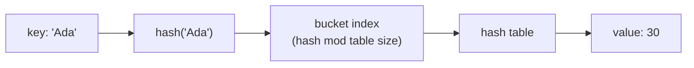

## Learning Objectives

- Explain why dictionary lookup runs in roughly constant time while searching a list by content runs in linear time.
- Implement the core dictionary operations — create, read, update, delete, safe lookup, and iteration — without triggering an avoidable `KeyError`.
- Identify, given a problem statement, whether it is naturally suited to positional access (a list) or associative access by key (a dictionary).
- Compare hashable and unhashable types and predict which values Python will accept as dictionary keys.
- Predict the concrete failure (`KeyError`, `TypeError`, or a silently wrong result) produced by a specific piece of dictionary-manipulating code before running it.

## Context & Motivation

Every data structure covered so far — variables, lists, tuples — has answered the question "where is this value?" with a position: the third element, the value bound to this name. A dictionary answers a different question: "what value is associated with *this* key?" That shift, from "the nth thing" to "the thing named X," is one of the first genuine data-modeling decisions a beginning programmer has to make deliberately, because both structures can technically hold the same information, but reaching for the wrong one makes the resulting code either slow, awkward to read, or both.

Consider a program that needs to count how many times each word appears in a document. Using only a list, the natural approach is a list of `[word, count]` pairs, and updating a word's count means scanning the entire list, comparing each entry's word against the one just seen, until a match is found — or falling off the end and appending a new pair. For a short document this is invisible. For a real document with tens of thousands of words, that linear scan repeated for every single word turns an operation that should be instant into one that visibly drags, because the total work is proportional to (number of words) × (number of distinct words seen so far). A dictionary sidesteps the scan entirely: `counts[word] = counts.get(word, 0) + 1` finds or creates the entry directly, in time that does not grow with how many distinct words have already been counted.

This is not a narrow trick specific to word counting. The same pattern — "look something up by a name, an identifier, a code, rather than by its position in an ordered sequence" — recurs constantly: a username mapped to an account, a product code mapped to its price, a country mapped to its capital, a variable name mapped to its current value (which is, not coincidentally, how Python itself keeps track of your own variables internally). Python's own tutorial introduces dictionaries directly alongside lists and tuples in its chapter on data structures precisely because the choice between them is a foundational one, not a late-stage optimization; understanding *when* a dictionary is the right tool is as important as knowing its syntax.

The mechanism that makes this possible — hashing — is worth understanding at more than a surface level, because it explains not just why dictionaries are fast, but also a rule that otherwise looks arbitrary: why a dictionary's keys must be immutable. That constraint, and the small set of behaviors it implies (a `TypeError` when a list is used as a key, a `KeyError` when a lookup misses), are the two places where new dictionary users most often get surprised, and both fall directly out of the same underlying idea explained below.

## Core Theory

### The key-value model and the basic operations

A dictionary is a collection of key-value pairs, written with curly braces and colons. Every key in a dictionary is unique — assigning to an existing key overwrites its value rather than creating a second entry.

```python
ages = {"Ada": 30, "Bob": 25}

ages["Ada"]              # 30 — read the value stored under the key "Ada"
ages["Cid"] = 40          # adds a brand-new key-value pair
ages["Ada"] = 31          # overwrites the existing value for "Ada" — still one entry
len(ages)                 # 3 — number of key-value pairs
del ages["Bob"]            # removes the key "Bob" and its value entirely
"Bob" in ages             # False — membership test is by key, not by value
```

Reading a key that does not exist with `ages["Zoe"]` raises `KeyError: 'Zoe'` — Python refuses to silently invent a value. Two safer alternatives exist for exactly this situation:

```python
ages.get("Zoe")           # None — no error, just a default of None
ages.get("Zoe", 0)        # 0 — an explicit default in place of None
"Zoe" in ages             # False — check membership before reading, if that's clearer
```

Iterating a dictionary walks its keys by default; `.items()` walks (key, value) pairs together, and `.values()` walks just the values:

```python
for name in ages:                    # same as ages.keys()
    print(name)

for name, age in ages.items():        # both key and value in one step
    print(name, age)
```

### Why lookup is fast: hashing

A list finds a value by content the only way it can: checking elements one at a time until a match turns up or the list runs out — work proportional to the list's length in the worst case. A dictionary avoids that scan using a **hash table**. When a key is stored, Python computes a number from it — its *hash* — using the built-in `hash()` function, and uses that number to decide, essentially by doing arithmetic on it, which "bucket" of an internal array the key-value pair belongs in. Looking a key up later recomputes the same hash and jumps straight to that bucket, instead of inspecting every stored pair in turn.

```python
hash("Ada")     # some large integer, e.g. -4522842391039332703 (varies by run)
hash("Bob")     # a different large integer
hash(30)        # 30 — small integers hash to themselves
```



This is why a dictionary lookup does not need to know how many entries came before it: given a key, its hash points nearly directly at where the answer lives, rather than requiring a pass over everything stored so far. It is also exactly why dictionary **keys must be hashable, and in practice immutable** — a string, a number, a tuple of hashable things. If a key's contents could change after it was stored, its hash would change too, and the dictionary would be looking in the wrong bucket for it; Python prevents this problem entirely by refusing to let a mutable type (a list, or a dictionary itself) serve as a key at all.

```python
totals = {}
totals[[1, 2]] = "a list key"   # TypeError: unhashable type: 'list'
totals[(1, 2)] = "a tuple key"   # fine — tuples are immutable, hence hashable
```

Dictionary **values**, by contrast, can be anything — including mutable lists — because a value's identity never has to be looked up by its own content the way a key's does.

### Building a dictionary incrementally

A very common pattern is building up counts or groupings one item at a time, using `.get()` to supply a default for keys not yet seen:

```python
counts = {}
for word in ["a", "b", "a", "c", "b", "a"]:
    counts[word] = counts.get(word, 0) + 1
print(counts)   # {'a': 3, 'b': 2, 'c': 1}
```

Tracing this by hand clarifies what `.get()` is doing: on the first `"a"`, `counts.get("a", 0)` finds nothing and returns the default `0`, so `counts["a"]` becomes `0 + 1 = 1`. On the second `"a"`, `counts.get("a", 0)` now finds the existing entry and returns `1`, so the count becomes `2`. Without the default, the very first occurrence of every word would raise `KeyError` on the read side of `counts[word] + 1`, before there was ever a chance to write anything.

### A broken pattern: mutating a dictionary while iterating it

```python
scores = {"Ada": 91, "Bob": 40, "Cid": 88}

for name in scores:
    if scores[name] < 50:
        del scores[name]     # RuntimeError: dictionary changed size during iteration
```

Python detects that the dictionary's size changed mid-loop and refuses to continue, because the internal bookkeeping that drives the `for` loop assumes the structure being walked isn't shifting underneath it. The fix is to decide which keys to remove first, then remove them in a separate pass, once iteration has finished:

```python
scores = {"Ada": 91, "Bob": 40, "Cid": 88}

to_remove = [name for name in scores if scores[name] < 50]
for name in to_remove:
    del scores[name]
print(scores)   # {'Ada': 91, 'Cid': 88}
```

## Worked Examples

### Example 1 — word frequency counter, built up step by step

**Problem:** given a sentence, produce a dictionary mapping each word to how many times it appears.

Step 1 — split the sentence into words:

```python
text = "the cat sat on the mat the cat ran"
words = text.split()
# ['the', 'cat', 'sat', 'on', 'the', 'mat', 'the', 'cat', 'ran']
```

Step 2 — start with an empty dictionary and decide what happens on the first sighting of a word versus a repeat sighting. The first sighting has no existing entry to add to; `.get(word, 0)` handles both cases uniformly by supplying `0` when there is nothing yet:

```python
counts = {}
for word in words:
    counts[word] = counts.get(word, 0) + 1
```

Step 3 — inspect the result and use it. Because `.items()` yields (key, value) pairs, finding the most frequent word is a matter of picking the pair with the largest count:

```python
print(counts)
# {'the': 3, 'cat': 2, 'sat': 1, 'on': 1, 'mat': 1, 'ran': 1}

most_common_word, highest_count = max(counts.items(), key=lambda pair: pair[1])
print(most_common_word, highest_count)   # the 3
```

The reasoning that makes this efficient: each word is looked up and updated once per occurrence, in near-constant time per lookup, so the whole pass over `n` words costs work proportional to `n` — not to `n` multiplied by the number of distinct words, the way the list-of-pairs approach from the motivation section would.

### Example 2 — turning a list of records into a fast lookup table

**Problem:** given a list of `(student_id, name)` tuples, answer "what is the name for student id 1042?" many times, without re-scanning the list on every question.

Step 1 — state the naive approach and its cost. Scanning the list for a match on every question costs work proportional to the list's length, *for every single question asked*:

```python
records = [(1001, "Ada"), (1042, "Bob"), (1077, "Cid")]

def find_name_slow(student_id):
    for sid, name in records:
        if sid == student_id:
            return name
    return None
```

Step 2 — build the lookup table once, up front, paying the scanning cost exactly one time:

```python
by_id = {}
for sid, name in records:
    by_id[sid] = name
# {1001: 'Ada', 1042: 'Bob', 1077: 'Cid'}
```

Step 3 — every subsequent question is now a direct dictionary read instead of a scan:

```python
by_id.get(1042)          # 'Bob'
by_id.get(9999, "unknown")   # 'unknown' — no such student id
```

The general shape here — pay a one-time cost to build a dictionary, then answer many queries against it cheaply — is worth recognizing on its own: it is the right move whenever the same collection will be queried by key more than once.

### Example 3 — grouping values under a shared key

**Problem:** given a list of words, group them by their first letter.

Step 1 — for each word, decide which group it belongs in, and notice that a group might not exist yet the first time a letter is seen:

```python
words = ["ant", "bee", "bat", "cat", "ape", "cow"]
groups = {}
```

Step 2 — because each group's value is itself a list (not a single count), the "supply a default" trick needs the default to be an empty list, and it must be created before the first word can be appended to it:

```python
for word in words:
    first_letter = word[0]
    if first_letter not in groups:
        groups[first_letter] = []
    groups[first_letter].append(word)
```

Step 3 — inspect the result:

```python
print(groups)
# {'a': ['ant', 'ape'], 'b': ['bee', 'bat'], 'c': ['cat', 'cow']}
```

Tracing the first two words makes the `if first_letter not in groups` check concrete: on `"ant"`, `groups["a"]` doesn't exist yet, so it's created as `[]` and then `"ant"` is appended — `groups["a"] == ["ant"]`. On `"ape"`, `groups["a"]` already exists, so the `if` is skipped and `"ape"` is appended straight to the existing list — `groups["a"] == ["ant", "ape"]`. Skipping the existence check entirely and just writing `groups[first_letter].append(word)` would raise `KeyError` on every first sighting of a letter, since there would be no list yet to append to.

## Common Misconceptions & Pitfalls

- **"A missing key should just return something like `None`, not crash."** Python deliberately does the opposite with `[]`: a missing key raises `KeyError` immediately, on the theory that a typo'd key or a bad assumption about what's in the dictionary is a bug worth surfacing loudly, right where it happened — not one worth papering over with a silent default that then causes a confusing failure somewhere else, later, once the `None` has propagated. `.get()` exists precisely for the (different) situation where a missing key is a legitimate, expected case:

  ```python
  ages = {"Ada": 30}
  ages["Bob"]         # KeyError: 'Bob' — loud and immediate
  ages.get("Bob")     # None — silent, because this case was anticipated
  ```
- **"Dictionaries are unordered, so I can't rely on the order I get from iterating them."** This was true in Python before 3.7; since 3.7, dictionaries do preserve insertion order, and iterating one really does yield keys in the order they were first added. The pitfall runs in the other direction now: because that guarantee exists, it is tempting to *design around it* — writing code whose correctness silently depends on insertion order — without ever stating that dependency explicitly. Code that needs a specific order should say so (sort explicitly, or document the assumption), rather than relying on an implementation detail that a reader has to already know about to trust.
- **"I can use a list as a dictionary key since it's just another Python value."** Lists are mutable, and mutable values cannot be hashed consistently (their hash would have to change every time their contents did), so Python refuses them as keys outright with `TypeError: unhashable type: 'list'`. The usual fix, when a list-shaped key is genuinely needed, is to use the equivalent tuple instead — `(1, 2)` instead of `[1, 2]` — since tuples are immutable and therefore hashable.
- **"Two dictionaries with the same key-value pairs but built differently must be different objects."** Comparing dictionaries with `==` compares their contents, not their identity — `{"a": 1, "b": 2} == {"b": 2, "a": 1}` is `True`, because key order doesn't affect equality even though it does affect iteration order.
- **"Modifying a dictionary while looping over it is fine, since it's fine for a list."** As shown above, Python actively raises `RuntimeError` if a dictionary's size changes mid-iteration. The safe pattern is always to collect the keys that need changing into a separate list first, then apply the changes in a second pass once iteration is done.

## Summary

A dictionary stores key-value pairs and answers "what value belongs to this key?" directly, in roughly constant time, by computing a hash of the key rather than scanning stored entries one by one — the same reason a list must be scanned to find something by content, and the same reason dictionary keys must be immutable (a tuple, a string, a number) while values can be anything, including further lists or dictionaries. Safe lookup with `.get(key, default)` and membership testing with `in` exist because reading a missing key with `[]` deliberately raises `KeyError` rather than guessing — a design choice that surfaces bugs immediately instead of letting them propagate as silent `None`s. Since Python 3.7, iteration order matches insertion order, but that guarantee should be used deliberately, not relied upon by accident. Building a dictionary once and querying it many times — rather than re-scanning a list on every query — is the recurring shape that makes dictionaries worth reaching for whenever data needs to be found by a natural identifier rather than by position.

## Documentation Links

- [Python Tutorial — Data Structures](https://docs.python.org/3/tutorial/datastructures.html) — doc
- [Python Library Reference — Built-in Types](https://docs.python.org/3/library/stdtypes.html) — doc
