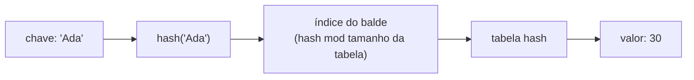

## Objetivos de Aprendizagem

- Explicar por que a busca em dicionário roda em tempo aproximadamente constante enquanto buscar numa lista pelo conteúdo roda em tempo linear.
- Implementar as operações centrais de dicionário (criar, ler, atualizar, apagar, busca segura e iteração) sem disparar um `KeyError` evitável.
- Identificar, dado um enunciado de problema, se ele é naturalmente adequado a acesso posicional (uma lista) ou acesso associativo por chave (um dicionário).
- Comparar tipos hasheáveis e não hasheáveis e prever quais valores o Python vai aceitar como chaves de dicionário.
- Prever a falha concreta (`KeyError`, `TypeError`, ou um resultado silenciosamente errado) produzida por um trecho específico de código manipulando um dicionário antes de rodá-lo.

## Contexto e Motivação

Toda estrutura de dados coberta até agora (variáveis, listas, tuplas) respondeu à pergunta "onde está esse valor?" com uma posição: o terceiro elemento, o valor vinculado a este nome. Um dicionário responde a uma pergunta diferente: "qual valor está associado a *esta* chave?" Essa mudança, de "a n-ésima coisa" para "a coisa chamada X," é uma das primeiras decisões genuínas de modelagem de dados que um programador iniciante precisa tomar deliberadamente, porque as duas estruturas podem, tecnicamente, guardar a mesma informação, mas escolher a errada torna o código resultante lento, difícil de ler, ou as duas coisas.

Considere um programa que precisa contar quantas vezes cada palavra aparece num documento. Usando só uma lista, a abordagem natural é uma lista de pares `[palavra, contagem]`, e atualizar a contagem de uma palavra significa varrer a lista inteira, comparando a palavra de cada entrada com a que acabou de ser vista, até encontrar uma correspondência, ou chegar ao fim e adicionar um novo par. Para um documento curto, isso é invisível. Para um documento real com dezenas de milhares de palavras, essa varredura linear repetida para cada palavra transforma uma operação que deveria ser instantânea numa que visivelmente arrasta, porque o trabalho total é proporcional a (número de palavras) × (número de palavras distintas vistas até agora). Um dicionário evita a varredura por completo: `counts[word] = counts.get(word, 0) + 1` encontra ou cria a entrada diretamente, em tempo que não cresce com quantas palavras distintas já foram contadas.

Isso não é um truque de nicho específico de contagem de palavras. O mesmo padrão (procurar algo por um nome, um identificador, um código, em vez de pela sua posição numa sequência ordenada) reaparece constantemente: um nome de usuário mapeado para uma conta, um código de produto mapeado para seu preço, um país mapeado para sua capital, um nome de variável mapeado para seu valor atual (que é, não por coincidência, como o próprio Python mantém o controle das suas variáveis internamente). O próprio tutorial do Python apresenta dicionários diretamente ao lado de listas e tuplas em seu capítulo sobre estruturas de dados precisamente porque a escolha entre eles é uma decisão fundamental, não uma otimização de última hora; entender *quando* um dicionário é a ferramenta certa é tão importante quanto conhecer sua sintaxe.

O mecanismo que torna isso possível (o hashing) vale a pena entender além da superfície, porque ele explica não só por que dicionários são rápidos, mas também uma regra que de outra forma pareceria arbitrária: por que as chaves de um dicionário precisam ser imutáveis. Essa restrição, e o pequeno conjunto de comportamentos que ela implica (um `TypeError` quando uma lista é usada como chave, um `KeyError` quando uma busca falha), são os dois lugares onde novos usuários de dicionário mais frequentemente se surpreendem, e ambos decorrem diretamente da mesma ideia subjacente explicada abaixo.

## Teoria Central

### O modelo chave-valor e as operações básicas

Um dicionário é uma coleção de pares chave-valor, escrita com chaves e dois-pontos. Toda chave num dicionário é única: atribuir a uma chave já existente sobrescreve seu valor em vez de criar uma segunda entrada.

```python
ages = {"Ada": 30, "Bob": 25}

ages["Ada"]              # 30 -- lê o valor guardado sob a chave "Ada"
ages["Cid"] = 40          # adiciona um par chave-valor totalmente novo
ages["Ada"] = 31          # sobrescreve o valor existente de "Ada" -- ainda uma entrada
len(ages)                 # 3 -- número de pares chave-valor
del ages["Bob"]            # remove a chave "Bob" e seu valor por completo
"Bob" in ages             # False -- o teste de pertencimento é pela chave, não pelo valor
```

Ler uma chave que não existe com `ages["Zoe"]` dispara `KeyError: 'Zoe'`: o Python se recusa a inventar silenciosamente um valor. Duas alternativas mais seguras existem exatamente para essa situação:

```python
ages.get("Zoe")           # None -- sem erro, apenas um padrão de None
ages.get("Zoe", 0)        # 0 -- um padrão explícito no lugar de None
"Zoe" in ages             # False -- checa pertencimento antes de ler, se ficar mais claro
```

Iterar um dicionário percorre suas chaves por padrão; `.items()` percorre pares (chave, valor) juntos, e `.values()` percorre só os valores:

```python
for name in ages:                    # o mesmo que ages.keys()
    print(name)

for name, age in ages.items():        # chave e valor num único passo
    print(name, age)
```

### Por que a busca é rápida: hashing

Uma lista encontra um valor pelo conteúdo da única forma que consegue: checando elementos um de cada vez até uma correspondência aparecer ou a lista acabar, trabalho proporcional ao comprimento da lista no pior caso. Um dicionário evita essa varredura usando uma **tabela hash**. Quando uma chave é armazenada, o Python calcula um número a partir dela (seu *hash*) usando a função embutida `hash()`, e usa esse número para decidir, essencialmente fazendo aritmética com ele, em qual "balde" de um array interno o par chave-valor pertence. Buscar uma chave depois recalcula o mesmo hash e pula direto para aquele balde, em vez de inspecionar cada par armazenado um a um.

```python
hash("Ada")     # algum inteiro grande, ex.: -4522842391039332703 (varia a cada execução)
hash("Bob")     # um inteiro grande diferente
hash(30)        # 30 -- inteiros pequenos têm hash para si mesmos
```



É por isso que uma busca em dicionário não precisa saber quantas entradas vieram antes dela: dada uma chave, seu hash aponta quase diretamente para onde a resposta mora, em vez de exigir uma passagem por tudo o que foi armazenado até agora. É também exatamente por isso que **chaves de dicionário precisam ser hasheáveis e, na prática, imutáveis**: uma string, um número, uma tupla de coisas hasheáveis. Se o conteúdo de uma chave pudesse mudar depois de armazenada, seu hash mudaria também, e o dicionário estaria procurando no balde errado por ela; o Python evita esse problema por completo se recusando a deixar um tipo mutável (uma lista, ou um dicionário em si) servir como chave de forma alguma.

```python
totals = {}
totals[[1, 2]] = "a list key"   # TypeError: unhashable type: 'list'
totals[(1, 2)] = "a tuple key"   # ok -- tuplas são imutáveis, logo hasheáveis
```

**Valores** de dicionário, por outro lado, podem ser qualquer coisa, incluindo listas mutáveis, porque a identidade de um valor nunca precisa ser buscada pelo seu próprio conteúdo do jeito que a de uma chave precisa.

### Construindo um dicionário incrementalmente

Um padrão muito comum é construir contagens ou agrupamentos um item de cada vez, usando `.get()` para fornecer um padrão para chaves ainda não vistas:

```python
counts = {}
for word in ["a", "b", "a", "c", "b", "a"]:
    counts[word] = counts.get(word, 0) + 1
print(counts)   # {'a': 3, 'b': 2, 'c': 1}
```

Traçar isso na mão esclarece o que `.get()` está fazendo: no primeiro `"a"`, `counts.get("a", 0)` não encontra nada e retorna o padrão `0`, então `counts["a"]` se torna `0 + 1 = 1`. No segundo `"a"`, `counts.get("a", 0)` agora encontra a entrada existente e retorna `1`, então a contagem se torna `2`. Sem o padrão, a primeiríssima ocorrência de toda palavra dispararia `KeyError` no lado de leitura de `counts[word] + 1`, antes que houvesse qualquer chance de escrever algo.

### Um padrão quebrado: mutar um dicionário enquanto o itera

```python
scores = {"Ada": 91, "Bob": 40, "Cid": 88}

for name in scores:
    if scores[name] < 50:
        del scores[name]     # RuntimeError: dictionary changed size during iteration
```

O Python detecta que o tamanho do dicionário mudou no meio do laço e se recusa a continuar, porque o controle interno que conduz o laço `for` assume que a estrutura sendo percorrida não está mudando por baixo dele. A correção é decidir quais chaves remover primeiro, depois removê-las numa passagem separada, uma vez que a iteração tenha terminado:

```python
scores = {"Ada": 91, "Bob": 40, "Cid": 88}

to_remove = [name for name in scores if scores[name] < 50]
for name in to_remove:
    del scores[name]
print(scores)   # {'Ada': 91, 'Cid': 88}
```

## Exemplos Resolvidos

### Exemplo 1: contador de frequência de palavras, construído passo a passo

**Problema:** dada uma frase, produza um dicionário mapeando cada palavra para quantas vezes ela aparece.

Passo 1: divida a frase em palavras:

```python
text = "the cat sat on the mat the cat ran"
words = text.split()
# ['the', 'cat', 'sat', 'on', 'the', 'mat', 'the', 'cat', 'ran']
```

Passo 2: comece com um dicionário vazio e decida o que acontece na primeira aparição de uma palavra versus uma aparição repetida. A primeira aparição não tem entrada existente para somar; `.get(word, 0)` trata os dois casos uniformemente fornecendo `0` quando ainda não há nada:

```python
counts = {}
for word in words:
    counts[word] = counts.get(word, 0) + 1
```

Passo 3: inspecione o resultado e use-o. Como `.items()` produz pares (chave, valor), encontrar a palavra mais frequente é uma questão de escolher o par com a maior contagem:

```python
print(counts)
# {'the': 3, 'cat': 2, 'sat': 1, 'on': 1, 'mat': 1, 'ran': 1}

most_common_word, highest_count = max(counts.items(), key=lambda pair: pair[1])
print(most_common_word, highest_count)   # the 3
```

O raciocínio que torna isso eficiente: cada palavra é buscada e atualizada uma vez por ocorrência, em tempo quase constante por busca, então a passagem inteira sobre `n` palavras custa trabalho proporcional a `n`, não a `n` multiplicado pelo número de palavras distintas, do jeito que a abordagem de lista-de-pares da seção de motivação custaria.

### Exemplo 2: transformando uma lista de registros numa tabela de busca rápida

**Problema:** dada uma lista de tuplas `(student_id, name)`, responda "qual é o nome do estudante com id 1042?" muitas vezes, sem revarrer a lista a cada pergunta.

Passo 1: declare a abordagem ingênua e seu custo. Varrer a lista em busca de uma correspondência a cada pergunta custa trabalho proporcional ao comprimento da lista, *para cada pergunta feita*:

```python
records = [(1001, "Ada"), (1042, "Bob"), (1077, "Cid")]

def find_name_slow(student_id):
    for sid, name in records:
        if sid == student_id:
            return name
    return None
```

Passo 2: construa a tabela de busca uma vez, de antemão, pagando o custo de varredura exatamente uma vez:

```python
by_id = {}
for sid, name in records:
    by_id[sid] = name
# {1001: 'Ada', 1042: 'Bob', 1077: 'Cid'}
```

Passo 3: toda pergunta subsequente agora é uma leitura direta de dicionário em vez de uma varredura:

```python
by_id.get(1042)          # 'Bob'
by_id.get(9999, "unknown")   # 'unknown' -- não existe esse student id
```

O formato geral aqui (pagar um custo único para construir um dicionário, depois responder muitas consultas contra ele de forma barata) vale a pena reconhecer por si só: é o movimento certo sempre que a mesma coleção vai ser consultada por chave mais de uma vez.

### Exemplo 3: agrupando valores sob uma chave compartilhada

**Problema:** dada uma lista de palavras, agrupe-as pela primeira letra.

Passo 1: para cada palavra, decida a qual grupo ela pertence, e note que um grupo pode ainda não existir na primeira vez que uma letra é vista:

```python
words = ["ant", "bee", "bat", "cat", "ape", "cow"]
groups = {}
```

Passo 2: como o valor de cada grupo é ele próprio uma lista (não uma única contagem), o truque de "fornecer um padrão" precisa que o padrão seja uma lista vazia, e ela precisa ser criada antes que a primeira palavra possa ser adicionada a ela:

```python
for word in words:
    first_letter = word[0]
    if first_letter not in groups:
        groups[first_letter] = []
    groups[first_letter].append(word)
```

Passo 3: inspecione o resultado:

```python
print(groups)
# {'a': ['ant', 'ape'], 'b': ['bee', 'bat'], 'c': ['cat', 'cow']}
```

Traçar as duas primeiras palavras torna concreta a checagem `if first_letter not in groups`: em `"ant"`, `groups["a"]` ainda não existe, então é criado como `[]` e depois `"ant"` é adicionado: `groups["a"] == ["ant"]`. Em `"ape"`, `groups["a"]` já existe, então o `if` é pulado e `"ape"` é adicionado direto à lista existente: `groups["a"] == ["ant", "ape"]`. Pular a checagem de existência por completo e simplesmente escrever `groups[first_letter].append(word)` dispararia `KeyError` em toda primeira aparição de uma letra, já que ainda não haveria lista nenhuma para adicionar.

## Equívocos Comuns e Armadilhas

- **"Uma chave ausente deveria só retornar algo como `None`, não travar."** O Python deliberadamente faz o oposto com `[]`: uma chave ausente dispara `KeyError` imediatamente, sob a teoria de que uma chave digitada errado ou uma suposição ruim sobre o que está no dicionário é um bug que vale a pena revelar em voz alta, exatamente onde aconteceu, não um que valha a pena disfarçar com um padrão silencioso que depois causa uma falha confusa em outro lugar, mais tarde, uma vez que o `None` tenha se propagado. `.get()` existe precisamente para a situação (diferente) em que uma chave ausente é um caso legítimo e esperado:

  ```python
  ages = {"Ada": 30}
  ages["Bob"]         # KeyError: 'Bob' -- alto e imediato
  ages.get("Bob")     # None -- silencioso, porque este caso foi previsto
  ```
- **"Dicionários não têm ordem, então não posso confiar na ordem que recebo ao iterá-los."** Isso era verdade no Python antes da versão 3.7; desde a 3.7, dicionários de fato preservam a ordem de inserção, e iterar um dicionário realmente produz as chaves na ordem em que foram adicionadas pela primeira vez. A armadilha agora corre na direção oposta: como essa garantia existe, é tentador *projetar em torno dela*, escrevendo código cuja correção depende silenciosamente da ordem de inserção, sem nunca declarar essa dependência explicitamente. Código que precisa de uma ordem específica deveria dizer isso (ordenar explicitamente, ou documentar a suposição), em vez de confiar num detalhe de implementação que quem lê precisa já saber para confiar.
- **"Posso usar uma lista como chave de dicionário já que é só mais um valor do Python."** Listas são mutáveis, e valores mutáveis não podem ter hash consistente (o hash teria que mudar toda vez que o conteúdo mudasse), então o Python as recusa como chaves de imediato com `TypeError: unhashable type: 'list'`. A correção usual, quando uma chave em formato de lista é de fato necessária, é usar a tupla equivalente em vez dela: `(1, 2)` em vez de `[1, 2]`, já que tuplas são imutáveis e portanto hasheáveis.
- **"Dois dicionários com os mesmos pares chave-valor, mas construídos de forma diferente, precisam ser objetos diferentes."** Comparar dicionários com `==` compara seus conteúdos, não sua identidade: `{"a": 1, "b": 2} == {"b": 2, "a": 1}` é `True`, porque a ordem das chaves não afeta a igualdade, mesmo afetando a ordem de iteração.
- **"Modificar um dicionário enquanto o percorro num laço é tranquilo, já que é tranquilo para uma lista."** Como mostrado acima, o Python ativamente dispara `RuntimeError` se o tamanho de um dicionário muda no meio da iteração. O padrão seguro é sempre coletar as chaves que precisam mudar numa lista separada primeiro, depois aplicar as mudanças numa segunda passagem uma vez que a iteração tenha terminado.

## Resumo

Um dicionário armazena pares chave-valor e responde "qual valor pertence a esta chave?" diretamente, em tempo aproximadamente constante, calculando um hash da chave em vez de varrer entradas armazenadas uma por uma: a mesma razão pela qual uma lista precisa ser varrida para encontrar algo pelo conteúdo, e a mesma razão pela qual chaves de dicionário precisam ser imutáveis (uma tupla, uma string, um número) enquanto valores podem ser qualquer coisa, incluindo mais listas ou dicionários. Busca segura com `.get(key, default)` e teste de pertencimento com `in` existem porque ler uma chave ausente com `[]` deliberadamente dispara `KeyError` em vez de adivinhar: uma escolha de design que revela bugs imediatamente em vez de deixá-los se propagar como `None`s silenciosos. Desde o Python 3.7, a ordem de iteração combina com a ordem de inserção, mas essa garantia deveria ser usada deliberadamente, não confiada por acidente. Construir um dicionário uma vez e consultá-lo muitas vezes, em vez de revarrer uma lista a cada consulta, é o formato recorrente que torna dicionários a ferramenta certa sempre que dados precisam ser encontrados por um identificador natural em vez de por posição.

## Documentation Links

- [Python Tutorial: Data Structures](https://docs.python.org/3/tutorial/datastructures.html) (doc)
- [Python Library Reference: Built-in Types](https://docs.python.org/3/library/stdtypes.html) (doc)
