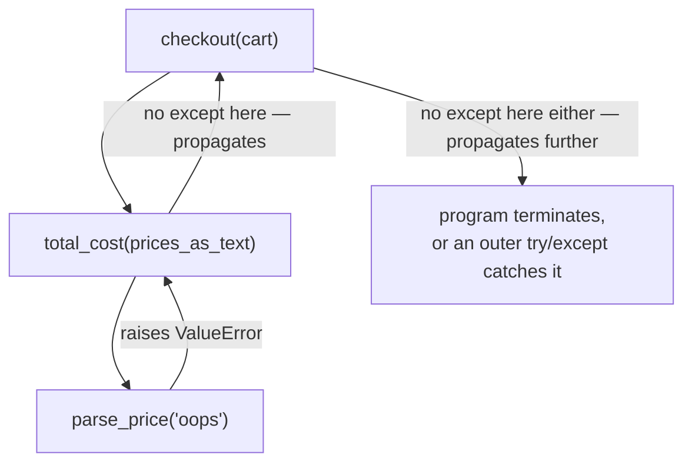

## Learning Objectives

- Explain the difference in *purpose* between an exception (a recoverable, expected failure a caller can handle) and an assertion (a check on a condition the code's own logic depends on never being false).
- Implement functions that raise a specific, well-chosen exception type with a clear message when given input they cannot work with.
- Trace how `raise` propagates an exception outward through a call chain until a matching `except` is found, or the program terminates.
- Identify, when reading unfamiliar code, whether a given check is defending against bad *input* or against bad *code*, and choose `raise` versus `assert` accordingly for new code.
- Predict what happens to a given assertion once a program is run with Python's `-O` flag, and explain why that makes assertions unsafe for validating untrusted input.

## Context & Motivation

Every function so far has been written under an unspoken assumption: it will always be called correctly, with arguments of the right type and within the right range, by code that has already checked whatever needed checking. Real programs cannot make that assumption — a user types text where a number was expected, a file that's supposed to exist doesn't, a network request times out, a caller passes zero to a function that's about to divide by it. Something has to decide, deliberately, what happens when that occurs: silently produce a nonsense result, crash immediately and unhelpfully, or fail in a controlled way that says clearly what went wrong and gives calling code a chance to respond. Python's exception mechanism is the language's answer to that decision, and it is the same mechanism used throughout the standard library, so understanding it well is a prerequisite to understanding *any* error message Python has ever produced at you.

An exception is raised — explicitly, with `raise`, or implicitly, whenever a built-in operation fails (dividing by zero, indexing past the end of a list, calling a method a value doesn't have) — and then propagates outward looking for code prepared to catch it. This is a fundamentally different idea from the conditional branching covered earlier in this course: an `if`/`else` handles a condition the calling code already anticipated and is checking for directly, in the normal flow of control, whereas an exception interrupts that flow entirely, jumping — possibly across several function calls — to wherever a matching `except` block exists, or all the way out of the program if none does.

A second, related but distinct mechanism, the assertion, is easy to confuse with exceptions because both use error-shaped syntax and both can stop a program. But an assertion answers a different question. Where an exception says "this specific, anticipated bad situation happened, and here is code prepared to deal with it," an assertion says "if this condition is ever false, my own code has a bug, because I was relying on it always being true." The distinction matters in practice for a very concrete reason: assertions can be turned off entirely by running Python with the `-O` (optimize) flag, on the theory that if the code is correct, an assertion should never fire anyway, so checking it in a shipped, trusted program is pure overhead. That means an assertion must never be the only thing standing between a program and bad *external* input — an assertion is a private contract between a function and its own internal logic, not a public gate against the outside world. Mixing the two up — asserting on a value a user could actually supply, or silently swallowing an exception that should have stopped the program — is one of the most common sources of confusing, hard-to-explain bugs in code written by people just learning this distinction.

## Core Theory

### Raising an exception deliberately

```python
def divide(a, b):
    if b == 0:
        raise ValueError("cannot divide by zero")
    return a / b

divide(10, 2)   # 5.0
divide(10, 0)   # ValueError: cannot divide by zero
```

`raise` immediately stops normal execution at that line — nothing after it in the function runs — and starts searching outward, through the call chain, for an `except` block prepared to catch this specific kind of exception. If the call to `divide(10, 0)` above happens directly at the top level with no surrounding `try`, none is found, and the program terminates, printing a traceback that shows exactly which line raised the exception and the chain of calls that led there.

### Catching an exception with `try`/`except`

```python
try:
    result = divide(10, 0)
except ValueError as e:
    print("Handled:", e)
    result = None
```

`except ValueError as e` catches specifically a `ValueError` — and only a `ValueError` — binding the raised exception object to the name `e` so its message can be inspected or logged. Once caught, the program continues normally after the `try`/`except` block; the exception does not propagate any further, and `result` ends up as `None` instead of the program simply terminating. A `try` can list several `except` clauses for different exception types, handling each one differently, and an optional `finally` clause runs regardless of whether an exception occurred — commonly used for cleanup (closing a file, releasing a resource) that must happen either way.

### How far an exception propagates, and where it should be caught

```python
def parse_price(text):
    return float(text)          # raises ValueError if text isn't a valid number

def total_cost(prices_as_text):
    return sum(parse_price(p) for p in prices_as_text)

def checkout(cart):
    return total_cost(cart)
```

If `checkout(["3.50", "oops", "1.25"])` is called, the `ValueError` raised deep inside `parse_price` propagates outward — through `total_cost`, through `checkout` — because none of those functions catches it themselves. It keeps propagating until something does, or the program terminates. This matters for *where* a `try` should be placed: catching too close to the top (wrapping the entire `checkout(cart)` call) means the handler cannot tell which specific price string was bad, only that *something* in the whole chain failed, whereas catching closer to the actual point of failure preserves that information.



### Assertions: checking a condition the code's own logic depends on

```python
def average(numbers):
    assert len(numbers) > 0, "average() requires a non-empty list"
    return sum(numbers) / len(numbers)

average([2, 4, 6])   # 4.0
average([])            # AssertionError: average() requires a non-empty list
```

`assert condition, message` checks `condition`; if it's `False`, it raises `AssertionError` with the given message, and if it's `True`, it does nothing at all — no cost beyond evaluating the condition. The crucial difference from `raise ValueError(...)` is not syntactic, it's about *what kind of claim is being made*. The assertion above documents an assumption `average`'s own logic depends on — that whatever calls it has already guaranteed the list isn't empty — rather than a condition `average` itself is designed to handle gracefully as a normal, expected case.

### Why assertions can vanish, and what that implies

```python
python -O my_program.py
```

Running Python with `-O` strips every `assert` statement out of the compiled code entirely — not just disables the check, removes it, as if it had never been written. A program that happens to work correctly only because an assertion caught some bad case (say, a caller passing an empty list) will, under `-O`, no longer catch that case at all: the assertion is gone, and whatever the code does next with an empty list — likely `ZeroDivisionError` from inside `average` itself — happens instead, with a far less informative error. This is precisely why user-facing validation belongs in an explicit `if`/`raise`, never in an `assert`: an `assert` is allowed to disappear, and code that is only correct *with* the assertion present was never actually correct to begin with.

## Worked Examples

### Example 1 — choosing exception versus assertion for the same-looking check

**Problem:** a function `apply_discount(price, percent)` should reject a negative price (which could come from a bad file or bad user input) and also rely on an internal invariant that `percent` — computed elsewhere in the program and never directly user-supplied — is always between 0 and 100.

Step 1 — separate the two checks by *where the bad value could come from*. `price` can come directly from untrusted external data, so it needs an exception a caller can catch and respond to:

```python
def apply_discount(price, percent):
    if price < 0:
        raise ValueError(f"price cannot be negative, got {price}")
```

Step 2 — `percent` in this program is only ever produced internally, by code the same programmer controls, and is never supposed to be able to fall outside 0–100; if it ever does, that's a bug in the code that computed it, not a bad input from the world. This is exactly the case an assertion documents:

```python
    assert 0 <= percent <= 100, f"internal invariant violated: percent={percent}"
    return price * (1 - percent / 100)
```

Step 3 — verify the two behave differently as intended:

```python
apply_discount(-10, 20)     # ValueError: price cannot be negative, got -10
apply_discount(100, 150)    # AssertionError: internal invariant violated: percent=150
```

A caller of `apply_discount` can reasonably catch the `ValueError` (say, to show a user a friendly message about a bad price) — catching the `AssertionError` instead would be treating a bug in the program's own logic as if it were a normal, expected outcome, which defeats the point of using an assertion there at all.

### Example 2 — a broken exception handler, and the fix

**Problem:** a function is meant to look up a user's age from a dictionary of records, catching the case where the user isn't found.

```python
records = {"ada": 30, "bob": 25}

def get_age(name):
    try:
        return recrods[name]     # typo: NameError, not KeyError
    except:
        return None
```

Step 1 — run it and observe the symptom: `get_age("ada")` returns `None` instead of `30`, even though `"ada"` is clearly in `records`. This looks like a lookup failure, but it isn't one.

Step 2 — the bare `except:` is the actual problem: it catches *every* exception, including the `NameError` caused by the typo `recrods` (an undefined name), and silently converts it into `None` — exactly as if the lookup had legitimately failed. The typo is now invisible; nothing in the output distinguishes "name not found" from "the code itself is broken."

Step 3 — fix it by catching only the exception this function actually intends to handle, `KeyError`, and let anything else propagate so it's visible:

```python
def get_age(name):
    try:
        return records[name]     # typo fixed
    except KeyError:
        return None

get_age("ada")     # 30
get_age("carl")    # None — a genuine, anticipated missing-key case
```

With the typo fixed and the `except` narrowed, a *future* typo of this kind would now raise a visible `NameError` instead of silently returning `None` — the narrower `except KeyError` only intercepts the one failure mode this function is actually designed to handle.

### Example 3 — validating untrusted input correctly, without leaning on assertions

**Problem:** a function reads a configuration value that is supposed to be a positive integer, but the configuration file is externally editable and cannot be trusted to always contain one.

Step 1 — the tempting-but-wrong version uses `assert`, since it looks like a quick way to "make sure" the value is right:

```python
def load_batch_size(config):
    value = config["batch_size"]
    assert isinstance(value, int) and value > 0    # wrong tool: this can vanish under -O
    return value
```

Step 2 — recognize why this is wrong: `config` comes from a file a user (or an ops script) can edit, which makes this exactly the kind of untrusted external input `assert` is not safe for — under `python -O`, the check disappears, and a config file with `"batch_size": -5` or `"batch_size": "oops"` would flow straight through unchecked.

Step 3 — rewrite the check as an explicit, un-disable-able validation that raises a specific exception with a message that says what was actually wrong:

```python
def load_batch_size(config):
    value = config["batch_size"]
    if not isinstance(value, int) or value <= 0:
        raise ValueError(f"batch_size must be a positive integer, got {value!r}")
    return value

load_batch_size({"batch_size": 32})      # 32
load_batch_size({"batch_size": -5})      # ValueError: batch_size must be a positive integer, got -5
```

This version behaves identically whether or not `-O` is passed, which is the entire point: validation of anything that can come from outside the program's own trusted logic must not depend on a mechanism that is allowed to disappear.

## Common Misconceptions & Pitfalls

- **"A bare `except:` is a safe way to make sure nothing crashes."** As Example 2 shows directly, a bare `except:` (or the only slightly narrower `except Exception:`) catches far more than the one failure a function was written to anticipate — including a `NameError` from a plain typo — and converts a loud, easy-to-diagnose crash into a silent, wrong result that looks like ordinary program behavior.
- **"`assert` is just a shorter way to write `raise ValueError(...)`."** They read similarly but make different promises: an assertion is allowed to be compiled away entirely (`python -O`), while a `raise` never is. Treating the two as interchangeable means any validation accidentally written as `assert` silently stops happening the moment someone runs the program with optimizations on — often without that someone realizing assertions were doing any work at all.
- **"Catching the exception as close to `try` as possible, wrapping a large block, is safer."** A `try` that wraps many unrelated lines of code can catch an exception from any of several very different places, and the `except` block then has no way to tell which one actually failed — narrowing the `try` to just the operation that can actually raise keeps that information intact.
- **"If a function might raise an exception, every caller must wrap every call in `try`/`except`."** Only a caller in a position to meaningfully *do something* about the failure (retry, show a message, substitute a default) should catch it; a caller with nothing useful to do about a given exception should simply let it propagate to whatever calls *it*, which is exactly what happens by default when no `except` is written at all.
- **"An assertion failing means the user did something wrong."** By design, an assertion failing means the *code* has a bug — it documents an assumption the programmer believed could never be false. If an assertion can, in fact, be triggered by ordinary user behavior, that is itself a sign it was the wrong tool for that check, and should be replaced with an explicit `raise`.

## Summary

Exceptions and assertions both look like error-handling machinery, but they answer different questions: an exception, raised with `raise` and caught with `try`/`except`, handles a condition a caller can reasonably trigger and should be able to respond to, while an assertion documents an internal invariant the code's own logic depends on never being violated. `raise` propagates outward through the call chain until a matching `except` is found or the program terminates, and where a `try` is placed determines how much information about the failure survives into the handler. Because `assert` statements can be stripped out entirely under Python's `-O` flag, they must never be the only safeguard against untrusted external input — that job belongs to an explicit `if`/`raise` instead. A bare `except:` is almost always too broad, since it silently catches genuine bugs (like a typo) alongside the one specific failure it was meant to handle. Choosing correctly between the two — by asking "could a legitimate caller trigger this?" versus "would this only happen if my own code were wrong?" — is what keeps error handling both safe and informative.

## Documentation Links

- [Python Tutorial — Errors and Exceptions](https://docs.python.org/3/tutorial/errors.html) — doc
- [Python Library Reference — Built-in Exceptions](https://docs.python.org/3/library/exceptions.html) — doc
