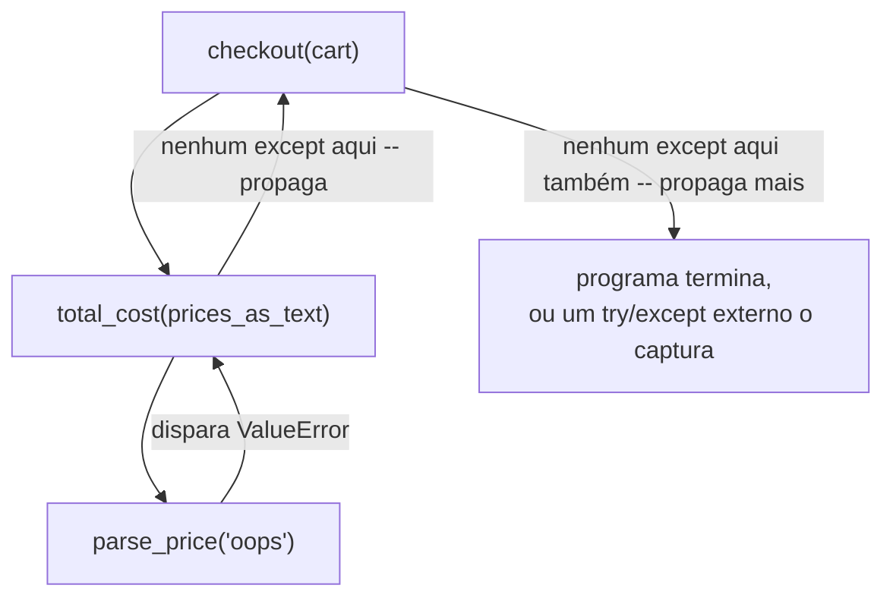

## Objetivos de Aprendizagem

- Explicar a diferença de *propósito* entre uma exceção (uma falha recuperável e esperada que quem chama pode tratar) e uma asserção (uma checagem sobre uma condição de que a própria lógica do código depende para nunca ser falsa).
- Implementar funções que disparam um tipo de exceção específico e bem escolhido, com uma mensagem clara, quando recebem uma entrada com a qual não conseguem trabalhar.
- Traçar como `raise` propaga uma exceção para fora, através de uma cadeia de chamadas, até que um `except` correspondente seja encontrado, ou o programa termine.
- Identificar, ao ler código desconhecido, se uma dada checagem está se defendendo contra uma entrada ruim ou contra um código ruim, e escolher `raise` versus `assert` de acordo, para código novo.
- Prever o que acontece a uma dada asserção quando um programa roda com a flag `-O` do Python, e explicar por que isso torna asserções inseguras para validar entrada não confiável.

## Contexto e Motivação

Toda função até agora foi escrita sob uma suposição não dita: ela sempre será chamada corretamente, com argumentos do tipo certo e dentro da faixa certa, por código que já checou o que precisava ser checado. Programas reais não podem fazer essa suposição: um usuário digita texto onde um número era esperado, um arquivo que deveria existir não existe, uma requisição de rede expira, quem chama passa zero para uma função que está prestes a dividir por ele. Algo precisa decidir, deliberadamente, o que acontece quando isso ocorre: produzir silenciosamente um resultado sem sentido, travar imediatamente e sem ajuda nenhuma, ou falhar de forma controlada que diga claramente o que deu errado e dê ao código chamador uma chance de reagir. O mecanismo de exceções do Python é a resposta da linguagem para essa decisão, e é o mesmo mecanismo usado por toda a biblioteca padrão, então entendê-lo bem é pré-requisito para entender *qualquer* mensagem de erro que o Python já tenha produzido para você.

Uma exceção é disparada, explicitamente, com `raise`, ou implicitamente, sempre que uma operação embutida falha (dividir por zero, indexar além do fim de uma lista, chamar um método que um valor não tem), e então se propaga para fora procurando código preparado para capturá-la. Essa é uma ideia fundamentalmente diferente da ramificação condicional coberta anteriormente neste curso: um `if`/`else` trata uma condição que o código chamador já previu e está checando diretamente, no fluxo normal de controle, enquanto uma exceção interrompe esse fluxo por completo, saltando (possivelmente através de várias chamadas de função) para onde quer que exista um bloco `except` correspondente, ou completamente para fora do programa se nenhum existir.

Um segundo mecanismo, relacionado mas distinto, a asserção, é fácil de confundir com exceções porque as duas usam sintaxe em formato de erro e as duas podem parar um programa. Mas uma asserção responde a uma pergunta diferente. Onde uma exceção diz "esta situação ruim, específica e prevista, aconteceu, e aqui está código preparado para lidar com ela," uma asserção diz "se esta condição algum dia for falsa, meu próprio código tem um bug, porque eu estava confiando que ela seria sempre verdadeira." A distinção importa na prática por uma razão bem concreta: asserções podem ser completamente desligadas rodando o Python com a flag `-O` (otimizar), sob a teoria de que, se o código está correto, uma asserção nunca deveria disparar de qualquer forma, então checá-la num programa já enviado e confiável é puro custo adicional. Isso significa que uma asserção nunca deve ser a única coisa entre um programa e uma entrada *externa* ruim: uma asserção é um contrato privado entre uma função e sua própria lógica interna, não um portão público contra o mundo externo. Confundir os dois (fazer uma asserção sobre um valor que um usuário poderia realmente fornecer, ou silenciosamente engolir uma exceção que deveria ter parado o programa) é uma das fontes mais comuns de bugs confusos e difíceis de explicar em código escrito por quem está apenas aprendendo essa distinção.

## Teoria Central

### Disparando uma exceção deliberadamente

```python
def divide(a, b):
    if b == 0:
        raise ValueError("cannot divide by zero")
    return a / b

divide(10, 2)   # 5.0
divide(10, 0)   # ValueError: cannot divide by zero
```

`raise` para imediatamente a execução normal naquela linha (nada depois dela na função roda) e começa a buscar para fora, através da cadeia de chamadas, um bloco `except` preparado para capturar esse tipo específico de exceção. Se a chamada a `divide(10, 0)` acima acontece diretamente no nível superior sem um `try` ao redor, nenhum é encontrado, e o programa termina, imprimindo um traceback que mostra exatamente qual linha disparou a exceção e a cadeia de chamadas que levou até lá.

### Capturando uma exceção com `try`/`except`

```python
try:
    result = divide(10, 0)
except ValueError as e:
    print("Handled:", e)
    result = None
```

`except ValueError as e` captura especificamente um `ValueError`, e só um `ValueError`, vinculando o objeto de exceção disparado ao nome `e` para que sua mensagem possa ser inspecionada ou registrada. Uma vez capturada, o programa continua normalmente depois do bloco `try`/`except`; a exceção não se propaga mais, e `result` acaba como `None` em vez de o programa simplesmente terminar. Um `try` pode listar várias cláusulas `except` para tipos de exceção diferentes, tratando cada uma de forma diferente, e uma cláusula `finally` opcional roda independentemente de ter ocorrido uma exceção ou não, comumente usada para limpeza (fechar um arquivo, liberar um recurso) que precisa acontecer de qualquer jeito.

### Até onde uma exceção se propaga, e onde ela deveria ser capturada

```python
def parse_price(text):
    return float(text)          # dispara ValueError se text não for um número válido

def total_cost(prices_as_text):
    return sum(parse_price(p) for p in prices_as_text)

def checkout(cart):
    return total_cost(cart)
```

Se `checkout(["3.50", "oops", "1.25"])` for chamada, o `ValueError` disparado bem no fundo de `parse_price` se propaga para fora, através de `total_cost`, através de `checkout`, porque nenhuma dessas funções o captura por si só. Ele continua se propagando até que algo o capture, ou o programa termine. Isso importa para *onde* um `try` deveria ser colocado: capturar perto demais do topo (envolvendo a chamada inteira de `checkout(cart)`) significa que o handler não consegue dizer qual string de preço específica estava ruim, só que *alguma coisa* na cadeia inteira falhou, enquanto capturar mais perto do ponto real de falha preserva essa informação.



### Asserções: checando uma condição de que a própria lógica do código depende

```python
def average(numbers):
    assert len(numbers) > 0, "average() requires a non-empty list"
    return sum(numbers) / len(numbers)

average([2, 4, 6])   # 4.0
average([])            # AssertionError: average() requires a non-empty list
```

`assert condition, message` checa `condition`; se for `False`, dispara `AssertionError` com a mensagem dada, e se for `True`, não faz nada além de avaliar a condição, sem custo adicional. A diferença crucial em relação a `raise ValueError(...)` não é sintática, é sobre *que tipo de afirmação está sendo feita*. A asserção acima documenta uma suposição de que a própria lógica de `average` depende, de que quem quer que a chame já garantiu que a lista não está vazia, em vez de uma condição que `average` em si é projetada para tratar graciosamente como um caso normal e esperado.

### Por que asserções podem desaparecer, e o que isso implica

```python
python -O my_program.py
```

Rodar o Python com `-O` remove toda instrução `assert` do código compilado por completo, não apenas desabilita a checagem, remove-a, como se nunca tivesse sido escrita. Um programa que por acaso funciona corretamente só porque uma asserção capturou algum caso ruim (digamos, quem chama passando uma lista vazia) vai, sob `-O`, deixar de capturar esse caso de forma alguma: a asserção se foi, e o que quer que o código faça em seguida com uma lista vazia, provavelmente `ZeroDivisionError` de dentro da própria `average`, acontece no lugar, com um erro muito menos informativo. É precisamente por isso que a validação voltada para o usuário pertence a um `if`/`raise` explícito, nunca a um `assert`: um `assert` tem permissão para desaparecer, e código que só é correto *com* a asserção presente nunca foi de fato correto para começar.

## Exemplos Resolvidos

### Exemplo 1: escolhendo entre exceção e asserção para uma checagem de aparência parecida

**Problema:** uma função `apply_discount(price, percent)` deve rejeitar um preço negativo (que poderia vir de um arquivo ruim ou de uma entrada ruim do usuário) e também confiar num invariante interno de que `percent`, calculado em outro lugar do programa e nunca fornecido diretamente pelo usuário, está sempre entre 0 e 100.

Passo 1: separe as duas checagens por *de onde o valor ruim poderia vir*. `price` pode vir diretamente de dados externos não confiáveis, então precisa de uma exceção que quem chama possa capturar e responder a ela:

```python
def apply_discount(price, percent):
    if price < 0:
        raise ValueError(f"price cannot be negative, got {price}")
```

Passo 2: `percent` neste programa só é produzido internamente, por código que o mesmo programador controla, e nunca deveria conseguir cair fora de 0 a 100; se algum dia cair, isso é um bug no código que o calculou, não uma entrada ruim do mundo. Este é exatamente o caso que uma asserção documenta:

```python
    assert 0 <= percent <= 100, f"internal invariant violated: percent={percent}"
    return price * (1 - percent / 100)
```

Passo 3: verifique que os dois se comportam de forma diferente, como pretendido:

```python
apply_discount(-10, 20)     # ValueError: price cannot be negative, got -10
apply_discount(100, 150)    # AssertionError: internal invariant violated: percent=150
```

Quem chama `apply_discount` pode razoavelmente capturar o `ValueError` (digamos, para mostrar ao usuário uma mensagem amigável sobre um preço ruim); capturar o `AssertionError` em vez disso estaria tratando um bug na própria lógica do programa como se fosse um resultado normal e esperado, o que anula por completo o propósito de usar uma asserção ali.

### Exemplo 2: um handler de exceção quebrado, e a correção

**Problema:** uma função deveria buscar a idade de um usuário num dicionário de registros, capturando o caso em que o usuário não é encontrado.

```python
records = {"ada": 30, "bob": 25}

def get_age(name):
    try:
        return recrods[name]     # erro de digitação: NameError, não KeyError
    except:
        return None
```

Passo 1: rode e observe o sintoma: `get_age("ada")` retorna `None` em vez de `30`, mesmo que `"ada"` claramente esteja em `records`. Parece uma falha de busca, mas não é.

Passo 2: o `except:` sem tipo é o verdadeiro problema: ele captura *toda* exceção, incluindo o `NameError` causado pelo erro de digitação `recrods` (um nome não definido), e o converte silenciosamente em `None`, exatamente como se a busca tivesse legitimamente falhado. O erro de digitação agora é invisível; nada na saída distingue "nome não encontrado" de "o próprio código está quebrado."

Passo 3: corrija capturando apenas a exceção que esta função de fato pretende tratar, `KeyError`, e deixe qualquer outra coisa se propagar para que fique visível:

```python
def get_age(name):
    try:
        return records[name]     # erro de digitação corrigido
    except KeyError:
        return None

get_age("ada")     # 30
get_age("carl")    # None -- um caso genuíno e previsto de chave ausente
```

Com o erro de digitação corrigido e o `except` estreitado, um *futuro* erro de digitação desse tipo agora dispararia um `NameError` visível em vez de silenciosamente retornar `None`: o `except KeyError` mais estreito só intercepta o único modo de falha que esta função de fato foi projetada para tratar.

### Exemplo 3: validando entrada não confiável corretamente, sem se apoiar em asserções

**Problema:** uma função lê um valor de configuração que deveria ser um inteiro positivo, mas o arquivo de configuração é editável externamente e não pode ser confiado a sempre conter um.

Passo 1: a versão tentadora, mas errada, usa `assert`, já que parece uma forma rápida de "garantir" que o valor está certo:

```python
def load_batch_size(config):
    value = config["batch_size"]
    assert isinstance(value, int) and value > 0    # ferramenta errada: pode desaparecer sob -O
    return value
```

Passo 2: reconheça por que isso está errado: `config` vem de um arquivo que um usuário (ou um script de operações) pode editar, o que torna isso exatamente o tipo de entrada externa não confiável para o qual `assert` não é seguro; sob `python -O`, a checagem desaparece, e um arquivo de configuração com `"batch_size": -5` ou `"batch_size": "oops"` passaria direto sem checagem.

Passo 3: reescreva a checagem como uma validação explícita e que não pode ser desabilitada, que dispara uma exceção específica com uma mensagem que diz o que de fato estava errado:

```python
def load_batch_size(config):
    value = config["batch_size"]
    if not isinstance(value, int) or value <= 0:
        raise ValueError(f"batch_size must be a positive integer, got {value!r}")
    return value

load_batch_size({"batch_size": 32})      # 32
load_batch_size({"batch_size": -5})      # ValueError: batch_size must be a positive integer, got -5
```

Esta versão se comporta identicamente com ou sem `-O`, que é todo o objetivo: a validação de qualquer coisa que possa vir de fora da própria lógica confiável do programa não deve depender de um mecanismo que tem permissão para desaparecer.

## Equívocos Comuns e Armadilhas

- **"Um `except:` sem tipo é uma forma segura de garantir que nada trave."** Como o Exemplo 2 mostra diretamente, um `except:` sem tipo (ou o só ligeiramente mais estreito `except Exception:`) captura muito mais do que a única falha para a qual uma função foi escrita a fim de prever, incluindo um `NameError` de um simples erro de digitação, e converte uma travada alta e fácil de diagnosticar num resultado errado e silencioso que parece comportamento normal do programa.
- **"`assert` é só uma forma mais curta de escrever `raise ValueError(...)`."** Eles se leem de forma parecida, mas fazem promessas diferentes: uma asserção tem permissão para ser completamente removida na compilação (`python -O`), enquanto um `raise` nunca é. Tratar os dois como intercambiáveis significa que qualquer validação acidentalmente escrita como `assert` silenciosamente para de acontecer no momento em que alguém roda o programa com otimizações ligadas, muitas vezes sem essa pessoa perceber que asserções estavam fazendo algum trabalho.
- **"Capturar a exceção o mais perto possível do `try`, envolvendo um bloco grande, é mais seguro."** Um `try` que envolve muitas linhas de código não relacionadas pode capturar uma exceção de qualquer um de vários lugares bem diferentes, e o bloco `except` então não tem como dizer qual de fato falhou: estreitar o `try` só para a operação que de fato pode disparar mantém essa informação intacta.
- **"Se uma função pode disparar uma exceção, todo chamador precisa envolver toda chamada em `try`/`except`."** Só um chamador em posição de fazer algo significativo em relação à falha (tentar de novo, mostrar uma mensagem, substituir por um padrão) deveria capturá-la; um chamador sem nada útil a fazer sobre uma dada exceção deveria simplesmente deixá-la se propagar para o que quer que o chame, que é exatamente o que acontece por padrão quando nenhum `except` é escrito.
- **"Uma asserção falhando significa que o usuário fez algo errado."** Por design, uma asserção falhando significa que o *código* tem um bug: ela documenta uma suposição que o programador acreditava nunca poder ser falsa. Se uma asserção pode, de fato, ser disparada por comportamento comum do usuário, isso já é um sinal de que ela era a ferramenta errada para aquela checagem, e deveria ser substituída por um `raise` explícito.

## Resumo

Exceções e asserções parecem, as duas, maquinaria de tratamento de erro, mas respondem a perguntas diferentes: uma exceção, disparada com `raise` e capturada com `try`/`except`, trata uma condição que quem chama pode razoavelmente disparar e deveria conseguir responder, enquanto uma asserção documenta um invariante interno de que a própria lógica do código depende para nunca ser violado. `raise` se propaga para fora através da cadeia de chamadas até que um `except` correspondente seja encontrado ou o programa termine, e onde um `try` é colocado determina quanta informação sobre a falha sobrevive até o handler. Como instruções `assert` podem ser removidas por completo sob a flag `-O` do Python, elas nunca devem ser a única proteção contra entrada externa não confiável; esse trabalho pertence a um `if`/`raise` explícito em vez disso. Um `except:` sem tipo é quase sempre amplo demais, já que silenciosamente captura bugs genuínos (como um erro de digitação) junto com a única falha específica para a qual foi feito para tratar. Escolher corretamente entre os dois (perguntando "um chamador legítimo poderia disparar isso?" versus "isso só aconteceria se meu próprio código estivesse errado?") é o que mantém o tratamento de erro seguro e informativo ao mesmo tempo.

## Documentation Links

- [Python Tutorial: Errors and Exceptions](https://docs.python.org/3/tutorial/errors.html) (doc)
- [Python Library Reference: Built-in Exceptions](https://docs.python.org/3/library/exceptions.html) (doc)
