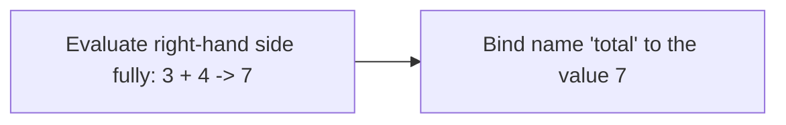

## Learning Objectives

- Define an expression as anything that evaluates to a value, and distinguish an expression from an assignment statement.
- Explain the evaluation order of an assignment: right-hand side first, fully, then bound to the left-hand name.
- Predict the result of a self-referential assignment such as `count = count + 1` by tracing the old versus new value.
- Distinguish `=` (assignment) from `==` (equality) precisely, including why Python treats confusing them as a syntax error in one specific case.
- Rewrite a compound assignment (`+=`, `*=`) as its fully expanded equivalent, and vice versa.

## Context & Motivation

Once a variable exists — a name bound to a value, as covered in the previous lesson — the natural next question is how that value gets computed and updated over the life of a program. The mechanism is the expression: any piece of code that evaluates to a value, built up from literals, variable names, and operators (`+`, `-`, `*`, `/`, `==`, `and`, and others) combined according to precise rules. Python's tutorial introduces expressions and assignment together in its earliest material for exactly this reason — an assignment statement is, structurally, "evaluate an expression, then store the result," so understanding one without the other leaves a gap. MIT's 6.100L organizes its own early lecture material the same way, treating expressions and assignment as a single, connected unit rather than two separate topics.

What makes this pairing genuinely worth a dedicated lesson — rather than something a student picks up as an afterthought — is a specific point of friction between the mathematics most students already know and the programming model they are learning. In mathematics, the symbol `=` asserts that two things are equal: `x = x + 1` is not merely unusual, it is a false statement for every real number `x`, since no number equals itself plus one. In Python, and in nearly every mainstream programming language, that exact same line of text means something entirely different and is a completely ordinary, frequently used instruction: compute the current value referred to by `x`, add one to it, and rebind the name `x` to that new result. The symbol is identical; the meaning is not. This is one of the first places where a learner's existing intuition actively works against them rather than helping, and getting the mental model right here — assignment as a command to execute, not a fact to assert — pays off for the rest of the curriculum, especially once loops make repeated self-referential assignment the normal way to accumulate a result.

The flip side of this same distinction is Python's separate operator for mathematical equality, `==`, which asks a genuine yes/no question ("are these the same value?") without changing anything. Keeping `=` and `==` conceptually — and visually — separate, and understanding exactly what protection Python's grammar does and does not offer against confusing them, is the second half of what this lesson covers.

## Core Theory

### Expressions evaluate; assignment stores

```python
3 + 4          # an expression: evaluates to 7, but nothing is stored anywhere
total = 3 + 4  # an assignment statement: evaluates 3 + 4, then stores 7 under the name "total"
```

The distinction is not cosmetic. The first line computes a value and immediately discards it — nothing in the program can refer to that `7` again, because it was never given a name. The second line performs the identical computation and then, as a second, separate step, binds the resulting value to the name `total`. Every assignment in Python follows this same two-phase structure: first the entire right-hand side is evaluated down to a single value, and only afterward is that value bound to whatever name (or names) appear on the left.



### Why self-referential assignment works at all

Because the right-hand side is evaluated *completely first*, using whatever the name currently refers to, before the name is rebound, an assignment can legally refer to its own current value on the right without any contradiction or special-casing:

```python
count = 5
count = count + 1   # right side evaluates using the OLD count (5), giving 6
                     # only after that evaluation finishes does "count" start meaning 6
```

Tracing this line by line makes the two-phase structure concrete: at the moment `count + 1` is evaluated, `count` still refers to `5` — the assignment has not happened yet — so the expression evaluates to `6`. Only then is `count` rebound. If assignment worked any other way — say, if the name were rebound before the right-hand side finished evaluating — this pattern would either loop forever or produce nonsense, since the right side would then read whatever `count` had just become instead of what it was.

Python also provides compound assignment operators as shorthand for exactly this recurring pattern — read, compute using the old value, rebind:

```python
count += 1   # equivalent to: count = count + 1
total *= 2   # equivalent to: total = total * 2
total -= 5   # equivalent to: total = total - 5
total /= 4   # equivalent to: total = total / 4
```

These are not new operators with new semantics; they are purely notational shortcuts for "take the current value, combine it with the right-hand operand using this operator, and rebind the name to the result." Anywhere `x = x <op> y` appears, `x <op>= y` means exactly the same thing.

### Equality is a different operator entirely

Mathematical equality — "is this the same value as that?" — is spelled `==` in Python, deliberately distinct in appearance from the single `=` used for assignment, precisely because the two operations do fundamentally different things:

```python
x = 5        # assignment: x now refers to 5; produces no usable value
x == 5       # equality check: evaluates to True; changes nothing about x
```

`==` is itself an expression — it evaluates to a `bool` (`True` or `False`) and can be used anywhere a value is expected, including stored under a name, passed to a function, or tested directly in an `if`. `=` is a statement, not an expression — it produces no value that could be used elsewhere; its entire effect is the side effect of rebinding a name. Confusing the two is a well-known beginner error, common enough that Python's grammar takes a specific, deliberate stance on it: `=` is not permitted to appear inside the condition of an `if`, `while`, or similar construct, so writing `if x = 5:` is caught immediately as a `SyntaxError`, not silently executed as an assignment disguised as a condition.

```python
if x = 5:
    pass
# SyntaxError: invalid syntax
```

This is worth being precise about: Python's grammar prevents this *specific* dangerous form of the mistake (assignment where a boolean condition was intended) by making it a syntax error rather than a silent bug. It does not, and cannot, prevent every possible confusion between assignment and equality — writing `x == 5` on its own line, intending to update `x` but forgetting the assignment entirely, is perfectly legal Python (it just evaluates the comparison and throws the result away), and the grammar has no way to know that wasn't intentional.

## Worked Examples

**Example 1 — Tracing a sequence of self-referential assignments by hand.** Given this code, predict the value of `balance` after each line, before running it:

```python
balance = 100
balance = balance + 50    # step 1
balance = balance - 30    # step 2
balance *= 2               # step 3
print(balance)
```

Tracing step by step: before step 1, `balance` is `100`. Step 1 evaluates `100 + 50` using the *old* value, giving `150`, then rebinds `balance` to `150`. Step 2 evaluates `150 - 30` using that new value, giving `120`, then rebinds `balance` to `120`. Step 3 is shorthand for `balance = balance * 2`, evaluating `120 * 2` to get `240`, then rebinding `balance` to `240`. The final printed value is `240`. The discipline of tracing "what is the current value right before this line evaluates its right-hand side" is exactly what makes self-referential assignment predictable rather than confusing.

**Example 2 — Building a boolean expression and storing its result for reuse.** A program needs to check, in several places, whether a student is eligible for a scholarship, defined as GPA at least 3.5 *and* enrolled full-time:

```python
gpa = 3.7
is_full_time = True

is_eligible = (gpa >= 3.5) and is_full_time   # a single expression, evaluating to a bool
print(is_eligible)   # True

if is_eligible:
    print("Eligible for scholarship")
```

Here `(gpa >= 3.5) and is_full_time` is an expression built from two smaller expressions (`gpa >= 3.5`, itself a comparison expression, and the variable `is_full_time`) combined with the logical operator `and`. Storing the result under `is_eligible` rather than repeating `(gpa >= 3.5) and is_full_time` everywhere the check is needed means the eligibility rule is written once — if the GPA threshold ever changes, exactly one line needs editing.

**Example 3 — Diagnosing a bug caused by confusing `=` and `==`.** A student intends to check whether a counter has reached a limit, but makes a typing slip:

```python
limit = 10
counter = 10

if counter == limit:      # correct: equality check
    print("Reached the limit")

# a different, broken version of the same intention:
# if counter = limit:      # SyntaxError: invalid syntax — caught immediately
```

The commented-out line shows exactly the mistake Python's grammar refuses to run at all: writing `=` where `==` was intended inside an `if` condition is caught as a `SyntaxError` before the program even starts, which is a direct, practical benefit of the grammar rule discussed above. Contrast this with a language where such a line would be silently interpreted as "assign `limit` to `counter`, and then treat the (always-truthy) result as the condition" — in Python, that specific failure mode simply cannot occur inside an `if`.

## Common Misconceptions & Pitfalls

- **"`x = x + 1` is a false statement, so it must be a special case in the language."** It is not false and not special-cased — it is a perfectly ordinary instruction, and the confusion comes entirely from carrying over the mathematical meaning of `=` (asserting equality) into a context where `=` means something different (issue a command to rebind a name). Once assignment is read as "do this, then store the result here" rather than "this is true," the apparent paradox disappears.
- **"`+=` introduces some new kind of operator with special behavior."** It is pure shorthand for the expanded form, nothing more — `total += total` doubles `total`, which is often exactly what's intended, but it is easy to write by accident when the actual intent was to add some *other* value, since the compact notation makes the self-reference less visually obvious than writing it out in full.
- **"Confusing `=` and `==` will always cause a crash, so it's a safe mistake to make."** Only the specific form `if x = 5:` (and similar conditions in `while`, etc.) is caught as a `SyntaxError`. Writing `x == 5` on its own line where an assignment was intended is legal Python — it silently evaluates the comparison and discards the `bool` result, changing nothing, which is a genuinely harder bug to spot than a crash would be:

  ```python
  x = 5
  x == 10   # legal but almost certainly a mistake: evaluates to False and does nothing
  print(x)  # 5 — unchanged, silently
  ```
- **"An expression that isn't assigned to anything just doesn't happen."** It still evaluates — Python computes `3 + 4` in the very first example above even though the result is thrown away — the *value* is discarded, not the computation. This matters once function calls with side effects are introduced later, where the return value might be unused but the effect of calling the function still occurs.

## Summary

An expression is anything that evaluates to a value; an assignment statement evaluates an expression completely and then, as a distinct second step, binds the resulting value to a name. That two-phase order — evaluate fully first, using whatever a name currently means, then rebind — is what makes self-referential assignments like `count = count + 1` and their `+=`-style shorthand both legal and predictable, once traced correctly. `==` is a genuinely different operator from `=`: it evaluates to a `bool` and changes nothing, where `=` produces no usable value and exists purely for its side effect of rebinding a name. Python's grammar eliminates the single most dangerous form of confusing the two — `=` inside an `if`/`while` condition — as an immediate `SyntaxError`, but it cannot and does not catch every misuse of `=` versus `==`, so tracing which one is intended, and why, remains the programmer's responsibility.

## Documentation Links

- [Python Tutorial — An Informal Introduction to Python](https://docs.python.org/3/tutorial/introduction.html) — doc
- [MIT 6.100L — Materials by Lecture](https://ocw.mit.edu/courses/6-100l-introduction-to-cs-and-programming-using-python-fall-2022/pages/material-by-lecture/) — doc
