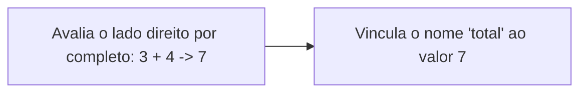

## Objetivos de Aprendizagem

- Definir uma expressão como qualquer coisa que se avalia em um valor, e distinguir uma expressão de uma instrução de atribuição.
- Explicar a ordem de avaliação de uma atribuição: primeiro o lado direito, por completo, depois vinculado ao nome do lado esquerdo.
- Prever o resultado de uma atribuição autorreferente como `count = count + 1` rastreando o valor antigo versus o novo.
- Distinguir `=` (atribuição) de `==` (igualdade) com precisão, incluindo o motivo de o Python tratar a confusão entre os dois como erro de sintaxe em um caso específico.
- Reescrever uma atribuição composta (`+=`, `*=`) na sua forma expandida equivalente, e vice-versa.

## Contexto e Motivação

Uma vez que uma variável existe (um nome vinculado a um valor, como visto na lição anterior), a próxima pergunta natural é como esse valor é calculado e atualizado ao longo da vida de um programa. O mecanismo é a expressão: qualquer trecho de código que se avalia em um valor, construído a partir de literais, nomes de variáveis e operadores (`+`, `-`, `*`, `/`, `==`, `and`, entre outros) combinados segundo regras precisas. O tutorial do Python apresenta expressões e atribuição juntas logo em seu material introdutório, exatamente por esse motivo: uma instrução de atribuição é, estruturalmente, "avalie uma expressão, depois armazene o resultado", então entender uma sem a outra deixa uma lacuna. O 6.100L do MIT organiza seu próprio material inicial da mesma forma, tratando expressões e atribuição como uma única unidade conectada, em vez de dois tópicos separados.

O que torna essa combinação realmente merecedora de uma lição dedicada, em vez de algo que o estudante absorve como nota de rodapé, é um ponto específico de atrito entre a matemática que a maioria dos estudantes já conhece e o modelo de programação que estão aprendendo. Na matemática, o símbolo `=` afirma que duas coisas são iguais: `x = x + 1` não é apenas incomum, é uma afirmação falsa para todo número real `x`, já que nenhum número é igual a si mesmo mais um. Em Python, e em praticamente toda linguagem de programação convencional, essa mesma linha de texto significa algo inteiramente diferente e é uma instrução completamente comum e frequentemente usada: calcule o valor atual referenciado por `x`, some um a ele, e revincule o nome `x` a esse novo resultado. O símbolo é idêntico; o significado não é. Esse é um dos primeiros pontos em que a intuição já existente de quem aprende trabalha ativamente contra ela em vez de ajudar, e acertar o modelo mental aqui (atribuição como um comando a ser executado, não um fato a ser afirmado) traz retorno pro resto do currículo, especialmente quando os loops tornarem a atribuição autorreferente repetida a forma normal de acumular um resultado.

O outro lado dessa mesma distinção é o operador separado do Python para igualdade matemática, `==`, que faz uma pergunta genuína de sim ou não ("esses valores são iguais?") sem alterar nada. Manter `=` e `==` conceitual e visualmente separados, e entender exatamente qual proteção a gramática do Python oferece (e não oferece) contra a confusão entre os dois, é a segunda metade do que esta lição cobre.

## Teoria Central

### Expressões avaliam; atribuição armazena

```python
3 + 4          # uma expressão: avalia para 7, mas nada é armazenado em lugar nenhum
total = 3 + 4  # uma instrução de atribuição: avalia 3 + 4, depois armazena 7 sob o nome "total"
```

A distinção não é cosmética. A primeira linha calcula um valor e imediatamente o descarta: nada no programa pode se referir a esse `7` novamente, porque ele nunca recebeu um nome. A segunda linha realiza o cálculo idêntico e, em seguida, como um segundo passo separado, vincula o valor resultante ao nome `total`. Toda atribuição em Python segue essa mesma estrutura em duas fases: primeiro o lado direito inteiro é avaliado até se tornar um único valor, e só depois esse valor é vinculado a qualquer nome (ou nomes) que apareça do lado esquerdo.



### Por que a atribuição autorreferente funciona

Como o lado direito é avaliado *completamente antes*, usando o que quer que o nome represente no momento, antes de o nome ser revinculado, uma atribuição pode legalmente se referir ao seu próprio valor atual no lado direito sem nenhuma contradição ou tratamento especial:

```python
count = 5
count = count + 1   # o lado direito avalia usando o VALOR ANTIGO de count (5), resultando em 6
                     # só depois que essa avaliação termina é que "count" passa a significar 6
```

Rastrear essa linha passo a passo torna concreta a estrutura em duas fases: no momento em que `count + 1` é avaliado, `count` ainda se refere a `5` (a atribuição ainda não aconteceu), então a expressão se avalia em `6`. Só então `count` é revinculado. Se a atribuição funcionasse de qualquer outra forma (digamos, se o nome fosse revinculado antes de o lado direito terminar de ser avaliado), esse padrão entraria em loop infinito ou produziria um resultado sem sentido, já que o lado direito passaria a ler o que `count` acabou de se tornar, em vez do que ele era.

O Python também fornece operadores de atribuição composta como atalho exatamente para esse padrão recorrente: ler, calcular usando o valor antigo, revincular.

```python
count += 1   # equivalente a: count = count + 1
total *= 2   # equivalente a: total = total * 2
total -= 5   # equivalente a: total = total - 5
total /= 4   # equivalente a: total = total / 4
```

Esses não são operadores novos com semântica nova; são puramente atalhos de notação para "pegue o valor atual, combine-o com o operando do lado direito usando esse operador, e revincule o nome ao resultado." Onde quer que `x = x <op> y` apareça, `x <op>= y` significa exatamente a mesma coisa.

### Igualdade é um operador completamente diferente

A igualdade matemática (algo como "esse valor é o mesmo que aquele?") é escrita `==` em Python, deliberadamente distinta em aparência do `=` único usado para atribuição, justamente porque as duas operações fazem coisas fundamentalmente diferentes:

```python
x = 5        # atribuição: x agora se refere a 5; não produz nenhum valor utilizável
x == 5       # checagem de igualdade: avalia para True; não muda nada em x
```

`==` é, ele próprio, uma expressão: avalia para um `bool` (`True` ou `False`) e pode ser usado em qualquer lugar em que se espera um valor, inclusive armazenado sob um nome, passado para uma função, ou testado diretamente em um `if`. `=` é uma instrução, não uma expressão: não produz nenhum valor que possa ser usado em outro lugar; seu efeito inteiro é o efeito colateral de revincular um nome. Confundir os dois é um erro conhecido de iniciantes, comum o bastante para que a gramática do Python assuma uma postura específica e deliberada sobre isso: `=` não é permitido dentro da condição de um `if`, `while`, ou construção semelhante, então escrever `if x = 5:` é pego imediatamente como um `SyntaxError`, em vez de ser silenciosamente executado como uma atribuição disfarçada de condição.

```python
if x = 5:
    pass
# SyntaxError: invalid syntax
```

Vale a pena ser preciso aqui: a gramática do Python previne essa forma *específica* e perigosa do erro (atribuição onde se pretendia uma condição booleana) transformando-a em erro de sintaxe em vez de bug silencioso. Ela não previne, e não tem como prevenir, toda possível confusão entre atribuição e igualdade: escrever `x == 5` sozinho em uma linha, com a intenção de atualizar `x` mas esquecendo a atribuição por completo, é Python perfeitamente válido (apenas avalia a comparação e descarta o resultado), e a gramática não tem como saber que isso não foi intencional.

## Exemplos Resolvidos

**Exemplo 1: rastreando à mão uma sequência de atribuições autorreferentes.** Dado este código, preveja o valor de `balance` após cada linha, antes de executá-lo:

```python
balance = 100
balance = balance + 50    # passo 1
balance = balance - 30    # passo 2
balance *= 2               # passo 3
print(balance)
```

Rastreando passo a passo: antes do passo 1, `balance` é `100`. O passo 1 avalia `100 + 50` usando o valor *antigo*, resultando em `150`, e então revincula `balance` a `150`. O passo 2 avalia `150 - 30` usando esse novo valor, resultando em `120`, e então revincula `balance` a `120`. O passo 3 é atalho para `balance = balance * 2`, avaliando `120 * 2` para obter `240`, e então revinculando `balance` a `240`. O valor final impresso é `240`. A disciplina de rastrear "qual é o valor atual bem antes de esta linha avaliar seu lado direito" é exatamente o que torna a atribuição autorreferente previsível em vez de confusa.

**Exemplo 2: construindo uma expressão booleana e armazenando seu resultado para reutilização.** Um programa precisa checar, em vários lugares, se um estudante é elegível para uma bolsa, definida como GPA de pelo menos 3,5 *e* matriculado em tempo integral:

```python
gpa = 3.7
is_full_time = True

is_eligible = (gpa >= 3.5) and is_full_time   # uma única expressão, que avalia para um bool
print(is_eligible)   # True

if is_eligible:
    print("Eligible for scholarship")
```

Aqui, `(gpa >= 3.5) and is_full_time` é uma expressão construída a partir de duas expressões menores (`gpa >= 3.5`, ela mesma uma expressão de comparação, e a variável `is_full_time`) combinadas com o operador lógico `and`. Armazenar o resultado sob `is_eligible`, em vez de repetir `(gpa >= 3.5) and is_full_time` em todo lugar em que a checagem é necessária, significa que a regra de elegibilidade é escrita uma única vez: se o limiar de GPA algum dia mudar, exatamente uma linha precisa ser editada.

**Exemplo 3: diagnosticando um bug causado pela confusão entre `=` e `==`.** Um estudante pretende checar se um contador atingiu um limite, mas comete um deslize de digitação:

```python
limit = 10
counter = 10

if counter == limit:      # correto: checagem de igualdade
    print("Reached the limit")

# uma versão diferente, quebrada, da mesma intenção:
# if counter = limit:      # SyntaxError: invalid syntax, pego imediatamente
```

A linha comentada mostra exatamente o erro que a gramática do Python se recusa a executar: escrever `=` onde se pretendia `==` dentro de uma condição de `if` é pego como `SyntaxError` antes mesmo de o programa começar a rodar, o que é um benefício direto e prático da regra de gramática discutida acima. Compare isso com uma linguagem em que essa linha seria silenciosamente interpretada como "atribua `limit` a `counter`, e então trate o resultado (sempre verdadeiro) como a condição": em Python, esse modo de falha específico simplesmente não pode ocorrer dentro de um `if`.

## Equívocos Comuns e Armadilhas

- **"`x = x + 1` é uma afirmação falsa, então precisa ser um caso especial da linguagem."** Não é falsa nem é tratada como caso especial: é uma instrução perfeitamente comum, e a confusão vem inteiramente de carregar o significado matemático de `=` (afirmar igualdade) para um contexto em que `=` significa outra coisa (emitir um comando para revincular um nome). Uma vez que a atribuição é lida como "faça isto, depois armazene o resultado aqui" em vez de "isto é verdade", o aparente paradoxo desaparece.
- **"`+=` introduz algum tipo novo de operador com comportamento especial."** É puro atalho para a forma expandida, nada mais: `total += total` dobra `total`, o que muitas vezes é exatamente a intenção, mas é fácil de escrever por acidente quando a intenção real era somar algum *outro* valor, já que a notação compacta torna a autorreferência menos visualmente óbvia do que escrevê-la por extenso.
- **"Confundir `=` e `==` sempre vai causar uma falha, então é um erro seguro de cometer."** Só a forma específica `if x = 5:` (e condições semelhantes em `while`, etc.) é pega como `SyntaxError`. Escrever `x == 5` sozinho em uma linha onde se pretendia uma atribuição é Python válido: ele silenciosamente avalia a comparação e descarta o resultado `bool`, sem mudar nada, o que é um bug genuinamente mais difícil de perceber do que uma falha seria:

  ```python
  x = 5
  x == 10   # legal, mas quase certamente um erro: avalia para False e não faz nada
  print(x)  # 5, inalterado, silenciosamente
  ```
- **"Uma expressão que não é atribuída a nada simplesmente não acontece."** Ela ainda é avaliada: o Python calcula `3 + 4` logo no primeiro exemplo acima, mesmo que o resultado seja descartado. O *valor* é descartado, não o cálculo. Isso importa quando chamadas de função com efeitos colaterais forem introduzidas mais adiante, casos em que o valor de retorno pode não ser usado, mas o efeito de chamar a função ainda ocorre.

## Resumo

Uma expressão é qualquer coisa que se avalia em um valor; uma instrução de atribuição avalia uma expressão por completo e, como um segundo passo distinto, vincula o valor resultante a um nome. Essa ordem em duas fases (avaliar por completo primeiro, usando o que quer que um nome signifique no momento, depois revincular) é o que torna atribuições autorreferentes como `count = count + 1`, e seus atalhos no estilo `+=`, tanto legais quanto previsíveis, uma vez rastreadas corretamente. `==` é um operador genuinamente diferente de `=`: avalia para um `bool` e não muda nada, enquanto `=` não produz nenhum valor utilizável e existe puramente pelo seu efeito colateral de revincular um nome. A gramática do Python elimina a forma mais perigosa de confundir os dois (`=` dentro de uma condição de `if`/`while`) transformando-a em um `SyntaxError` imediato, mas não consegue, e não pega, todo mau uso de `=` versus `==`, então rastrear qual dos dois é pretendido, e por quê, continua sendo responsabilidade de quem programa.

## Documentation Links

- [Python Tutorial: An Informal Introduction to Python](https://docs.python.org/3/tutorial/introduction.html) (doc)
- [MIT 6.100L: Materials by Lecture](https://ocw.mit.edu/courses/6-100l-introduction-to-cs-and-programming-using-python-fall-2022/pages/material-by-lecture/) (doc)
