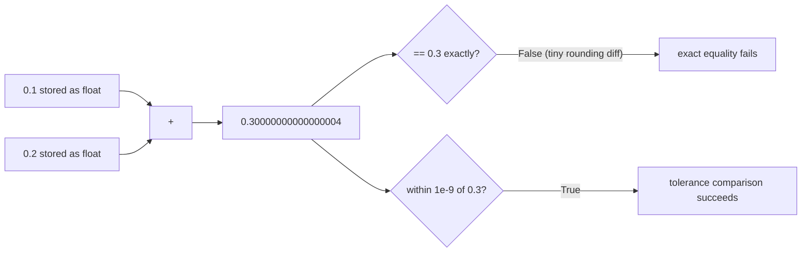

## Learning Objectives

- Explain why binary floating-point representation makes most decimal fractions inexact, using the same intuition as a repeating decimal.
- Predict when a floating-point comparison with `==` is likely to fail even though the two values are "mathematically" equal.
- Implement a tolerance-based ("close enough") comparison in place of exact equality.
- Identify a scenario where floating-point error accumulates across repeated operations, and quantify it with a small example.
- Compare using `float` versus `int` for a given quantity and justify the choice based on whether the quantity is genuinely continuous or genuinely discrete.

## Context & Motivation

By this point, `int` and `float` have both been used as though they were interchangeable flavors of "number" — pick whichever one matches the kind of value you're storing, and move on. That's true almost all of the time, but there is exactly one point where the two behave in genuinely different, sometimes surprising ways: equality comparison and accumulation. An `int` in Python is exact, arbitrarily large, and behaves exactly the way arithmetic taught you it should. A `float`, on the other hand, is stored as a fixed number of binary digits — a finite approximation of a real number, not the real number itself — and that single fact ripples out into a whole category of behavior that looks, on first encounter, like a bug in the language.

This matters for more than intellectual curiosity. It is a direct prerequisite for the next concept in this track, guess-and-check and bisection search: a search loop that keeps refining a floating-point guess and stops when `guess == target` can, in principle, never terminate, because the arithmetic producing `guess` may simply never land on a value that compares exactly equal to `target`, no matter how close it gets. Understanding *why* floats behave this way — not just memorizing "don't use `==` on floats" as a rule of thumb — is what lets you predict, before running any code, whether a given calculation is at risk.

MIT's 6.100L introduces this topic right where it belongs: after variables and primitive types have been covered in the abstract, and right before floating-point approximation becomes load-bearing for solving equations that don't have exact closed-form solutions. The core idea generalizes past Python specifically — floating-point representation is a shared standard (IEEE 754) used by nearly every mainstream programming language, so what you learn here about `0.1 + 0.2` is not a Python quirk; it is a property of how computers represent real numbers in binary, full stop.

## Core Theory

### Why 0.1 + 0.2 != 0.3

```python
0.1 + 0.2            # 0.30000000000000004
0.1 + 0.2 == 0.3      # False
```

This is not a bug — it is a direct, predictable consequence of representing numbers in a fixed number of binary bits. The intuition transfers directly from a fact you already know about decimal notation: `1/3` has no exact finite representation in decimal — it's `0.333...`, repeating forever, and any finite number of digits you write down is an *approximation* of `1/3`, not `1/3` itself. Binary floating-point has the exact same problem, just with a different set of "awkward" fractions. `0.1` in binary is a repeating fraction (analogous to `1/3` in decimal), and since a `float` stores only a fixed number of binary digits, `0.1` has to be rounded to the *nearest representable value* — a value extremely close to, but not exactly, one tenth. Adding two such rounded values (`0.1`'s stored approximation plus `0.2`'s stored approximation) compounds their respective tiny errors, and the result lands a hair away from the binary approximation of `0.3`.

### Exact equality is the wrong tool for floats

Because of this, comparing two floating-point values for exact equality is unreliable whenever either value was produced by arithmetic (as opposed to being a literal typed directly into the source, where it's at least consistently rounded the same way). The standard fix is a **tolerance comparison** — check that the two values are within some small acceptable distance of each other, rather than identical bit-for-bit:

```python
abs((0.1 + 0.2) - 0.3) < 1e-9   # True -- "close enough" comparison
```

`abs(a - b) < epsilon` (for some small `epsilon`, here `1e-9`) asks "are these two values close enough that any difference is just rounding noise?" rather than "are these two values bit-for-bit identical?" — and that is almost always the question you actually meant to ask when comparing two floats.



### Accumulated error over repeated operations

A single floating-point operation introduces, at most, a tiny rounding error — often too small to matter for one calculation. The problem is that these tiny errors don't cancel out on average; they can compound when the same operation repeats many times:

```python
total = 0.0
for _ in range(10):
    total += 0.1
print(total)          # 0.9999999999999999, not exactly 1.0
print(total == 1.0)   # False
```

Ten additions of a value that is itself only an approximation of one tenth do not sum to an exact `1.0` — they sum to a value extremely close to `1.0` but distinguishable from it at the level of precision Python tracks. This is the accumulation phenomenon in miniature: one addition's rounding error is invisible; ten additions' worth is measurable; and a loop that ran for a million iterations instead of ten could, in principle, drift far enough to actually matter for the calculation at hand, depending on what precision the application needs.

### `int` sidesteps the problem entirely — when the quantity actually is discrete

Not every numeric quantity needs to be a `float`. Money is the textbook example: representing a price as a `float` number of dollars invites exactly the rounding problems above (`$0.10 + $0.20` might not print as exactly `$0.30`), whereas storing the same amount as an `int` number of cents is exact, because integer arithmetic in Python has no rounding error at all — `10 + 20` is always, exactly, `30`. The trade-off is that displaying the value back to a human now requires an explicit conversion step (dividing by 100 and formatting with two decimal places), but that's a small, one-time cost in exchange for eliminating rounding error from every arithmetic operation in between.

## Worked Examples

**Example 1 — predicting, before running it, whether a comparison will fail.** Given the expression `0.3 * 3 == 0.9`, predict the outcome before running it. `0.3` is a repeating binary fraction (like `0.1`), so it's stored as an approximation; multiplying that approximation by `3` compounds whatever rounding error was already present. `0.9`, independently, is *also* stored as its own nearest approximation — and there's no guarantee these two independently-rounded values land on the identical stored bit pattern. Running it confirms the prediction:

```python
0.3 * 3          # 0.8999999999999999
0.3 * 3 == 0.9   # False
```

The lesson generalizes: any time a float is the *result of an arithmetic operation*, treat an exact `==` comparison against another float as suspect by default, and reach for a tolerance comparison instead, unless you have a specific reason to believe both sides were rounded identically (for instance, comparing a float against itself, or against a value copied from the exact same computation).

**Example 2 — building a "close enough" comparison function for repeated use.** Rather than writing `abs(a - b) < 1e-9` inline every time two floats need comparing, wrap the pattern once:

```python
def is_close(a, b, epsilon=1e-9):
    return abs(a - b) < epsilon

print(is_close(0.1 + 0.2, 0.3))        # True
print(is_close(1.0, 1.0000000001))     # True
print(is_close(1.0, 1.1))              # False
```

Walking through the third call: `abs(1.0 - 1.1)` is `0.1` (well, its own floating-point approximation of `0.1` — but close enough to `0.1` that the point still holds), and `0.1 < 1e-9` is `False`, since `0.1` is vastly larger than one-billionth. The function correctly reports that `1.0` and `1.1` are *not* close enough to be considered equal, while the first two calls correctly recognize rounding noise for what it is. Choosing `epsilon` is itself a judgment call — too large, and genuinely different values get treated as equal; too small, and rounding noise starts failing the check again, defeating the purpose.

**Example 3 — measuring accumulated drift directly.** To see the accumulation phenomenon scale, compare a small loop against a larger one:

```python
def accumulate(step, count):
    total = 0.0
    for _ in range(count):
        total += step
    return total

print(accumulate(0.1, 10))      # 0.9999999999999999  (expected 1.0)
print(accumulate(0.1, 10) == 1.0)   # False

exact_expected = 0.1 * 10       # still not exactly 1.0 either, but by a different rounding path
print(accumulate(0.1, 10) - 1.0)    # a tiny negative number -- the accumulated error, made visible
```

The last line makes the error itself a value you can inspect rather than an abstract warning: subtracting the mathematically expected result from the actual computed result exposes exactly how far the accumulated rounding has drifted — a number on the order of `1e-16` here, negligible for most purposes, but the same mechanism, run for far more iterations or with far more sensitive downstream calculations, is exactly what makes naive `==` checks in long-running numeric code a real (not just theoretical) source of bugs.

## Common Misconceptions & Pitfalls

- **"0.1 + 0.2 == 0.3 being False must be a bug in Python."** It is not Python-specific at all — it is a consequence of the IEEE 754 binary floating-point standard used by essentially every mainstream language (C, Java, JavaScript, and Python all exhibit the identical behavior for this exact expression). The "bug" is really a mismatch between how humans think about decimal fractions and how computers are forced to represent them in binary.
- **"Since the error is only in the 17th decimal place, it can never matter."** For a single operation, that's usually true. But error from repeated operations does not average out to zero — it can accumulate in one direction, and a loop that runs for a very large number of iterations, or a calculation where the tiny difference gets amplified by a later operation (like a subtraction between two nearly-equal large numbers), can turn a seemingly negligible rounding error into a visibly wrong final answer.
- **"Switching everything to `float` is always safe since it's 'more precise' than `int`."** `int` in Python is exact and arbitrarily large — it has *no* rounding error at all for whole numbers, however large. `float` trades that exactness for the ability to represent fractional and very large/small magnitudes, at the cost of the approximation behavior covered in this lesson. When a quantity is genuinely discrete (a count of items, a number of cents), `int` is not just adequate — it is strictly more correct, because it removes an entire category of bug that `float` cannot avoid.
- **"A tolerance comparison with any small `epsilon` is automatically correct."** Choosing `epsilon` is itself a decision with real consequences, not a boilerplate detail. Too small, and the comparison can still fail on values that "should" be considered equal, because floating-point noise can occasionally exceed a too-tight tolerance; too large, and truly different values start being treated as equal, silently swallowing real bugs. There is no single universally correct `epsilon` — it depends on how much precision the specific calculation actually needs.

## Summary

A `float` stores a fixed number of binary digits and is therefore an approximation of a real number, not the real number itself — most decimal fractions, including simple-looking ones like `0.1`, have no exact finite binary representation, the same way `1/3` has no exact finite decimal one. This single fact explains why `0.1 + 0.2 == 0.3` is `False`: each operand was independently rounded to its nearest representable value before the addition even happened. The reliable fix is comparing floats with a tolerance (`abs(a - b) < epsilon`) rather than exact equality, and recognizing that rounding error, while tiny per operation, can accumulate across repeated arithmetic in a loop. When a quantity is genuinely discrete rather than continuous, switching to `int` sidesteps floating-point approximation entirely — a design choice worth making deliberately rather than defaulting to `float` for every number.

## Documentation Links

- [Python Library Reference — Built-in Types](https://docs.python.org/3/library/stdtypes.html) — doc
- [MIT 6.100L — Materials by Lecture](https://ocw.mit.edu/courses/6-100l-introduction-to-cs-and-programming-using-python-fall-2022/pages/material-by-lecture/) — doc
