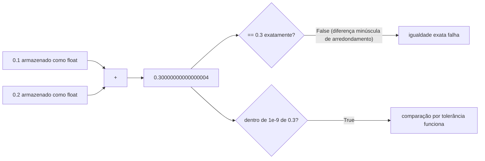

## Objetivos de Aprendizagem

- Explicar por que a representação binária de ponto flutuante torna a maioria das frações decimais inexata, usando a mesma intuição de uma {{dízima periódica}}[^dizima-periodica].
- Prever quando uma comparação de ponto flutuante com `==` provavelmente falha mesmo que os dois valores sejam "matematicamente" iguais.
- Implementar uma comparação baseada em tolerância ("perto o suficiente") no lugar de igualdade exata.
- Identificar um cenário em que o erro de ponto flutuante se acumula ao longo de operações repetidas, e quantificá-lo com um pequeno exemplo.
- Comparar o uso de `float` versus `int` para uma dada quantidade e justificar a escolha com base em se a quantidade é genuinamente contínua ou genuinamente discreta.

[^dizima-periodica]: Dízima periódica é um número decimal cuja parte decimal se repete infinitamente seguindo um padrão. O exemplo clássico é: 1/3 = 0,3333333333...

    O 3 continua se repetindo para sempre. Por isso chamamos de dízima periódica.

## Contexto e Motivação

Até este ponto, `int` e `float` foram usados como se fossem sabores intercambiáveis de "número": escolha o que combinar com o tipo de valor que você está guardando, e siga em frente. Isso é verdade quase o tempo todo, mas existe exatamente um ponto em que os dois se comportam de formas genuinamente diferentes, às vezes surpreendentes: comparação de igualdade e acumulação. Um `int` em Python é exato, arbitrariamente grande, e se comporta exatamente do jeito que a aritmética ensinou que deveria. Um `float`, por outro lado, é armazenado como um número fixo de dígitos binários, uma aproximação finita de um número real, não o número real em si, e esse único fato se espalha para toda uma categoria de comportamento que parece, à primeira vista, um bug na linguagem.

Isso importa além da curiosidade intelectual. É um pré-requisito direto para o próximo conceito desta trilha, guess-and-check e busca por bisseção: um laço de busca que continua refinando um palpite de ponto flutuante e para quando `guess == target` pode, em princípio, nunca terminar, porque a aritmética que produz `guess` pode simplesmente nunca cair num valor que compare exatamente igual a `target`, não importa quão perto ele chegue. Entender *por que* floats se comportam assim, não apenas memorizar "não use `==` em floats" como regra de bolso, é o que permite prever, antes de rodar qualquer código, se um dado cálculo está em risco.

O 6.100L do MIT apresenta este tema exatamente onde ele pertence: depois que variáveis e tipos primitivos foram cobertos no abstrato, e logo antes de a aproximação de ponto flutuante se tornar estrutural para resolver equações que não têm soluções exatas em forma fechada. A ideia central generaliza além do Python especificamente: a representação de ponto flutuante é um padrão compartilhado (IEEE 754) usado por praticamente toda linguagem de programação mainstream, então o que você aprende aqui sobre `0.1 + 0.2` não é uma peculiaridade do Python; é uma propriedade de como computadores representam números reais em binário, ponto final.

## Teoria Central

### Por que 0.1 + 0.2 != 0.3

```python
0.1 + 0.2            # 0.30000000000000004
0.1 + 0.2 == 0.3      # False
```

Isso não é um bug: é uma consequência direta e previsível de representar números num número fixo de bits binários. A intuição se transfere diretamente de um fato que você já conhece sobre a notação decimal: `1/3` não tem representação decimal finita exata, é `0,333...`, repetindo para sempre, e qualquer número finito de dígitos que você escrever é uma *aproximação* de `1/3`, não `1/3` em si. O ponto flutuante binário tem exatamente o mesmo problema, só que com um conjunto diferente de frações "incômodas". `0,1` em binário é uma fração periódica (análoga a `1/3` em decimal), e como um `float` armazena apenas um número fixo de dígitos binários, `0,1` precisa ser arredondado para o *valor representável mais próximo*: um valor extremamente perto, mas não exatamente igual, a um décimo. Somar dois desses valores arredondados (a aproximação armazenada de `0,1` mais a aproximação armazenada de `0,2`) combina seus respectivos erros minúsculos, e o resultado cai a um fio de distância da aproximação binária de `0,3`.

### Igualdade exata é a ferramenta errada para floats

Por causa disso, comparar dois valores de ponto flutuante por igualdade exata é pouco confiável sempre que qualquer um dos valores foi produzido por aritmética (em oposição a ser um literal digitado diretamente no código-fonte, onde ao menos é arredondado consistentemente da mesma forma). A correção padrão é uma **comparação por tolerância**: checar se os dois valores estão dentro de alguma pequena distância aceitável um do outro, em vez de idênticos bit a bit:

```python
abs((0.1 + 0.2) - 0.3) < 1e-9   # True -- comparação "perto o suficiente"
```

`abs(a - b) < epsilon` (para algum `epsilon` pequeno, aqui `1e-9`) pergunta "esses dois valores estão perto o suficiente que qualquer diferença é só ruído de arredondamento?" em vez de "esses dois valores são idênticos bit a bit?", e essa é quase sempre a pergunta que você de fato queria fazer ao comparar dois floats.



### Erro acumulado ao longo de operações repetidas

Uma única operação de ponto flutuante introduz, no máximo, um erro de arredondamento minúsculo, frequentemente pequeno demais para importar para um único cálculo. O problema é que esses erros minúsculos não se cancelam na média; eles podem se combinar quando a mesma operação se repete muitas vezes:

```python
total = 0.0
for _ in range(10):
    total += 0.1
print(total)          # 0.9999999999999999, não exatamente 1.0
print(total == 1.0)   # False
```

Dez adições de um valor que é, ele próprio, apenas uma aproximação de um décimo não somam a um `1,0` exato: elas somam a um valor extremamente perto de `1,0`, mas distinguível dele no nível de precisão que o Python rastreia. Este é o fenômeno de acumulação em miniatura: o erro de arredondamento de uma adição é invisível; o de dez adições é mensurável; e um laço que rodasse por um milhão de iterações em vez de dez poderia, em princípio, desviar o suficiente para de fato importar para o cálculo em questão, dependendo de qual precisão a aplicação precisa.

### `int` evita o problema por completo, quando a quantidade de fato é discreta

Nem toda quantidade numérica precisa ser um `float`. Dinheiro é o exemplo clássico: representar um preço como um número `float` de dólares convida exatamente aos problemas de arredondamento acima (`$0,10 + $0,20` pode não imprimir como exatamente `$0,30`), enquanto armazenar a mesma quantia como um número `int` de centavos é exato, porque a aritmética de inteiros no Python não tem erro de arredondamento nenhum: `10 + 20` é sempre, exatamente, `30`. A troca é que exibir o valor de volta para um humano agora exige um passo explícito de conversão (dividir por 100 e formatar com duas casas decimais), mas esse é um custo pequeno e único em troca de eliminar o erro de arredondamento de toda operação aritmética no meio do caminho.

## Exemplos Resolvidos

**Exemplo 1: prevendo, antes de rodar, se uma comparação vai falhar.** Dada a expressão `0.3 * 3 == 0.9`, preveja o resultado antes de rodá-la. `0,3` é uma fração binária periódica (como `0,1`), então é armazenado como uma aproximação; multiplicar essa aproximação por `3` combina qualquer erro de arredondamento que já estava presente. `0,9`, independentemente, *também* é armazenado como sua própria aproximação mais próxima, e não há garantia de que esses dois valores arredondados de forma independente caiam no mesmo padrão de bits armazenado. Rodar confirma a previsão:

```python
0.3 * 3          # 0.8999999999999999
0.3 * 3 == 0.9   # False
```

A lição generaliza: sempre que um float é o *resultado de uma operação aritmética*, trate uma comparação exata `==` contra outro float como suspeita por padrão, e recorra a uma comparação por tolerância em vez disso, a menos que você tenha uma razão específica para acreditar que os dois lados foram arredondados de forma idêntica (por exemplo, comparar um float consigo mesmo, ou contra um valor copiado do exato mesmo cálculo).

**Exemplo 2: construindo uma função de comparação "perto o suficiente" para uso repetido.** Em vez de escrever `abs(a - b) < 1e-9` inline toda vez que dois floats precisam ser comparados, empacote o padrão uma vez:

```python
def is_close(a, b, epsilon=1e-9):
    return abs(a - b) < epsilon

print(is_close(0.1 + 0.2, 0.3))        # True
print(is_close(1.0, 1.0000000001))     # True
print(is_close(1.0, 1.1))              # False
```

Percorrendo a terceira chamada: `abs(1.0 - 1.1)` é `0,1` (bem, sua própria aproximação de ponto flutuante de `0,1`, mas perto o suficiente de `0,1` que o ponto ainda vale), e `0,1 < 1e-9` é `False`, já que `0,1` é vastamente maior que um bilionésimo. A função corretamente relata que `1,0` e `1,1` *não* estão perto o suficiente para serem consideradas iguais, enquanto as duas primeiras chamadas corretamente reconhecem o ruído de arredondamento pelo que ele é. Escolher `epsilon` é, em si, um julgamento: grande demais, e valores genuinamente diferentes são tratados como iguais; pequeno demais, e o ruído de arredondamento começa a falhar a checagem de novo, anulando o propósito.

**Exemplo 3: medindo o desvio acumulado diretamente.** Para ver o fenômeno de acumulação escalar, compare um laço pequeno com um maior:

```python
def accumulate(step, count):
    total = 0.0
    for _ in range(count):
        total += step
    return total

print(accumulate(0.1, 10))      # 0.9999999999999999  (esperado 1.0)
print(accumulate(0.1, 10) == 1.0)   # False

exact_expected = 0.1 * 10       # também não é exatamente 1.0, mas por um caminho diferente de arredondamento
print(accumulate(0.1, 10) - 1.0)    # um número negativo minúsculo -- o erro acumulado, tornado visível
```

A última linha torna o próprio erro um valor que você pode inspecionar em vez de um aviso abstrato: subtrair o resultado matematicamente esperado do resultado de fato calculado expõe exatamente o quanto o arredondamento acumulado desviou, um número da ordem de `1e-16` aqui, insignificante para a maioria dos propósitos, mas o mesmo mecanismo, rodado por muito mais iterações ou com cálculos subsequentes muito mais sensíveis, é exatamente o que torna checagens ingênuas de `==` em código numérico de longa duração uma fonte real (não apenas teórica) de bugs.

## Equívocos Comuns e Armadilhas

- **"0.1 + 0.2 == 0.3 ser False deve ser um bug do Python."** Não é específico do Python de forma alguma: é uma consequência do padrão IEEE 754 de ponto flutuante binário usado por essencialmente toda linguagem mainstream (C, Java, JavaScript e Python todos exibem o comportamento idêntico para esta expressão exata). O "bug" é na verdade um descompasso entre como humanos pensam sobre frações decimais e como computadores são forçados a representá-las em binário.
- **"Como o erro está só na 17ª casa decimal, ele nunca pode importar."** Para uma única operação, isso costuma ser verdade. Mas o erro de operações repetidas não se cancela até zero na média: ele pode se acumular numa direção, e um laço que roda por um número muito grande de iterações, ou um cálculo em que a diferença minúscula é amplificada por uma operação posterior (como uma subtração entre dois números grandes quase iguais), pode transformar um erro de arredondamento aparentemente insignificante numa resposta final visivelmente errada.
- **"Trocar tudo para `float` é sempre seguro, já que é 'mais preciso' que `int`."** `int` no Python é exato e arbitrariamente grande: não tem erro de arredondamento nenhum para números inteiros, por maiores que sejam. `float` troca essa exatidão pela capacidade de representar magnitudes fracionárias e muito grandes/pequenas, ao custo do comportamento de aproximação coberto nesta lição. Quando uma quantidade é genuinamente discreta (uma contagem de itens, um número de centavos), `int` não é apenas adequado, é estritamente mais correto, porque remove uma categoria inteira de bug que `float` não consegue evitar.
- **"Uma comparação por tolerância com qualquer `epsilon` pequeno é automaticamente correta."** Escolher `epsilon` é, em si, uma decisão com consequências reais, não um detalhe padronizado. Pequeno demais, e a comparação ainda pode falhar em valores que "deveriam" ser considerados iguais, porque o ruído de ponto flutuante ocasionalmente pode exceder uma tolerância apertada demais; grande demais, e valores verdadeiramente diferentes começam a ser tratados como iguais, engolindo silenciosamente bugs reais. Não existe um único `epsilon` universalmente correto: depende de quanta precisão o cálculo específico de fato precisa.

## Resumo

Um `float` armazena um número fixo de dígitos binários e é, portanto, uma aproximação de um número real, não o número real em si: a maioria das frações decimais, incluindo algumas que parecem simples como `0,1`, não tem representação binária finita exata, do mesmo jeito que `1/3` não tem representação decimal finita exata. Esse único fato explica por que `0.1 + 0.2 == 0.3` é `False`: cada operando foi independentemente arredondado para seu valor representável mais próximo antes mesmo da adição acontecer. A correção confiável é comparar floats com uma tolerância (`abs(a - b) < epsilon`) em vez de igualdade exata, e reconhecer que o erro de arredondamento, embora minúsculo por operação, pode se acumular ao longo de aritmética repetida num laço. Quando uma quantidade é genuinamente discreta em vez de contínua, trocar para `int` evita a aproximação de ponto flutuante por completo: uma escolha de design que vale a pena fazer deliberadamente em vez de recorrer a `float` por padrão para todo número.

## Documentation Links

- [Python Library Reference: Built-in Types](https://docs.python.org/3/library/stdtypes.html) (doc)
- [MIT 6.100L: Materials by Lecture](https://ocw.mit.edu/courses/6-100l-introduction-to-cs-and-programming-using-python-fall-2022/pages/material-by-lecture/) (doc)
