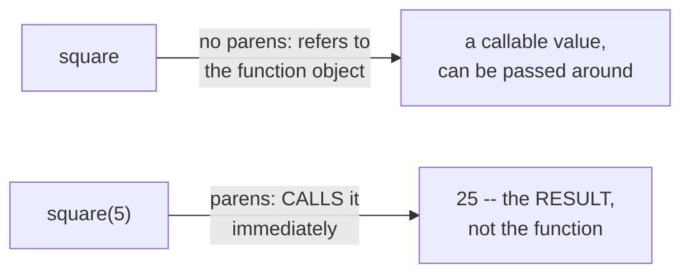

## Learning Objectives

- Explain what it means, concretely, for a function to be a "first-class object" in Python's data model.
- Distinguish referring to a function (`square`) from calling it (`square()`), and predict the consequence of confusing the two.
- Implement code that passes a function as an argument to another function, and that stores functions in a data structure.
- Write short, single-expression functions using `lambda` and identify when a `lambda` should be replaced by a full `def`.
- Compare the readability trade-offs of passing functions around versus writing the equivalent logic inline.

## Context & Motivation

Every value discussed so far — a number, a string, a list — has been something a program computes *with*. Functions have been the tool used to do that computing, sitting one level above the data itself. Python's data model erases that distinction almost entirely: a function created with `def` is an ordinary object, of a type like any other, and it can be assigned to a variable, stored in a list or dictionary, passed as an argument, or returned from another function, using exactly the same rules that govern every other value in the language. This property — that functions are values, not a separate category of thing — is what computer scientists call being "first-class," and Python's data model is explicit that `def` does nothing more exotic than bind a name to a function object, the same act `x = 5` performs for an integer.

The practical payoff is enormous, and it shows up the moment a program needs to parameterize *behavior* rather than just data. Consider sorting a list of words: sometimes you want alphabetical order, sometimes by length, sometimes by the last letter. Writing three separate sorting functions — one per rule — would be a poor use of the abstraction functions are supposed to provide. Instead, Python's built-in `sorted()` takes the comparison rule itself as an argument: `sorted(words, key=len)` sorts by length, `sorted(words, key=str.upper)` sorts case-insensitively, without `sorted` ever needing to know in advance which rule you'll want. This is only possible because a function — `len`, `str.upper`, or anything else — can be handed to another function exactly like a number or a string can.

This idea traces directly to the material in Python's own control-flow tutorial and its data model reference, both of which single out functions-as-objects as a distinct concept worth calling out rather than something that "just happens" to work. It's worth taking seriously for exactly that reason: many languages *do* draw a hard boundary between "things you compute with" and "code that computes," and Python's decision not to is a deliberate design choice with real consequences for how idiomatic Python code is written — sorting, filtering, callbacks, and decorators all lean on this same underlying property.

## Core Theory

### A function object is created once, at `def`

When Python executes a `def` statement, it does two things: it builds a function object (compiled code plus some bookkeeping), and it binds a name to that object in the current scope — the exact same two-step process `x = 5` performs for an `int` object. Nothing about calling the function has happened yet; `def square(x): return x * x` on its own produces no output and does no arithmetic. It's only the later act of *calling* — `square(5)` — that executes the code inside.

```python
def square(x):
    return x * x

operation = square        # binds ANOTHER name to the SAME function object
print(operation is square)  # True -- same object, two names
print(operation(5))         # 25 -- calling through either name works identically
```

### Referring to a function vs. calling it

The single most important syntactic distinction in this entire concept is the presence or absence of parentheses. `square` refers to the function object itself. `square()` (or `square(5)`) *calls* it, and the resulting expression refers to whatever that call returned — not to the function.



This is exactly what makes passing a function as an argument possible — and exactly what makes a specific, very common mistake possible too:

```python
def apply_twice(f, x):
    return f(f(x))

apply_twice(square, 3)     # correct: passes the FUNCTION -- square(square(3)) = 81
apply_twice(square(3), 3)  # wrong: passes 9 (square(3)'s RESULT) as the first argument
                            # -- crashes: TypeError: 'int' object is not callable
```

`apply_twice(square, 3)` hands `apply_twice` the function itself, which it then calls twice internally. `apply_twice(square(3), 3)` evaluates `square(3)` *before* the call to `apply_twice` even happens, producing `9`, then tries to pass `9` in the slot meant for a callable — and the failure surfaces as `'int' object is not callable`, a message that only makes sense once you know the difference between referring to and calling a function.

### Functions as elements of ordinary data structures

Because a function is just an object, it can live inside a list, a dictionary, or any other container, exactly like an `int` or a `str` could:

```python
def add(a, b):
    return a + b

def subtract(a, b):
    return a - b

operations = {"add": add, "sub": subtract}
choice = input("add or sub? ")
result = operations[choice](3, 4)   # look up the function, then call it
```

`operations[choice]` retrieves a function object from the dictionary; the following `(3, 4)` is a separate, second step that calls whatever function was retrieved. This pattern — dispatching to different behavior by looking a function up in a table rather than writing a long `if/elif` chain — is a direct, practical consequence of functions being ordinary values.

### `lambda`: a function written as a single expression

For a small function used exactly once, right where it's needed, writing a full `def` plus a name it will only ever be referenced by once can be more ceremony than the logic deserves. `lambda` creates a function object inline, without either:

```python
key_function = lambda x: abs(x)
sorted([3, -2, 5, -1], key=lambda x: abs(x))    # [-1, -2, 3, 5] -- sorted by absolute value
```

`lambda x: abs(x)` and `def key_function(x): return abs(x)` produce equivalent function objects — the only difference is that the `lambda` form has no name of its own (it's an anonymous function) and is restricted to a *single expression*, with no statements and no multiple lines permitted inside it. That restriction isn't a shortcoming to work around; it's precisely what keeps `lambda` suited only to small, throwaway logic, and precisely why reaching for it to force multi-step logic into one expression tends to make code harder, not easier, to read.

## Worked Examples

**Example 1 — replacing an `if/elif` dispatcher with a lookup table of functions.** Suppose a small calculator needs to apply one of four operations based on a string the user typed. A first, naive version:

```python
def calculate(op, a, b):
    if op == "add":
        return a + b
    elif op == "sub":
        return a - b
    elif op == "mul":
        return a * b
    elif op == "div":
        return a / b
```

This works, but every new operation means another `elif` branch, and the logic for "which operation" and "what each operation computes" are tangled together. Using functions as values separates the two concerns:

```python
def add(a, b): return a + b
def sub(a, b): return a - b
def mul(a, b): return a * b
def div(a, b): return a / b

operations = {"add": add, "sub": sub, "mul": mul, "div": div}

def calculate(op, a, b):
    return operations[op](a, b)

calculate("mul", 6, 7)   # 42
```

`calculate` no longer needs to know anything about what each operation *does* — it just looks the right function up by name and calls it. Adding a fifth operation means adding one dictionary entry, not one more `elif` branch; the dispatcher itself never changes.

**Example 2 — sorting with a `key` function, built up step by step.** Given a list of `(name, score)` tuples, sort by score, highest first.

Step 1 — sorting with no key uses each tuple's natural ordering (first element, then second, as a tiebreaker), which is *not* what's wanted here:

```python
students = [("Ada", 92), ("Ben", 88), ("Cid", 95)]
sorted(students)   # sorts by name first -- wrong for this problem
```

Step 2 — supply a `key` function that extracts just the score from each tuple:

```python
def get_score(pair):
    return pair[1]

sorted(students, key=get_score)   # ascending by score
```

Step 3 — reverse it, and replace the named function with an equivalent `lambda`, since the logic is a single expression used exactly once:

```python
sorted(students, key=lambda pair: pair[1], reverse=True)
# [("Cid", 95), ("Ada", 92), ("Ben", 88)]
```

The `lambda` and the earlier `get_score` function are functionally identical — `sorted` calls whichever callable it's handed, once per element, exactly the same way regardless of which form was used to write it.

**Example 3 — a function that returns a function.** A "multiplier factory" produces a new function, specialized to a specific factor, each time it's called:

```python
def make_multiplier(factor):
    def multiply(x):
        return x * factor
    return multiply          # returns a FUNCTION, not a number

double = make_multiplier(2)
triple = make_multiplier(3)

print(double(5))   # 10
print(triple(5))   # 15
print(double is triple)   # False -- two distinct function objects
```

Each call to `make_multiplier` creates and returns a brand-new function object, and that function "remembers" the `factor` it was built with. `double` and `triple` are genuinely different objects — calling `make_multiplier` twice doesn't reuse the same function, the way a mutable default argument would reuse the same list. This is a direct consequence of functions being ordinary, freshly-creatable objects rather than something baked once into the source code.

## Common Misconceptions & Pitfalls

- **"`square` and `square()` mean the same thing, just written differently."** They don't — `square` is a reference to a callable object, `square()` is a call that evaluates to whatever that object returns. Passing `square()` where code expected a callable produces a `TypeError` at the point that value is later called, which can be confusing because the actual mistake happened earlier, at the point it was passed in.

  ```python
  def run(f):
      return f()

  run(square(5))   # crashes: TypeError: 'int' object is not callable
                     # (square(5) already evaluated to 25 before run() was ever called)
  ```

- **"`lambda` is just a shorter way to write any function."** `lambda` bodies are restricted to a single expression — no `if` statements, no loops, no multiple lines. Code that tries to cram multi-step logic into a `lambda` (often via nested ternary expressions or chained boolean tricks) is usually less readable than the equivalent three-line `def`, not more. The restriction is a signal for when `lambda` is the wrong tool, not an obstacle to route around.

- **"Assigning a function to a new name copies it."** `operation = square` does not create a second, independent function — it creates a second name bound to the *same* function object, exactly the way `b = a` for a list creates an alias, not a copy. `operation is square` evaluates to `True` for exactly this reason.

- **"Passing functions around makes code harder to follow, so it should be avoided."** It's true that tracing which function will actually execute at a given call site sometimes requires following a variable back to wherever it was last assigned — this is a genuine cost. But the alternative (a long `if/elif` chain hardcoding every case, or duplicated near-identical functions for each variation) usually costs more in the long run. The right takeaway isn't to avoid the pattern, but to name the variables holding functions clearly enough that tracing them stays easy.

## Summary

Python's data model treats a function created by `def` as an ordinary object: `def` builds it once and binds a name to it, the same two steps `x = 5` performs for an integer, which is what "first-class" means in practice. This lets a function be stored in a variable, placed inside a list or dictionary, passed as an argument to another function, or returned from one — enabling patterns like dispatch tables and `sorted(..., key=...)` that would otherwise require hardcoding every case. The syntax that makes or breaks this is the presence of parentheses: a bare name refers to the function, while adding `()` calls it and refers to its result instead — conflating the two is the single most common mistake in this area. `lambda` provides a way to write small, single-expression functions inline, at the cost of being unable to express anything beyond one expression, which is precisely why it belongs only to small, throwaway logic rather than anything requiring multiple steps.

## Documentation Links

- [Python Data Model](https://docs.python.org/3/reference/datamodel.html) — doc
- [Python Tutorial — More Control Flow Tools](https://docs.python.org/3/tutorial/controlflow.html) — doc
