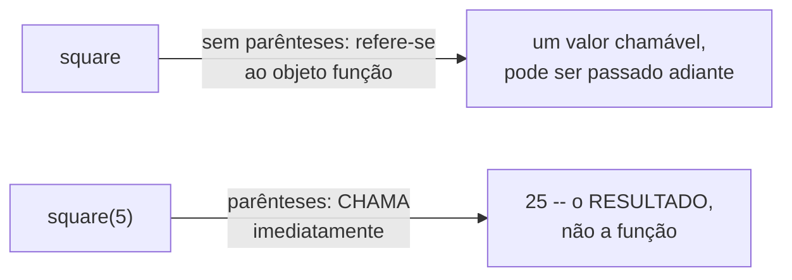

## Objetivos de Aprendizagem

- Explicar o que significa, concretamente, uma função ser um "objeto de primeira classe" no modelo de dados do Python.
- Distinguir referir-se a uma função (`square`) de chamá-la (`square()`), e prever a consequência de confundir as duas coisas.
- Implementar código que passa uma função como argumento para outra função, e que armazena funções numa estrutura de dados.
- Escrever funções curtas de expressão única usando `lambda` e identificar quando um `lambda` deveria ser substituído por um `def` completo.
- Comparar as trocas de legibilidade entre passar funções adiante versus escrever a lógica equivalente inline.

## Contexto e Motivação

Todo valor discutido até agora (um número, uma string, uma lista) tem sido algo com que um programa calcula. Funções têm sido a ferramenta usada para fazer esse cálculo, sentada um nível acima dos próprios dados. O modelo de dados do Python apaga essa distinção quase por completo: uma função criada com `def` é um objeto comum, de um tipo como qualquer outro, e pode ser atribuída a uma variável, armazenada numa lista ou dicionário, passada como argumento, ou retornada de outra função, usando exatamente as mesmas regras que governam todo outro valor na linguagem. Essa propriedade (que funções são valores, não uma categoria separada de coisa) é o que cientistas da computação chamam de "primeira classe", e o modelo de dados do Python é explícito de que `def` não faz nada mais exótico do que vincular um nome a um objeto função, o mesmo ato que `x = 5` realiza para um inteiro.

O ganho prático é enorme, e aparece no momento em que um programa precisa parametrizar *comportamento* em vez de apenas dados. Considere ordenar uma lista de palavras: às vezes você quer ordem alfabética, às vezes por comprimento, às vezes pela última letra. Escrever três funções de ordenação separadas, uma por regra, seria um mau uso da abstração que funções deveriam fornecer. Em vez disso, o `sorted()` embutido do Python recebe a própria regra de comparação como argumento: `sorted(words, key=len)` ordena por comprimento, `sorted(words, key=str.upper)` ordena sem diferenciar maiúsculas de minúsculas, sem que `sorted` jamais precise saber de antemão qual regra você vai querer. Isso só é possível porque uma função (`len`, `str.upper`, ou qualquer outra) pode ser entregue a outra função exatamente como um número ou uma string podem.

Essa ideia remonta diretamente ao material do próprio tutorial de fluxo de controle do Python e à sua referência do modelo de dados, ambos destacando funções-como-objetos como um conceito distinto que vale a pena mencionar, em vez de algo que "simplesmente acontece" de funcionar. Vale a pena levar isso a sério exatamente por esse motivo: muitas linguagens *de fato* traçam uma fronteira rígida entre "coisas com as quais você calcula" e "código que calcula", e a decisão do Python de não fazer isso é uma escolha de design deliberada com consequências reais para como código Python idiomático é escrito: ordenação, filtragem, callbacks e decoradores todos se apoiam nesta mesma propriedade subjacente.

## Teoria Central

### Um objeto função é criado uma vez, no `def`

Quando o Python executa uma instrução `def`, ele faz duas coisas: constrói um objeto função (código compilado mais algum controle interno), e vincula um nome a esse objeto no escopo atual, o exato mesmo processo de dois passos que `x = 5` realiza para um objeto `int`. Nada relacionado a chamar a função aconteceu ainda; `def square(x): return x * x` sozinho não produz saída nenhuma e não faz aritmética alguma. É só o ato posterior de *chamar*, `square(5)`, que executa o código dentro.

```python
def square(x):
    return x * x

operation = square        # vincula OUTRO nome ao MESMO objeto função
print(operation is square)  # True -- mesmo objeto, dois nomes
print(operation(5))         # 25 -- chamar por qualquer um dos nomes funciona identicamente
```

### Referir-se a uma função versus chamá-la

A distinção sintática mais importante deste conceito inteiro é a presença ou ausência de parênteses. `square` se refere ao próprio objeto função. `square()` (ou `square(5)`) a *chama*, e a expressão resultante se refere ao que quer que aquela chamada tenha retornado, não à função.



Isso é exatamente o que torna possível passar uma função como argumento, e exatamente o que torna possível um erro específico e muito comum também:

```python
def apply_twice(f, x):
    return f(f(x))

apply_twice(square, 3)     # correto: passa a FUNÇÃO -- square(square(3)) = 81
apply_twice(square(3), 3)  # errado: passa 9 (o RESULTADO de square(3)) como primeiro argumento
                            # -- trava: TypeError: 'int' object is not callable
```

`apply_twice(square, 3)` entrega a `apply_twice` a própria função, que ela depois chama duas vezes internamente. `apply_twice(square(3), 3)` avalia `square(3)` *antes* mesmo de a chamada a `apply_twice` acontecer, produzindo `9`, então tenta passar `9` no lugar destinado a um chamável, e a falha aparece como `'int' object is not callable`, uma mensagem que só faz sentido uma vez que você conhece a diferença entre referir-se a uma função e chamá-la.

### Funções como elementos de estruturas de dados comuns

Como uma função é apenas um objeto, ela pode viver dentro de uma lista, um dicionário, ou qualquer outro container, exatamente como um `int` ou uma `str` poderiam:

```python
def add(a, b):
    return a + b

def subtract(a, b):
    return a - b

operations = {"add": add, "sub": subtract}
choice = input("add or sub? ")
result = operations[choice](3, 4)   # busca a função, depois a chama
```

`operations[choice]` recupera um objeto função do dicionário; o `(3, 4)` seguinte é um segundo passo separado que chama o que quer que tenha sido recuperado. Esse padrão (despachar para um comportamento diferente buscando uma função numa tabela em vez de escrever uma longa cadeia `if/elif`) é uma consequência direta e prática de funções serem valores comuns.

### `lambda`: uma função escrita como uma única expressão

Para uma função pequena usada exatamente uma vez, bem onde é necessária, escrever um `def` completo mais um nome que só vai ser referenciado uma vez pode ser mais cerimônia do que a lógica merece. `lambda` cria um objeto função inline, sem nenhum dos dois:

```python
key_function = lambda x: abs(x)
sorted([3, -2, 5, -1], key=lambda x: abs(x))    # [-1, -2, 3, 5] -- ordenado por valor absoluto
```

`lambda x: abs(x)` e `def key_function(x): return abs(x)` produzem objetos função equivalentes: a única diferença é que a forma `lambda` não tem nome próprio (é uma função anônima) e é restrita a uma *única expressão*, sem instruções e sem múltiplas linhas permitidas dentro dela. Essa restrição não é uma deficiência para contornar; é precisamente o que mantém `lambda` adequado apenas a lógica pequena e descartável, e precisamente por que recorrer a ele para forçar lógica de múltiplos passos numa única expressão tende a tornar o código mais difícil, não mais fácil, de ler.

## Exemplos Resolvidos

**Exemplo 1: substituindo um despachante `if/elif` por uma tabela de busca de funções.** Suponha que uma pequena calculadora precise aplicar uma de quatro operações com base numa string que o usuário digitou. Uma primeira versão ingênua:

```python
def calculate(op, a, b):
    if op == "add":
        return a + b
    elif op == "sub":
        return a - b
    elif op == "mul":
        return a * b
    elif op == "div":
        return a / b
```

Isso funciona, mas toda nova operação significa mais um ramo `elif`, e a lógica de "qual operação" e "o que cada operação calcula" ficam emaranhadas. Usar funções como valores separa as duas preocupações:

```python
def add(a, b): return a + b
def sub(a, b): return a - b
def mul(a, b): return a * b
def div(a, b): return a / b

operations = {"add": add, "sub": sub, "mul": mul, "div": div}

def calculate(op, a, b):
    return operations[op](a, b)

calculate("mul", 6, 7)   # 42
```

`calculate` não precisa mais saber nada sobre o que cada operação *faz*: ela só busca a função certa pelo nome e a chama. Adicionar uma quinta operação significa adicionar uma entrada de dicionário, não mais um ramo `elif`; o próprio despachante nunca muda.

**Exemplo 2: ordenando com uma função `key`, construída passo a passo.** Dada uma lista de tuplas `(name, score)`, ordene por pontuação, a mais alta primeiro.

Passo 1: ordenar sem uma chave usa a ordenação natural de cada tupla (primeiro elemento, depois o segundo, como desempate), que *não* é o que se quer aqui:

```python
students = [("Ada", 92), ("Ben", 88), ("Cid", 95)]
sorted(students)   # ordena pelo nome primeiro -- errado para este problema
```

Passo 2: forneça uma função `key` que extrai só a pontuação de cada tupla:

```python
def get_score(pair):
    return pair[1]

sorted(students, key=get_score)   # crescente por pontuação
```

Passo 3: inverta, e substitua a função nomeada por um `lambda` equivalente, já que a lógica é uma única expressão usada exatamente uma vez:

```python
sorted(students, key=lambda pair: pair[1], reverse=True)
# [("Cid", 95), ("Ada", 92), ("Ben", 88)]
```

O `lambda` e a anterior função `get_score` são funcionalmente idênticos: `sorted` chama qualquer chamável que lhe seja entregue, uma vez por elemento, exatamente da mesma forma independentemente de qual forma foi usada para escrevê-lo.

**Exemplo 3: uma função que retorna uma função.** Uma "fábrica de multiplicadores" produz uma nova função, especializada para um fator específico, a cada chamada:

```python
def make_multiplier(factor):
    def multiply(x):
        return x * factor
    return multiply          # retorna uma FUNÇÃO, não um número

double = make_multiplier(2)
triple = make_multiplier(3)

print(double(5))   # 10
print(triple(5))   # 15
print(double is triple)   # False -- dois objetos função distintos
```

Cada chamada a `make_multiplier` cria e retorna um objeto função totalmente novo, e essa função "lembra" o `factor` com que foi construída. `double` e `triple` são objetos genuinamente diferentes: chamar `make_multiplier` duas vezes não reutiliza a mesma função, do jeito que um argumento padrão mutável reutilizaria a mesma lista. Isso é uma consequência direta de funções serem objetos comuns e recém-criáveis, em vez de algo embutido de uma vez no código-fonte.

## Equívocos Comuns e Armadilhas

- **"`square` e `square()` significam a mesma coisa, só escritas de forma diferente."** Não significam: `square` é uma referência a um objeto chamável, `square()` é uma chamada que se avalia para o que quer que aquele objeto retorne. Passar `square()` onde o código esperava um chamável produz um `TypeError` no ponto em que aquele valor é chamado depois, o que pode ser confuso porque o erro real aconteceu antes, no ponto em que foi passado.

  ```python
  def run(f):
      return f()

  run(square(5))   # trava: TypeError: 'int' object is not callable
                     # (square(5) já foi avaliado como 25 antes de run() sequer ser chamada)
  ```

- **"`lambda` é só uma forma mais curta de escrever qualquer função."** Corpos de `lambda` são restritos a uma única expressão: sem instruções `if`, sem laços, sem múltiplas linhas. Código que tenta espremer lógica de múltiplos passos num `lambda` (frequentemente via expressões ternárias aninhadas ou truques booleanos encadeados) costuma ser menos legível que o `def` equivalente de três linhas, não mais. A restrição é um sinal de quando `lambda` é a ferramenta errada, não um obstáculo para contornar.

- **"Atribuir uma função a um novo nome a copia."** `operation = square` não cria uma segunda função independente: cria um segundo nome vinculado ao *mesmo* objeto função, exatamente como `b = a` para uma lista cria um alias, não uma cópia. `operation is square` avalia como `True` exatamente por esse motivo.

- **"Passar funções adiante torna o código mais difícil de acompanhar, então deveria ser evitado."** É verdade que traçar qual função de fato vai executar num dado ponto de chamada às vezes exige seguir uma variável de volta até onde foi atribuída pela última vez; isso é um custo genuíno. Mas a alternativa (uma longa cadeia `if/elif` codificando cada caso, ou funções quase idênticas duplicadas para cada variação) costuma custar mais no longo prazo. A conclusão certa não é evitar o padrão, mas nomear as variáveis que guardam funções com clareza suficiente para que rastreá-las continue fácil.

## Resumo

O modelo de dados do Python trata uma função criada por `def` como um objeto comum: `def` a constrói uma vez e vincula um nome a ela, os mesmos dois passos que `x = 5` realiza para um inteiro, que é o que "primeira classe" significa na prática. Isso permite que uma função seja armazenada numa variável, colocada dentro de uma lista ou dicionário, passada como argumento para outra função, ou retornada de uma, habilitando padrões como tabelas de despacho e `sorted(..., key=...)` que de outra forma exigiriam codificar cada caso à mão. A sintaxe que faz toda a diferença é a presença de parênteses: um nome puro se refere à função, enquanto adicionar `()` a chama e se refere ao seu resultado em vez disso; confundir os dois é o erro mais comum nessa área. `lambda` fornece uma forma de escrever pequenas funções de expressão única inline, ao custo de não conseguir expressar nada além de uma expressão, que é precisamente por que ele pertence apenas a lógica pequena e descartável, e não a nada que exija múltiplos passos.

## Documentation Links

- [Python Data Model](https://docs.python.org/3/reference/datamodel.html) (doc)
- [Python Tutorial: More Control Flow Tools](https://docs.python.org/3/tutorial/controlflow.html) (doc)
