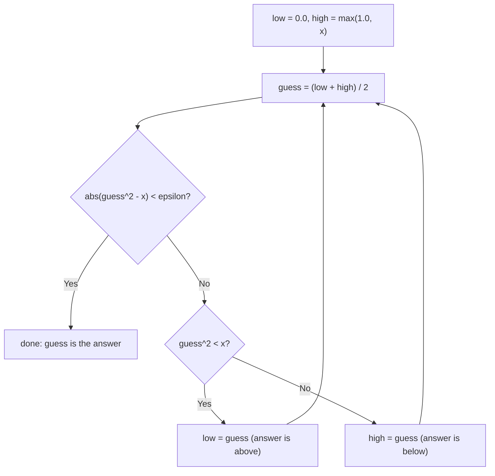

## Learning Objectives

- Explain why some equations (like finding an arbitrary square root) have no closed-form solution and require successive approximation instead.
- Implement exhaustive guess-and-check for a simple root-finding problem, and identify why it becomes impractical as the search space grows.
- Implement bisection search over an ordered search space, using a midpoint and a shrinking `low`/`high` bound.
- Predict, given a search space size, roughly how many steps bisection search needs, and contrast that with exhaustive guess-and-check on the same space.
- Identify the precondition bisection search depends on (an ordered space with a "too high / too low" direction) and recognize when a problem does not satisfy it.

## Context & Motivation

Every equation solved so far in this course has had a direct, mechanical way to compute the answer: add the numbers, multiply them, plug them into a formula. But not every equation you might want to solve has a formula like that at all. Finding the square root of an arbitrary number, or more generally finding a value `x` that makes some equation `f(x) = 0` true, often has no closed-form expression you can just type in — no sequence of `+`, `-`, `*`, `/` that hands you the exact answer directly. This is not a limitation of Python; it is a mathematical fact about certain classes of equations, and it is exactly the situation MIT's 6.100L uses to introduce a different way of solving problems entirely: not by computing the answer directly, but by *approaching* it — starting with a guess, checking how good that guess is, and using what the check reveals to make a better guess, repeating until the guess is close enough to trust.

This is a genuine shift in how you think about "solving" something. Until now, computing an answer has meant deriving it in one shot. Successive approximation instead treats solving as a loop: guess, check, adjust, repeat — and the previous concept in this track, floating-point and approximation, is the reason this loop has to stop on a *tolerance* rather than on exact equality; a search that waits for `guess == target` may never terminate, because arithmetic on floats essentially never lands on a target value exactly.

The two techniques covered here sit at opposite ends of a spectrum of cleverness for the exact same kind of problem. Exhaustive guess-and-check is the "brute force" end: try every candidate, in order, starting from the most obvious one, and stop the moment one works. It is almost embarrassingly simple to write and to convince yourself is correct — and it is often good enough. Bisection search is the "use what you know about the structure of the problem" end: if the candidates are ordered and checking a candidate tells you which *direction* the right answer lies, you don't need to try every candidate one at a time — you can eliminate half of the remaining possibilities with a single check. This is the first real encounter, in this track, with an idea that becomes central once Big-O and asymptotic complexity are introduced later: two algorithms that solve the identical problem can differ enormously in how much work they do, and that difference is not about one being "more correct" than the other — both get the right answer — but about how that work scales as the problem gets larger.

## Core Theory

### Exhaustive guess-and-check

The most direct way to find an (integer) square root of `x` by successive approximation is to simply try every non-negative integer, starting from `0`, until one squares to at least `x`:

```python
x = 25
guess = 0
while guess * guess < x:
    guess += 1

if guess * guess == x:
    print(guess, "is the square root of", x)
else:
    print(x, "has no exact integer square root")
```

This works, and it is easy to convince yourself it's correct: the loop stops the instant `guess * guess` reaches or exceeds `x`, and since `guess` climbs by exactly `1` each time starting from `0`, it cannot skip over the correct answer. But its simplicity comes at a direct cost in the number of steps needed: finding the integer square root of `1,000,000` this way takes on the order of `1,000` guesses, moving one integer at a time. For that particular case it's still fast in absolute terms on a modern machine — but the *pattern* of "one candidate per step, starting from the smallest," scales linearly with how large the answer turns out to be, and for some problems that linear growth is genuinely too slow.

### Bisection search: using order to eliminate half the space at once

Bisection search exploits a structural fact that exhaustive guess-and-check ignores entirely: the candidates are **ordered**, and checking any one candidate reveals which *half* of the remaining space the answer must be in. Instead of walking through `0, 1, 2, 3, ...` one at a time, bisection search keeps a `low` and `high` bound around where the answer must lie, always checks the *midpoint* of that range, and narrows the range by half based on whether the midpoint was too high or too low:

```python
x = 25
epsilon = 0.01
low = 0.0
high = max(1.0, x)
guess = (low + high) / 2

while abs(guess ** 2 - x) >= epsilon:
    if guess ** 2 < x:
        low = guess           # answer is in the upper half
    else:
        high = guess          # answer is in the lower half
    guess = (low + high) / 2

print(guess)   # approximately 5.0
```

Two details here are easy to skim past but essential. First, the loop condition is `abs(guess ** 2 - x) >= epsilon`, not `guess ** 2 != x` — this is the floating-point lesson made concrete: `guess ** 2` will almost never land on `x` exactly once `guess` is a float, so the loop has to stop when the guess is *close enough*, using the same tolerance-comparison pattern from the floating-point-and-approximation concept. Second, notice that every iteration cuts the size of the remaining range `(high - low)` exactly in half, regardless of how large the original range was — which is the entire source of bisection search's advantage.



### Why halving beats counting one at a time

The practical payoff of "cut the range in half every step" versus "move one step at a time" is dramatic, and it's worth seeing the arithmetic directly rather than taking it on faith. If the initial range has size `N`, exhaustive guess-and-check may need on the order of `N` checks in the worst case. Bisection search needs only as many checks as it takes to halve `N` down to a range smaller than the tolerance — and halving shrinks a range so fast that the count of steps needed is proportional to `log2(N)`, not `N` itself:

| Initial range size `N` | Exhaustive guess-and-check (steps, roughly `N`) | Bisection search (steps, roughly `log2(N)`) |
|---|---|---|
| 1,000 | ~1,000 | ~10 |
| 1,000,000 | ~1,000,000 | ~20 |
| 1,000,000,000 | ~1,000,000,000 | ~30 |

Doubling the size of the search space costs exhaustive guess-and-check roughly *double* the work; it costs bisection search only **one more step**. This is the same reduction in growth rate that Big-O and asymptotic complexity, later in this track, gives a formal vocabulary for — but the intuition for why it matters is entirely visible here already, without needing that vocabulary yet.

## Worked Examples

**Example 1 — tracing bisection search by hand for a small case.** Find the square root of `16` using the bisection search code above, tracing `low`, `high`, and `guess` by hand:

| Step | `low` | `high` | `guess` | `guess**2` | Compare to `x = 16` |
|---|---|---|---|---|---|
| start | 0.0 | 16.0 | 8.0 | 64.0 | too high → `high = 8.0` |
| 1 | 0.0 | 8.0 | 4.0 | 16.0 | within `epsilon` of 16 → stop |

Two steps, and the loop already lands within tolerance of the exact answer (`4.0`). Compare this to exhaustive guess-and-check on the same `x = 16`, incrementing by `1` from `0`: it takes four steps (`0, 1, 2, 3, 4`) to reach `guess = 4`, which happens to be small too, since `16` is a small number — the gap between the two techniques only becomes dramatic once `x` is large, exactly as the table in Core Theory shows.

**Example 2 — recognizing when bisection search's precondition fails.** Suppose you want to find which value in an *unsorted* list `[42, 7, 99, 3, 61]` equals some target, say `61`. Applying the bisection pattern — check the middle element, decide whether to search "above" or "below" based on whether it was too big or too small — makes no sense here, because the list isn't ordered: the middle element, `99`, is bigger than the target `61`, but the actual target is sitting at index `4`, not anywhere in a "lower half" that a bisection step would correctly identify. The precondition bisection search needs is not just "there are many candidates" — it specifically needs an **ordered space** where checking one candidate reliably tells you which direction the answer lies. Sorting the list first (`[3, 7, 42, 61, 99]`) restores that precondition, and *then* a bisection-style search over the sorted list works correctly — this is exactly the binary search algorithm that reappears constantly once real data structures are introduced later in a computer science curriculum.

**Example 3 — choosing `epsilon` and seeing the consequence of choosing it badly.** Using the bisection search code from Core Theory to find the square root of `2`, compare three tolerances:

```python
def bisection_sqrt(x, epsilon):
    low, high = 0.0, max(1.0, x)
    guess = (low + high) / 2
    steps = 0
    while abs(guess ** 2 - x) >= epsilon:
        if guess ** 2 < x:
            low = guess
        else:
            high = guess
        guess = (low + high) / 2
        steps += 1
    return guess, steps

print(bisection_sqrt(2, 1e-2))    # coarse: fewer steps, less precise
print(bisection_sqrt(2, 1e-12))   # tight: many more steps, far more precise
```

Running this shows the trade-off directly: the coarse tolerance (`1e-2`) converges in only a handful of steps but returns a `guess` that's only accurate to about two decimal places; the tight tolerance (`1e-12`) takes noticeably more steps (bisection search still needs roughly `log2` of the ratio between the initial range and the tolerance) but returns a value accurate to about twelve decimal places. Neither choice of `epsilon` is "correct" in the abstract — a physics simulation might need the tight tolerance, while a rough estimate for a user-facing display might not — which is exactly why choosing `epsilon` is a design decision made deliberately for the problem at hand, not a constant copied unchanged from one program to the next.

## Common Misconceptions & Pitfalls

- **"Bisection search is just a faster version of guess-and-check, so it can replace it everywhere."** Bisection search is only valid when the search space is ordered *and* checking a candidate reveals which direction the answer lies — both conditions at once. Example 2 above shows a case (an unsorted list) where the second condition fails outright: checking the middle element does not tell you a reliable "search left" or "search right" direction unless the underlying data is actually sorted first.
- **"Since bisection search converges quickly, any `epsilon` works fine."** As Worked Example 3 shows, a tolerance that's too coarse for the problem at hand returns an answer that's technically "close enough" by the loop's own definition but not precise enough for what the answer will actually be used for. Choosing `epsilon` too small, meanwhile, can make the loop run many more iterations than needed for no practical benefit, or in rare cases risk never converging at all if floating-point rounding prevents `abs(guess ** 2 - x)` from ever dropping below an extremely tight threshold.
- **"Exhaustive guess-and-check is obsolete now that bisection search exists."** For a genuinely small search space, exhaustive guess-and-check is simpler to write, simpler to verify by inspection, and has no precondition about ordering to worry about at all. Reaching for bisection search on a range of ten candidates adds real complexity (tracking `low`, `high`, and the midpoint update logic) for savings that only start to matter once the range is large — this is a case where the "obviously more clever" algorithm is not automatically the better engineering choice.
- **"The loop in bisection search always converges to the exact mathematical answer."** It converges to a value *within `epsilon`* of the answer to whatever precision the arithmetic and the chosen tolerance allow — not the exact real-number answer. For irrational answers (like the true square root of `2`), no floating-point value is ever exactly correct in the first place; the loop is finding the best approximation the chosen `epsilon` permits, which is a subtly different (and more accurate) way to describe what "converges" means here.

## Summary

When an equation has no closed-form solution — as with finding an arbitrary square root — successive approximation solves it instead: start with a guess, check it, and refine it, stopping once the guess is within an acceptable tolerance rather than waiting for exact equality, which floating-point arithmetic may never deliver. Exhaustive guess-and-check tries every candidate in order and is simple to write and verify, but the number of steps it needs grows directly with the size of the search space. Bisection search instead exploits an ordered search space where checking a candidate reveals a "too high" or "too low" direction, halving the remaining range on every step — a strategy that needs only on the order of `log2` of the range's size, dramatically fewer steps than exhaustive search once that range is large. Bisection search's power depends entirely on its precondition (order, plus a directional check) actually holding for the problem at hand; when it doesn't, the technique simply doesn't apply, no matter how appealing the speedup would be.

## Documentation Links

- [MIT 6.100L — Materials by Lecture](https://ocw.mit.edu/courses/6-100l-introduction-to-cs-and-programming-using-python-fall-2022/pages/material-by-lecture/) — doc
- [MIT 6.100L — Syllabus](https://ocw.mit.edu/courses/6-100l-introduction-to-cs-and-programming-using-python-fall-2022/pages/syllabus/) — doc
