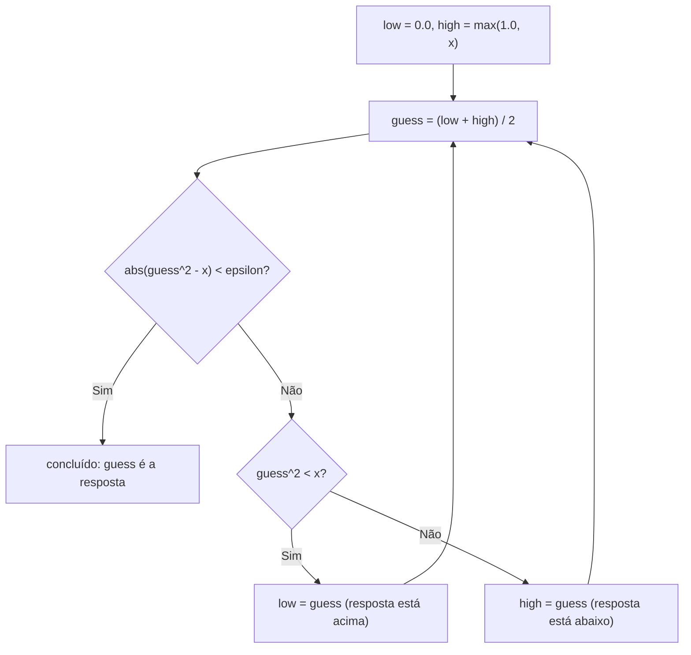

## Objetivos de Aprendizagem

- Explicar por que algumas equações (como encontrar uma raiz quadrada arbitrária) não têm solução em forma fechada e exigem aproximação sucessiva em vez disso.
- Implementar guess-and-check exaustivo para um problema simples de busca de raiz, e identificar por que ele se torna impraticável conforme o espaço de busca cresce.
- Implementar busca por bisseção sobre um espaço de busca ordenado, usando um ponto médio e limites `low`/`high` que encolhem.
- Prever, dado o tamanho de um espaço de busca, aproximadamente quantos passos a busca por bisseção precisa, e contrastar isso com guess-and-check exaustivo no mesmo espaço.
- Identificar a pré-condição de que a busca por bisseção depende (um espaço ordenado com uma direção de "muito alto / muito baixo") e reconhecer quando um problema não a satisfaz.

## Contexto e Motivação

Toda equação resolvida até agora neste curso teve uma forma direta e mecânica de calcular a resposta: some os números, multiplique-os, insira-os numa fórmula. Mas nem toda equação que você pode querer resolver tem uma fórmula assim. Encontrar a raiz quadrada de um número arbitrário, ou mais geralmente encontrar um valor `x` que torne alguma equação `f(x) = 0` verdadeira, frequentemente não tem expressão em forma fechada que você simplesmente digita: nenhuma sequência de `+`, `-`, `*`, `/` que entrega a resposta exata diretamente. Isso não é uma limitação do Python; é um fato matemático sobre certas classes de equações, e é exatamente a situação que o 6.100L do MIT usa para apresentar uma forma inteiramente diferente de resolver problemas: não calculando a resposta diretamente, mas *se aproximando* dela, começando com um palpite, checando quão bom esse palpite é, e usando o que a checagem revela para fazer um palpite melhor, repetindo até o palpite estar perto o suficiente para confiar.

Essa é uma mudança genuína em como você pensa sobre "resolver" algo. Até agora, calcular uma resposta significou derivá-la de uma vez. A aproximação sucessiva, em vez disso, trata resolver como um laço: chute, checa, ajusta, repete; e o conceito anterior nesta trilha, ponto flutuante e aproximação, é a razão pela qual esse laço precisa parar numa *tolerância* em vez de igualdade exata: uma busca que espera por `guess == target` pode nunca terminar, porque a aritmética com floats essencialmente nunca cai exatamente num valor alvo.

As duas técnicas cobertas aqui ficam em extremos opostos de um espectro de esperteza para exatamente o mesmo tipo de problema. Guess-and-check exaustivo é o extremo de "força bruta": tente cada candidato, em ordem, começando pelo mais óbvio, e pare no instante em que um funcionar. É quase embaraçosamente simples de escrever e de se convencer que está correto, e frequentemente já é bom o suficiente. A busca por bisseção é o extremo de "use o que você sabe sobre a estrutura do problema": se os candidatos estão ordenados e checar um candidato diz a você em que *direção* a resposta certa está, você não precisa tentar cada candidato um por um: você pode eliminar metade das possibilidades restantes com uma única checagem. Este é o primeiro encontro real, nesta trilha, com uma ideia que se torna central quando Big-O e complexidade assintótica forem apresentados mais adiante: dois algoritmos que resolvem o mesmo problema idêntico podem diferir enormemente em quanto trabalho fazem, e essa diferença não é sobre um estar "mais correto" que o outro (os dois chegam na resposta certa), mas sobre como esse trabalho escala conforme o problema fica maior.

## Teoria Central

### Guess-and-check exaustivo

A forma mais direta de encontrar uma raiz quadrada (inteira) de `x` por aproximação sucessiva é simplesmente tentar todo inteiro não negativo, começando de `0`, até que algum eleve ao quadrado para pelo menos `x`:

```python
x = 25
guess = 0
while guess * guess < x:
    guess += 1

if guess * guess == x:
    print(guess, "is the square root of", x)
else:
    print(x, "has no exact integer square root")
```

Isso funciona, e é fácil se convencer de que está correto: o laço para no instante em que `guess * guess` alcança ou excede `x`, e como `guess` sobe exatamente `1` cada vez começando de `0`, ele não pode pular a resposta correta. Mas sua simplicidade vem com um custo direto no número de passos necessários: encontrar a raiz quadrada inteira de `1.000.000` desse jeito leva na ordem de `1.000` palpites, avançando um inteiro por vez. Para esse caso particular, ainda é rápido em termos absolutos numa máquina moderna, mas o *padrão* de "um candidato por passo, começando do menor," escala linearmente com o quão grande a resposta acaba sendo, e para alguns problemas esse crescimento linear é genuinamente lento demais.

### Busca por bisseção: usando a ordem para eliminar metade do espaço de uma vez

A busca por bisseção explora um fato estrutural que o guess-and-check exaustivo ignora por completo: os candidatos estão **ordenados**, e checar qualquer candidato revela em qual *metade* do espaço restante a resposta precisa estar. Em vez de percorrer `0, 1, 2, 3, ...` um de cada vez, a busca por bisseção mantém um limite `low` e `high` ao redor de onde a resposta precisa estar, sempre checa o *ponto médio* dessa faixa, e estreita a faixa pela metade com base em se o ponto médio estava alto demais ou baixo demais:

```python
x = 25
epsilon = 0.01
low = 0.0
high = max(1.0, x)
guess = (low + high) / 2

while abs(guess ** 2 - x) >= epsilon:
    if guess ** 2 < x:
        low = guess           # a resposta está na metade superior
    else:
        high = guess          # a resposta está na metade inferior
    guess = (low + high) / 2

print(guess)   # aproximadamente 5.0
```

Dois detalhes aqui são fáceis de passar por cima, mas essenciais. Primeiro, a condição do laço é `abs(guess ** 2 - x) >= epsilon`, não `guess ** 2 != x`: esta é a lição de ponto flutuante feita concreta: `guess ** 2` quase nunca vai cair exatamente em `x` uma vez que `guess` seja um float, então o laço precisa parar quando o palpite estiver *perto o suficiente*, usando o mesmo padrão de comparação por tolerância do conceito de ponto flutuante e aproximação. Segundo, note que toda iteração corta o tamanho da faixa restante `(high - low)` exatamente pela metade, independentemente de quão grande fosse a faixa original: essa é toda a origem da vantagem da busca por bisseção.



### Por que dividir pela metade supera contar um por vez

O ganho prático de "cortar a faixa pela metade a cada passo" versus "avançar um passo por vez" é dramático, e vale a pena ver a aritmética diretamente em vez de aceitá-la por fé. Se a faixa inicial tem tamanho `N`, o guess-and-check exaustivo pode precisar na ordem de `N` checagens no pior caso. A busca por bisseção precisa apenas de tantas checagens quantas forem necessárias para reduzir `N` pela metade até uma faixa menor que a tolerância, e reduzir pela metade encolhe uma faixa tão rápido que a contagem de passos necessários é proporcional a `log2(N)`, não `N` em si:

| Tamanho inicial da faixa `N` | Guess-and-check exaustivo (passos, aproximadamente `N`) | Busca por bisseção (passos, aproximadamente `log2(N)`) |
|---|---|---|
| 1.000 | ~1.000 | ~10 |
| 1.000.000 | ~1.000.000 | ~20 |
| 1.000.000.000 | ~1.000.000.000 | ~30 |

Dobrar o tamanho do espaço de busca custa ao guess-and-check exaustivo aproximadamente o *dobro* do trabalho; custa à busca por bisseção apenas **mais um passo**. Essa é a mesma redução na taxa de crescimento para a qual Big-O e complexidade assintótica, mais adiante nesta trilha, dão um vocabulário formal, mas a intuição de por que isso importa já está inteiramente visível aqui, sem precisar ainda desse vocabulário.

## Exemplos Resolvidos

**Exemplo 1: traçando a busca por bisseção na mão para um caso pequeno.** Encontre a raiz quadrada de `16` usando o código de busca por bisseção acima, traçando `low`, `high` e `guess` na mão:

| Passo | `low` | `high` | `guess` | `guess**2` | Compara com `x = 16` |
|---|---|---|---|---|---|
| início | 0.0 | 16.0 | 8.0 | 64.0 | alto demais → `high = 8.0` |
| 1 | 0.0 | 8.0 | 4.0 | 16.0 | dentro de `epsilon` de 16 → para |

Dois passos, e o laço já cai dentro da tolerância da resposta exata (`4.0`). Compare isso com guess-and-check exaustivo no mesmo `x = 16`, incrementando por `1` a partir de `0`: leva quatro passos (`0, 1, 2, 3, 4`) para alcançar `guess = 4`, que por acaso também é pequeno, já que `16` é um número pequeno: a diferença entre as duas técnicas só se torna dramática quando `x` é grande, exatamente como a tabela na Teoria Central mostra.

**Exemplo 2: reconhecendo quando a pré-condição da busca por bisseção falha.** Suponha que você queira encontrar qual valor numa lista *não ordenada* `[42, 7, 99, 3, 61]` é igual a algum alvo, digamos `61`. Aplicar o padrão de bisseção (checar o elemento do meio, decidir se busca "acima" ou "abaixo" com base em se ele estava grande demais ou pequeno demais) não faz sentido aqui, porque a lista não está ordenada: o elemento do meio, `99`, é maior que o alvo `61`, mas o alvo real está sentado no índice `4`, não em nenhuma "metade inferior" que um passo de bisseção identificaria corretamente. A pré-condição de que a busca por bisseção precisa não é só "há muitos candidatos": ela precisa especificamente de um **espaço ordenado** onde checar um candidato confiavelmente diz a você em que direção a resposta está. Ordenar a lista primeiro (`[3, 7, 42, 61, 99]`) restaura essa pré-condição, e *então* uma busca no estilo bisseção sobre a lista ordenada funciona corretamente: este é exatamente o algoritmo de busca binária que reaparece constantemente quando estruturas de dados reais são apresentadas mais adiante num currículo de ciência da computação.

**Exemplo 3: escolhendo `epsilon` e vendo a consequência de escolhê-lo mal.** Usando o código de busca por bisseção da Teoria Central para encontrar a raiz quadrada de `2`, compare três tolerâncias:

```python
def bisection_sqrt(x, epsilon):
    low, high = 0.0, max(1.0, x)
    guess = (low + high) / 2
    steps = 0
    while abs(guess ** 2 - x) >= epsilon:
        if guess ** 2 < x:
            low = guess
        else:
            high = guess
        guess = (low + high) / 2
        steps += 1
    return guess, steps

print(bisection_sqrt(2, 1e-2))    # grosseiro: menos passos, menos preciso
print(bisection_sqrt(2, 1e-12))   # apertado: muito mais passos, muito mais preciso
```

Rodar isso mostra a troca diretamente: a tolerância grosseira (`1e-2`) converge em apenas um punhado de passos, mas retorna um `guess` preciso a apenas cerca de duas casas decimais; a tolerância apertada (`1e-12`) leva sensivelmente mais passos (a busca por bisseção ainda precisa de aproximadamente `log2` da razão entre a faixa inicial e a tolerância), mas retorna um valor preciso a cerca de doze casas decimais. Nenhuma escolha de `epsilon` é "correta" no abstrato: uma simulação de física pode precisar da tolerância apertada, enquanto uma estimativa aproximada para uma exibição voltada ao usuário pode não precisar, e é exatamente por isso que escolher `epsilon` é uma decisão de design tomada deliberadamente para o problema em questão, não uma constante copiada sem mudança de um programa para o próximo.

## Equívocos Comuns e Armadilhas

- **"A busca por bisseção é só uma versão mais rápida do guess-and-check, então pode substituí-lo em todo lugar."** A busca por bisseção só é válida quando o espaço de busca está ordenado *e* checar um candidato revela em que direção a resposta está: as duas condições ao mesmo tempo. O Exemplo 2 acima mostra um caso (uma lista não ordenada) em que a segunda condição falha completamente: checar o elemento do meio não diz a você uma direção confiável de "buscar à esquerda" ou "buscar à direita" a menos que os dados subjacentes de fato estejam ordenados primeiro.
- **"Como a busca por bisseção converge rapidamente, qualquer `epsilon` funciona bem."** Como o Exemplo Resolvido 3 mostra, uma tolerância grosseira demais para o problema em questão retorna uma resposta que é tecnicamente "perto o suficiente" pela própria definição do laço, mas não precisa o bastante para o que a resposta de fato vai ser usada. Escolher `epsilon` pequeno demais, por outro lado, pode fazer o laço rodar muito mais iterações do que necessário sem benefício prático nenhum, ou, em casos raros, arriscar nunca convergir se o arredondamento de ponto flutuante impedir que `abs(guess ** 2 - x)` algum dia caia abaixo de um limiar extremamente apertado.
- **"O guess-and-check exaustivo está obsoleto agora que existe a busca por bisseção."** Para um espaço de busca genuinamente pequeno, o guess-and-check exaustivo é mais simples de escrever, mais simples de verificar por inspeção, e não tem pré-condição nenhuma de ordenação com que se preocupar. Recorrer à busca por bisseção numa faixa de dez candidatos adiciona complexidade real (controlar `low`, `high`, e a lógica de atualização do ponto médio) por economias que só começam a importar quando a faixa é grande: este é um caso em que o algoritmo "obviamente mais esperto" não é automaticamente a melhor escolha de engenharia.
- **"O laço na busca por bisseção sempre converge para a resposta matemática exata."** Ele converge para um valor *dentro de `epsilon`* da resposta, na precisão que a aritmética e a tolerância escolhida permitem, não a resposta exata em números reais. Para respostas irracionais (como a verdadeira raiz quadrada de `2`), nenhum valor de ponto flutuante é jamais exatamente correto para começar; o laço está encontrando a melhor aproximação que o `epsilon` escolhido permite, o que é uma forma sutilmente diferente (e mais precisa) de descrever o que "converge" significa aqui.

## Resumo

Quando uma equação não tem solução em forma fechada, como encontrar uma raiz quadrada arbitrária, a aproximação sucessiva a resolve em vez disso: comece com um palpite, cheque-o, e refine-o, parando quando o palpite estiver dentro de uma tolerância aceitável em vez de esperar por igualdade exata, que a aritmética de ponto flutuante pode nunca entregar. O guess-and-check exaustivo tenta cada candidato em ordem e é simples de escrever e verificar, mas o número de passos que precisa cresce diretamente com o tamanho do espaço de busca. A busca por bisseção, em vez disso, explora um espaço de busca ordenado onde checar um candidato revela uma direção de "muito alto" ou "muito baixo", cortando pela metade a faixa restante a cada passo: uma estratégia que precisa apenas na ordem de `log2` do tamanho da faixa, dramaticamente menos passos que a busca exaustiva quando essa faixa é grande. O poder da busca por bisseção depende inteiramente de sua pré-condição (ordem, mais uma checagem direcional) de fato valer para o problema em questão; quando não vale, a técnica simplesmente não se aplica, não importa quão atraente seria o ganho de velocidade.

## Documentation Links

- [MIT 6.100L: Materials by Lecture](https://ocw.mit.edu/courses/6-100l-introduction-to-cs-and-programming-using-python-fall-2022/pages/material-by-lecture/) (doc)
- [MIT 6.100L: Syllabus](https://ocw.mit.edu/courses/6-100l-introduction-to-cs-and-programming-using-python-fall-2022/pages/syllabus/) (doc)
