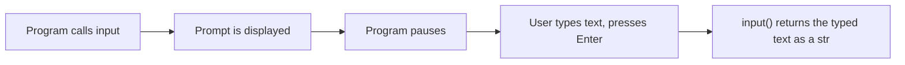

## Learning Objectives

- Explain what `input()` and `print()` do and why together they form the smallest possible feedback loop a program can have.
- State the type `input()` always returns, and predict when a missing conversion causes a bug rather than a crash.
- Convert a string obtained from `input()` to the numeric type a computation actually requires.
- Use `print()`'s `sep` and `end` keyword arguments to control exactly how multiple values are displayed.
- Identify why scattered `print()` calls are a reasonable first debugging tool but not a sufficient long-term one.

## Context & Motivation

A program that computes something but never shows the result, and never accepts anything from the person running it, is nearly useless outside of a classroom exercise — computation only becomes useful once it can talk to the outside world. In Python, that conversation happens through two built-in functions: `input()`, which pauses the program's execution to read a line of text typed by a user, and `print()`, which writes a value out to the screen. Together they form the smallest possible feedback loop available to a program: show something, read a response, show a result — and it is not a coincidence that essentially every introductory programming course, including Harvard's CS50, opens with exactly this loop before introducing any control flow at all. A program that can read one value and print one value is already, in the most minimal sense, a working program; everything this curriculum adds after this lesson — branching, looping, functions — only changes what happens *between* the read and the print, not the basic shape of the interaction.

There is a specific reason this lesson comes right after expressions and assignment rather than before it: `input()` and `print()` are two of the first places a beginner directly experiences Python's type system doing something that is not obviously intuitive. Every value `input()` returns, no matter what a user typed, is a `str` — even if the person typing entered what looks, to a human eye, exactly like a number. Understanding this precisely, rather than discovering it through a confusing bug, is the practical heart of this lesson: reading numeric input safely from a user requires an explicit conversion step, and forgetting it is one of the most common early mistakes in any first programming course, because the resulting bug does not look like an error at all — it looks like a wrong answer.

## Core Theory

### Reading input and printing output

```python
name = input("What's your name? ")   # pauses, shows the prompt, waits for Enter
print("Hello,", name)                 # writes "Hello, <name>" to the screen
```

`input()` accomplishes three things in a single call: it displays whatever string is passed as its argument (the prompt) without a trailing newline, it suspends the program until the user types something and presses Enter, and it returns everything the user typed — with the trailing newline from pressing Enter already stripped off — as a value. That returned value is *always* a `str`, regardless of what the text looks like:

```python
raw = input("Age? ")   # user types: 16
type(raw)               # <class 'str'>
raw == "16"             # True — it is the three-character string "16"
raw == 16                # False — it is not the integer 16
```

This is the single most important fact about `input()`, and it is the source of the majority of bugs beginners encounter around it, walked through fully below.



### From text to a usable number

Because `input()` always hands back a `str`, using the result in a numeric computation requires an explicit conversion — Python will not silently guess that a string "looks like" a number and treat it as one:

```python
age_text = input("Age? ")     # e.g. user types "16" — age_text is the str "16"
age = int(age_text)            # explicit conversion: age is now the int 16
print("Next year you'll be", age + 1)
```

Without that conversion, attempting `age_text + 1` raises an error rather than doing arithmetic, because Python refuses to silently combine a `str` and an `int` with `+`:

```python
age_text + 1
# TypeError: can only concatenate str (not "int") to str
```

The same conversion pattern applies to `float()` when the expected input has a fractional part (`float(input("Price? "))`), and the conversion function itself can raise `ValueError` if the text the user typed cannot be parsed as that type at all — typing `"sixteen"` and calling `int("sixteen")` fails with `ValueError: invalid literal for int() with base 10: 'sixteen'`, a case this lesson only names, since handling it robustly belongs to the later material on exceptions.

### Controlling exactly how `print()` displays values

`print()` accepts any number of positional arguments and, by default, joins them with a single space and ends the whole line with a newline character. Both defaults can be overridden with keyword arguments:

```python
print("a", "b", "c")                # a b c        (default separator: one space)
print("a", "b", "c", sep="-")       # a-b-c        (custom separator)
print("a", "b", "c", sep="")        # abc          (no separator at all)
print("no newline", end="")         # "no newline" with no trailing newline
print("still", "here")               # printed on a fresh line, since the newline above was suppressed only for that one call
```

`sep` and `end` are independent of each other: `sep` controls what appears *between* the arguments of a single `print()` call, and `end` controls what appears *after* all of them, replacing the default trailing newline. A common, deliberate use of `end=""` is building up a single line of output across several `print()` calls, or across a loop, without an unwanted line break appearing between each piece.

## Worked Examples

**Example 1 — Reading two numbers and computing their sum, correctly.** A program should read two numbers from the user and print their sum:

```python
first_text = input("First number: ")
second_text = input("Second number: ")

first = float(first_text)
second = float(second_text)

print("Sum:", first + second)
```

Walking through this: both calls to `input()` return `str` values, regardless of what the user types. Both are explicitly converted with `float()` before any arithmetic is attempted — using `float` rather than `int` here is a deliberate choice, since a "number" prompt with no further constraint should accept a value like `2.5`, not just whole numbers. Only after both conversions succeed does `first + second` perform genuine numeric addition; had the conversions been skipped, `first + second` would instead perform string concatenation, joining the two pieces of text together rather than adding them.

**Example 2 — Formatting a running list of scores on one line.** A program prints a list of scores separated by " | " without a trailing separator, built up across a loop, before printing a final summary:

```python
scores = [88, 92, 79, 95]

for i in range(len(scores)):
    print(scores[i], end="")
    if i < len(scores) - 1:
        print(" | ", end="")

print()   # a bare print() call, with no arguments, just to move to a new line
print("Average:", sum(scores) / len(scores))
```

This prints `88 | 92 | 79 | 95` on one line, followed by `Average: 88.5` on the next. The `end=""` on the score itself suppresses the automatic newline so the next piece can continue the same line; the conditional `" | "` avoids a trailing separator after the last score; the final bare `print()` exists purely to emit the newline that was suppressed throughout the loop, so the "Average" line starts fresh rather than being appended to the scores line.

**Example 3 — Diagnosing a classic missing-conversion bug.** A program is supposed to double whatever number the user enters, but produces a suspicious result:

```python
x = input("Enter a number: ")   # user types "5"
print(x * 2)                     # prints "55", not 10
```

This is exactly the bug caused by never converting `input()`'s return value. `x` is the string `"5"`, and `*` between a `str` and an `int` does not mean multiplication — it means repetition, producing the string `"5"` repeated twice, `"55"`. Note that this is *not* a crash; there is no `TypeError` here, because `str * int` is a perfectly legal operation with a well-defined meaning of its own, just not the meaning the programmer intended. The fix requires the same conversion pattern as Example 1:

```python
x = input("Enter a number: ")
print(int(x) * 2)   # prints 10
```

This particular bug is a good illustration of why forgetting the conversion is more dangerous than it first appears: it does not always raise an error, which means it can pass silently unless the output is checked carefully against what was expected.

## Common Misconceptions & Pitfalls

- **"If the user types a number, `input()` gives me back a number."** It never does — `input()` always returns a `str`, and the type of the text the user happened to type is irrelevant. The string `"42"` and the integer `42` are different values of different types in Python, and only an explicit call to `int()` or `float()` bridges between them.
- **"A missing type conversion will crash the program, so I'll notice right away."** Often it will not crash at all, as the `x * 2` example shows — `str * int` is legal and does something, just not the intended arithmetic. The bug manifests as a plausible-looking wrong answer, not an error message, which makes it considerably easier to miss during casual testing.
- **"Putting the prompt text inside `input()` versus printing it separately are functionally different."** They are functionally equivalent — `input("Age? ")` and writing `print("Age? ", end=""); input()` produce the same visible prompt. The difference is purely stylistic: passing the prompt to `input()` is more compact, while a separate `print()` before an argument-less `input()` can read more clearly when several prompts are chained together.
- **"`print()`'s default separator and line ending are the only options, so formatting output precisely requires string concatenation instead."** `sep` and `end` exist specifically so this is not necessary — as shown in the running-scores example, both defaults can be overridden directly in the `print()` call, without building a single pre-formatted string by hand first.
- **"Scattered `print()` calls are a fine way to debug any program, no matter how large."** They are a reasonable and honest first tool — and this lesson uses them that way — but they do not scale: a program with many interacting parts needs a systematic process for isolating where a computation goes wrong, which is the subject of the later lesson on testing and debugging, rather than an ever-growing pile of temporary `print()` statements.

## Summary

`input()` and `print()` together form the minimal feedback loop every interactive program is built from: read a response, show a result. The single fact that governs nearly every bug beginners hit around `input()` is that it always returns a `str`, regardless of what the user typed, which means any numeric use of that value requires an explicit, deliberate conversion with `int()` or `float()` — and forgetting that conversion frequently does not crash the program at all, it just silently computes the wrong thing, as with string repetition standing in for multiplication. `print()` offers real control over its output through the `sep` and `end` keyword arguments, letting a program format multiple values on one line, or across several calls, without manual string-building. Print-based debugging is a legitimate first tool for exactly the reason this lesson introduces it early, but it is deliberately a starting point, not the destination — a systematic approach to isolating bugs is covered once programs grow past what a handful of print statements can usefully illuminate.

## Documentation Links

- [Python Built-in Functions](https://docs.python.org/3/library/functions.html) — doc
- [CS50x 2025 — Weeks](https://cs50.harvard.edu/x/2025/weeks/) — doc
