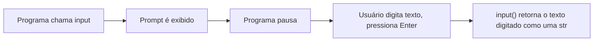

## Objetivos de Aprendizagem

- Explicar o que `input()` e `print()` fazem e por que, juntas, formam o menor loop de feedback possível que um programa pode ter.
- Indicar o tipo que `input()` sempre retorna, e prever quando a falta de uma conversão causa um bug em vez de um erro de execução.
- Converter uma string obtida de `input()` para o tipo numérico que um cálculo realmente exige.
- Usar os argumentos nomeados `sep` e `end` de `print()` para controlar exatamente como múltiplos valores são exibidos.
- Identificar por que chamadas espalhadas de `print()` são uma ferramenta de depuração inicial razoável, mas não suficiente a longo prazo.

## Contexto e Motivação

Um programa que calcula algo, mas nunca mostra o resultado, e nunca aceita nada de quem o está executando, é praticamente inútil fora de um exercício de sala de aula: computação só se torna útil quando pode conversar com o mundo externo. Em Python, essa conversa acontece por meio de duas funções embutidas: `input()`, que pausa a execução do programa para ler uma linha de texto digitada por um usuário, e `print()`, que escreve um valor na tela. Juntas, elas formam o menor loop de feedback possível disponível a um programa: mostrar algo, ler uma resposta, mostrar um resultado. E não é coincidência que praticamente todo curso introdutório de programação, incluindo o CS50 de Harvard, comece exatamente com esse loop antes de introduzir qualquer fluxo de controle. Um programa que consegue ler um valor e imprimir um valor já é, no sentido mais mínimo, um programa funcional; tudo o que este currículo acrescenta depois desta lição (ramificação, repetição, funções) só muda o que acontece *entre* a leitura e a impressão, não a forma básica da interação.

Há um motivo específico para esta lição vir logo depois de expressões e atribuição, e não antes: `input()` e `print()` são dois dos primeiros lugares em que um iniciante experimenta diretamente o sistema de tipos do Python fazendo algo que não é obviamente intuitivo. Todo valor que `input()` retorna, não importa o que o usuário tenha digitado, é uma `str`, mesmo que a pessoa tenha digitado algo que, aos olhos humanos, pareça exatamente um número. Entender isso com precisão, em vez de descobrir por meio de um bug confuso, é o núcleo prático desta lição: ler uma entrada numérica com segurança exige um passo explícito de conversão, e esquecê-lo é um dos erros iniciais mais comuns em qualquer primeiro curso de programação, porque o bug resultante não parece um erro de execução de jeito nenhum: parece uma resposta errada.

## Teoria Central

### Lendo entrada e imprimindo saída

```python
name = input("What's your name? ")   # pausa, mostra o prompt, espera o Enter
print("Hello,", name)                 # escreve "Hello, <name>" na tela
```

`input()` realiza três coisas em uma única chamada: exibe a string passada como argumento (o prompt) sem quebra de linha ao final, suspende o programa até o usuário digitar algo e pressionar Enter, e retorna tudo o que o usuário digitou, já com a quebra de linha do Enter removida, como um valor. Esse valor retornado é *sempre* uma `str`, independentemente da aparência do texto:

```python
raw = input("Age? ")   # usuário digita: 16
type(raw)               # <class 'str'>
raw == "16"             # True: é a string de três caracteres "16"
raw == 16                # False: não é o inteiro 16
```

Esse é o fato mais importante sobre `input()`, e é a origem da maioria dos bugs que iniciantes encontram em torno dela, detalhado por completo a seguir.



### De texto a um número utilizável

Como `input()` sempre devolve uma `str`, usar o resultado em um cálculo numérico exige uma conversão explícita: o Python não vai adivinhar silenciosamente que uma string "parece" um número e tratá-la como tal.

```python
age_text = input("Age? ")     # ex.: usuário digita "16", e age_text é a str "16"
age = int(age_text)            # conversão explícita: age agora é o int 16
print("Next year you'll be", age + 1)
```

Sem essa conversão, tentar `age_text + 1` gera um erro em vez de fazer aritmética, porque o Python se recusa a combinar silenciosamente uma `str` e um `int` com `+`:

```python
age_text + 1
# TypeError: can only concatenate str (not "int") to str
```

O mesmo padrão de conversão se aplica a `float()` quando a entrada esperada tem parte fracionária (`float(input("Price? "))`), e a própria função de conversão pode lançar `ValueError` se o texto digitado pelo usuário não puder ser interpretado como aquele tipo de jeito nenhum: digitar `"sixteen"` e chamar `int("sixteen")` falha com `ValueError: invalid literal for int() with base 10: 'sixteen'`, um caso que esta lição apenas nomeia, já que tratá-lo de forma robusta pertence ao material posterior sobre exceções.

### Controlando exatamente como `print()` exibe valores

`print()` aceita qualquer número de argumentos posicionais e, por padrão, os une com um único espaço e termina a linha toda com um caractere de nova linha. Os dois padrões podem ser sobrescritos com argumentos nomeados:

```python
print("a", "b", "c")                # a b c        (separador padrão: um espaço)
print("a", "b", "c", sep="-")       # a-b-c        (separador customizado)
print("a", "b", "c", sep="")        # abc          (sem separador nenhum)
print("no newline", end="")         # "no newline" sem quebra de linha ao final
print("still", "here")               # impresso em uma linha nova, já que a quebra acima foi suprimida só para aquela chamada
```

`sep` e `end` são independentes um do outro: `sep` controla o que aparece *entre* os argumentos de uma única chamada de `print()`, e `end` controla o que aparece *depois* de todos eles, substituindo a quebra de linha padrão. Um uso comum e deliberado de `end=""` é construir uma única linha de saída ao longo de várias chamadas de `print()`, ou ao longo de um loop, sem que uma quebra de linha indesejada apareça entre cada pedaço.

## Exemplos Resolvidos

**Exemplo 1: Lendo dois números e calculando sua soma, corretamente.** Um programa deve ler dois números do usuário e imprimir sua soma:

```python
first_text = input("First number: ")
second_text = input("Second number: ")

first = float(first_text)
second = float(second_text)

print("Sum:", first + second)
```

Passando por isso: as duas chamadas a `input()` retornam valores `str`, independentemente do que o usuário digite. Ambas são explicitamente convertidas com `float()` antes de qualquer aritmética ser tentada; usar `float` em vez de `int` aqui é uma escolha deliberada, já que um prompt de "número" sem restrição adicional deve aceitar um valor como `2.5`, não apenas números inteiros. Só depois que as duas conversões têm sucesso é que `first + second` realiza uma soma numérica de verdade; se as conversões tivessem sido puladas, `first + second` faria concatenação de strings, juntando os dois pedaços de texto em vez de somá-los.

**Exemplo 2: Formatando uma lista corrente de pontuações em uma linha.** Um programa imprime uma lista de pontuações separadas por " | " sem separador final, construída ao longo de um loop, antes de imprimir um resumo final:

```python
scores = [88, 92, 79, 95]

for i in range(len(scores)):
    print(scores[i], end="")
    if i < len(scores) - 1:
        print(" | ", end="")

print()   # uma chamada print() vazia, sem argumentos, só para pular para uma nova linha
print("Average:", sum(scores) / len(scores))
```

Isso imprime `88 | 92 | 79 | 95` em uma linha, seguido de `Average: 88.5` na próxima. O `end=""` na própria pontuação suprime a quebra de linha automática para que o próximo pedaço continue na mesma linha; o " | " condicional evita um separador sobrando depois da última pontuação; o `print()` final e vazio existe puramente para emitir a quebra de linha que foi suprimida ao longo do loop, de modo que a linha "Average" comece do zero em vez de ser anexada à linha das pontuações.

**Exemplo 3: Diagnosticando um bug clássico de conversão ausente.** Um programa deveria dobrar o número que o usuário digita, mas produz um resultado suspeito:

```python
x = input("Enter a number: ")   # usuário digita "5"
print(x * 2)                     # imprime "55", não 10
```

Esse é exatamente o bug causado por nunca converter o valor de retorno de `input()`. `x` é a string `"5"`, e `*` entre uma `str` e um `int` não significa multiplicação: significa repetição, produzindo a string `"5"` repetida duas vezes, `"55"`. Note que isso *não* é um erro de execução; não há `TypeError` aqui, porque `str * int` é uma operação perfeitamente legal e com um significado próprio bem definido, só que não é o significado que o programador pretendia. A correção exige o mesmo padrão de conversão do Exemplo 1:

```python
x = input("Enter a number: ")
print(int(x) * 2)   # imprime 10
```

Esse bug em particular é uma boa ilustração de por que esquecer a conversão é mais perigoso do que parece à primeira vista: ele nem sempre gera um erro, o que significa que pode passar despercebido, a menos que a saída seja verificada com cuidado contra o que era esperado.

## Equívocos Comuns e Armadilhas

- **"Se o usuário digitar um número, `input()` me devolve um número."** Nunca devolve: `input()` sempre retorna uma `str`, e o tipo do texto que o usuário digitou é irrelevante. A string `"42"` e o inteiro `42` são valores diferentes de tipos diferentes em Python, e só uma chamada explícita a `int()` ou `float()` faz a ponte entre eles.
- **"Uma conversão de tipo ausente vai travar o programa, então eu vou perceber na hora."** Muitas vezes não trava nada, como mostra o exemplo `x * 2`: `str * int` é legal e faz algo, só que não é a aritmética pretendida. O bug se manifesta como uma resposta errada plausível, não como uma mensagem de erro, o que torna consideravelmente mais fácil passar despercebido durante um teste casual.
- **"Colocar o texto do prompt dentro de `input()` versus imprimi-lo separadamente são coisas funcionalmente diferentes."** São funcionalmente equivalentes: `input("Age? ")` e escrever `print("Age? ", end=""); input()` produzem o mesmo prompt visível. A diferença é puramente estilística: passar o prompt para `input()` é mais compacto, enquanto um `print()` separado antes de um `input()` sem argumentos pode ficar mais claro quando vários prompts são encadeados.
- **"O separador e o final de linha padrão de `print()` são as únicas opções, então formatar a saída com precisão exige concatenação de strings."** `sep` e `end` existem justamente para que isso não seja necessário: como mostrado no exemplo das pontuações correntes, os dois padrões podem ser sobrescritos diretamente na chamada de `print()`, sem construir manualmente uma única string pré-formatada primeiro.
- **"Chamadas espalhadas de `print()` são uma boa forma de depurar qualquer programa, não importa o tamanho."** Elas são uma primeira ferramenta razoável e honesta (e esta lição as usa dessa forma), mas não escalam: um programa com muitas partes interagindo precisa de um processo sistemático para isolar onde um cálculo dá errado, tema da lição posterior sobre testes e depuração, em vez de uma pilha cada vez maior de chamadas temporárias de `print()`.

## Resumo

`input()` e `print()` juntas formam o loop de feedback mínimo do qual todo programa interativo é construído: ler uma resposta, mostrar um resultado. O único fato que rege quase todos os bugs que iniciantes encontram em torno de `input()` é que ela sempre retorna uma `str`, independentemente do que o usuário digitou, o que significa que qualquer uso numérico desse valor exige uma conversão explícita e deliberada com `int()` ou `float()`. E esquecer essa conversão frequentemente não trava o programa de jeito nenhum, apenas calcula silenciosamente a coisa errada, como no caso da repetição de string no lugar da multiplicação. `print()` oferece controle real sobre sua saída por meio dos argumentos nomeados `sep` e `end`, permitindo que um programa formate múltiplos valores em uma linha, ou ao longo de várias chamadas, sem construção manual de strings. A depuração baseada em `print()` é uma primeira ferramenta legítima exatamente pelo motivo que esta lição a introduz cedo, mas é deliberadamente um ponto de partida, não o destino: uma abordagem sistemática para isolar bugs é abordada quando os programas crescem além do que um punhado de instruções print consegue esclarecer de forma útil.

## Documentation Links

- [Python Built-in Functions](https://docs.python.org/3/library/functions.html) (doc)
- [CS50x 2025: Semanas do Curso](https://cs50.harvard.edu/x/2025/weeks/) (doc)
