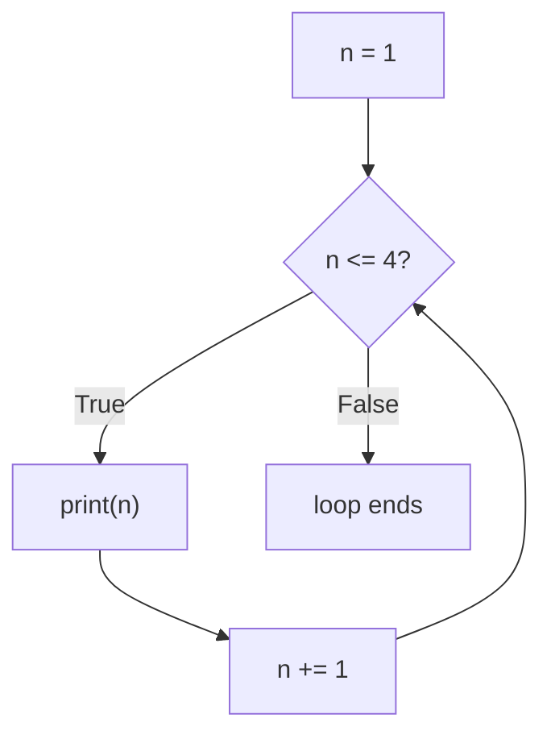

## Learning Objectives

- Explain the difference between a `for` loop iterating over a known sequence and a `while` loop iterating until a condition changes.
- Implement accumulation patterns (running sum, running count, running maximum) using both `for` and `while`.
- State a loop invariant for a simple accumulation loop and use it to argue the loop produces the correct answer for every valid input, not just the one tested.
- Identify the specific coding mistake that produces an infinite `while` loop, and fix it.
- Compare `for` and `while` for a given task and justify which one is the more natural fit.

## Context & Motivation

A conditional lets a program choose between two paths once. Most real computation, though, isn't about choosing once — it's about doing the same kind of step over and over: adding up every price in a shopping cart, checking every character of a password, trying every candidate guess until one works. Without a way to repeat work, every one of those tasks would require writing out one line per item, which is not just tedious but impossible when the number of items isn't known until the program runs. Iteration is the mechanism that lets a handful of lines of code process an arbitrarily large amount of data or run for an arbitrarily large number of steps.

MIT's 6.100L sequences loops immediately after conditionals for a specific reason: a loop's body is, in a sense, just an `if`-like decision — "should I run this block again?" — asked repeatedly rather than once. Seen that way, iteration is not an entirely new idea bolted on top of conditionals; it is conditionals applied again and again, with the twist that each pass through the body can change the state the next check depends on.

But there is a genuinely new intellectual demand that comes with looping, and it's the one this lesson centers on: how do you know a loop that repeats a step twenty times, or two thousand times, or an unknown number of times, actually computes the right answer, rather than merely looking right on the one input you happened to run it on? Testing a loop on a single example proves only that it worked for that example. What is needed instead is a way to reason about *every* iteration at once — and the tool for that is the loop invariant, a statement about the program's state that stays true no matter how many times the loop has run so far. This idea — reasoning about a loop's correctness independent of how many times it happens to execute — is what separates writing a loop that seems to work from actually knowing it does.

## Core Theory

### `for`: iterating over a known sequence

A `for` loop runs its body once for each element of a sequence, in order, with no need to manage a counter by hand:

```python
total = 0
for n in [1, 2, 3, 4]:
    total += n
print(total)   # 10
```

Each pass through the loop binds `n` to the next element of the list — first `1`, then `2`, then `3`, then `4` — and after the last element, the loop simply ends; there is no condition to check, because the sequence itself defines how many times the body runs. `range(n)` is the common way to iterate a fixed number of times without an existing list: `for i in range(4):` runs the body exactly four times, with `i` taking the values `0, 1, 2, 3` in turn.

### `while`: iterating until a condition is false

A `while` loop instead re-checks a boolean condition **before every iteration**, including the very first one, and stops the moment that condition is `False`:

```python
n = 1
while n <= 4:
    print(n)
    n += 1   # without this line, the condition never changes and the loop never ends
```

This is functionally similar to the `for` example above, but the mechanics are different in an important way: nothing about a `while` loop guarantees it will ever stop. A `for` loop over a finite list is guaranteed to terminate — it runs out of elements eventually, by construction. A `while` loop terminates only if *something inside the body* eventually makes the condition `False`. That "something" — here, `n += 1` — is not optional bookkeeping; it is the entire reason the loop is guaranteed to end at all.



### Loop invariants: proving a loop correct instead of hoping

Consider summing the first `n` positive integers with a loop, rather than the closed-form formula `n * (n + 1) / 2`:

```python
total = 0
i = 1
while i <= n:
    total += i
    i += 1
```

A loop invariant is a precise claim about the relationship between the loop's variables that holds *at the start of every single iteration* — before the loop has run at all, and after every subsequent pass through the body. For this loop, the invariant is: **"at the start of each iteration, `total` equals the sum of all integers from 1 up to `i - 1`."**

Checking an invariant is a three-part argument, and all three parts matter:

1. **It holds before the loop starts.** Before any iteration, `total` is `0` and `i` is `1`. The invariant claims `total` equals the sum from `1` to `i - 1`, which is the sum from `1` to `0` — an empty sum, which is `0` by convention. `total` is indeed `0`. The invariant holds at the start.
2. **It's preserved by each iteration.** Assume the invariant holds at the start of some iteration — `total` equals the sum from `1` to `i - 1`. The body adds `i` to `total` (now the sum from `1` to `i`) and then increments `i` by 1. After the increment, "the sum from `1` to `i - 1`" (using the *new* `i`) is exactly "the sum from `1` to the old `i`" — which is what `total` now holds. The invariant holds again, one step further along.
3. **Combined with the exit condition, it implies the answer.** The loop exits when `i <= n` becomes `False`, i.e., when `i` equals `n + 1` (since `i` only ever increases by exactly 1, it can't skip past `n + 1`). At that point the invariant says `total` equals the sum from `1` to `i - 1`, which is the sum from `1` to `n` — precisely the answer wanted.

This argument works for *every* `n`, including edge cases like `n = 0` (the loop body never runs at all, `total` stays `0`, which is correct: the sum of no integers is `0`) — without having to run the code and check.

### Accumulator patterns beyond summation

The same shape — a variable that starts at some neutral value and gets updated once per iteration — covers far more than sums:

```python
# running maximum
values = [3, 7, 2, 9, 4]
highest = values[0]
for v in values[1:]:
    if v > highest:
        highest = v
print(highest)   # 9

# running count matching a condition
count = 0
for v in values:
    if v % 2 == 0:
        count += 1
print(count)   # 2 (2 and 4 are even)
```

Both follow the identical structure: initialize an accumulator before the loop, update it exactly once per iteration based on the current element, and read the final answer once the loop ends. Recognizing this shared shape is what lets you write a new accumulation loop quickly instead of re-deriving loop mechanics from scratch every time.

## Worked Examples

**Example 1 — tracing a `for` loop step by step.** Trace `total = 0; for n in [5, 10, 15]: total += n` by hand, one iteration at a time:

| Before iteration | `n` | `total` after `total += n` |
|---|---|---|
| 1st | 5 | 5 |
| 2nd | 10 | 15 |
| 3rd | 15 | 30 |

After the third element, there are no more elements in the list, so the loop ends with `total = 30`. This kind of hand-trace — a small table tracking every variable across every iteration — is the most reliable way to find a loop bug: if the code's actual behavior diverges from the traced table at some iteration, that iteration is exactly where the bug lives.

**Example 2 — diagnosing and fixing an infinite loop.** A student writes a loop meant to count down from 5 to 1:

```python
n = 5
while n > 0:
    print(n)
    n += 1     # bug: increments instead of decrements
```

Trace it: `n = 5`, condition `5 > 0` is `True`, prints `5`, then `n += 1` makes `n = 6`. Next check: `6 > 0` is still `True` — and it always will be, because `n` only ever grows, moving further from `0`, never closer. The condition can never become `False`. The fix is not to change the condition; the condition is fine. The fix is to change what happens inside the body so the condition's truth value actually moves toward `False`: `n -= 1` instead of `n += 1`. This distinguishes two very different categories of `while`-loop bug: a wrong *condition* (checking the wrong thing) versus a wrong *update* (never making progress toward the condition becoming false) — this example is squarely the second kind, and it's the far more common one.

**Example 3 — building an invariant for a "does this contain a negative number" loop.** Consider:

```python
values = [4, 7, -2, 9]
found_negative = False
i = 0
while i < len(values) and not found_negative:
    if values[i] < 0:
        found_negative = True
    i += 1
```

The invariant here is: *"at the start of each iteration, `found_negative` is `True` if and only if some element among `values[0], ..., values[i-1]` is negative; otherwise it is `False`."* Before the loop, `i = 0` and there are no elements among `values[0], ..., values[-1]` (an empty range), so `found_negative = False` is consistent with the invariant. Each iteration examines exactly one new element, `values[i]`, and updates `found_negative` accordingly before advancing `i` — so the invariant's claim (which only talks about elements already examined) continues to hold. The loop stops either when `i` reaches `len(values)` (every element has been checked) or the instant `found_negative` becomes `True` (no need to check the rest). In both stopping cases, the invariant, now covering either "all elements" or "up to and including the one that mattered," gives exactly the right final answer — and it explains *why* this loop is allowed to stop early once it finds one negative number, something a purely "run it and see" test wouldn't make explicit.

## Common Misconceptions & Pitfalls

- **"A `while` loop will eventually stop on its own, the same way a `for` loop over a list does."** A `for` loop over a finite sequence is guaranteed to terminate because it is driven by something with a known, finite size. A `while` loop has no such guarantee built in — it terminates only if the code inside the body is written so that the condition's truth value is guaranteed to change. Forgetting the line that updates the condition's variable is the most common single bug in loops at this level, and it doesn't crash the program — it silently hangs it, which is often harder to notice and debug than a raised exception.

  ```python
  n = 1
  while n <= 4:
      print(n)   # missing n += 1 -- this never terminates
  ```
- **"If the loop produced the correct output on my test case, the loop is correct."** A test case only demonstrates the loop worked for that specific input. Loops routinely pass on a "normal" input (say, a list of five items) while silently failing on an edge case never tried — an empty list, `n = 0`, a list with exactly one element. Reasoning through the loop invariant, rather than running more examples, is what actually establishes correctness across every input, including ones never explicitly tested.
- **"Reaching for `while` is just as good as `for` whenever you're repeating something."** When the number of repetitions or the sequence being processed is already known up front, a `for` loop expresses that directly and removes an entire category of bug: there is no manual counter to forget to update, and no way to accidentally loop one time too many or too few. Simulating a `for` loop's behavior with a manually managed `while` loop and counter variable adds a moving part that can be gotten wrong for no benefit.
- **"An accumulator variable needs to be initialized inside the loop, since that's where it gets used."** An accumulator (`total = 0`, `highest = values[0]`, `count = 0`) must be set up *before* the loop begins, precisely because the loop invariant's "before the loop starts" case has to already be true — initializing it inside the loop body would either reset it every iteration (destroying any accumulation) or reference it before it's ever been assigned.

## Summary

Iteration lets a fixed block of code process an input whose size isn't known until the program runs, using either `for` (iterating a known sequence, with guaranteed termination) or `while` (repeating until a condition becomes false, with no such guarantee). A `while` loop only terminates because something in its body deliberately drives its condition toward `False` — omitting that step is the single most common way to write an infinite loop. What actually establishes that a loop computes the right answer is not running it on an example and checking the output, but stating and verifying a loop invariant: a claim that is true before the first iteration, preserved by every subsequent iteration, and which — combined with the loop's exit condition — implies the correct final result for every valid input, not merely the one tested. Accumulator patterns (running sum, count, maximum) all share the same shape: initialize before the loop, update exactly once per iteration, read the result after the loop ends.

## Documentation Links

- [Python Tutorial — More Control Flow Tools](https://docs.python.org/3/tutorial/controlflow.html) — doc
- [MIT 6.100L — Materials by Lecture](https://ocw.mit.edu/courses/6-100l-introduction-to-cs-and-programming-using-python-fall-2022/pages/material-by-lecture/) — doc
