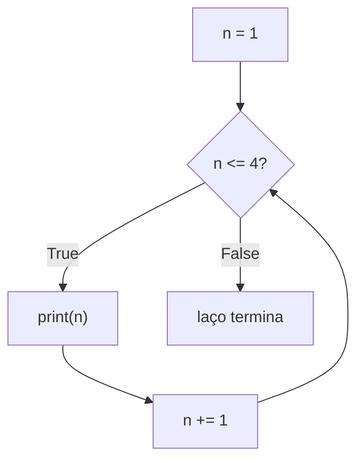

## Objetivos de Aprendizagem

- Explicar a diferença entre um laço `for` iterando sobre uma sequência conhecida e um laço `while` iterando até uma condição mudar.
- Implementar padrões de acumulação (soma corrente, contagem corrente, máximo corrente) usando tanto `for` quanto `while`.
- Declarar um invariante de laço para um laço de acumulação simples e usá-lo para argumentar que o laço produz a resposta correta para toda entrada válida, não só a testada.
- Identificar o erro de código específico que produz um laço `while` infinito, e corrigi-lo.
- Comparar `for` e `while` para uma dada tarefa e justificar qual dos dois é o encaixe mais natural.

## Contexto e Motivação

Um condicional permite que um programa escolha entre dois caminhos uma vez. A maior parte da computação real, porém, não é sobre escolher uma vez: é sobre fazer o mesmo tipo de passo repetidamente: somar todo preço num carrinho de compras, checar todo caractere de uma senha, tentar todo palpite candidato até que um funcione. Sem uma forma de repetir trabalho, cada uma dessas tarefas exigiria escrever uma linha por item, o que não é só tedioso, mas impossível quando o número de itens não é conhecido até o programa rodar. Iteração é o mecanismo que permite que um punhado de linhas de código processe uma quantidade arbitrariamente grande de dados ou rode por um número arbitrariamente grande de passos.

O 6.100L do MIT sequencia laços logo depois de condicionais por uma razão específica: o corpo de um laço é, num sentido, apenas uma decisão parecida com `if` ("devo rodar este bloco de novo?") perguntada repetidamente em vez de uma vez. Vista assim, a iteração não é uma ideia inteiramente nova grudada em cima de condicionais; é condicionais aplicados de novo e de novo, com a peculiaridade de que cada passagem pelo corpo pode mudar o estado do qual a próxima checagem depende.

Mas existe uma demanda intelectual genuinamente nova que vem junto com laços, e é nela que esta lição se concentra: como você sabe que um laço que repete um passo vinte vezes, ou duas mil vezes, ou um número desconhecido de vezes, de fato calcula a resposta certa, em vez de meramente parecer certo na única entrada em que você por acaso o rodou? Testar um laço num único exemplo prova apenas que ele funcionou para aquele exemplo. O que é necessário, em vez disso, é uma forma de raciocinar sobre *toda* iteração de uma vez, e a ferramenta para isso é o invariante de laço, uma afirmação sobre o estado do programa que permanece verdadeira não importa quantas vezes o laço já rodou até agora. Essa ideia (raciocinar sobre a correção de um laço independentemente de quantas vezes ele por acaso execute) é o que separa escrever um laço que parece funcionar de realmente saber que ele funciona.

## Teoria Central

### `for`: iterando sobre uma sequência conhecida

Um laço `for` roda seu corpo uma vez para cada elemento de uma sequência, em ordem, sem precisar controlar um contador manualmente:

```python
total = 0
for n in [1, 2, 3, 4]:
    total += n
print(total)   # 10
```

Cada passagem pelo laço vincula `n` ao próximo elemento da lista (primeiro `1`, depois `2`, depois `3`, depois `4`), e depois do último elemento, o laço simplesmente termina; não há condição para checar, porque a própria sequência define quantas vezes o corpo roda. `range(n)` é a forma comum de iterar um número fixo de vezes sem uma lista já existente: `for i in range(4):` roda o corpo exatamente quatro vezes, com `i` assumindo os valores `0, 1, 2, 3` em sequência.

### `while`: iterando até uma condição ser falsa

Um laço `while`, em vez disso, checa novamente uma condição booleana **antes de toda iteração**, incluindo a primeiríssima, e para no instante em que essa condição é `False`:

```python
n = 1
while n <= 4:
    print(n)
    n += 1   # sem esta linha, a condição nunca muda e o laço nunca termina
```

Isso é funcionalmente parecido com o exemplo `for` acima, mas a mecânica é diferente de uma forma importante: nada num laço `while` garante que ele algum dia vá parar. Um laço `for` sobre uma lista finita tem garantia de terminar: ele fica sem elementos eventualmente, por construção. Um laço `while` termina somente se *algo dentro do corpo* eventualmente torna a condição `False`. Esse "algo", aqui, `n += 1`, não é controle interno opcional; é o motivo inteiro pelo qual o laço tem garantia de terminar em algum momento.



### Invariantes de laço: provando um laço correto em vez de esperar que esteja

Considere somar os primeiros `n` inteiros positivos com um laço, em vez da fórmula em forma fechada `n * (n + 1) / 2`:

```python
total = 0
i = 1
while i <= n:
    total += i
    i += 1
```

Um invariante de laço é uma afirmação precisa sobre a relação entre as variáveis do laço que vale *no início de toda iteração*: antes de o laço ter rodado de forma alguma, e depois de toda passagem subsequente pelo corpo. Para este laço, o invariante é: **"no início de cada iteração, `total` é igual à soma de todos os inteiros de 1 até `i - 1`."**

Checar um invariante é um argumento de três partes, e as três importam:

1. **Vale antes de o laço começar.** Antes de qualquer iteração, `total` é `0` e `i` é `1`. O invariante afirma que `total` é igual à soma de `1` até `i - 1`, que é a soma de `1` até `0`, uma soma vazia, que é `0` por convenção. `total` de fato é `0`. O invariante vale no início.
2. **É preservado por cada iteração.** Assuma que o invariante vale no início de alguma iteração: `total` é igual à soma de `1` até `i - 1`. O corpo soma `i` a `total` (agora a soma de `1` até `i`) e depois incrementa `i` em 1. Depois do incremento, "a soma de `1` até `i - 1`" (usando o *novo* `i`) é exatamente "a soma de `1` até o antigo `i`", que é o que `total` agora contém. O invariante vale de novo, um passo adiante.
3. **Combinado com a condição de saída, implica a resposta.** O laço sai quando `i <= n` se torna `False`, ou seja, quando `i` é igual a `n + 1` (já que `i` só aumenta exatamente 1 de cada vez, não pode pular além de `n + 1`). Nesse ponto, o invariante diz que `total` é igual à soma de `1` até `i - 1`, que é a soma de `1` até `n`: precisamente a resposta desejada.

Este argumento funciona para *todo* `n`, incluindo casos extremos como `n = 0` (o corpo do laço nunca roda de forma alguma, `total` permanece `0`, o que é correto: a soma de nenhum inteiro é `0`), sem precisar rodar o código e checar.

### Padrões de acumulador além de somatório

O mesmo formato (uma variável que começa num valor neutro e é atualizada uma vez por iteração) cobre muito mais que somas:

```python
# máximo corrente
values = [3, 7, 2, 9, 4]
highest = values[0]
for v in values[1:]:
    if v > highest:
        highest = v
print(highest)   # 9

# contagem corrente que satisfaz uma condição
count = 0
for v in values:
    if v % 2 == 0:
        count += 1
print(count)   # 2 (2 e 4 são pares)
```

Os dois seguem a estrutura idêntica: inicialize um acumulador antes do laço, atualize-o exatamente uma vez por iteração com base no elemento atual, e leia a resposta final uma vez que o laço termine. Reconhecer esse formato compartilhado é o que permite escrever um novo laço de acumulação rapidamente em vez de re-derivar a mecânica do laço do zero toda vez.

## Exemplos Resolvidos

**Exemplo 1: traçando um laço `for` passo a passo.** Trace `total = 0; for n in [5, 10, 15]: total += n` na mão, uma iteração de cada vez:

| Antes da iteração | `n` | `total` depois de `total += n` |
|---|---|---|
| 1ª | 5 | 5 |
| 2ª | 10 | 15 |
| 3ª | 15 | 30 |

Depois do terceiro elemento, não há mais elementos na lista, então o laço termina com `total = 30`. Esse tipo de traço na mão (uma pequena tabela rastreando toda variável ao longo de toda iteração) é a forma mais confiável de encontrar um bug de laço: se o comportamento real do código divergir da tabela traçada em alguma iteração, é exatamente ali que o bug mora.

**Exemplo 2: diagnosticando e corrigindo um laço infinito.** Um aluno escreve um laço destinado a contar regressivamente de 5 até 1:

```python
n = 5
while n > 0:
    print(n)
    n += 1     # bug: incrementa em vez de decrementar
```

Trace: `n = 5`, condição `5 > 0` é `True`, imprime `5`, depois `n += 1` faz `n = 6`. Próxima checagem: `6 > 0` ainda é `True`, e sempre será, porque `n` só cresce, se afastando de `0`, nunca se aproximando. A condição nunca pode se tornar `False`. A correção não é mudar a condição; a condição está ok. A correção é mudar o que acontece dentro do corpo para que o valor de verdade da condição de fato se mova em direção a `False`: `n -= 1` em vez de `n += 1`. Isso distingue duas categorias bem diferentes de bug em laço `while`: uma *condição* errada (checando a coisa errada) versus uma *atualização* errada (nunca progredindo em direção à condição se tornar falsa): este exemplo é claramente do segundo tipo, e é o de longe mais comum.

**Exemplo 3: construindo um invariante para um laço "isto contém um número negativo".** Considere:

```python
values = [4, 7, -2, 9]
found_negative = False
i = 0
while i < len(values) and not found_negative:
    if values[i] < 0:
        found_negative = True
    i += 1
```

O invariante aqui é: *"no início de cada iteração, `found_negative` é `True` se e somente se algum elemento entre `values[0], ..., values[i-1]` é negativo; caso contrário é `False`."* Antes do laço, `i = 0` e não há elementos entre `values[0], ..., values[-1]` (uma faixa vazia), então `found_negative = False` é consistente com o invariante. Cada iteração examina exatamente um novo elemento, `values[i]`, e atualiza `found_negative` de acordo antes de avançar `i`, então a afirmação do invariante (que só fala sobre elementos já examinados) continua valendo. O laço para ou quando `i` alcança `len(values)` (todo elemento foi checado) ou no instante em que `found_negative` se torna `True` (não há necessidade de checar o resto). Nos dois casos de parada, o invariante, agora cobrindo ou "todos os elementos" ou "até e incluindo aquele que importou", dá exatamente a resposta final certa, e explica *por que* este laço tem permissão para parar cedo assim que encontra um número negativo, algo que um teste puramente "rodar e ver" não deixaria explícito.

## Equívocos Comuns e Armadilhas

- **"Um laço `while` eventualmente vai parar sozinho, do mesmo jeito que um laço `for` sobre uma lista para."** Um laço `for` sobre uma sequência finita tem garantia de terminar porque é conduzido por algo com um tamanho conhecido e finito. Um laço `while` não tem garantia nenhuma assim embutida: ele termina somente se o código dentro do corpo for escrito de forma que o valor de verdade da condição tenha garantia de mudar. Esquecer a linha que atualiza a variável da condição é o bug mais comum em laços neste nível, e ele não trava o programa: ele silenciosamente o trava sem resposta, o que costuma ser mais difícil de notar e depurar do que uma exceção disparada.

  ```python
  n = 1
  while n <= 4:
      print(n)   # faltando n += 1 -- isto nunca termina
  ```
- **"Se o laço produziu a saída correta no meu caso de teste, o laço está correto."** Um caso de teste só demonstra que o laço funcionou para aquela entrada específica. Laços rotineiramente passam numa entrada "normal" (digamos, uma lista de cinco itens) enquanto falham silenciosamente num caso extremo nunca testado: uma lista vazia, `n = 0`, uma lista com exatamente um elemento. Raciocinar pelo invariante de laço, em vez de rodar mais exemplos, é o que de fato estabelece corretude para toda entrada, incluindo as nunca explicitamente testadas.
- **"Recorrer a `while` é tão bom quanto `for` sempre que você está repetindo algo."** Quando o número de repetições ou a sequência sendo processada já é conhecido de antemão, um laço `for` expressa isso diretamente e remove uma categoria inteira de bug: não há contador manual para esquecer de atualizar, e não há como acidentalmente laçar uma vez a mais ou a menos. Simular o comportamento de um laço `for` com um laço `while` controlado manualmente e uma variável contadora adiciona uma peça móvel que pode dar errado sem benefício nenhum.
- **"Uma variável acumuladora precisa ser inicializada dentro do laço, já que é ali que ela é usada."** Um acumulador (`total = 0`, `highest = values[0]`, `count = 0`) precisa ser configurado *antes* de o laço começar, precisamente porque o caso "antes de o laço começar" do invariante de laço precisa já ser verdadeiro; inicializá-lo dentro do corpo do laço ou o reiniciaria toda iteração (destruindo qualquer acumulação) ou o referenciaria antes de ele jamais ter sido atribuído.

## Resumo

A iteração permite que um bloco fixo de código processe uma entrada cujo tamanho não é conhecido até o programa rodar, usando ou `for` (iterando uma sequência conhecida, com terminação garantida) ou `while` (repetindo até uma condição se tornar falsa, sem essa garantia). Um laço `while` só termina porque algo em seu corpo deliberadamente conduz sua condição em direção a `False`: omitir esse passo é a forma mais comum de escrever um laço infinito. O que de fato estabelece que um laço computa a resposta certa não é rodá-lo num exemplo e checar a saída, mas declarar e verificar um invariante de laço: uma afirmação que é verdadeira antes da primeira iteração, preservada por toda iteração subsequente, e que, combinada com a condição de saída do laço, implica o resultado final correto para toda entrada válida, não apenas a testada. Padrões de acumulador (soma corrente, contagem, máximo) todos compartilham a mesma forma: inicialize antes do laço, atualize exatamente uma vez por iteração, leia o resultado depois de o laço terminar.

## Documentation Links

- [Python Tutorial: More Control Flow Tools](https://docs.python.org/3/tutorial/controlflow.html) (doc)
- [MIT 6.100L: Materials by Lecture](https://ocw.mit.edu/courses/6-100l-introduction-to-cs-and-programming-using-python-fall-2022/pages/material-by-lecture/) (doc)
