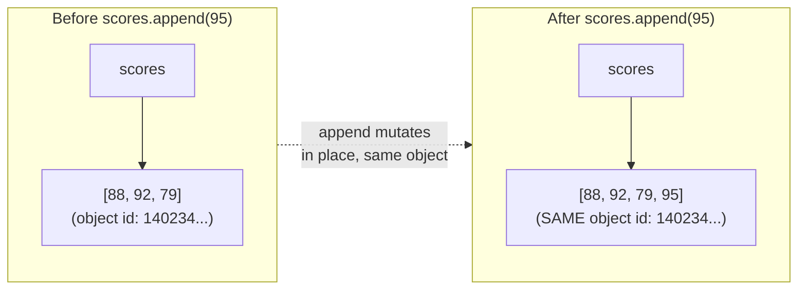

## Learning Objectives

- Explain what makes a list different from every value studied so far — namely, that it is mutable.
- Implement code that creates, indexes, mutates, and grows a list using the core list operations.
- Predict the outcome of an out-of-range index, and explain why Python raises an error instead of returning a default value.
- Compare a mutable type (list) against an immutable type (str, int) and identify which operations are legal on each.
- Identify situations where choosing a mutable list over an immutable alternative introduces risk that the immutable alternative would have prevented.

## Context & Motivation

Every value discussed up to this point in the course — an `int`, a `float`, a `str`, a `bool` — shares one quiet, easily overlooked property: once created, it cannot be changed. `"Ada".upper()` doesn't modify the string `"Ada"`; it builds an entirely new string, `"ADA"`, leaving the original completely untouched. This has been true so consistently that it's easy to assume it's a universal law of how values behave in a program — a rule so basic it barely needed stating. The list is the first type in this course that breaks that rule, and the break is significant enough that Python's own type system draws a hard, explicit line between two categories: *mutable* types, whose contents can change in place after creation, and *immutable* types, which cannot.

A list is written with square brackets — `[88, 92, 79]` — and behaves, in terms of indexing, iterating, and measuring length, almost identically to a string or tuple: `scores[0]` retrieves the first element, `len(scores)` counts the elements, a `for` loop walks through them in order. What a list adds is the ability to change *after* it exists: appending a new score as it comes in, correcting a mistaken entry, removing an item that no longer belongs. This is not a minor convenience feature bolted onto an otherwise ordinary sequence type — it is a foundational shift in what a program can assume about a value that's just sitting in a variable. Python's own tutorial on data structures treats the list as the workhorse container specifically because of this: almost every program that accumulates results over time — every score seen so far, every word typed, every task still pending — reaches for a list precisely because its contents don't have to be known in full up front.

But mutability is a double-edged tool, and the sharp edge doesn't show up until later in this course, in the very next concept (aliasing and cloning): if two variables both refer to the *same* list, a mutation performed through one is visible through the other, whether that was intended or not. Understanding lists thoroughly here — what mutation actually means, what operations count as mutation, and why an immutable type like a string categorically forbids it — is what makes that later, sharper lesson make sense at all. It's worth sitting with the "mutable vs. immutable" distinction now, deliberately, rather than picking it up as an afterthought once it's already caused a confusing bug.

## Core Theory

### Creating, indexing, and measuring a list

```python
scores = [88, 92, 79]
scores[0]              # 88 -- indexing starts at 0, not 1
scores[-1]             # 79 -- negative indices count from the end
len(scores)             # 3
```

Indexing and length work exactly the way they do for a string — this consistency is deliberate, part of what Python's data structures documentation calls the sequence protocol, a shared set of behaviors that lists, tuples, and strings all implement. What differs is what happens next.

### Mutation: changing a list in place

```python
scores.append(95)      # scores is now [88, 92, 79, 95]
scores[1] = 100          # scores is now [88, 100, 79, 95] -- element replaced in place
scores.remove(79)        # scores is now [88, 100, 95]
scores.insert(1, 91)     # scores is now [88, 91, 100, 95]
scores.pop()              # returns and removes the last element -- scores is [88, 91, 100]
```

Every one of these lines changes the *same* list object that `scores` already referred to — none of them creates a new list and reassigns `scores` to point at it. This is the concrete meaning of "mutable": the object's identity stays fixed while its contents change underneath it.



### Why immutability forbids this outright

```python
name = "Ada"
name[0] = "E"     # TypeError: 'str' object does not support item assignment
```

A `str` doesn't merely discourage in-place modification — it has no mechanism for it at all. Every method that looks like it "modifies" a string, like `.upper()` or `.replace()`, actually constructs and returns a brand-new string object, leaving the original completely intact:

```python
name = "Ada"
loud = name.upper()
print(name)   # "Ada" -- untouched
print(loud)    # "ADA" -- a different, new string object
```

A list built the exact same way faces no such restriction — `letters[0] = "E"` is perfectly legal, because a list's design explicitly permits item assignment where a string's design does not. The two types look similar on the surface (both indexable, both iterable) but diverge completely the moment mutation is attempted.

### Growing and shrinking: a list's size isn't fixed at creation

Unlike a tuple (covered later in this course) or a fixed-size array in some other languages, a Python list's length is not fixed when it's created. `.append()`, `.insert()`, and `.extend()` grow it; `.remove()`, `.pop()`, and `del` shrink it. This is what makes a list the natural choice for accumulating a sequence of results whose final size isn't known in advance — a common pattern paired directly with a loop:

```python
passing = []
for score in [55, 88, 40, 92, 71]:
    if score >= 60:
        passing.append(score)
# passing is now [88, 92, 71] -- built up incrementally, size unknown at the start
```

### Out-of-range access: failing loudly instead of guessing

```python
scores = [1, 2, 3]
scores[5]   # IndexError: list index out of range
```

Some languages return a garbage value, a zero, or silently extend the collection when an index is out of range. Python's built-in types reference is explicit that this is treated as an error, immediately, rather than something the program is allowed to continue past unnoticed. This is a deliberate design choice consistent with a theme that will recur throughout this course: a bug that's caught the instant it happens, with a clear error message pointing at the exact line, is vastly easier to fix than one that's allowed to silently propagate and surface as a mysterious wrong answer much later.

## Worked Examples

**Example 1 — building a list incrementally inside a loop, then mutating it further.** Suppose a program needs to collect every number in a range that's divisible by 3, then double each one afterward.

```python
multiples = []
for n in range(1, 21):
    if n % 3 == 0:
        multiples.append(n)
# multiples is [3, 6, 9, 12, 15, 18]

for i in range(len(multiples)):
    multiples[i] = multiples[i] * 2
# multiples is now [6, 12, 18, 24, 30, 36] -- the SAME list, mutated in place
```

The first loop demonstrates the classic "accumulate into an initially empty list" pattern; the second demonstrates mutating existing elements by index rather than building a second list. Note the second loop deliberately indexes with `range(len(multiples))` rather than `for n in multiples` — iterating directly over the list's *values* while trying to reassign by index inside the same loop is a common point of confusion, since `n` in that alternate form would be a copy of the value at each position, not something reassignment could route back into the list.

**Example 2 — diagnosing why a string "won't update."** A student tries to censor part of a string in place and can't figure out why nothing changes:

```python
message = "hello world"
message[0] = "H"   # TypeError: 'str' object does not support item assignment
```

Walking through why this fails: `message` refers to a `str`, and a `str` has no operation, anywhere in its design, that permits changing one character in place — this isn't a bug to route around, it's categorical. The fix requires recognizing that "changing a string" always means "building a new string that replaces the old one":

```python
message = "hello world"
message = "H" + message[1:]   # build a NEW string, reassign message to point at it
print(message)                  # "Hello world"
```

Contrast this with the equivalent operation on a list of characters, where in-place mutation is legal because lists were designed to permit it:

```python
letters = list("hello world")   # ['h', 'e', 'l', 'l', 'o', ' ', 'w', 'o', 'r', 'l', 'd']
letters[0] = "H"                  # legal -- lists support item assignment
print("".join(letters))           # "Hello world"
```

**Example 3 — a function that mutates its argument, and reasoning about what the caller sees afterward.** (This example previews the full aliasing mechanism covered in the next lesson, but the piece needed here is simply: a list passed into a function is the *same* list, not a copy.)

```python
def add_bonus_point(scores):
    scores.append(100)    # mutates whatever list was passed in

class_scores = [88, 92, 79]
add_bonus_point(class_scores)
print(class_scores)         # [88, 92, 79, 100] -- the caller's list changed
```

Nothing about calling `add_bonus_point` created a copy of `class_scores` for the function to work on privately — `scores` inside the function and `class_scores` outside it refer to the identical list object, so `.append()` inside the function is visible to the caller immediately after the call returns. This is a direct consequence of mutability combined with how Python passes arguments, and it's exactly the property that makes disciplined use of lists in functions important: a function that mutates a list argument should make that clear (through its name, its documentation, or both), because the caller has no protection against it otherwise.

## Common Misconceptions & Pitfalls

- **"Every operation that changes what a list looks like creates a new list."** This is true for a `str` but false for a `list`. `.append()`, `.sort()`, `.reverse()`, and item assignment (`scores[0] = 100`) all mutate the existing list object; only genuinely new-list-producing operations like slicing (`scores[1:3]`) or `sorted(scores)` (note: the built-in *function*, not the *method* `.sort()`) return a fresh list while leaving the original alone. Mixing these up — expecting `scores.sort()` to return a new sorted list, for instance — is a very common early mistake:

  ```python
  scores = [3, 1, 2]
  result = scores.sort()   # sorts IN PLACE and returns None, not the sorted list!
  print(result)              # None
  print(scores)               # [1, 2, 3] -- the original list, mutated
  ```

- **"An `IndexError` means something is broken with the list itself."** It means the *index* was invalid for that list's current length — often because the list is shorter than expected (perhaps it was mutated earlier in ways the reader didn't track) rather than because anything is wrong with list indexing as a mechanism. Checking `len()` before indexing, or using a loop that iterates the list directly rather than by a separately-tracked index, avoids this entirely.

- **"Choosing a list is always safe, since it's the most flexible container."** Flexibility cuts both ways: if a collection of values is genuinely fixed (the twelve months of the year, a coordinate pair that should never change once computed), storing it in a list gives up a safety net that an immutable alternative — a tuple, covered later in this course — would have provided for free. An accidental `.append()` to data that was supposed to stay fixed produces a bug that a tuple would have caught immediately, as a loud `AttributeError`, at the exact point of the mistaken call, rather than allowing the mutation to happen silently and surface as a wrong answer somewhere else entirely.

## Summary

A list is Python's growable, ordered, *mutable* sequence type — the first type in this course whose contents can change in place after creation, in contrast to the immutable numbers and strings studied so far. `.append()`, `.insert()`, `.remove()`, `.pop()`, and index assignment all change the existing list object rather than building a new one, which is what "mutable" concretely means. A `str`, by contrast, permits no such in-place change at all; every seemingly-modifying string method actually returns a brand-new string. Indexing past a list's current length raises `IndexError` immediately rather than silently returning a default, which is a deliberate design choice that surfaces bugs early. And because a list passed into a function is the same object the caller holds — not a private copy — a function that mutates a list parameter changes what the caller sees too, a consequence that becomes central in the very next lesson on aliasing and cloning.

## Documentation Links

- [Python Tutorial — Data Structures](https://docs.python.org/3/tutorial/datastructures.html) — doc
- [Python Library Reference — Built-in Types](https://docs.python.org/3/library/stdtypes.html) — doc
