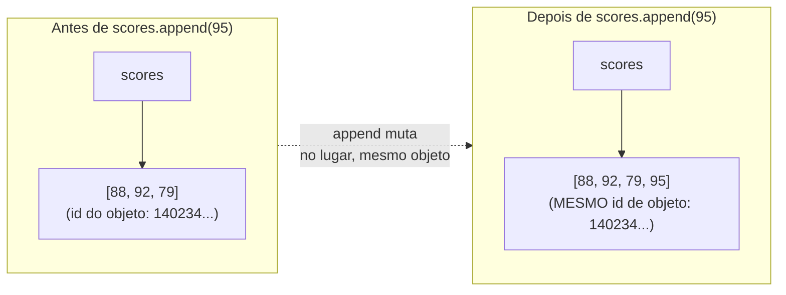

## Objetivos de Aprendizagem

- Explicar o que torna uma lista diferente de todo valor estudado até agora: ela é mutável.
- Implementar código que cria, indexa, muta e cresce uma lista usando as operações centrais de lista.
- Prever o resultado de um índice fora da faixa, e explicar por que o Python dispara um erro em vez de retornar um valor padrão.
- Comparar um tipo mutável (lista) com um tipo imutável (str, int) e identificar quais operações são legais em cada um.
- Identificar situações em que escolher uma lista mutável em vez de uma alternativa imutável introduz um risco que a alternativa imutável teria evitado.

## Contexto e Motivação

Todo valor discutido até este ponto no curso (um `int`, um `float`, uma `str`, um `bool`) compartilha uma propriedade discreta e facilmente ignorada: uma vez criado, não pode ser mudado. `"Ada".upper()` não modifica a string `"Ada"`; ela constrói uma string inteiramente nova, `"ADA"`, deixando a original completamente intocada. Isso tem sido verdade de forma tão consistente que é fácil assumir que é uma lei universal de como valores se comportam num programa, uma regra tão básica que quase nem precisava ser dita. A lista é o primeiro tipo neste curso que quebra essa regra, e a quebra é significativa o suficiente que o próprio sistema de tipos do Python traça uma linha rígida e explícita entre duas categorias: tipos *mutáveis*, cujo conteúdo pode mudar no lugar depois da criação, e tipos *imutáveis*, que não podem.

Uma lista é escrita com colchetes, `[88, 92, 79]`, e se comporta, em termos de indexação, iteração e medição de comprimento, quase identicamente a uma string ou tupla: `scores[0]` recupera o primeiro elemento, `len(scores)` conta os elementos, um laço `for` os percorre em ordem. O que uma lista adiciona é a capacidade de mudar *depois* de existir: adicionar uma nova pontuação conforme ela chega, corrigir uma entrada equivocada, remover um item que não pertence mais. Isso não é um recurso de conveniência menor grudado num tipo sequência que de outra forma seria comum; é uma mudança fundamental no que um programa pode assumir sobre um valor que está apenas guardado numa variável. O próprio tutorial do Python sobre estruturas de dados trata a lista como o container cavalo de batalha especificamente por causa disso: quase todo programa que acumula resultados ao longo do tempo (toda pontuação vista até agora, toda palavra digitada, toda tarefa ainda pendente) recorre a uma lista precisamente porque seu conteúdo não precisa ser conhecido por completo de antemão.

Mas mutabilidade é uma ferramenta de dois gumes, e o lado afiado não aparece até mais tarde neste curso, no conceito imediatamente seguinte (aliasing e clonagem): se duas variáveis se referem à *mesma* lista, uma mutação feita através de uma é visível através da outra, intencional ou não. Entender listas a fundo aqui (o que mutação de fato significa, quais operações contam como mutação, e por que um tipo imutável como uma string proíbe isso categoricamente) é o que faz aquela lição posterior e mais afiada fazer sentido de forma alguma. Vale a pena passar tempo com a distinção "mutável versus imutável" agora, deliberadamente, em vez de pegá-la depois como uma reflexão tardia, uma vez que já causou um bug confuso.

## Teoria Central

### Criando, indexando e medindo uma lista

```python
scores = [88, 92, 79]
scores[0]              # 88 -- a indexação começa em 0, não 1
scores[-1]             # 79 -- índices negativos contam a partir do fim
len(scores)             # 3
```

Indexação e comprimento funcionam exatamente como funcionam para uma string; essa consistência é deliberada, parte do que a documentação de estruturas de dados do Python chama de protocolo de sequência, um conjunto compartilhado de comportamentos que listas, tuplas e strings todas implementam. O que difere é o que acontece em seguida.

### Mutação: mudando uma lista no lugar

```python
scores.append(95)      # scores agora é [88, 92, 79, 95]
scores[1] = 100          # scores agora é [88, 100, 79, 95] -- elemento substituído no lugar
scores.remove(79)        # scores agora é [88, 100, 95]
scores.insert(1, 91)     # scores agora é [88, 91, 100, 95]
scores.pop()              # retorna e remove o último elemento -- scores é [88, 91, 100]
```

Cada uma dessas linhas muda o *mesmo* objeto lista ao qual `scores` já se referia: nenhuma delas cria uma lista nova e reatribui `scores` para apontar para ela. Este é o significado concreto de "mutável": a identidade do objeto permanece fixa enquanto seu conteúdo muda por baixo dele.



### Por que a imutabilidade proíbe isso totalmente

```python
name = "Ada"
name[0] = "E"     # TypeError: 'str' object does not support item assignment
```

Uma `str` não apenas desencoraja a modificação no lugar: ela não tem mecanismo nenhum para isso. Todo método que parece "modificar" uma string, como `.upper()` ou `.replace()`, na verdade constrói e retorna um objeto string totalmente novo, deixando o original completamente intacto:

```python
name = "Ada"
loud = name.upper()
print(name)   # "Ada" -- intocado
print(loud)    # "ADA" -- um objeto string novo e diferente
```

Uma lista construída da forma exatamente igual não enfrenta essa restrição: `letters[0] = "E"` é perfeitamente legal, porque o design de uma lista permite explicitamente atribuição a item onde o design de uma string não permite. Os dois tipos parecem semelhantes na superfície (ambos indexáveis, ambos iteráveis), mas divergem completamente no momento em que a mutação é tentada.

### Crescendo e encolhendo: o tamanho de uma lista não é fixo na criação

Diferente de uma tupla (coberta mais adiante neste curso) ou de um array de tamanho fixo em outras linguagens, o comprimento de uma lista Python não é fixado quando ela é criada. `.append()`, `.insert()` e `.extend()` a fazem crescer; `.remove()`, `.pop()` e `del` a fazem encolher. Isso é o que torna uma lista a escolha natural para acumular uma sequência de resultados cujo tamanho final não é conhecido de antemão, um padrão comum combinado diretamente com um laço:

```python
passing = []
for score in [55, 88, 40, 92, 71]:
    if score >= 60:
        passing.append(score)
# passing agora é [88, 92, 71] -- construída incrementalmente, tamanho desconhecido no início
```

### Acesso fora da faixa: falhando em voz alta em vez de adivinhar

```python
scores = [1, 2, 3]
scores[5]   # IndexError: list index out of range
```

Algumas linguagens retornam um valor lixo, um zero, ou silenciosamente estendem a coleção quando um índice está fora da faixa. A referência de tipos embutidos do Python é explícita de que isso é tratado como um erro, imediatamente, em vez de algo que o programa tem permissão de continuar além sem perceber. Esta é uma escolha de design deliberada consistente com um tema que vai reaparecer ao longo deste curso: um bug capturado no instante em que acontece, com uma mensagem de erro clara apontando para a linha exata, é vastamente mais fácil de corrigir do que um que tem permissão de se propagar silenciosamente e aparecer como uma resposta misteriosamente errada bem mais tarde.

## Exemplos Resolvidos

**Exemplo 1: construindo uma lista incrementalmente dentro de um laço, depois mutando-a ainda mais.** Suponha que um programa precise coletar todo número numa faixa que é divisível por 3, depois dobrar cada um em seguida.

```python
multiples = []
for n in range(1, 21):
    if n % 3 == 0:
        multiples.append(n)
# multiples é [3, 6, 9, 12, 15, 18]

for i in range(len(multiples)):
    multiples[i] = multiples[i] * 2
# multiples agora é [6, 12, 18, 24, 30, 36] -- a MESMA lista, mutada no lugar
```

O primeiro laço demonstra o padrão clássico de "acumular numa lista inicialmente vazia"; o segundo demonstra mutar elementos existentes por índice em vez de construir uma segunda lista. Note que o segundo laço deliberadamente indexa com `range(len(multiples))` em vez de `for n in multiples`: iterar diretamente sobre os *valores* da lista enquanto tenta reatribuir por índice dentro do mesmo laço é um ponto comum de confusão, já que `n` naquela forma alternativa seria uma cópia do valor em cada posição, não algo pelo qual a reatribuição pudesse voltar para dentro da lista.

**Exemplo 2: diagnosticando por que uma string "não atualiza".** Um aluno tenta censurar parte de uma string no lugar e não consegue entender por que nada muda:

```python
message = "hello world"
message[0] = "H"   # TypeError: 'str' object does not support item assignment
```

Percorrendo por que isso falha: `message` se refere a uma `str`, e uma `str` não tem operação nenhuma, em lugar algum do seu design, que permita mudar um caractere no lugar; isso não é um bug para contornar, é categórico. A correção exige reconhecer que "mudar uma string" sempre significa "construir uma nova string que substitui a antiga":

```python
message = "hello world"
message = "H" + message[1:]   # constrói uma NOVA string, reatribui message para apontar para ela
print(message)                  # "Hello world"
```

Contraste isso com a operação equivalente numa lista de caracteres, onde a mutação no lugar é legal porque listas foram desenhadas para permiti-la:

```python
letters = list("hello world")   # ['h', 'e', 'l', 'l', 'o', ' ', 'w', 'o', 'r', 'l', 'd']
letters[0] = "H"                  # legal -- listas suportam atribuição a item
print("".join(letters))           # "Hello world"
```

**Exemplo 3: uma função que muta seu argumento, e raciocinar sobre o que quem chama vê depois.** (Este exemplo antecipa o mecanismo completo de aliasing coberto na próxima lição, mas a peça necessária aqui é simplesmente: uma lista passada para uma função é a *mesma* lista, não uma cópia.)

```python
def add_bonus_point(scores):
    scores.append(100)    # muta o que quer que tenha sido passado

class_scores = [88, 92, 79]
add_bonus_point(class_scores)
print(class_scores)         # [88, 92, 79, 100] -- a lista do chamador mudou
```

Nada em chamar `add_bonus_point` criou uma cópia de `class_scores` para a função trabalhar em particular: `scores` dentro da função e `class_scores` fora dela se referem ao idêntico objeto lista, então `.append()` dentro da função é visível para quem chama imediatamente depois que a chamada retorna. Isso é uma consequência direta da mutabilidade combinada com a forma como o Python passa argumentos, e é exatamente a propriedade que torna importante o uso disciplinado de listas em funções: uma função que muta um argumento lista deveria deixar isso claro (por meio do seu nome, sua documentação, ou os dois), porque quem chama não tem proteção nenhuma contra isso de outra forma.

## Equívocos Comuns e Armadilhas

- **"Toda operação que muda a aparência de uma lista cria uma lista nova."** Isso é verdade para uma `str`, mas falso para uma `list`. `.append()`, `.sort()`, `.reverse()`, e atribuição a item (`scores[0] = 100`) todos mutam o objeto lista existente; só operações que genuinamente produzem uma lista nova, como slicing (`scores[1:3]`) ou `sorted(scores)` (note: a *função* embutida, não o *método* `.sort()`), retornam uma lista nova enquanto deixam a original em paz. Confundir isso, esperando que `scores.sort()` retorne uma nova lista ordenada, por exemplo, é um erro muito comum no início:

  ```python
  scores = [3, 1, 2]
  result = scores.sort()   # ordena NO LUGAR e retorna None, não a lista ordenada!
  print(result)              # None
  print(scores)               # [1, 2, 3] -- a lista original, mutada
  ```

- **"Um `IndexError` significa que algo está quebrado com a lista em si."** Significa que o *índice* era inválido para o comprimento atual daquela lista, frequentemente porque a lista é mais curta do que o esperado (talvez tenha sido mutada antes de formas que quem lê não rastreou) em vez de por haver algo errado com a indexação de lista como mecanismo. Checar `len()` antes de indexar, ou usar um laço que itera a lista diretamente em vez de por um índice rastreado separadamente, evita isso por completo.

- **"Escolher uma lista é sempre seguro, já que é o container mais flexível."** Flexibilidade corta dos dois lados: se uma coleção de valores é genuinamente fixa (os doze meses do ano, um par de coordenadas que nunca deveria mudar depois de calculado), armazená-la numa lista abre mão de uma rede de segurança que uma alternativa imutável (uma tupla, coberta mais adiante neste curso) teria fornecido de graça. Um `.append()` acidental a dados que deveriam permanecer fixos produz um bug que uma tupla teria capturado imediatamente, como um `AttributeError` alto e claro, no exato ponto da chamada equivocada, em vez de permitir que a mutação aconteça silenciosamente e apareça como uma resposta errada em algum outro lugar completamente diferente.

## Resumo

Uma lista é o tipo sequência crescível, ordenado e *mutável* do Python: o primeiro tipo neste curso cujo conteúdo pode mudar no lugar depois da criação, em contraste com os números e strings imutáveis estudados até agora. `.append()`, `.insert()`, `.remove()`, `.pop()`, e atribuição por índice todos mudam o objeto lista existente em vez de construir um novo, que é o que "mutável" concretamente significa. Uma `str`, por outro lado, não permite nenhuma mudança assim no lugar; todo método de string que parece "modificar" na verdade retorna uma string totalmente nova. Indexar além do comprimento atual de uma lista dispara `IndexError` imediatamente, em vez de silenciosamente retornar um padrão, que é uma escolha de design deliberada que revela bugs cedo. E como uma lista passada para uma função é o mesmo objeto que quem chama tem, não uma cópia privada, uma função que muta um parâmetro lista muda também o que quem chama vê, uma consequência que se torna central na próxima lição sobre aliasing e clonagem.

## Documentation Links

- [Python Tutorial: Data Structures](https://docs.python.org/3/tutorial/datastructures.html) (doc)
- [Python Library Reference: Built-in Types](https://docs.python.org/3/library/stdtypes.html) (doc)
