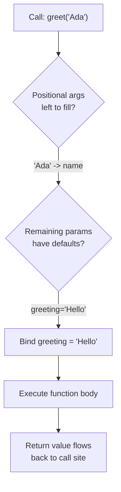

## Learning Objectives

- Explain the difference between a parameter (a name declared in a function's signature) and an argument (the value supplied at a call site).
- Implement functions that combine positional parameters, keyword arguments, and default values correctly.
- Predict what a function returns when it has no `return` statement, or when `return` is reached with no expression after it.
- Identify the "prints instead of returns" bug in unfamiliar code, and explain why it doesn't raise an error immediately.
- Compare the cost of over-defaulting a function's parameters against the cost of under-defaulting it.

## Context & Motivation

Once a program has more than a handful of lines, the single biggest lever for keeping it manageable is the function: a named, reusable chunk of logic that hides its internal steps behind an interface. But an interface is only useful if it's precise about two things — what the function needs from the outside world to do its job, and what it hands back once it's done. Those two things are exactly what parameters and return values formalize. A function's signature, `def convert(temperature, from_unit, to_unit="celsius")`, is a contract: call me with a temperature and a source unit, optionally tell me the target unit, and I promise to hand back a converted number. Everything about how that conversion actually happens is irrelevant to the caller, and that's the entire point of decomposition — the caller only needs to trust the contract.

This is why parameter binding and return values deserve careful, explicit study rather than being picked up by osmosis. A huge fraction of early bugs in student code come not from "wrong logic" in the traditional sense but from a mismatch between what a function's contract actually says and what a programmer assumes it says: forgetting that a function needs an argument the caller didn't supply, assuming a value comes back when the function never says `return`, or being surprised that a default value doesn't behave the way a fresh value would on every call. The Python tutorial's chapter on control flow tools devotes substantial space to exactly this — positional vs. keyword arguments, default values, and the various ways arguments can be passed — because getting comfortable with the mechanics here pays off every time a function is written or called afterward.

There's also a conceptual shift buried in "returning a value" that's worth surfacing directly. Early programs tend to communicate results by printing them: the function does its work and immediately shows the answer to a human. But a program that's more than a toy needs functions that hand results to *other code*, not to a person reading a terminal. `print()` and `return` look similar — both seem to "produce output" — but they serve fundamentally different audiences: one talks to a human, the other talks to the rest of the program. Recognizing which one a given function needs is a small decision that has an outsized effect on whether a function is actually reusable.

## Core Theory

### The vocabulary: parameters vs. arguments

A **parameter** is a name that appears in a function's `def` line — it exists only inside that function's own scope and only means something in the context of a call. An **argument** is the actual value supplied at the point a function is called. The distinction matters because the same word "greeting" can refer to a parameter (a placeholder with no value yet) or, once a call is made, to a bound name that now refers to a specific real value:

```python
def greet(name, greeting="Hello"):   # name, greeting are PARAMETERS
    return f"{greeting}, {name}!"

greet("Ada")                          # "Ada" is an ARGUMENT bound to name
greet("Ada", "Hi")                    # "Hi" is an ARGUMENT bound to greeting
greet(name="Ada", greeting="Hi")      # keyword arguments — matched by name, not position
```

### How binding actually happens

Python resolves a call in a fixed order: positional arguments fill parameters left to right first, then keyword arguments fill whatever's left by name, and finally any parameter still unfilled falls back to its default. A parameter with no default is *required*: omitting it is not politely ignored, it's an immediate `TypeError`.



`greet()` with zero arguments raises `TypeError: greet() missing 1 required positional argument: 'name'` — Python checks that every required parameter got a value *before* the function body runs a single line. This is deliberate: a missing required argument is a contract violation, and contract violations should fail loudly and immediately, not silently produce garbage partway through execution.

Positional and keyword styles can be mixed, but only in one direction: every positional argument must come before any keyword argument in the call. `greet(greeting="Hi", "Ada")` is a syntax error, not just bad style — once you've named an argument, Python can no longer infer position from what follows.

### What "returning nothing" actually means

Every Python function returns *something*, even if that something is never explicitly requested. A function that runs off the end of its body without hitting a `return` statement — or that hits a bare `return` with no expression — implicitly returns the special value `None`. There is no such thing, in Python, as a function that returns "nothing at all"; `None` is that "nothing," made into a real, checkable value.

```python
def print_square(x):
    print(x * x)          # displays the result — does NOT return it

def log_and_stop(x):
    if x < 0:
        return             # bare return — returns None
    print(x * x)

result = print_square(5)   # prints 25 to the terminal
print(result)               # None — nothing was ever returned
```

`print_square` *looks* like it produces `25`, because a human watching the terminal sees `25` appear. But the function's contract, as written, never says `return` — so as far as any other code is concerned, calling `print_square(5)` produces `None`. The bug this causes is a "spooky action at a distance" of its own kind: it doesn't crash inside `print_square`, it crashes wherever the caller later tries to treat `result` as a usable number.

### Default arguments: convenience with a sharp edge

A default value is evaluated exactly **once**, at the moment the `def` statement itself runs (i.e., when the module is loaded), not fresh on every call. For an immutable default like `"Hello"` or `0`, this distinction is invisible — the value never changes, so "the same object every time" and "a fresh copy every time" look identical. But for a *mutable* default like `[]` or `{}`, the difference becomes a genuine trap:

```python
def add_item(item, cart=[]):   # cart's default is created ONCE
    cart.append(item)
    return cart

add_item("apple")     # ['apple']
add_item("banana")    # ['apple', 'banana']  -- the SAME list as before!
```

Every call that doesn't supply its own `cart` shares the exact same list object as its default, because that list was constructed a single time when `def` ran, not once per call. The fix — using `None` as the sentinel default and constructing a fresh list inside the body when needed — is one of the most-cited idioms in Python precisely because this bug is subtle and nearly universal among people learning the language.

```python
def add_item(item, cart=None):
    if cart is None:
        cart = []            # a fresh list, built fresh on every call that needs one
    cart.append(item)
    return cart
```

## Worked Examples

**Example 1 — designing a contract from a problem statement.** Suppose we need a function that computes the total cost of an order, given a unit price, a quantity, and an optional discount percentage that defaults to no discount at all. Working from the problem statement to the signature:

```python
def order_total(unit_price, quantity, discount_percent=0):
    subtotal = unit_price * quantity
    discount = subtotal * (discount_percent / 100)
    return subtotal - discount

order_total(9.99, 3)             # 29.97 -- discount_percent defaults to 0
order_total(9.99, 3, 10)          # 26.973 -- 10% off, positionally
order_total(9.99, 3, discount_percent=10)   # same, but explicit and self-documenting
```

The decision to make `discount_percent` optional (rather than required) reflects a judgment call: most orders have no discount, so forcing every caller to type `0` at every call site would be pure noise. Notice also that the function *returns* the total rather than printing it — this is what allows the caller, three lines later, to add tax, log it, or compare it to a budget, none of which would be possible if `order_total` had simply printed its answer.

**Example 2 — diagnosing the "prints instead of returns" bug.** A student writes a function meant to double every element of a list and reports that "the function doesn't work — it just gives me `None`."

```python
def double_all(numbers):
    doubled = [n * 2 for n in numbers]
    print(doubled)          # bug: shows the result, doesn't hand it back

result = double_all([1, 2, 3])
print(result[0])             # TypeError: 'NoneType' object is not subscriptable
```

Walking through it: `double_all([1, 2, 3])` does compute `[2, 4, 6]` correctly — the loop, the arithmetic, the list comprehension are all fine. The bug is entirely about the last line of the function body: `print(doubled)` shows the list to a human, but the function's implicit return value is still `None`, because no `return` statement ever ran. The fix is a one-word change:

```python
def double_all(numbers):
    doubled = [n * 2 for n in numbers]
    return doubled          # now the caller actually receives the list

result = double_all([1, 2, 3])
print(result[0])             # 2
```

**Example 3 — returning multiple values, and what's really happening.** A function that needs to hand back more than one piece of information — say, both the minimum and maximum of a list — appears to "return two things," but is actually returning a single tuple:

```python
def bounds(values):
    return min(values), max(values)   # this builds and returns ONE tuple: (min, max)

lo, hi = bounds([4, 1, 9, 2])          # tuple-unpacking on the receiving end
print(lo, hi)                           # 1 9

result = bounds([4, 1, 9, 2])
print(result)                           # (1, 9) -- confirms it's a single tuple
print(type(result))                     # <class 'tuple'>
```

The comma between `min(values)` and `max(values)` is what constructs the tuple — `return a, b` and `return (a, b)` are identical. Recognizing this matters for reading unfamiliar code: a function that appears to "return two values" is a function returning one tuple, and the unpacking on the caller's side (`lo, hi = bounds(...)`) is doing the work of splitting it back apart.

## Common Misconceptions & Pitfalls

- **"If my function has no errors, it must be returning the right thing."** A function can run without raising a single exception and still return `None` because it never reached a `return` statement. The absence of an error says nothing about whether a value was actually returned — always check what a function's *last* executed line does, not whether the function "ran fine."

- **"A default argument gets evaluated fresh every time the function is called."** This is false for any default, and dangerous specifically when the default is mutable. The snippet below demonstrates it directly — running it shows the *same* list object growing across unrelated calls, not two independent empty lists:

  ```python
  def add_item(item, cart=[]):
      cart.append(item)
      return cart

  print(add_item("apple"))     # ['apple']
  print(add_item("banana"))    # ['apple', 'banana']  -- not a fresh cart!
  print(add_item("apple") is add_item("banana"))  # would show shared identity issues too
  ```

- **"Keyword arguments and default values are the same feature."** They're independent: keyword arguments are about *how a call supplies a value* (matched by name instead of position), while default values are about *what happens when a call supplies no value at all*. A parameter can have a default and still be passed positionally; a parameter with no default can still be passed by keyword. Confusing the two leads to writing `def f(x=None)` when what was actually meant was just "let callers pass `x` by name," with no intent for `x` to ever be genuinely optional.

- **"Giving every parameter a default value makes a function more flexible, with no downside."** Excess optionality can hide a required piece of information the caller genuinely needed to supply. If a function computes a shipping cost and `destination_country` silently defaults to `"US"`, a caller who forgot to pass it gets a wrong answer with no error at all — which is worse than a loud `TypeError` would have been. Whether a parameter should be required or optional is a design decision about the contract, not a courtesy to make every call shorter.

## Summary

A function's signature is a contract: parameters declare what the caller must (or may) supply, and the return value is what the caller receives back once the call completes. Positional arguments bind by position, keyword arguments bind by name, and parameters with no default are required — Python enforces this contract before the function body ever runs. A function with no `return` statement (or a bare `return`) implicitly hands back `None`, which is a real, checkable value rather than an absence of one — and mistaking a function that `print()`s its result for one that `return`s it is one of the most common early bugs, because the mistake doesn't cause an error until much later, wherever the caller tries to use `None` as if it were real data. Mutable default arguments compound this danger, since a default like `[]` is constructed exactly once, at definition time, and shared across every call that relies on it. Finally, "returning multiple values" is really returning a single tuple, unpacked back into separate names on the caller's side.

## Documentation Links

- [Python Tutorial — More Control Flow Tools](https://docs.python.org/3/tutorial/controlflow.html) — doc
- [Python Built-in Functions](https://docs.python.org/3/library/functions.html) — doc
