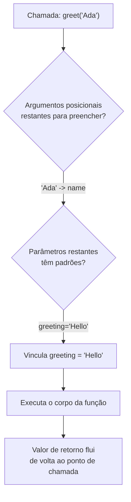

## Objetivos de Aprendizagem

- Explicar a diferença entre um parâmetro (um nome declarado na assinatura de uma função) e um argumento (o valor fornecido num ponto de chamada).
- Implementar funções que combinam parâmetros posicionais, argumentos nomeados e valores padrão corretamente.
- Prever o que uma função retorna quando não tem instrução `return`, ou quando `return` é alcançado sem expressão nenhuma depois dele.
- Identificar o bug de "imprime em vez de retornar" em código desconhecido, e explicar por que ele não dispara um erro imediatamente.
- Comparar o custo de fornecer padrões demais aos parâmetros de uma função com o custo de fornecer padrões de menos.

## Contexto e Motivação

Uma vez que um programa tem mais que um punhado de linhas, a maior alavanca única para mantê-lo administrável é a função: um pedaço de lógica nomeado e reutilizável que esconde seus passos internos atrás de uma interface. Mas uma interface só é útil se for precisa sobre duas coisas: o que a função precisa do mundo externo para fazer seu trabalho, e o que ela entrega de volta uma vez que termina. Essas duas coisas são exatamente o que parâmetros e valores de retorno formalizam. A assinatura de uma função, `def convert(temperature, from_unit, to_unit="celsius")`, é um contrato: me chame com uma temperatura e uma unidade de origem, opcionalmente me diga a unidade de destino, e eu prometo entregar de volta um número convertido. Tudo sobre como essa conversão de fato acontece é irrelevante para quem chama, e esse é o objetivo inteiro da decomposição: quem chama só precisa confiar no contrato.

É por isso que a vinculação de parâmetros e valores de retorno merecem um estudo cuidadoso e explícito, em vez de serem absorvidos por osmose. Uma fração enorme dos bugs iniciais em código de aluno vem não de "lógica errada" no sentido tradicional, mas de um descompasso entre o que o contrato de uma função de fato diz e o que um programador assume que ele diz: esquecer que uma função precisa de um argumento que quem chama não forneceu, assumir que um valor volta quando a função nunca diz `return`, ou se surpreender que um valor padrão não se comporta do jeito que um valor novo se comportaria a cada chamada. O capítulo do tutorial do Python sobre ferramentas de fluxo de controle dedica espaço substancial exatamente a isso (argumentos posicionais versus nomeados, valores padrão, e as várias formas como argumentos podem ser passados) porque ficar confortável com a mecânica aqui compensa toda vez que uma função é escrita ou chamada depois.

Também há uma mudança conceitual escondida em "retornar um valor" que vale a pena trazer à tona diretamente. Programas iniciais tendem a comunicar resultados imprimindo-os: a função faz seu trabalho e imediatamente mostra a resposta a um humano. Mas um programa que é mais que um brinquedo precisa de funções que entreguem resultados a *outro código*, não a uma pessoa lendo um terminal. `print()` e `return` parecem semelhantes (os dois parecem "produzir saída"), mas atendem a públicos fundamentalmente diferentes: um fala com um humano, o outro fala com o resto do programa. Reconhecer de qual dos dois uma dada função precisa é uma pequena decisão que tem um efeito desproporcional sobre se uma função é de fato reutilizável.

## Teoria Central

### O vocabulário: parâmetros versus argumentos

Um **parâmetro** é um nome que aparece na linha `def` de uma função: ele existe apenas dentro do próprio escopo daquela função e só significa algo no contexto de uma chamada. Um **argumento** é o valor real fornecido no ponto em que uma função é chamada. A distinção importa porque a mesma palavra "greeting" pode se referir a um parâmetro (um espaço reservado sem valor ainda) ou, uma vez que uma chamada é feita, a um nome vinculado que agora se refere a um valor real específico:

```python
def greet(name, greeting="Hello"):   # name, greeting são PARÂMETROS
    return f"{greeting}, {name}!"

greet("Ada")                          # "Ada" é um ARGUMENTO vinculado a name
greet("Ada", "Hi")                    # "Hi" é um ARGUMENTO vinculado a greeting
greet(name="Ada", greeting="Hi")      # argumentos nomeados -- combinados por nome, não posição
```

### Como a vinculação de fato acontece

O Python resolve uma chamada numa ordem fixa: argumentos posicionais preenchem parâmetros da esquerda para a direita primeiro, depois argumentos nomeados preenchem o que sobrar por nome, e por fim qualquer parâmetro ainda não preenchido recorre ao seu padrão. Um parâmetro sem padrão é *obrigatório*: omiti-lo não é educadamente ignorado, é um `TypeError` imediato.



`greet()` com zero argumentos dispara `TypeError: greet() missing 1 required positional argument: 'name'`: o Python checa se todo parâmetro obrigatório recebeu um valor *antes* de o corpo da função rodar uma única linha. Isso é deliberado: um argumento obrigatório ausente é uma violação de contrato, e violações de contrato deveriam falhar em voz alta e imediatamente, não silenciosamente produzir lixo no meio da execução.

Os estilos posicional e nomeado podem ser misturados, mas só numa direção: todo argumento posicional precisa vir antes de qualquer argumento nomeado na chamada. `greet(greeting="Hi", "Ada")` é um erro de sintaxe, não apenas mau estilo: uma vez que você nomeou um argumento, o Python não consegue mais inferir posição a partir do que vem depois.

### O que "não retornar nada" realmente significa

Toda função Python retorna *algo*, mesmo que esse algo nunca seja explicitamente pedido. Uma função que chega ao fim do seu corpo sem alcançar uma instrução `return`, ou que alcança um `return` sem expressão, implicitamente retorna o valor especial `None`. Não existe, em Python, tal coisa como uma função que retorna "nada de forma alguma"; `None` é esse "nada", transformado num valor real e checável.

```python
def print_square(x):
    print(x * x)          # exibe o resultado -- NÃO o retorna

def log_and_stop(x):
    if x < 0:
        return             # return puro -- retorna None
    print(x * x)

result = print_square(5)   # imprime 25 no terminal
print(result)               # None -- nada foi de fato retornado
```

`print_square` *parece* produzir `25`, porque um humano observando o terminal vê `25` aparecer. Mas o contrato da função, como escrito, nunca diz `return`, então, no que diz respeito a qualquer outro código, chamar `print_square(5)` produz `None`. O bug que isso causa é uma "ação fantasmagórica a distância" própria: ele não trava dentro de `print_square`, ele trava onde quer que quem chama depois tente tratar `result` como um número utilizável.

### Argumentos padrão: conveniência com uma aresta afiada

Um valor padrão é avaliado exatamente **uma vez**, no momento em que a própria instrução `def` roda (ou seja, quando o módulo é carregado), não de novo a cada chamada. Para um padrão imutável como `"Hello"` ou `0`, essa distinção é invisível: o valor nunca muda, então "o mesmo objeto toda vez" e "uma cópia nova toda vez" parecem idênticos. Mas para um padrão *mutável* como `[]` ou `{}`, a diferença se torna uma armadilha genuína:

```python
def add_item(item, cart=[]):   # o padrão de cart é criado UMA VEZ
    cart.append(item)
    return cart

add_item("apple")     # ['apple']
add_item("banana")    # ['apple', 'banana']  -- a MESMA lista de antes!
```

Toda chamada que não fornece seu próprio `cart` compartilha o exato mesmo objeto lista como seu padrão, porque essa lista foi construída uma única vez quando `def` rodou, não uma vez por chamada. A correção (usar `None` como sentinela padrão e construir uma lista nova dentro do corpo quando necessário) é um dos idiomas mais citados em Python precisamente porque esse bug é sutil e quase universal entre quem está aprendendo a linguagem.

```python
def add_item(item, cart=None):
    if cart is None:
        cart = []            # uma lista nova, construída de novo em toda chamada que precisar
    cart.append(item)
    return cart
```

## Exemplos Resolvidos

**Exemplo 1: projetando um contrato a partir de um enunciado de problema.** Suponha que precisamos de uma função que calcule o custo total de um pedido, dados um preço unitário, uma quantidade, e uma porcentagem de desconto opcional que tem como padrão nenhum desconto. Trabalhando do enunciado do problema até a assinatura:

```python
def order_total(unit_price, quantity, discount_percent=0):
    subtotal = unit_price * quantity
    discount = subtotal * (discount_percent / 100)
    return subtotal - discount

order_total(9.99, 3)             # 29.97 -- discount_percent usa o padrão 0
order_total(9.99, 3, 10)          # 26.973 -- 10% de desconto, posicionalmente
order_total(9.99, 3, discount_percent=10)   # o mesmo, mas explícito e autodocumentado
```

A decisão de tornar `discount_percent` opcional (em vez de obrigatório) reflete um julgamento: a maioria dos pedidos não tem desconto, então forçar todo chamador a digitar `0` em toda chamada seria puro ruído. Note também que a função *retorna* o total em vez de imprimi-lo: isso é o que permite que quem chama, três linhas depois, adicione imposto, registre em log, ou compare com um orçamento, nada disso seria possível se `order_total` simplesmente tivesse impresso sua resposta.

**Exemplo 2: diagnosticando o bug "imprime em vez de retorna".** Um aluno escreve uma função destinada a dobrar todo elemento de uma lista e relata que "a função não funciona, ela só me dá `None`."

```python
def double_all(numbers):
    doubled = [n * 2 for n in numbers]
    print(doubled)          # bug: mostra o resultado, não o entrega de volta

result = double_all([1, 2, 3])
print(result[0])             # TypeError: 'NoneType' object is not subscriptable
```

Percorrendo: `double_all([1, 2, 3])` de fato calcula `[2, 4, 6]` corretamente: o laço, a aritmética, a compreensão de lista estão todos ok. O bug está inteiramente na última linha do corpo da função: `print(doubled)` mostra a lista para um humano, mas o valor de retorno implícito da função ainda é `None`, porque nenhuma instrução `return` jamais rodou. A correção é uma mudança de uma palavra:

```python
def double_all(numbers):
    doubled = [n * 2 for n in numbers]
    return doubled          # agora quem chama de fato recebe a lista

result = double_all([1, 2, 3])
print(result[0])             # 2
```

**Exemplo 3: retornando múltiplos valores, e o que de fato está acontecendo.** Uma função que precisa entregar de volta mais que uma informação, digamos, tanto o mínimo quanto o máximo de uma lista, parece "retornar duas coisas", mas na verdade está retornando uma única tupla:

```python
def bounds(values):
    return min(values), max(values)   # isso constrói e retorna UMA tupla: (min, max)

lo, hi = bounds([4, 1, 9, 2])          # desempacotamento de tupla do lado receptor
print(lo, hi)                           # 1 9

result = bounds([4, 1, 9, 2])
print(result)                           # (1, 9) -- confirma que é uma única tupla
print(type(result))                     # <class 'tuple'>
```

A vírgula entre `min(values)` e `max(values)` é o que constrói a tupla: `return a, b` e `return (a, b)` são idênticos. Reconhecer isso importa para ler código desconhecido: uma função que parece "retornar dois valores" é uma função retornando uma tupla, e o desempacotamento do lado de quem chama (`lo, hi = bounds(...)`) é o que faz o trabalho de dividi-la de volta.

## Equívocos Comuns e Armadilhas

- **"Se minha função não tem erros, ela deve estar retornando a coisa certa."** Uma função pode rodar sem disparar uma única exceção e ainda retornar `None` porque nunca alcançou uma instrução `return`. A ausência de um erro não diz nada sobre se um valor foi de fato retornado; sempre cheque o que a *última* linha executada de uma função faz, não se a função "rodou bem".

- **"Um argumento padrão é avaliado de novo toda vez que a função é chamada."** Isso é falso para qualquer padrão, e perigoso especificamente quando o padrão é mutável. O trecho abaixo demonstra isso diretamente: rodá-lo mostra o *mesmo* objeto lista crescendo ao longo de chamadas não relacionadas, não duas listas vazias independentes:

  ```python
  def add_item(item, cart=[]):
      cart.append(item)
      return cart

  print(add_item("apple"))     # ['apple']
  print(add_item("banana"))    # ['apple', 'banana']  -- não é um carrinho novo!
  print(add_item("apple") is add_item("banana"))  # também mostraria problemas de identidade compartilhada
  ```

- **"Argumentos nomeados e valores padrão são o mesmo recurso."** Eles são independentes: argumentos nomeados são sobre *como uma chamada fornece um valor* (combinado por nome em vez de posição), enquanto valores padrão são sobre *o que acontece quando uma chamada não fornece valor nenhum*. Um parâmetro pode ter um padrão e ainda ser passado posicionalmente; um parâmetro sem padrão ainda pode ser passado por nome. Confundir os dois leva a escrever `def f(x=None)` quando o que de fato se queria era só "deixar quem chama passar `x` por nome", sem intenção de `x` algum dia ser genuinamente opcional.

- **"Dar a todo parâmetro um valor padrão torna uma função mais flexível, sem custo."** Opcionalidade em excesso pode esconder uma informação obrigatória que quem chama genuinamente precisava fornecer. Se uma função calcula um custo de frete e `destination_country` silenciosamente tem como padrão `"US"`, quem chama e esqueceu de passá-lo recebe uma resposta errada sem erro nenhum, o que é pior do que um `TypeError` alto teria sido. Se um parâmetro deveria ser obrigatório ou opcional é uma decisão de design sobre o contrato, não uma cortesia para tornar toda chamada mais curta.

## Resumo

A assinatura de uma função é um contrato: parâmetros declaram o que quem chama deve (ou pode) fornecer, e o valor de retorno é o que quem chama recebe de volta uma vez que a chamada termina. Argumentos posicionais se vinculam por posição, argumentos nomeados se vinculam por nome, e parâmetros sem padrão são obrigatórios; o Python impõe esse contrato antes de o corpo da função jamais rodar. Uma função sem instrução `return` (ou um `return` puro) implicitamente entrega de volta `None`, que é um valor real e checável em vez da ausência de um; e confundir uma função que faz `print()` do seu resultado com uma que o `return`a é um dos bugs iniciais mais comuns, porque o erro não causa um erro até bem mais tarde, onde quer que quem chame tente usar `None` como se fosse dado real. Argumentos padrão mutáveis agravam esse perigo, já que um padrão como `[]` é construído exatamente uma vez, no momento da definição, e compartilhado entre toda chamada que depende dele. Por fim, "retornar múltiplos valores" é na verdade retornar uma única tupla, desempacotada de volta em nomes separados do lado de quem chama.

## Documentation Links

- [Python Tutorial: More Control Flow Tools](https://docs.python.org/3/tutorial/controlflow.html) (doc)
- [Python Built-in Functions](https://docs.python.org/3/library/functions.html) (doc)
