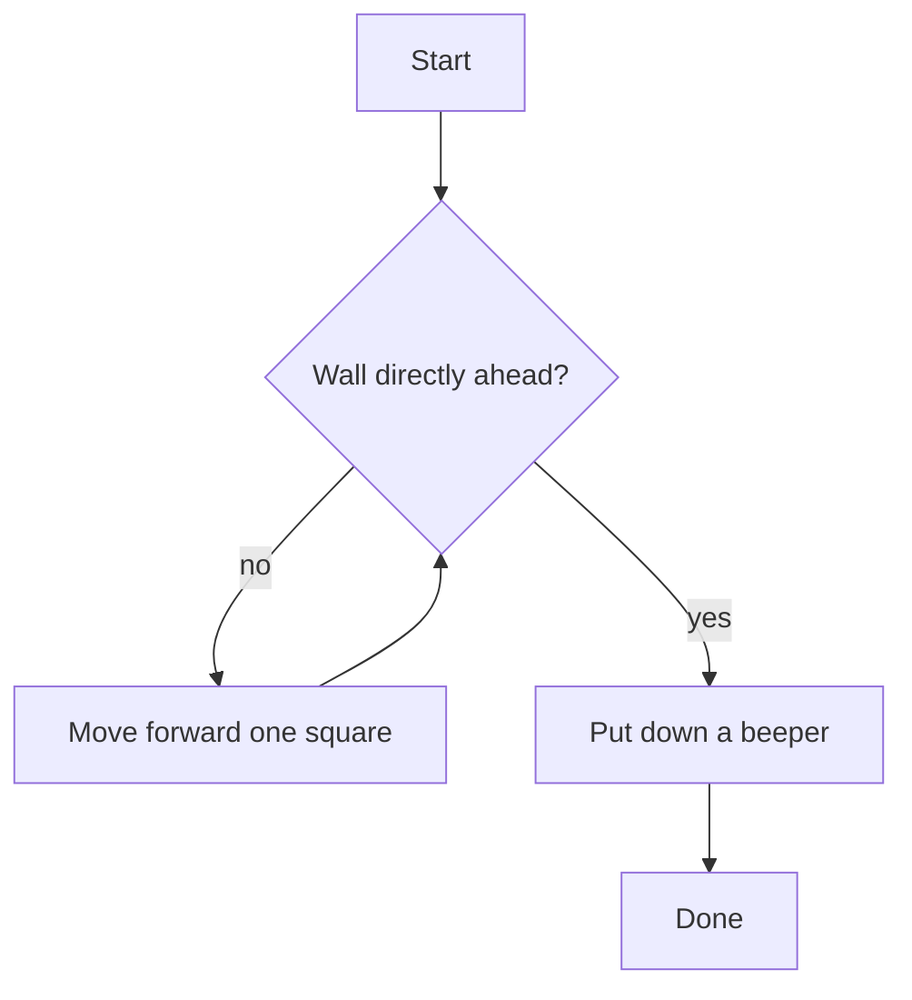

## Learning Objectives

- Define an algorithm as an ordered, unambiguous, finite sequence of steps and distinguish it from a vague plan that only sounds precise.
- Decompose an unfamiliar task into a numbered sequence of concrete steps before writing any real code.
- Identify ordering dependencies between steps and predict what happens when that order is violated.
- Translate a pseudocode plan into working Python with minimal further decisions, once the plan itself is correct.
- Evaluate a proposed plan for ambiguity or missing edge cases before it is implemented.

## Context & Motivation

Stanford's introductory course CS106A has, for decades, opened not with a programming language but with a robot named Karel, who lives on a grid of streets and avenues and understands only a small, fixed vocabulary of commands: move forward one square, turn left ninety degrees, pick up a token called a "beeper" if one sits on the current square. Karel cannot be told "go find a wall" in the abstract; Karel can only be told, precisely, a sequence of the handful of things Karel already knows how to do. That restriction is deliberate pedagogy, not a limitation of the tool. By forcing every plan through such a narrow, literal vocabulary, CS106A makes it impossible for a student to paper over an unclear step with an ordinary-language shortcut — every ambiguity has to surface and get resolved before Karel can do anything at all.

This concept builds directly on the four pillars from *What Is Computation* — decomposition, pattern recognition, abstraction, and algorithm design — but narrows the focus to the pillar that turns a plan into something an executor (Karel, a computer, a person following instructions literally) can actually run: algorithmic thinking. An algorithm, in the strict sense this curriculum uses throughout, is an ordered sequence of unambiguous steps that transforms a starting situation into a desired result in a finite number of steps. Every one of those four words is load-bearing. *Ordered* means the sequence matters and cannot be silently rearranged. *Unambiguous* means each step has exactly one reasonable interpretation, not several. *Finite* means the process is guaranteed to terminate, not run forever. Losing any one of the four turns something that looks like an algorithm into something that is not one — a plan that stalls, does the wrong thing, or never returns.

The discipline this concept asks you to practice is separating the thinking (what has to happen, and in what order) from the typing (which Python keyword expresses "repeat until"). Practicing on a toy robot, exactly as CS106A does, removes the temptation to reach for real syntax before the plan is settled — there is no syntax to reach for yet, only a numbered list of moves. Once that list is genuinely unambiguous, translating it into Python turns out to be close to mechanical, and the value of having done the planning step first becomes obvious: nearly all of the hard thinking already happened on paper, where a mistake costs one crossed-out line, not a debugging session.

## Core Theory

### A toy robot on a grid

Imagine a robot on a grid of streets and avenues, facing East, that can only do four things: move forward one square, turn left 90°, pick up a "beeper" token if one is on its current square, and check whether a wall blocks the square directly ahead. The task: walk to the nearest wall and place a beeper against it.

Decomposed into pseudocode, with no real programming language yet:

```
repeat until wall is directly ahead:
    move forward one square
put down a beeper
```

This is already an algorithm — precise, ordered, and finite — even though it is not Python. Decomposition means noticing that the plan has exactly one repeated action ("move forward") guarded by exactly one condition ("wall ahead"), and one final action that happens exactly once, after the repetition ends. Writing the plan this way, before touching real code, forces the plan's author to answer a question a compiler would otherwise force on them anyway: what happens if the robot starts *already* facing a wall? Reading the pseudocode literally answers it — the loop body never runs even once, and the beeper is placed immediately — which is exactly the correct behavior for that edge case, and the plan proves it without needing to be run.

Only once the plan is settled does translating it become close to mechanical:

```python
while not wall_ahead():
    move_forward()
put_down_beeper()
```

The flow of control in this plan, independent of Python's specific `while` syntax, is:



### Ordering and dependency

Decomposition also means noticing which steps *must* come before others, because an algorithm is an *ordered* sequence — silently reordering steps is not a neutral rewrite, it is a different algorithm that may produce a different result. "Turn to face North, then move forward" only works in that order; reversing it moves the robot in the wrong direction entirely:

```
1. turn_left()      # facing East -> now facing North
2. move_forward()   # moves North, as intended

# reversed order — a different, wrong algorithm:
1. move_forward()   # moves East, still facing East
2. turn_left()      # now facing North, but already in the wrong square
```

Spotting this kind of ordering dependency on paper, as a numbered list, catches the bug before a single line of real code exists. This is one of the concrete payoffs of algorithmic thinking as a discipline: the cost of finding this mistake on paper is crossing out two lines and swapping them; the cost of finding the same mistake after it has been typed as working-looking Python, buried inside a larger program, is a debugging session.

### Finiteness is not automatic

A plan that reads naturally in prose can still fail to be finite. "Keep moving forward until you reach the wall" assumes a wall exists somewhere ahead; on a grid with no boundary in that direction, the "algorithm" as stated never terminates — it is not an algorithm at all under the strict definition, just an infinite process that happens to look like one until it is run. Algorithmic thinking includes explicitly asking, for every repeated step, "what guarantees this eventually stops?" For the Karel example above, the guarantee comes from the physical grid itself — a bounded grid always has a wall in every direction, so `wall_ahead()` is guaranteed to eventually become true. That guarantee is worth stating explicitly in the plan, not left implicit, because it is exactly the kind of assumption that silently breaks when the environment changes (for instance, a grid with a gap in its boundary).

### Decomposing a task with a branching structure

Not every plan is a single repeated action. Consider a fuller Karel task: walk forward, and pick up any beeper found along the way, until a wall is reached. This has two things that can happen at each square — moving is unconditional, but picking up a beeper is conditional on one being present — nested inside the same repetition:

```
repeat until wall is directly ahead:
    if beeper is on current square:
        pick up beeper
    move forward one square
```

```python
while not wall_ahead():
    if beeper_present():
        pick_beeper()
    move_forward()
```

Decomposing this correctly means noticing that "pick up beeper" and "move forward" are not alternatives to each other (an `if`/`else`) — they can both happen at the same square, in that specific order, which is why the plan lists them as two separate, unconditional-then-conditional lines rather than as a single either/or choice.

## Worked Examples

**Example 1 — Planning a laundry-sorting task before writing code.** The vague instruction "sort the laundry" is not yet an algorithm. Decomposed: (1) take one item from the pile; (2) if it is dark-colored, place it in the dark pile; (3) otherwise, place it in the light pile; (4) repeat until the original pile is empty. Written as pseudocode:

```
repeat until pile is empty:
    take one item from pile
    if item is dark-colored:
        add item to dark pile
    else:
        add item to light pile
```

Translating directly:

```python
def sort_laundry(pile):
    dark_pile = []
    light_pile = []
    while len(pile) > 0:
        item = pile.pop()
        if item.is_dark:
            dark_pile.append(item)
        else:
            light_pile.append(item)
    return dark_pile, light_pile
```

Every line of the Python is a direct transcription of a line in the pseudocode — the decomposition step did essentially all of the thinking, and the translation step required no new decisions.

**Example 2 — Catching a missing edge case on paper.** Plan: "find the first negative number in a list of numbers, and report its position." A first draft of the pseudocode:

```
for each number in the list, at position i:
    if number is negative:
        report position i
```

Reading this plan critically, as algorithmic thinking demands, surfaces an unanswered question: what should happen if *no* number in the list is negative? The plan as written simply ends without reporting anything, which is ambiguous — did it fail, or did it correctly find nothing? A corrected plan makes the "not found" case an explicit, unambiguous step:

```
for each number in the list, at position i:
    if number is negative:
        report position i
        stop
report that no negative number was found
```

```python
def first_negative_position(numbers):
    for i in range(len(numbers)):
        if numbers[i] < 0:
            return i
    return None   # explicit: no negative number was found

print(first_negative_position([4, 7, -2, 9]))   # 2
print(first_negative_position([4, 7, 2, 9]))    # None
```

The fix was found entirely in the planning stage, by asking "what if the loop finishes and nothing triggered?" — exactly the kind of question algorithmic thinking trains a student to ask before code, not after a bug report.

**Example 3 — A plan with an ordering mistake, found and fixed.** Task: "compute the average of a list of numbers, but only after removing the highest and lowest values." A first, sloppy pseudocode:

```
compute the average of the list
remove the highest and lowest values
```

Read literally, this plan computes the average of the *original* list and then throws away two values afterward, achieving nothing useful — the ordering is backwards relative to what the task actually requires. The corrected plan puts the steps in the order the task depends on:

```
remove the highest and lowest values from the list
compute the average of what remains
```

```python
def trimmed_average(numbers):
    remaining = sorted(numbers)[1:-1]   # drop lowest and highest
    return sum(remaining) / len(remaining)

print(trimmed_average([9, 1, 5, 5, 100]))   # average of [5, 5, 9] = 6.333...
```

The bug here was never a Python bug — a working, syntactically valid program could be written for either ordering. It was an algorithmic-thinking bug, caught by checking the plan's *order* against what the task actually required, before any code existed to debug.

## Common Misconceptions & Pitfalls

- **"Writing a plan first just slows me down — I'll figure it out while coding."** A precise plan does take longer than immediately typing something, but an ambiguous or misordered step discovered while debugging real code costs far more time than discovering the same problem on paper, where the fix is a one-line edit to a numbered list, as in the trimmed-average example above.
- **"If it reads fine in English, it's precise enough."** Natural language tolerates gaps a strict algorithm cannot. "Keep moving until you reach the wall" reads as perfectly clear prose but silently assumes a wall is guaranteed to exist — an assumption that needs to be checked explicitly, not left implicit, exactly as discussed under finiteness above.
- **"Toy environments like a grid-robot don't teach anything about real programming."** The discipline transfers even though the toy world is simplified; the Karel abstraction deliberately strips away real-world messiness (multiple robots acting at once, unreliable sensors, timing) so that decomposition and ordering can be practiced without those complications. A plan that only works in the clean toy world may need rework once real constraints show up later in the curriculum, but the habit of writing an unambiguous, ordered, finite plan first does not change.
- **"Over-specifying every possible edge case in prose makes a plan more rigorous."** Past a point, writing out every conceivable edge case in prose becomes as unproductive as under-specifying — a plan so exhaustive that it takes longer to read than to just write the code and test it has stopped serving its purpose. The goal is a plan precise enough to be unambiguous on the cases that actually matter for the task, not maximal exhaustiveness for its own sake.

## Summary

An algorithm is an ordered, unambiguous, finite sequence of steps, and every one of those three properties can fail independently: steps can be silently reordered into a different (and wrong) algorithm, a step can hide more than one reasonable interpretation, and a repeated action can lack any real guarantee that it terminates. Decomposition — breaking a vague task into a numbered plan before writing real code — is how these failures get caught cheaply, on paper, rather than expensively, in a debugger. Toy environments like Karel's grid exist specifically to force this discipline by removing real syntax as an escape hatch; the same habits of checking order, checking for missing branches, and checking for guaranteed termination apply directly once real code is being written. Once a plan is genuinely unambiguous, translating it into Python is close to mechanical — most of the thinking already happened before the first line of code was typed.

## Documentation Links

- [Wing, "Computational Thinking" — Communications of the ACM (2006)](https://dl.acm.org/doi/10.1145/1118178.1118215) — doc
- [Stanford CS106A — Course Schedule](https://web.stanford.edu/class/cs106a/schedule) — doc
