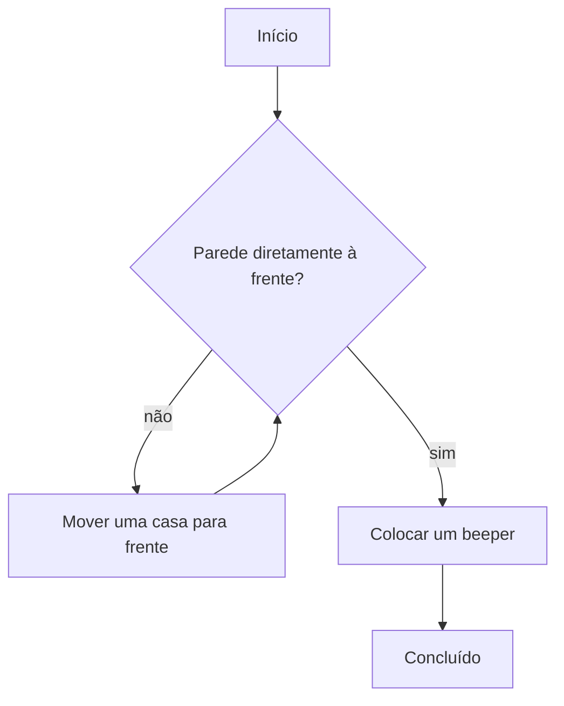

## Objetivos de Aprendizagem

- Definir um algoritmo como uma sequência ordenada, inequívoca e finita de passos, e distingui-lo de um plano vago que só soa preciso.
- Decompor uma tarefa desconhecida em uma sequência numerada de passos concretos antes de escrever qualquer código real.
- Identificar dependências de ordem entre os passos e prever o que acontece quando essa ordem é violada.
- Traduzir um plano em pseudocódigo para Python funcional com o mínimo de decisões adicionais, uma vez que o plano em si esteja correto.
- Avaliar um plano proposto quanto a ambiguidades ou casos extremos ausentes antes de ele ser implementado.

## Contexto e Motivação

O curso introdutório CS106A de Stanford começa, há décadas, não com uma linguagem de programação, mas com um robô chamado Karel, que vive numa grade de ruas e avenidas e entende apenas um vocabulário pequeno e fixo de comandos: mover uma casa para frente, girar noventa graus à esquerda, pegar um token chamado "beeper" se houver um na casa atual. Não é possível dizer a Karel "vá encontrar uma parede" de forma abstrata; só é possível dizer a Karel, com precisão, uma sequência das poucas coisas que Karel já sabe fazer. Essa restrição é pedagogia deliberada, não uma limitação da ferramenta. Ao forçar todo plano a passar por um vocabulário tão estreito e literal, o CS106A torna impossível que um aluno disfarce um passo pouco claro com um atalho da linguagem cotidiana: toda ambiguidade precisa vir à tona e ser resolvida antes que Karel consiga fazer qualquer coisa.

Este conceito se apoia diretamente nos quatro pilares de *O Que É Computação*: decomposição, reconhecimento de padrões, abstração e design de algoritmos, mas estreita o foco para o pilar que transforma um plano em algo que um executor (Karel, um computador, uma pessoa seguindo instruções ao pé da letra) realmente consegue executar: o pensamento algorítmico. Um algoritmo, no sentido estrito usado por este currículo, é uma sequência ordenada de passos inequívocos que transforma uma situação inicial num resultado desejado em um número finito de passos. Cada uma dessas quatro palavras é estrutural. *Ordenada* significa que a sequência importa e não pode ser reorganizada silenciosamente. *Inequívocos* significa que cada passo tem exatamente uma interpretação razoável, não várias. *Finito* significa que o processo tem garantia de terminar, não de rodar para sempre. Perder qualquer uma dessas quatro propriedades transforma algo que parece um algoritmo em algo que não é: um plano que trava, faz a coisa errada ou nunca retorna.

A disciplina que este conceito pede para você praticar é separar o pensamento (o que precisa acontecer, e em que ordem) da digitação (qual palavra-chave do Python expressa "repita até"). Praticar num robô de brinquedo, exatamente como faz o CS106A, remove a tentação de recorrer à sintaxe real antes de o plano estar definido: ainda não há sintaxe para recorrer, apenas uma lista numerada de movimentos. Uma vez que essa lista seja genuinamente inequívoca, traduzi-la para Python acaba sendo quase mecânico, e o valor de ter feito primeiro a etapa de planejamento fica óbvio: quase todo o raciocínio difícil já aconteceu no papel, onde um erro custa uma linha riscada, não uma sessão de depuração.

## Teoria Central

### Um robô de brinquedo numa grade

Imagine um robô numa grade de ruas e avenidas, voltado para o Leste, que só consegue fazer quatro coisas: mover uma casa para frente, girar 90° à esquerda, pegar um token "beeper" se houver um na casa atual, e verificar se uma parede bloqueia a casa logo à frente. A tarefa: caminhar até a parede mais próxima e colocar um beeper junto a ela.

Decomposta em pseudocódigo, ainda sem nenhuma linguagem de programação real:

```
repita até que a parede esteja diretamente à frente:
    mova uma casa para frente
coloque um beeper
```

Isso já é um algoritmo (preciso, ordenado e finito), mesmo não sendo Python. Decomposição significa perceber que o plano tem exatamente uma ação repetida ("mover para frente") protegida por exatamente uma condição ("parede à frente"), e uma ação final que acontece exatamente uma vez, depois que a repetição termina. Escrever o plano dessa forma, antes de tocar em código real, obriga quem o escreve a responder uma pergunta que um compilador acabaria forçando de qualquer jeito: o que acontece se o robô já começa voltado para uma parede? Ler o pseudocódigo literalmente responde a isso: o corpo do laço nunca chega a rodar nem uma vez, e o beeper é colocado imediatamente, que é exatamente o comportamento correto para esse caso extremo, e o plano prova isso sem precisar ser executado.

Só depois que o plano está definido é que traduzi-lo se torna quase mecânico:

```python
while not wall_ahead():
    move_forward()
put_down_beeper()
```

O fluxo de controle deste plano, independente da sintaxe específica do `while` em Python, é:



### Ordenação e dependência

Decomposição também significa perceber quais passos *precisam* vir antes de outros, porque um algoritmo é uma sequência *ordenada*: reordenar passos silenciosamente não é uma reescrita neutra, é um algoritmo diferente que pode produzir um resultado diferente. "Virar para o Norte, depois mover para frente" só funciona nessa ordem; invertê-la move o robô completamente na direção errada:

```
1. turn_left()      # voltado para Leste -> agora voltado para Norte
2. move_forward()   # move para o Norte, como esperado

# ordem invertida: um algoritmo diferente e errado
1. move_forward()   # move para Leste, ainda voltado para Leste
2. turn_left()      # agora voltado para Norte, mas já na casa errada
```

Detectar esse tipo de dependência de ordem no papel, como uma lista numerada, pega o bug antes de existir uma única linha de código real. Esse é um dos ganhos concretos do pensamento algorítmico como disciplina: o custo de achar esse erro no papel é riscar duas linhas e trocá-las de lugar; o custo de achar o mesmo erro depois que ele já foi digitado como Python de aparência funcional, escondido dentro de um programa maior, é uma sessão de depuração.

### A finitude não é automática

Um plano que soa natural em prosa ainda pode falhar em ser finito. "Continue andando para frente até chegar à parede" assume que existe uma parede em algum lugar à frente; numa grade sem limite naquela direção, o "algoritmo" como está escrito nunca termina: sob a definição estrita, isso não é um algoritmo, é apenas um processo infinito que parece um até ser executado. O pensamento algorítmico inclui perguntar explicitamente, para cada passo repetido, "o que garante que isso eventualmente para?" No exemplo do Karel acima, a garantia vem da própria grade física: uma grade limitada sempre tem uma parede em toda direção, então `wall_ahead()` tem garantia de eventualmente se tornar verdadeiro. Vale a pena declarar essa garantia explicitamente no plano, em vez de deixá-la implícita, porque é exatamente o tipo de suposição que quebra silenciosamente quando o ambiente muda (por exemplo, uma grade com uma brecha no seu limite).

### Decompondo uma tarefa com estrutura de ramificação

Nem todo plano é uma única ação repetida. Considere uma tarefa mais completa para o Karel: andar para frente e pegar qualquer beeper encontrado pelo caminho, até chegar a uma parede. Aqui existem duas coisas que podem acontecer em cada casa (mover é incondicional, mas pegar um beeper é condicional à presença de um) aninhadas dentro da mesma repetição:

```
repita até que a parede esteja diretamente à frente:
    se houver um beeper na casa atual:
        pegue o beeper
    mova uma casa para frente
```

```python
while not wall_ahead():
    if beeper_present():
        pick_beeper()
    move_forward()
```

Decompor isso corretamente significa perceber que "pegar o beeper" e "mover para frente" não são alternativas entre si (um `if`/`else`): as duas podem acontecer na mesma casa, nessa ordem específica, e é por isso que o plano as lista como duas linhas separadas, uma condicional e uma incondicional em sequência, em vez de uma única escolha do tipo ou-um-ou-outro.

## Exemplos Resolvidos

**Exemplo 1: planejando uma tarefa de separar roupa suja antes de escrever código.** A instrução vaga "separe a roupa suja" ainda não é um algoritmo. Decomposta: (1) pegue um item da pilha; (2) se for de cor escura, coloque na pilha escura; (3) caso contrário, coloque na pilha clara; (4) repita até a pilha original ficar vazia. Escrita como pseudocódigo:

```
repita até a pilha ficar vazia:
    pegue um item da pilha
    se o item for de cor escura:
        adicione o item à pilha escura
    senão:
        adicione o item à pilha clara
```

Traduzindo diretamente:

```python
def sort_laundry(pile):
    dark_pile = []
    light_pile = []
    while len(pile) > 0:
        item = pile.pop()
        if item.is_dark:
            dark_pile.append(item)
        else:
            light_pile.append(item)
    return dark_pile, light_pile
```

Cada linha do Python é uma transcrição direta de uma linha do pseudocódigo: a etapa de decomposição fez essencialmente todo o raciocínio, e a etapa de tradução não exigiu nenhuma decisão nova.

**Exemplo 2: pegando um caso extremo ausente no papel.** Plano: "encontre o primeiro número negativo numa lista de números, e relate sua posição." Um primeiro rascunho do pseudocódigo:

```
para cada número na lista, na posição i:
    se o número for negativo:
        relate a posição i
```

Ler esse plano de forma crítica, como o pensamento algorítmico exige, traz à tona uma pergunta sem resposta: o que deve acontecer se *nenhum* número da lista for negativo? O plano como está escrito simplesmente termina sem relatar nada, o que é ambíguo: falhou, ou encontrou corretamente nenhum resultado? Um plano corrigido transforma o caso de "não encontrado" num passo explícito e inequívoco:

```
para cada número na lista, na posição i:
    se o número for negativo:
        relate a posição i
        pare
relate que nenhum número negativo foi encontrado
```

```python
def first_negative_position(numbers):
    for i in range(len(numbers)):
        if numbers[i] < 0:
            return i
    return None   # explícito: nenhum número negativo foi encontrado

print(first_negative_position([4, 7, -2, 9]))   # 2
print(first_negative_position([4, 7, 2, 9]))    # None
```

A correção foi encontrada inteiramente na etapa de planejamento, ao perguntar "e se o laço terminar e nada tiver disparado?", exatamente o tipo de pergunta que o pensamento algorítmico treina o aluno a fazer antes do código, não depois de um relatório de bug.

**Exemplo 3: um plano com um erro de ordem, encontrado e corrigido.** Tarefa: "calcule a média de uma lista de números, mas somente depois de remover os valores mais alto e mais baixo." Um primeiro pseudocódigo, descuidado:

```
calcule a média da lista
remova os valores mais alto e mais baixo
```

Lido literalmente, esse plano calcula a média da lista *original* e só depois descarta dois valores, sem alcançar nada útil: a ordem está invertida em relação ao que a tarefa realmente exige. O plano corrigido coloca os passos na ordem de que a tarefa depende:

```
remova os valores mais alto e mais baixo da lista
calcule a média do que restar
```

```python
def trimmed_average(numbers):
    remaining = sorted(numbers)[1:-1]   # descarta o menor e o maior
    return sum(remaining) / len(remaining)

print(trimmed_average([9, 1, 5, 5, 100]))   # média de [5, 5, 9] = 6.333...
```

O bug aqui nunca foi um bug de Python: um programa funcional e sintaticamente válido poderia ser escrito para qualquer uma das duas ordens. Foi um bug de pensamento algorítmico, encontrado ao checar a *ordem* do plano contra o que a tarefa realmente exigia, antes de existir qualquer código para depurar.

## Erros Comuns e Armadilhas

- **"Escrever um plano primeiro só me atrasa, vou resolver enquanto codifico."** Um plano preciso realmente leva mais tempo do que digitar algo de imediato, mas um passo ambíguo ou fora de ordem descoberto durante a depuração de código real custa muito mais tempo do que descobrir o mesmo problema no papel, onde a correção é uma edição de uma linha numa lista numerada, como no exemplo da média aparada acima.
- **"Se soa bem em linguagem natural, já é preciso o suficiente."** A linguagem natural tolera lacunas que um algoritmo estrito não tolera. "Continue andando até chegar à parede" soa como uma prosa perfeitamente clara, mas assume silenciosamente que uma parede tem garantia de existir, uma suposição que precisa ser checada explicitamente, não deixada implícita, exatamente como discutido acima na seção sobre finitude.
- **"Ambientes de brinquedo como um robô em grade não ensinam nada sobre programação real."** A disciplina se transfere mesmo que o mundo de brinquedo seja simplificado; a abstração do Karel remove deliberadamente as complicações do mundo real (múltiplos robôs agindo ao mesmo tempo, sensores não confiáveis, temporização) para que decomposição e ordenação possam ser praticadas sem essas complicações. Um plano que só funciona no mundo de brinquedo limpo pode precisar de retrabalho quando restrições reais aparecerem mais adiante no currículo, mas o hábito de escrever primeiro um plano inequívoco, ordenado e finito não muda.
- **"Especificar demais cada caso extremo possível em prosa torna um plano mais rigoroso."** A partir de certo ponto, escrever todo caso extremo concebível em prosa se torna tão improdutivo quanto especificar de menos: um plano tão exaustivo que demora mais para ler do que simplesmente escrever o código e testá-lo deixou de cumprir seu propósito. O objetivo é um plano preciso o suficiente para ser inequívoco nos casos que realmente importam para a tarefa, não uma exaustividade máxima como um fim em si mesma.

## Resumo

Um algoritmo é uma sequência ordenada, inequívoca e finita de passos, e cada uma dessas três propriedades pode falhar de forma independente: passos podem ser reordenados silenciosamente num algoritmo diferente (e errado), um passo pode esconder mais de uma interpretação razoável, e uma ação repetida pode não ter nenhuma garantia real de que vai terminar. Decomposição (quebrar uma tarefa vaga num plano numerado antes de escrever código real) é como essas falhas são pegas de forma barata, no papel, em vez de cara, num depurador. Ambientes de brinquedo como a grade do Karel existem especificamente para forçar essa disciplina removendo a sintaxe real como válvula de escape; os mesmos hábitos de checar a ordem, checar ramos ausentes e checar a garantia de terminação se aplicam diretamente quando código real está sendo escrito. Uma vez que um plano é genuinamente inequívoco, traduzi-lo para Python é quase mecânico: a maior parte do raciocínio já aconteceu antes de a primeira linha de código ser digitada.

## Documentation Links

- [Wing, "Computational Thinking", Communications of the ACM (2006)](https://dl.acm.org/doi/10.1145/1118178.1118215) (doc)
- [Stanford CS106A, Cronograma do Curso](https://web.stanford.edu/class/cs106a/schedule) (doc)
