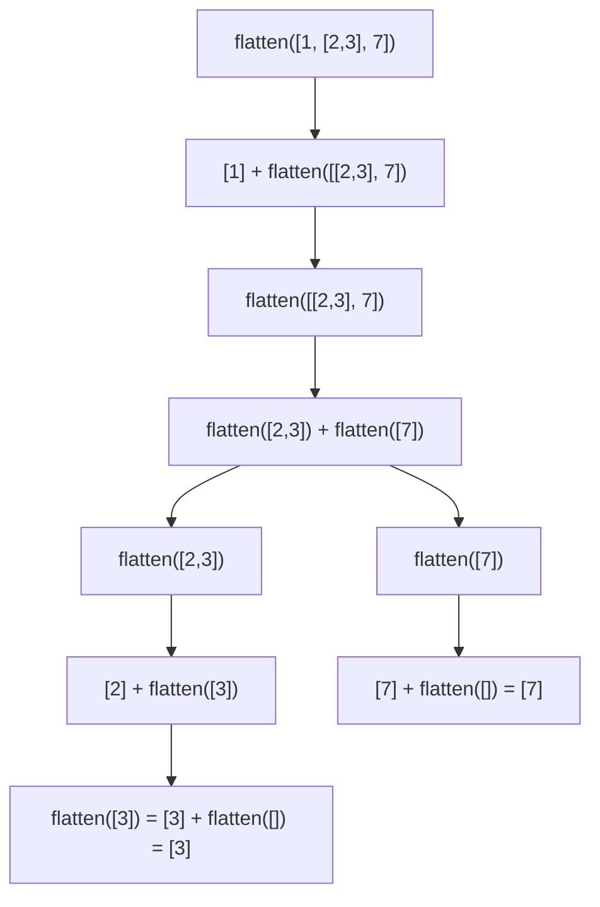

## Learning Objectives

- Explain what it means to recurse on a value's *shape* rather than on a shrinking number.
- Implement structural recursion over strings and arbitrarily nested lists, correctly identifying the base case in each.
- Identify the "smaller version of the same structure" in a new problem before writing any code.
- Predict when structural recursion will raise `RecursionError` and explain why a loop-based traversal avoids that failure mode.
- Compare a structural-recursion solution with an equivalent iterative one to judge when each is the better fit.

## Context & Motivation

The previous concept introduced recursion through the classic numeric pattern: a function calls itself on `n - 1`, and the base case is "the number reached zero." That pattern is memorable, but it's also narrow — it can make recursion look like a trick that only applies to counting down. In reality, recursion is a far more general idea: it applies to *anything defined in terms of a smaller version of itself*, and many everyday data structures already have exactly that kind of definition built in. A string is either empty, or it's one character followed by a (shorter) string. A list is either empty, or it's one element followed by a (shorter) list. Neither of those definitions mentions a number at all — the thing getting smaller is the *structure itself*.

This is the idea behind structural recursion, and it matters for reasons well beyond writing a slightly different kind of function. MIT's 6.100L deliberately sequences recursion this way: numeric recursion first, to establish the base-case/recursive-case vocabulary in the simplest possible setting, and structural recursion second, to generalize that vocabulary to the data students already know — strings, lists, and (later in the curriculum) nested lists that stand in for trees. The generalization is what matters. Once "the base case is the smallest instance of the structure, and the recursive case operates on a strictly smaller instance of the same structure" clicks, it stops being a special case and becomes the lens through which tree traversal, graph traversal, parsing, and recursive data processing of every kind are read. This concept is the bridge between "recursion is something you do with `n - 1`" and "recursion is something you do with *shape*."

There is also a formal echo of this idea in discrete mathematics: proving a property holds for every string or every list by induction on its structure (structural induction) is the mathematical mirror of writing a structurally recursive function — the base case of the proof matches the base case of the code, and the inductive step matches the recursive case. You don't need the proof technique to write the code, but recognizing that the two are the same shape is part of what makes a computer scientist comfortable with recursion rather than merely tolerant of it.

## Core Theory

### From numeric shrinking to structural shrinking

The general schema for any recursive function is: identify a base case (the smallest, simplest instance, which can be answered directly with no further recursion) and a recursive case (an instance that can be answered by combining a direct answer for one small piece with a recursive answer for what remains). Numeric recursion instantiates this schema with "smallest instance" = 0 and "one small piece" = "subtract 1." Structural recursion instantiates the *same* schema with "smallest instance" = the empty string or empty list, and "one small piece" = "the first character" or "the first element." Nothing else changes — the guarantee that recursion terminates still comes from the same place: each recursive call operates on a structure that is strictly smaller (one character shorter, one element shorter) than the one it was called with, so repeated shrinking is guaranteed to eventually reach the base case, exactly as `n - 1` is guaranteed to eventually reach 0.

### Recursing on a string

```python
def is_palindrome(s):
    if len(s) <= 1:                  # base case — 0 or 1 characters is always a palindrome
        return True
    if s[0] != s[-1]:                # first and last characters must match
        return False
    return is_palindrome(s[1:-1])    # recursive case — check the smaller, inner string

is_palindrome("racecar")   # True
is_palindrome("hello")      # False
```

The base case here isn't a number reaching zero — it's the string shrinking to length 0 or 1, at which point there's nothing left to compare. Each recursive call strips off both ends and checks a strictly shorter string, guaranteeing the base case is eventually reached, exactly like `n - 1` guarantees `factorial` reaches 0. Notice the base case actually has to cover *two* cases here (length 0 *and* length 1) — a beginner writing `if len(s) == 0` alone would crash comparing `s[0]` to `s[-1]` on a single-character string in some formulations, or (as written here) simply never terminate cleanly on odd-length input, because the "0 or 1" base case is what correctly stops the shrinking one step before it goes negative.

### Recursing on a nested list

```python
def flatten(nested):
    if not nested:                      # base case — empty list, nothing to flatten
        return []
    first, rest = nested[0], nested[1:]
    if isinstance(first, list):
        return flatten(first) + flatten(rest)   # first is itself a list — recurse into it
    return [first] + flatten(rest)               # first is a plain value — keep it, recurse on rest

flatten([1, [2, 3], 7])   # [1, 2, 3, 7]
```

This handles nesting to *any* depth without knowing that depth ahead of time, because the recursion itself discovers it: whenever `first` turns out to be a list, `flatten` calls itself on that nested list before moving on, and however deep that nesting goes, each call is on a structurally smaller piece. Tracing `flatten([1, [2, 3], 7])` makes the "smaller piece" guarantee concrete:



Every arrow in that tree points to a call on a list that is strictly shorter, or nested one level less deep, than its parent — which is exactly why the recursion is guaranteed to bottom out.

### A broken/fixed pair: forgetting the empty-structure base case

```python
def flatten_broken(nested):
    first, rest = nested[0], nested[1:]      # no check for an empty list first!
    if isinstance(first, list):
        return flatten_broken(first) + flatten_broken(rest)
    return [first] + flatten_broken(rest)

flatten_broken([1, 2])
# IndexError: list index out of range
```

`flatten_broken` never checks whether `nested` is empty before indexing into it with `nested[0]`. Every call to `flatten_broken` on a non-empty list eventually recurses on `rest`, and `rest` eventually becomes `[]` once every element has been peeled off — at that point `nested[0]` on an empty list raises `IndexError`, because there is no base case telling the recursion "you've reached the smallest instance, stop and return directly." The fix is exactly the `if not nested: return []` line at the top of the correct `flatten` above: the base case isn't an optional safety check, it's the thing that makes the recursion well-defined at all, in the same way `if n == 0: return 1` is not optional in numeric factorial recursion.

## Worked Examples

**Example 1 — `is_palindrome`, built up step by step.** Start from the question: what's the smallest string for which "is this a palindrome" has an obvious answer with no further work? An empty string, trivially, and a single character, trivially — both read the same forwards and backwards. That's the base case: `len(s) <= 1: return True`. Now, for a longer string, what has to be true for it to be a palindrome? Its first and last characters must match — if they don't, we can return `False` immediately without looking at anything else. If they do match, the *only* remaining question is whether the string with those two characters removed is itself a palindrome — which is the exact same question, on a string two characters shorter. That "same question, smaller input" observation is the recursive case: `return is_palindrome(s[1:-1])`. Tracing `is_palindrome("racecar")`: compare `r`/`r` (match) → recurse on `"aceca"` → compare `a`/`a` (match) → recurse on `"cec"` → compare `c`/`c` (match) → recurse on `"e"` → base case, length 1, return `True`. Every level's answer depends only on one smaller level, all the way down.

**Example 2 — `flatten`, built up step by step.** The smallest nested list for which flattening is obvious is the empty list — flattening it produces the empty list, no further work needed: `if not nested: return []`. For a non-empty list, split off the first element and "the rest." If the first element is itself a list, it has its own flattening to do before it can be combined with anything — so recurse on it: `flatten(first)`. Either way, whatever the first element contributed still needs to be followed by the flattened version of everything after it: `+ flatten(rest)`. Put together, that's the full function above. The call tree traced in Core Theory shows exactly how each level narrows: `flatten([1, [2,3], 7])` doesn't do all the work itself, it delegates to `flatten([[2,3], 7])` for "everything after the first element," which itself delegates further, until every call is operating on either an empty list or a single non-list element.

**Example 3 — `sum_nested`, summing every number in an arbitrarily nested list.** This is the same pattern applied to a new question, built the same way. Smallest instance: an empty list sums to 0 — `if not nested: return 0`. For a non-empty list, split into `first` and `rest` as before. If `first` is a list, its own numbers need to be summed first: `sum_nested(first)`. If `first` is a plain number, it contributes itself directly. Either way, add whatever `first` contributed to the sum of everything else: `+ sum_nested(rest)`.

```python
def sum_nested(nested):
    if not nested:
        return 0
    first, rest = nested[0], nested[1:]
    if isinstance(first, list):
        return sum_nested(first) + sum_nested(rest)
    return first + sum_nested(rest)

sum_nested([1, [2, 3], [4, [5, 6]], 7])   # 28
```

Recognizing that `sum_nested` and `flatten` are *the same recursive skeleton* with a different combining step (`+` instead of list concatenation) is the real payoff of this example — once the skeleton is internalized, a whole family of "process every element of an arbitrarily nested structure" problems becomes a matter of filling in the combining step, not reinventing the recursion.

## Common Misconceptions & Pitfalls

**"Recursion only works when something is counting down to zero."** A student who has only seen numeric recursion often tries to force a structural problem into that mold — for instance, converting a string into indices and recursing on `range(len(s))` instead of recognizing "the rest of the string" as the smaller subproblem. The tell that a problem is structural rather than numeric is that the natural base case is "nothing left" (an empty string or list), not "a specific number reached." Once that's recognized, `s[1:]` or `nested[1:]` is the natural way to shrink, not an index counting down.

**Slicing feels free, but it isn't.** `s[1:-1]` and `nested[1:]` both create a brand-new string or list on every call, copying every remaining element — the cost is proportional to what's left at each level, so the total copying cost across the whole recursion adds up. This is easy to demonstrate: recursing on an index into the *original* string instead of a fresh slice avoids the repeated copies entirely.

```python
def is_palindrome_by_index(s, lo, hi):
    if lo >= hi:
        return True
    if s[lo] != s[hi]:
        return False
    return is_palindrome_by_index(s, lo + 1, hi - 1)

is_palindrome_by_index("racecar", 0, len("racecar") - 1)   # True — no slicing at any step
```

For short strings the difference is invisible; for a very long string, the slicing version does meaningfully more copying work than the index-based one, even though both are "the same algorithm" in spirit.

**Deep nesting can hit Python's recursion limit, and a loop wouldn't.** A list nested a few thousand levels deep will make `flatten` raise `RecursionError`, because each level of nesting is one more stack frame, and Python bounds how many stack frames can be active at once:

```python
deeply_nested = 1
for _ in range(5000):
    deeply_nested = [deeply_nested]

flatten(deeply_nested)
# RecursionError: maximum recursion depth exceeded
```

An iterative traversal using an explicit stack (a plain list you push and pop from yourself) processes the same nested structure without ever growing Python's call stack, and so never hits this limit — the recursion limit is a property of *how deep the function calls go*, not of how much data there is to process.

**Forgetting the base case doesn't just give a wrong answer — it crashes.** As the broken/fixed pair above shows, omitting `if not nested: return []` doesn't make `flatten` merely inaccurate; it makes `nested[0]` raise `IndexError` the moment the recursion reaches an empty list, because there's no case telling the function to stop and answer directly instead of indexing into nothing.

## Summary

Structural recursion generalizes the base-case/recursive-case pattern from "a number reaching zero" to "a structure reaching its smallest instance" — an empty string or an empty list. The recursive case peels off one piece (a character, an element) and recurses on strictly less structure, which is what guarantees termination, exactly as decrementing `n` does for numeric recursion. The same skeleton (check for the empty case, split into "first" and "rest," recurse on the pieces, combine the results) solves palindrome-checking, flattening, and summing alike — only the combining step changes. Two very real costs come with this convenience: slicing creates new copies at every level, and deep structural nesting can exhaust Python's recursion limit the same way deep numeric recursion can. Recognizing "the rest of the sequence" as the smaller subproblem — rather than reflexively reaching for a numeric index — is itself the skill this concept is building, and it is exactly the skill tree and graph traversal will require next.

## Documentation Links

- [Python Tutorial — Data Structures](https://docs.python.org/3/tutorial/datastructures.html) — doc
- [MIT 6.100L — Materials by Lecture](https://ocw.mit.edu/courses/6-100l-introduction-to-cs-and-programming-using-python-fall-2022/pages/material-by-lecture/) — doc
