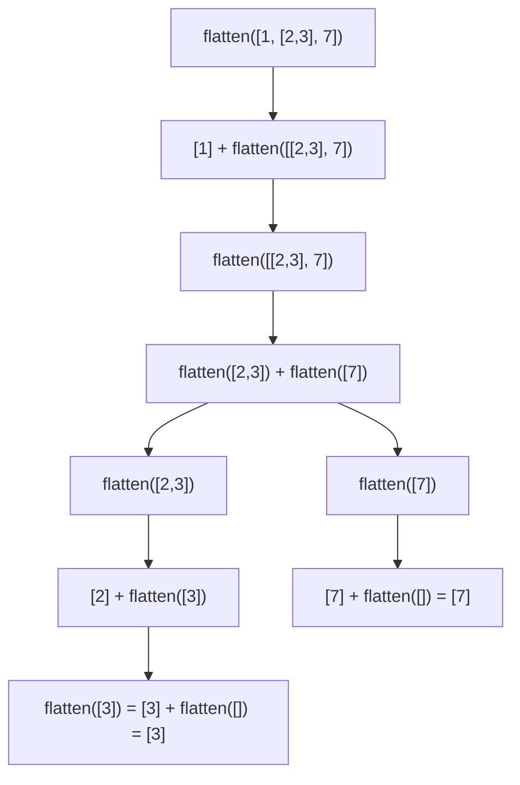

## Objetivos de Aprendizagem

- Explicar o que significa recursar sobre a *forma* de um valor em vez de sobre um número que encolhe.
- Implementar recursão estrutural sobre strings e listas aninhadas de forma arbitrária, identificando corretamente o caso base em cada uma.
- Identificar a "versão menor da mesma estrutura" num problema novo antes de escrever qualquer código.
- Prever quando a recursão estrutural vai disparar `RecursionError` e explicar por que uma travessia baseada em laço evita esse modo de falha.
- Comparar uma solução de recursão estrutural com uma iterativa equivalente para julgar quando cada uma é o encaixe melhor.

## Contexto e Motivação

O conceito anterior apresentou recursão através do padrão numérico clássico: uma função chama a si mesma sobre `n - 1`, e o caso base é "o número chegou a zero." Esse padrão é memorável, mas também é estreito: pode fazer a recursão parecer um truque que só se aplica a contar regressivamente. Na realidade, recursão é uma ideia muito mais geral: ela se aplica a *qualquer coisa definida em termos de uma versão menor de si mesma*, e muitas estruturas de dados do dia a dia já têm exatamente esse tipo de definição embutida. Uma string ou está vazia, ou é um caractere seguido de uma string (mais curta). Uma lista ou está vazia, ou é um elemento seguido de uma lista (mais curta). Nenhuma dessas definições menciona um número de forma alguma: o que está encolhendo é a *estrutura em si*.

Essa é a ideia por trás da recursão estrutural, e ela importa por razões bem além de escrever um tipo levemente diferente de função. O 6.100L do MIT deliberadamente sequencia recursão desta forma: recursão numérica primeiro, para estabelecer o vocabulário de caso base/caso recursivo no cenário mais simples possível, e recursão estrutural em segundo, para generalizar esse vocabulário aos dados que os alunos já conhecem (strings, listas, e mais adiante no currículo, listas aninhadas que representam árvores). A generalização é o que importa. Uma vez que "o caso base é a instância mais simples da estrutura, e o caso recursivo opera sobre uma instância estritamente menor da mesma estrutura" faz clique, isso deixa de ser um caso especial e se torna a lente através da qual travessia de árvore, travessia de grafo, análise sintática, e processamento de dados recursivo de todo tipo são lidos. Este conceito é a ponte entre "recursão é algo que você faz com `n - 1`" e "recursão é algo que você faz com *forma*."

Também há um eco formal dessa ideia na matemática discreta: provar que uma propriedade vale para toda string ou toda lista por indução na estrutura (indução estrutural) é o espelho matemático de escrever uma função estruturalmente recursiva: o caso base da prova combina com o caso base do código, e o passo indutivo combina com o caso recursivo. Você não precisa da técnica de prova para escrever o código, mas reconhecer que os dois têm a mesma forma é parte do que torna um cientista da computação confortável com recursão em vez de meramente tolerante a ela.

## Teoria Central

### Do encolhimento numérico ao encolhimento estrutural

O esquema geral para qualquer função recursiva é: identifique um caso base (a instância mais simples e menor, que pode ser respondida diretamente sem mais recursão) e um caso recursivo (uma instância que pode ser respondida combinando uma resposta direta para uma pequena peça com uma resposta recursiva para o que resta). A recursão numérica instancia esse esquema com "instância menor" = 0 e "uma pequena peça" = "subtrair 1." A recursão estrutural instancia o *mesmo* esquema com "instância menor" = a string vazia ou lista vazia, e "uma pequena peça" = "o primeiro caractere" ou "o primeiro elemento." Nada mais muda: a garantia de que a recursão termina ainda vem do mesmo lugar: cada chamada recursiva opera sobre uma estrutura que é estritamente menor (um caractere mais curta, um elemento mais curta) do que aquela com que foi chamada, então o encolhimento repetido tem garantia de eventualmente alcançar o caso base, exatamente como `n - 1` tem garantia de eventualmente alcançar 0.

### Recursando sobre uma string

```python
def is_palindrome(s):
    if len(s) <= 1:                  # caso base -- 0 ou 1 caracteres é sempre um palíndromo
        return True
    if s[0] != s[-1]:                # o primeiro e o último caractere precisam combinar
        return False
    return is_palindrome(s[1:-1])    # caso recursivo -- checa a string menor e interna

is_palindrome("racecar")   # True
is_palindrome("hello")      # False
```

O caso base aqui não é um número chegando a zero: é a string encolhendo para comprimento 0 ou 1, ponto em que não sobra nada para comparar. Cada chamada recursiva remove as duas pontas e checa uma string estritamente mais curta, garantindo que o caso base é eventualmente alcançado, exatamente como `n - 1` garante que `factorial` alcança 0. Note que o caso base de fato precisa cobrir *dois* casos aqui (comprimento 0 *e* comprimento 1): um iniciante escrevendo apenas `if len(s) == 0` travaria comparando `s[0]` com `s[-1]` numa string de um único caractere em algumas formulações, ou (como escrito aqui) simplesmente nunca terminaria de forma limpa numa entrada de comprimento ímpar, porque o caso base "0 ou 1" é o que corretamente para o encolhimento um passo antes de ele ficar negativo.

### Recursando sobre uma lista aninhada

```python
def flatten(nested):
    if not nested:                      # caso base -- lista vazia, nada para achatar
        return []
    first, rest = nested[0], nested[1:]
    if isinstance(first, list):
        return flatten(first) + flatten(rest)   # first é ela própria uma lista -- recursa nela
    return [first] + flatten(rest)               # first é um valor comum -- mantém, recursa no resto

flatten([1, [2, 3], 7])   # [1, 2, 3, 7]
```

Isso trata aninhamento a *qualquer* profundidade sem saber essa profundidade de antemão, porque a própria recursão a descobre: sempre que `first` acaba sendo uma lista, `flatten` chama a si mesma naquela lista aninhada antes de continuar, e não importa quão fundo esse aninhamento vá, cada chamada está sobre uma peça estruturalmente menor. Traçar `flatten([1, [2, 3], 7])` torna concreta a garantia de "peça menor":



Toda seta nessa árvore aponta para uma chamada sobre uma lista que é estritamente mais curta, ou aninhada um nível menos profundo, do que sua pai, que é exatamente por que a recursão tem garantia de se fundamentar.

### Um par quebrado/corrigido: esquecendo o caso base de estrutura vazia

```python
def flatten_broken(nested):
    first, rest = nested[0], nested[1:]      # nenhuma checagem para uma lista vazia primeiro!
    if isinstance(first, list):
        return flatten_broken(first) + flatten_broken(rest)
    return [first] + flatten_broken(rest)

flatten_broken([1, 2])
# IndexError: list index out of range
```

`flatten_broken` nunca checa se `nested` está vazia antes de indexá-la com `nested[0]`. Toda chamada a `flatten_broken` numa lista não vazia eventualmente recursa em `rest`, e `rest` eventualmente se torna `[]` uma vez que todo elemento tenha sido removido: nesse ponto, `nested[0]` numa lista vazia dispara `IndexError`, porque não há caso base dizendo à recursão "você alcançou a instância mais simples, pare e retorne diretamente." A correção é exatamente a linha `if not nested: return []` no topo do `flatten` correto acima: o caso base não é uma checagem de segurança opcional, é a coisa que torna a recursão bem definida de forma alguma, do mesmo jeito que `if n == 0: return 1` não é opcional na recursão numérica de fatorial.

## Exemplos Resolvidos

**Exemplo 1: `is_palindrome`, construído passo a passo.** Comece pela pergunta: qual é a menor string para a qual "isto é um palíndromo" tem uma resposta óbvia sem trabalho adicional? Uma string vazia, trivialmente, e um único caractere, trivialmente: os dois se leem igual para frente e para trás. Esse é o caso base: `len(s) <= 1: return True`. Agora, para uma string mais longa, o que precisa ser verdade para ela ser um palíndromo? Seu primeiro e último caractere precisam combinar; se não combinam, podemos retornar `False` imediatamente sem olhar mais nada. Se combinam, a *única* pergunta restante é se a string com esses dois caracteres removidos é ela própria um palíndromo, que é a exata mesma pergunta, sobre uma string dois caracteres mais curta. Essa observação de "mesma pergunta, entrada menor" é o caso recursivo: `return is_palindrome(s[1:-1])`. Traçando `is_palindrome("racecar")`: compare `r`/`r` (combina) → recursa em `"aceca"` → compare `a`/`a` (combina) → recursa em `"cec"` → compare `c`/`c` (combina) → recursa em `"e"` → caso base, comprimento 1, retorna `True`. A resposta de cada nível depende apenas de um nível menor, até o fim.

**Exemplo 2: `flatten`, construído passo a passo.** A menor lista aninhada para a qual achatar é óbvio é a lista vazia: achatá-la produz a lista vazia, nenhum trabalho adicional necessário: `if not nested: return []`. Para uma lista não vazia, separe o primeiro elemento e "o resto." Se o primeiro elemento é ele próprio uma lista, ele tem seu próprio achatamento para fazer antes de poder ser combinado com qualquer coisa: então recursa nele: `flatten(first)`. De qualquer forma, o que quer que o primeiro elemento tenha contribuído ainda precisa ser seguido pela versão achatada de tudo depois dele: `+ flatten(rest)`. Juntando tudo, essa é a função completa acima. A árvore de chamadas traçada na Teoria Central mostra exatamente como cada nível estreita: `flatten([1, [2,3], 7])` não faz todo o trabalho sozinha, ela delega a `flatten([[2,3], 7])` "tudo depois do primeiro elemento", que ela própria delega mais, até toda chamada estar operando ou numa lista vazia ou num único elemento que não é lista.

**Exemplo 3: `sum_nested`, somando todo número numa lista aninhada de forma arbitrária.** Este é o mesmo padrão aplicado a uma nova pergunta, construído da mesma forma. Instância menor: uma lista vazia soma 0: `if not nested: return 0`. Para uma lista não vazia, divida em `first` e `rest` como antes. Se `first` é uma lista, seus próprios números precisam ser somados primeiro: `sum_nested(first)`. Se `first` é um número comum, ele contribui diretamente. De qualquer forma, some o que quer que `first` tenha contribuído à soma de tudo mais: `+ sum_nested(rest)`.

```python
def sum_nested(nested):
    if not nested:
        return 0
    first, rest = nested[0], nested[1:]
    if isinstance(first, list):
        return sum_nested(first) + sum_nested(rest)
    return first + sum_nested(rest)

sum_nested([1, [2, 3], [4, [5, 6]], 7])   # 28
```

Reconhecer que `sum_nested` e `flatten` são *o mesmo esqueleto recursivo* com um passo de combinação diferente (`+` em vez de concatenação de lista) é o verdadeiro ganho deste exemplo: uma vez que o esqueleto é internalizado, uma família inteira de problemas de "processar todo elemento de uma estrutura aninhada de forma arbitrária" se torna uma questão de preencher o passo de combinação, não reinventar a recursão.

## Equívocos Comuns e Armadilhas

**"Recursão só funciona quando algo está contando regressivamente até zero."** Um aluno que só viu recursão numérica frequentemente tenta forçar um problema estrutural naquele molde: por exemplo, convertendo uma string em índices e recursando sobre `range(len(s))` em vez de reconhecer "o resto da string" como o subproblema menor. O indício de que um problema é estrutural em vez de numérico é que o caso base natural é "nada restante" (uma string ou lista vazia), não "um número específico alcançado." Uma vez que isso é reconhecido, `s[1:]` ou `nested[1:]` é a forma natural de encolher, não um índice contando regressivamente.

**Fatiar (slicing) parece grátis, mas não é.** `s[1:-1]` e `nested[1:]` ambos criam uma string ou lista totalmente nova a cada chamada, copiando cada elemento restante: o custo é proporcional ao que resta em cada nível, então o custo total de cópia ao longo de toda a recursão se acumula. Isso é fácil de demonstrar: recursar sobre um índice na string *original* em vez de um slice novo evita as cópias repetidas por completo.

```python
def is_palindrome_by_index(s, lo, hi):
    if lo >= hi:
        return True
    if s[lo] != s[hi]:
        return False
    return is_palindrome_by_index(s, lo + 1, hi - 1)

is_palindrome_by_index("racecar", 0, len("racecar") - 1)   # True -- sem slicing em passo nenhum
```

Para strings curtas, a diferença é invisível; para uma string muito longa, a versão com slicing faz significativamente mais trabalho de cópia que a baseada em índice, mesmo que as duas sejam "o mesmo algoritmo" em espírito.

**Aninhamento profundo pode bater no limite de recursão do Python, e um laço não bateria.** Uma lista aninhada alguns milhares de níveis de profundidade vai fazer `flatten` disparar `RecursionError`, porque cada nível de aninhamento é mais um quadro de pilha, e o Python limita quantos quadros de pilha podem estar ativos ao mesmo tempo:

```python
deeply_nested = 1
for _ in range(5000):
    deeply_nested = [deeply_nested]

flatten(deeply_nested)
# RecursionError: maximum recursion depth exceeded
```

Uma travessia iterativa usando uma pilha explícita (uma lista comum na qual você mesmo empilha e desempilha) processa a mesma estrutura aninhada sem jamais fazer a pilha de chamadas do Python crescer, e portanto nunca bate nesse limite: o limite de recursão é uma propriedade de *quão fundo as chamadas de função vão*, não de quanto dado há para processar.

**Esquecer o caso base não só dá uma resposta errada, ele trava.** Como o par quebrado/corrigido acima mostra, omitir `if not nested: return []` não torna `flatten` meramente impreciso; ele faz `nested[0]` disparar `IndexError` no instante em que a recursão alcança uma lista vazia, porque não há caso dizendo à função para parar e responder diretamente em vez de indexar em nada.

## Resumo

A recursão estrutural generaliza o padrão caso base/caso recursivo de "um número chegando a zero" para "uma estrutura chegando à sua instância mais simples": uma string vazia ou uma lista vazia. O caso recursivo remove uma peça (um caractere, um elemento) e recursa sobre estritamente menos estrutura, que é o que garante a terminação, exatamente como decrementar `n` faz para a recursão numérica. O mesmo esqueleto (checar o caso vazio, dividir em "primeiro" e "resto", recursar sobre as peças, combinar os resultados) resolve checagem de palíndromo, achatamento e somatório igualmente: só o passo de combinação muda. Dois custos bem reais vêm junto com essa conveniência: slicing cria cópias novas em todo nível, e aninhamento estrutural profundo pode esgotar o limite de recursão do Python do mesmo jeito que recursão numérica profunda pode. Reconhecer "o resto da sequência" como o subproblema menor, em vez de recorrer reflexivamente a um índice numérico, é em si a habilidade que este conceito está construindo, e é exatamente a habilidade que travessia de árvore e grafo vai exigir a seguir.

## Documentation Links

- [Python Tutorial: Data Structures](https://docs.python.org/3/tutorial/datastructures.html) (doc)
- [MIT 6.100L: Materials by Lecture](https://ocw.mit.edu/courses/6-100l-introduction-to-cs-and-programming-using-python-fall-2022/pages/material-by-lecture/) (doc)
