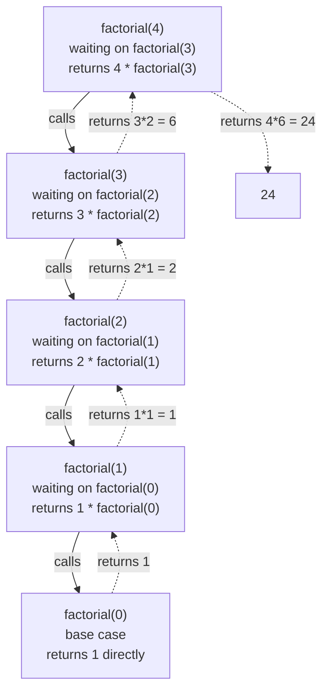

## Learning Objectives

- Explain what a base case and a recursive case each contribute, and why a correct recursive function needs both.
- Trace, frame by frame, how a call stack grows during a recursive call and unwinds once base cases are reached.
- Implement a recursive function directly from a problem stated as "in terms of a smaller version of itself."
- Predict, given a candidate recursive function, whether it terminates, and if not, identify which requirement (a reachable base case, real progress toward it) it violates.
- Compare a recursive solution against its iterative equivalent for the same problem, and identify which is the more natural fit for a given problem shape.

## Context & Motivation

Every function written so far in this course calls *other* functions — never itself. Recursion breaks that pattern in a way that looks almost paradoxical at first: a function that calls itself, as part of computing its own answer, on a smaller version of the exact same problem it was just asked to solve. It can feel like circular reasoning — how can something be defined in terms of itself without going in an infinite loop? — until the missing piece is made explicit: recursion is not "call yourself forever," it is "call yourself on something *strictly smaller*, until reaching a case simple enough to answer directly, with no further self-reference at all." That missing piece is exactly what separates recursion, a well-founded and extremely powerful problem-solving technique, from the mistake it superficially resembles.

The idea has deep roots in mathematics — a factorial, a Fibonacci sequence, and countless other quantities have always been most naturally *defined* recursively (`n! = n × (n-1)!`, with `0! = 1` as the base case), long before programming languages existed to execute that definition directly. What recursion gives a programmer is the ability to translate a definition like that almost verbatim into working code, rather than having to first mentally convert it into an explicit loop with counters and accumulated state. For problems that are naturally self-referential — walking a tree-shaped structure, exploring every branch of a decision, processing a list by handling one element and recursively handling "the rest" — this translation is often dramatically more direct and readable than the iterative alternative.

Understanding recursion also means understanding a piece of machinery every program has been quietly relying on all along: the **call stack** — the mechanism a language uses to keep track of which function called which, and what each one still has left to do once whatever it called returns. Every function call, recursive or not, pushes a new frame onto this stack, and that frame is only removed once the call it represents has fully returned. Ordinary (non-recursive) programs rarely make this visible, because the stack rarely gets more than a few frames deep. Recursion makes the call stack impossible to ignore, because a recursive function can push dozens, hundreds, or (if something has gone wrong) an unbounded number of frames — one for every unfinished call still waiting on the ones it made after it. Seeing recursion clearly, and debugging it when it misbehaves, means being able to picture that stack of waiting frames directly, not just the final answer they eventually produce.

## Core Theory

### Base case and recursive case: the two pieces every recursive function needs

```python
def factorial(n):
    if n == 0:                      # base case — answered directly, no further recursion
        return 1
    return n * factorial(n - 1)      # recursive case — smaller problem, same shape
```

The **base case** is the simplest instance of the problem, small enough to answer directly with no self-reference at all — here, `factorial(0)`, defined to be `1` by mathematical convention. The **recursive case** handles every other input by doing two things at once: making the problem *strictly smaller* (`n - 1` instead of `n`), and trusting that the recursive call on that smaller problem will produce the right answer, so that all this level of the function has to do is combine that answer with something of its own (`n *`). This trust — often called the "recursive leap of faith" — is the conceptual crux of reading or writing any recursive function: rather than mentally unrolling the entire chain of calls at once, it's enough to check that (1) the base case is correct on its own, and (2) the recursive case is correct *assuming* the smaller call already returns the right answer.

Both pieces are required, and each fails differently if missing. Without a base case, every call makes another call with no way to ever stop. Without the problem actually shrinking on every recursive call, a base case can exist and still never be reached.

### Tracing the call stack directly

`factorial(4)` does not compute anything on its own until `factorial(3)` returns; `factorial(3)` doesn't compute anything until `factorial(2)` returns, and so on, all the way down to `factorial(0)`, which is the first call in the whole chain that produces an answer without waiting on anyone else. The multiplications then unwind back up, in the reverse order the calls were made, each one finishing the work it had left pending:



Each box in that diagram is a **stack frame**: a record of one call's local variables (here, its own value of `n`) and exactly where it is in its own execution — specifically, that it's in the middle of evaluating `n * factorial(n - 1)` and is paused waiting for the second half of that expression. Frames are added top-to-bottom as calls are made (this is the "stack" growing) and removed bottom-to-top as calls return (the stack shrinking again) — the last frame pushed is always the first one popped, which is exactly why the multiplications unwind in the reverse order the calls happened in.

### Why a missing or unreachable base case fails, concretely

```python
def bad_factorial(n):
    return n * bad_factorial(n - 1)      # no base case at all

bad_factorial(4)   # RecursionError: maximum recursion depth exceeded
```

Every call here makes another call, on a strictly smaller `n`, with genuinely nothing to stop it — `n` keeps decreasing forever, through `0`, into negative numbers, without ever hitting a case that returns without recursing further. Python's own call stack has a finite, language-enforced depth limit (by default, in the low thousands of frames), and once that limit is hit, Python raises `RecursionError` rather than letting the process crash the way an unbounded, unmanaged stack eventually would in some other languages. A second, subtler version of the same failure keeps a base case but never actually reaches it:

```python
def also_bad_factorial(n):
    if n == 0:
        return 1
    return n * also_bad_factorial(n)      # bug: calls itself with the same n, not n - 1

also_bad_factorial(4)   # RecursionError — the base case exists but is never reached
```

Here `n == 0` genuinely is a valid, reachable base case in principle — but the recursive call passes `n` unchanged instead of `n - 1`, so `n` never actually decreases, and the base case is never reached from any starting value other than `0` itself.

### Recursion versus iteration for the same problem

Any recursion that unwinds into a single running total, like `factorial`, can equally be written as a loop that accumulates the same total explicitly:

```python
def factorial_iterative(n):
    result = 1
    for i in range(1, n + 1):
        result *= i
    return result
```

Both versions compute the identical answer for every input, and both take work proportional to `n`. The difference is not correctness or, typically, speed — it's which form more directly matches how a person naturally thinks about the problem, and what it costs in memory. The iterative version uses one stack frame total and one variable that gets updated in place; the recursive version uses `n + 1` stack frames simultaneously alive at the deepest point (as the diagram above shows), because each pending multiplication has to wait for everything below it to finish before it can complete. For a problem that is naturally iterative — accumulate a running total by walking a sequence once — forcing a recursive solution adds that stack overhead for no corresponding benefit in clarity. For a problem that is naturally recursive — the structure itself is self-similar, like a nested list or a tree — the recursive version is often shorter and more directly readable than the iterative equivalent would be, at the cost of that same stack usage.

### Multiple recursive calls: when the shape branches

Not every recursive case makes exactly one recursive call. A function can call itself more than once, when the problem itself naturally splits into more than one smaller subproblem:

```python
def fibonacci(n):
    if n <= 1:              # base case: fibonacci(0) == 0, fibonacci(1) == 1
        return n
    return fibonacci(n - 1) + fibonacci(n - 2)     # two recursive calls, not one
```

`fibonacci(4)` calls both `fibonacci(3)` and `fibonacci(2)`, and each of *those* branches again — `fibonacci(3)` calls both `fibonacci(2)` and `fibonacci(1)`. The call "stack" here is really a call *tree*: at any given moment only one path through it is actually on the stack (Python still finishes one branch completely before starting the next), but tracing the full computation by hand reveals that `fibonacci(2)` gets computed twice independently — once via `fibonacci(4) → fibonacci(3) → fibonacci(2)` and again via `fibonacci(4) → fibonacci(2)` directly — repeated work that a loop-based, iterative version naturally avoids by computing each value only once and remembering it.

## Worked Examples

### Example 1 — summing the elements of a list recursively, built up step by step

**Problem:** compute the sum of a list of numbers without using the built-in `sum()`, using recursion instead of a loop.

Step 1 — identify the base case: the smallest input this problem can meaningfully have. The sum of an empty list is `0` — nothing to add, and no smaller list to recurse into, which makes it a natural place to stop:

```python
def list_sum(numbers):
    if not numbers:            # base case: empty list
        return 0
```

Step 2 — express every other case in terms of a strictly smaller version of the same problem. "The sum of a list" can be restated as "its first element, plus the sum of everything after it" — and "everything after it," `numbers[1:]`, is a list with exactly one fewer element:

```python
    return numbers[0] + list_sum(numbers[1:])
```

Step 3 — trace it by hand on a small example to check the leap of faith holds at every level:

```python
list_sum([3, 1, 4, 1])
# = 3 + list_sum([1, 4, 1])
# = 3 + (1 + list_sum([4, 1]))
# = 3 + (1 + (4 + list_sum([1])))
# = 3 + (1 + (4 + (1 + list_sum([]))))
# = 3 + (1 + (4 + (1 + 0)))
# = 9
```

Each level only had to trust that the *next* level's recursive call would return the correct sum of a strictly shorter list — a trust that bottoms out safely because the list genuinely does get one element shorter on every call, guaranteeing the empty-list base case is reached in exactly as many steps as the list had elements.

### Example 2 — a broken recursive function, diagnosed and fixed

**Problem:** a function is meant to count how many times a target value appears in a list, recursively — but it isn't returning the right count.

```python
def count_occurrences(numbers, target):
    if not numbers:
        return 0
    if numbers[0] == target:
        return 1
    return count_occurrences(numbers[1:], target)
```

Step 1 — run it and observe the symptom: `count_occurrences([2, 5, 2, 2], 2)` returns `1`, but `2` clearly appears three times.

Step 2 — trace the calls to find where the count is being lost. `count_occurrences([2, 5, 2, 2], 2)` sees `numbers[0] == 2 == target`, so it immediately `return`s `1` — without ever looking at the rest of the list, `[5, 2, 2]`, which still has two more matches in it. The bug is structural: matching the first element causes an early, final return instead of *adding* one and continuing to recurse into the remainder.

Step 3 — fix it by making the matching case still recurse, adding its own contribution (`1`, or `0`) to whatever the recursive call on the rest of the list finds:

```python
def count_occurrences(numbers, target):
    if not numbers:                          # base case unchanged
        return 0
    first_match = 1 if numbers[0] == target else 0
    return first_match + count_occurrences(numbers[1:], target)

count_occurrences([2, 5, 2, 2], 2)   # 3 — correct
```

The corrected version mirrors Example 1's shape closely: "the count in the whole list" is "whether the first element matches, plus the count in everything after it" — the base case was never the problem, the recursive case's early `return` was.

### Example 3 — recursion whose branching makes the leap of faith concrete: counting paths

**Problem:** given a robot that can move only right or down on a grid, count how many distinct paths lead from the top-left corner to a point `rows` steps down and `cols` steps right.

Step 1 — find the base case: with `0` remaining rows or `0` remaining columns to travel, there is exactly one way to finish — stop moving in that direction and go straight in the other:

```python
def count_paths(rows, cols):
    if rows == 0 or cols == 0:
        return 1
```

Step 2 — for any other position, the robot's very next move is either right or down, and *whichever* it picks, the number of paths from there on is the same problem with one dimension reduced by one. Trusting each recursive call to correctly count paths from a smaller grid, the total from here is just the sum of both options:

```python
    return count_paths(rows - 1, cols) + count_paths(rows, cols - 1)
```

Step 3 — check it against a case small enough to verify by hand: a `1×1` grid (one step down, one step right, in either order) should have exactly `2` paths.

```python
count_paths(1, 1)
# = count_paths(0, 1) + count_paths(1, 0)
# = 1 + 1
# = 2
```

This matches direct enumeration — "down then right" and "right then down" are the only two paths — and confirms the recursive case's logic (branch on the next move, trust the smaller subproblems) without needing to trace every deeper call by hand.

## Common Misconceptions & Pitfalls

- **"Recursion is a kind of loop, so it should be traced the same way — following execution top to bottom in a single pass."** As the `factorial(4)` diagram shows, a recursive call does not run to completion before returning to its caller in a simple straight line — it pauses mid-expression, dispatches to a deeper call, and only resumes once that deeper call fully unwinds. Tracing it correctly means tracking a *stack* of paused, waiting frames, not a single line of execution.
- **"If I write a base case, my function is guaranteed to terminate."** `also_bad_factorial` in Core Theory has a perfectly correct-looking base case (`if n == 0: return 1`) that is simply never reached, because the recursive call fails to shrink `n`. A base case only helps if the recursive case is guaranteed to make real progress toward it on every call.
- **"A `return` inside the matching branch of a recursive function is fine, as long as there's also a base case."** Example 2's original bug was exactly this: returning early on a match skipped the rest of the list entirely, silently dropping later matches. The fix required recursing *past* the matching case too, only stopping recursion at the actual base case.
- **"Recursion is always the 'better' or more elegant choice once you understand it."** `fibonacci(n)` implemented with two recursive calls redundantly recomputes the same smaller values many times over (`fibonacci(2)` computed twice just within `fibonacci(4)`, and far more times for larger `n`) — the equivalent iterative version, accumulating two running values in a loop, does the same job without that repeated work and without growing the call stack at all.
- **"Recursion has no real cost as long as the logic is correct."** Every simultaneously-pending recursive call holds an actual stack frame in memory; a function correct in its logic can still fail in practice — with `RecursionError`, or worse in some other languages — purely from exhausting the call stack on an input large enough to need more frames than the language allows, in a way an equivalent loop, which reuses one frame throughout, never would.

## Summary

A recursive function solves a problem by calling itself on a strictly smaller version of the same problem, and correctness requires two pieces together: a base case simple enough to answer directly, and a recursive case that both shrinks the problem on every call and can be trusted (the "leap of faith") to combine correctly with whatever the smaller call returns. Each call adds a frame to the call stack — holding that call's own local state and its paused position mid-expression — and those frames unwind in reverse order as calls return, which is why tracing recursion means tracking a stack of waiting frames, not a single straight-line pass. Missing or unreachable base cases, or a recursive case that fails to make real progress, both lead to unbounded recursion, which Python halts with `RecursionError` once the stack's finite depth limit is hit. Some recursive cases branch into more than one recursive call at once, which can mean solving the same smaller subproblem redundantly, more than once — a cost an iterative version can often avoid. Recursion and iteration compute identical answers for the same problem; the choice between them is about which shape — self-referential structure, or an explicit accumulating loop — more directly matches how the problem is naturally described, and about the stack-memory cost recursion carries that iteration does not.

## Documentation Links

- [Python Data Model](https://docs.python.org/3/reference/datamodel.html) — doc
- [MIT 6.100L — Materials by Lecture](https://ocw.mit.edu/courses/6-100l-introduction-to-cs-and-programming-using-python-fall-2022/pages/material-by-lecture/) — doc
