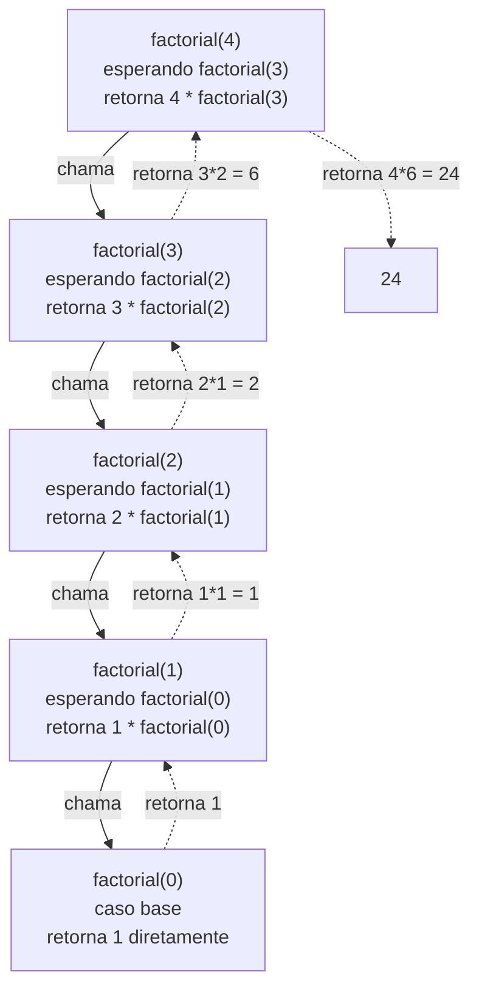

## Objetivos de Aprendizagem

- Explicar o que um caso base e um caso recursivo contribuem cada um, e por que uma função recursiva correta precisa dos dois.
- Traçar, quadro a quadro, como uma pilha de chamadas cresce durante uma chamada recursiva e se desenrola uma vez que casos base são alcançados.
- Implementar uma função recursiva diretamente a partir de um problema declarado como "em termos de uma versão menor de si mesmo."
- Prever, dada uma função recursiva candidata, se ela termina, e se não, identificar qual requisito (um caso base alcançável, progresso real em direção a ele) ela viola.
- Comparar uma solução recursiva com seu equivalente iterativo para o mesmo problema, e identificar qual é o encaixe mais natural para um dado formato de problema.

## Contexto e Motivação

Toda função escrita até agora neste curso chama *outras* funções, nunca a si mesma. A recursão quebra esse padrão de um jeito que parece quase paradoxal à primeira vista: uma função que chama a si mesma, como parte de calcular sua própria resposta, numa versão menor do exato mesmo problema que acabou de ser pedida para resolver. Pode parecer raciocínio circular (como algo pode ser definido em termos de si mesmo sem entrar num laço infinito?) até que a peça que faltava seja tornada explícita: recursão não é "se chamar para sempre", é "se chamar sobre algo *estritamente menor*, até alcançar um caso simples o suficiente para responder diretamente, sem autorreferência nenhuma além disso." Essa peça que faltava é exatamente o que separa recursão, uma técnica de resolução de problemas bem fundamentada e extremamente poderosa, do erro que ela superficialmente se parece.

A ideia tem raízes profundas na matemática: um fatorial, uma sequência de Fibonacci, e inúmeras outras quantidades sempre foram mais naturalmente *definidas* recursivamente (`n! = n × (n-1)!`, com `0! = 1` como caso base), muito antes de linguagens de programação existirem para executar essa definição diretamente. O que a recursão dá a um programador é a capacidade de traduzir uma definição assim quase palavra por palavra em código funcional, em vez de primeiro precisar convertê-la mentalmente num laço explícito com contadores e estado acumulado. Para problemas que são naturalmente autorreferenciais (percorrer uma estrutura em formato de árvore, explorar todo ramo de uma decisão, processar uma lista tratando um elemento e recursivamente tratando "o resto"), essa tradução costuma ser dramaticamente mais direta e legível que a alternativa iterativa.

Entender recursão também significa entender uma peça de maquinaria que todo programa esteve silenciosamente dependendo o tempo todo: a **pilha de chamadas**, o mecanismo que uma linguagem usa para rastrear qual função chamou qual, e o que cada uma ainda tem que fazer uma vez que aquilo que ela chamou retorne. Toda chamada de função, recursiva ou não, empilha um novo quadro nessa pilha, e esse quadro só é removido uma vez que a chamada que ele representa tenha retornado por completo. Programas comuns (não recursivos) raramente tornam isso visível, porque a pilha raramente fica com mais que alguns quadros de profundidade. Recursão torna a pilha de chamadas impossível de ignorar, porque uma função recursiva pode empilhar dezenas, centenas, ou (se algo deu errado) um número ilimitado de quadros, um para cada chamada não finalizada ainda esperando pelas que ela fez depois de si mesma. Enxergar recursão claramente, e depurá-la quando se comporta mal, significa ser capaz de visualizar diretamente essa pilha de quadros esperando, não apenas a resposta final que eles eventualmente produzem.

## Teoria Central

### Caso base e caso recursivo: as duas peças de que toda função recursiva precisa

```python
def factorial(n):
    if n == 0:                      # caso base -- respondido diretamente, sem mais recursão
        return 1
    return n * factorial(n - 1)      # caso recursivo -- problema menor, mesma forma
```

O **caso base** é a instância mais simples do problema, pequena o suficiente para responder diretamente sem autorreferência nenhuma: aqui, `factorial(0)`, definido como `1` por convenção matemática. O **caso recursivo** trata todas as outras entradas fazendo duas coisas ao mesmo tempo: tornando o problema *estritamente menor* (`n - 1` em vez de `n`), e confiando que a chamada recursiva naquele problema menor vai produzir a resposta certa, de modo que tudo o que este nível da função precisa fazer é combinar essa resposta com algo próprio (`n *`). Essa confiança, frequentemente chamada de "salto de fé recursivo," é o cerne conceitual de ler ou escrever qualquer função recursiva: em vez de desenrolar mentalmente a cadeia inteira de chamadas de uma vez, basta checar que (1) o caso base está correto sozinho, e (2) o caso recursivo está correto *assumindo* que a chamada menor já retorna a resposta certa.

As duas peças são necessárias, e cada uma falha de forma diferente se ausente. Sem um caso base, toda chamada faz outra chamada sem forma nenhuma de algum dia parar. Sem o problema de fato encolher a cada chamada recursiva, um caso base pode existir e ainda assim nunca ser alcançado.

### Traçando a pilha de chamadas diretamente

`factorial(4)` não calcula nada sozinha até `factorial(3)` retornar; `factorial(3)` não calcula nada até `factorial(2)` retornar, e assim por diante, até `factorial(0)`, que é a primeira chamada em toda a cadeia que produz uma resposta sem esperar por ninguém mais. As multiplicações então se desenrolam de volta para cima, na ordem inversa em que as chamadas foram feitas, cada uma terminando o trabalho que tinha deixado pendente:



Cada caixa nesse diagrama é um **quadro de pilha**: um registro das variáveis locais de uma chamada (aqui, seu próprio valor de `n`) e exatamente onde ela está na sua própria execução, especificamente, que está no meio da avaliação de `n * factorial(n - 1)` e está pausada esperando pela segunda metade dessa expressão. Quadros são adicionados de cima para baixo conforme chamadas são feitas (é a "pilha" crescendo) e removidos de baixo para cima conforme chamadas retornam (a pilha encolhendo de novo): o último quadro empilhado é sempre o primeiro removido, que é exatamente por que as multiplicações se desenrolam na ordem inversa em que as chamadas aconteceram.

### Por que um caso base ausente ou inalcançável falha, concretamente

```python
def bad_factorial(n):
    return n * bad_factorial(n - 1)      # nenhum caso base de forma alguma

bad_factorial(4)   # RecursionError: maximum recursion depth exceeded
```

Toda chamada aqui faz outra chamada, sobre um `n` estritamente menor, sem nada de verdade para pará-la: `n` continua diminuindo para sempre, passando por `0`, entrando em números negativos, sem nunca bater num caso que retorna sem recursar mais. A própria pilha de chamadas do Python tem um limite de profundidade finito, imposto pela linguagem (por padrão, na casa dos poucos milhares de quadros), e uma vez que esse limite é atingido, o Python dispara `RecursionError` em vez de deixar o processo travar do jeito que uma pilha ilimitada e não gerenciada eventualmente travaria em algumas outras linguagens. Uma segunda versão, mais sutil, da mesma falha mantém um caso base, mas nunca de fato o alcança:

```python
def also_bad_factorial(n):
    if n == 0:
        return 1
    return n * also_bad_factorial(n)      # bug: chama a si mesma com o mesmo n, não n - 1

also_bad_factorial(4)   # RecursionError -- o caso base existe mas nunca é alcançado
```

Aqui `n == 0` genuinamente é um caso base válido e alcançável em princípio, mas a chamada recursiva passa `n` sem mudança em vez de `n - 1`, então `n` nunca de fato diminui, e o caso base nunca é alcançado a partir de nenhum valor inicial além do próprio `0`.

### Recursão versus iteração para o mesmo problema

Qualquer recursão que se desenrola num único total corrente, como `factorial`, pode igualmente ser escrita como um laço que acumula o mesmo total explicitamente:

```python
def factorial_iterative(n):
    result = 1
    for i in range(1, n + 1):
        result *= i
    return result
```

As duas versões calculam a resposta idêntica para toda entrada, e as duas fazem trabalho proporcional a `n`. A diferença não é corretude ou, tipicamente, velocidade: é qual forma combina mais diretamente com como uma pessoa naturalmente pensa sobre o problema, e o que ela custa em memória. A versão iterativa usa um total de um quadro de pilha e uma variável que é atualizada no lugar; a versão recursiva usa `n + 1` quadros de pilha simultaneamente vivos no ponto mais profundo (como o diagrama acima mostra), porque cada multiplicação pendente precisa esperar tudo abaixo dela terminar antes de poder completar. Para um problema que é naturalmente iterativo (acumular um total corrente percorrendo uma sequência uma vez), forçar uma solução recursiva adiciona essa sobrecarga de pilha sem benefício correspondente em clareza. Para um problema que é naturalmente recursivo (a estrutura em si é autossimilar, como uma lista aninhada ou uma árvore), a versão recursiva costuma ser mais curta e mais diretamente legível do que o equivalente iterativo seria, ao custo desse mesmo uso de pilha.

### Múltiplas chamadas recursivas: quando a forma se ramifica

Nem todo caso recursivo faz exatamente uma chamada recursiva. Uma função pode chamar a si mesma mais de uma vez, quando o próprio problema naturalmente se divide em mais de um subproblema menor:

```python
def fibonacci(n):
    if n <= 1:              # caso base: fibonacci(0) == 0, fibonacci(1) == 1
        return n
    return fibonacci(n - 1) + fibonacci(n - 2)     # duas chamadas recursivas, não uma
```

`fibonacci(4)` chama tanto `fibonacci(3)` quanto `fibonacci(2)`, e cada uma *dessas* se ramifica de novo: `fibonacci(3)` chama tanto `fibonacci(2)` quanto `fibonacci(1)`. A "pilha" de chamadas aqui é na verdade uma *árvore* de chamadas: em qualquer momento dado, só um caminho por ela está de fato na pilha (o Python ainda termina um ramo completamente antes de começar o próximo), mas traçar o cálculo completo na mão revela que `fibonacci(2)` é calculado duas vezes independentemente, uma vez via `fibonacci(4) → fibonacci(3) → fibonacci(2)` e de novo via `fibonacci(4) → fibonacci(2)` diretamente, trabalho repetido que uma versão iterativa baseada em laço naturalmente evita calculando cada valor apenas uma vez e lembrando dele.

## Exemplos Resolvidos

### Exemplo 1: somando os elementos de uma lista recursivamente, construído passo a passo

**Problema:** calcule a soma de uma lista de números sem usar a função embutida `sum()`, usando recursão em vez de um laço.

Passo 1: identifique o caso base: a menor entrada que este problema pode significativamente ter. A soma de uma lista vazia é `0`: nada para somar, e nenhuma lista menor para recursar, o que a torna um lugar natural para parar:

```python
def list_sum(numbers):
    if not numbers:            # caso base: lista vazia
        return 0
```

Passo 2: expresse todo outro caso em termos de uma versão estritamente menor do mesmo problema. "A soma de uma lista" pode ser reformulada como "seu primeiro elemento, mais a soma de tudo depois dele", e "tudo depois dele", `numbers[1:]`, é uma lista com exatamente um elemento a menos:

```python
    return numbers[0] + list_sum(numbers[1:])
```

Passo 3: trace na mão num pequeno exemplo para checar que o salto de fé se sustenta em todo nível:

```python
list_sum([3, 1, 4, 1])
# = 3 + list_sum([1, 4, 1])
# = 3 + (1 + list_sum([4, 1]))
# = 3 + (1 + (4 + list_sum([1])))
# = 3 + (1 + (4 + (1 + list_sum([]))))
# = 3 + (1 + (4 + (1 + 0)))
# = 9
```

Cada nível só precisou confiar que a chamada recursiva do *próximo* nível retornaria a soma correta de uma lista estritamente mais curta: uma confiança que se fundamenta com segurança porque a lista genuinamente fica um elemento mais curta a cada chamada, garantindo que o caso base da lista vazia é alcançado em exatamente tantos passos quantos a lista tinha elementos.

### Exemplo 2: uma função recursiva quebrada, diagnosticada e corrigida

**Problema:** uma função deveria contar quantas vezes um valor alvo aparece numa lista, recursivamente, mas não está retornando a contagem certa.

```python
def count_occurrences(numbers, target):
    if not numbers:
        return 0
    if numbers[0] == target:
        return 1
    return count_occurrences(numbers[1:], target)
```

Passo 1: rode e observe o sintoma: `count_occurrences([2, 5, 2, 2], 2)` retorna `1`, mas `2` claramente aparece três vezes.

Passo 2: trace as chamadas para encontrar onde a contagem está sendo perdida. `count_occurrences([2, 5, 2, 2], 2)` vê `numbers[0] == 2 == target`, então imediatamente `return`a `1`, sem jamais olhar para o resto da lista, `[5, 2, 2]`, que ainda tem mais duas correspondências nela. O bug é estrutural: combinar com o primeiro elemento causa um retorno antecipado e final em vez de *somar* um e continuar recursando no restante.

Passo 3: corrija fazendo o caso de correspondência ainda recursar, somando sua própria contribuição (`1`, ou `0`) ao que quer que a chamada recursiva no resto da lista encontre:

```python
def count_occurrences(numbers, target):
    if not numbers:                          # caso base sem mudança
        return 0
    first_match = 1 if numbers[0] == target else 0
    return first_match + count_occurrences(numbers[1:], target)

count_occurrences([2, 5, 2, 2], 2)   # 3 -- correto
```

A versão corrigida reflete de perto a forma do Exemplo 1: "a contagem na lista inteira" é "se o primeiro elemento combina, mais a contagem em tudo depois dele": o caso base nunca foi o problema, o retorno antecipado do caso recursivo foi.

### Exemplo 3: recursão cuja ramificação torna o salto de fé concreto: contando caminhos

**Problema:** dado um robô que só pode se mover para a direita ou para baixo numa grade, conte quantos caminhos distintos levam do canto superior esquerdo até um ponto `rows` passos abaixo e `cols` passos à direita.

Passo 1: encontre o caso base: com `0` linhas restantes ou `0` colunas restantes para percorrer, existe exatamente uma forma de terminar: pare de se mover naquela direção e vá direto na outra:

```python
def count_paths(rows, cols):
    if rows == 0 or cols == 0:
        return 1
```

Passo 2: para qualquer outra posição, o próximo movimento do robô é ou direita ou baixo, e *qualquer* que ele escolha, o número de caminhos a partir dali é o mesmo problema com uma dimensão reduzida em um. Confiando que cada chamada recursiva conta corretamente os caminhos a partir de uma grade menor, o total a partir daqui é só a soma das duas opções:

```python
    return count_paths(rows - 1, cols) + count_paths(rows, cols - 1)
```

Passo 3: cheque contra um caso pequeno o suficiente para verificar na mão: uma grade `1×1` (um passo abaixo, um passo à direita, em qualquer ordem) deveria ter exatamente `2` caminhos.

```python
count_paths(1, 1)
# = count_paths(0, 1) + count_paths(1, 0)
# = 1 + 1
# = 2
```

Isso combina com a enumeração direta ("abaixo então direita" e "direita então abaixo" são os únicos dois caminhos), e confirma a lógica do caso recursivo (ramificar no próximo movimento, confiar nos subproblemas menores) sem precisar traçar toda chamada mais profunda na mão.

## Equívocos Comuns e Armadilhas

- **"Recursão é um tipo de laço, então deveria ser traçada da mesma forma: seguindo a execução de cima para baixo numa única passagem."** Como o diagrama de `factorial(4)` mostra, uma chamada recursiva não roda até o fim antes de retornar a quem a chamou numa linha reta simples: ela pausa no meio de uma expressão, despacha para uma chamada mais profunda, e só retoma uma vez que essa chamada mais profunda se desenrola por completo. Traçá-la corretamente significa rastrear uma *pilha* de quadros pausados e esperando, não uma única linha de execução.
- **"Se eu escrevo um caso base, minha função tem garantia de terminar."** `also_bad_factorial` na Teoria Central tem um caso base que parece perfeitamente correto (`if n == 0: return 1`) mas que simplesmente nunca é alcançado, porque a chamada recursiva falha em diminuir `n`. Um caso base só ajuda se o caso recursivo tiver garantia de fazer progresso real em direção a ele a cada chamada.
- **"Um `return` dentro do ramo de correspondência de uma função recursiva está tudo bem, contanto que também haja um caso base."** O bug original do Exemplo 2 era exatamente isso: retornar cedo numa correspondência pulava o resto da lista completamente, silenciosamente descartando correspondências posteriores. A correção exigiu recursar *além* do caso de correspondência também, só parando a recursão no caso base de fato.
- **"Recursão é sempre a escolha 'melhor' ou mais elegante uma vez que você a entende."** `fibonacci(n)` implementado com duas chamadas recursivas recalcula redundantemente os mesmos valores menores muitas vezes (`fibonacci(2)` calculado duas vezes só dentro de `fibonacci(4)`, e muito mais vezes para `n` maiores): a versão iterativa equivalente, acumulando dois valores correntes num laço, faz o mesmo trabalho sem esse trabalho repetido e sem fazer a pilha de chamadas crescer de forma alguma.
- **"Recursão não tem custo real desde que a lógica esteja correta."** Toda chamada recursiva simultaneamente pendente ocupa um quadro de pilha real na memória; uma função correta na sua lógica ainda pode falhar na prática, com `RecursionError`, ou pior em algumas outras linguagens, puramente por esgotar a pilha de chamadas numa entrada grande o suficiente para precisar de mais quadros do que a linguagem permite, de um jeito que um laço equivalente, que reutiliza um quadro ao longo de tudo, nunca falharia.

## Resumo

Uma função recursiva resolve um problema chamando a si mesma sobre uma versão estritamente menor do mesmo problema, e a corretude exige duas peças juntas: um caso base simples o suficiente para responder diretamente, e um caso recursivo que tanto diminui o problema a cada chamada quanto pode ser confiado (o "salto de fé") para se combinar corretamente com o que quer que a chamada menor retorne. Cada chamada adiciona um quadro à pilha de chamadas, guardando o estado local próprio daquela chamada e sua posição pausada no meio de uma expressão, e esses quadros se desenrolam em ordem inversa conforme chamadas retornam, o que é por que traçar recursão significa rastrear uma pilha de quadros esperando, não uma única passagem em linha reta. Casos base ausentes ou inalcançáveis, ou um caso recursivo que falha em fazer progresso real, ambos levam a recursão ilimitada, que o Python interrompe com `RecursionError` uma vez que o limite de profundidade finito da pilha é atingido. Alguns casos recursivos se ramificam em mais de uma chamada recursiva de uma vez, o que pode significar resolver o mesmo subproblema menor redundantemente, mais de uma vez: um custo que uma versão iterativa frequentemente pode evitar. Recursão e iteração calculam respostas idênticas para o mesmo problema; a escolha entre elas é sobre qual forma (estrutura autorreferencial, ou um laço acumulador explícito) combina mais diretamente com como o problema é naturalmente descrito, e sobre o custo de memória de pilha que a recursão carrega e que a iteração não carrega.

## Documentation Links

- [Python Data Model](https://docs.python.org/3/reference/datamodel.html) (doc)
- [MIT 6.100L: Materials by Lecture](https://ocw.mit.edu/courses/6-100l-introduction-to-cs-and-programming-using-python-fall-2022/pages/material-by-lecture/) (doc)
