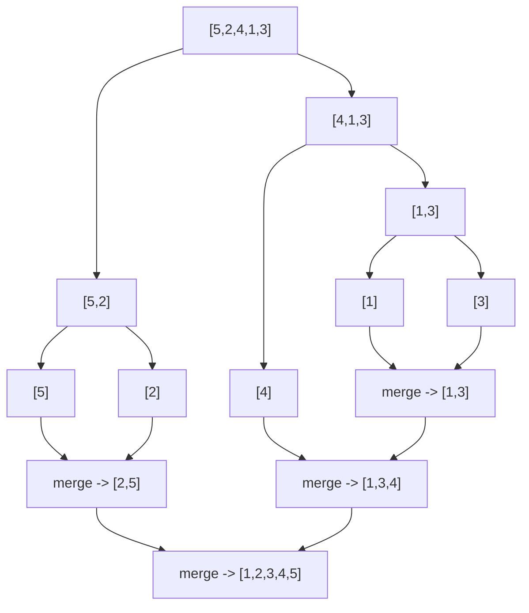

## Learning Objectives

- Explain why comparing sorting algorithms by growth rate matters more than comparing them by a single benchmark run.
- Implement a simple O(n²) sort (selection sort, and recognize the same shape in bubble and insertion sort) and a divide-and-conquer O(n log n) sort (merge sort).
- Identify the O(n²) pattern — nested loops, each over the same collection — when reading or writing a simple sort.
- Compare merge sort's time/space trade-off against a simple quadratic sort, including where the "better" algorithm can still lose on small input.
- Predict which family of sort is appropriate for a given input size, and recognize when to reach for Python's built-in `sorted()` instead of hand-writing either.

## Context & Motivation

Sorting is one of the clearest places in the whole curriculum to see Big-O stop being an abstract notation and start being an observable, practical consequence. Several intuitive sorting methods — bubble sort, selection sort, insertion sort — all do roughly `n²` comparisons in the worst case, while a divide-and-conquer approach like merge sort does roughly `n log n`. On a small list of ten items, the difference between these two families is invisible — both finish before a human could notice. On a large list, it's the difference between a program that finishes instantly and one that doesn't finish within any reasonable amount of time. MIT's 6.100L places sorting directly after the introduction of Big-O for exactly this reason: it's the first problem in the curriculum where the abstract growth-rate distinction from the previous concept translates into a difference anyone can watch happen.

It's worth being honest about scope here, because sorting is also a problem people spend entire courses on: this is a first pass, meant to make the O(n²)-versus-O(n log n) comparison concrete and to introduce divide-and-conquer as a strategy — not an exhaustive tour of every sorting algorithm that exists. The three quadratic sorts covered here (bubble, selection, insertion) are taught first, in essentially every introductory algorithms course, precisely *because* they're simple enough to write and trust in a few lines — that simplicity is a real pedagogical virtue even though it comes at a real performance cost. Merge sort is the first genuine example of divide-and-conquer this curriculum introduces: split a problem in half, solve each half by the same method, and combine the two solved halves cheaply. That three-step shape — divide, conquer, combine — reappears constantly in algorithm design well beyond sorting, which is a large part of why merge sort earns a place here rather than being deferred to a later course.

## Core Theory

### Three quadratic sorts, one shared shape

Selection sort repeatedly finds the smallest remaining value and moves it into place:

```python
def selection_sort(items):
    items = items[:]                       # work on a clone, don't mutate the caller's list
    for i in range(len(items)):
        smallest = i
        for j in range(i + 1, len(items)):  # inner loop scans the unsorted remainder
            if items[j] < items[smallest]:
                smallest = j
        items[i], items[smallest] = items[smallest], items[i]
    return items

selection_sort([5, 2, 4, 1, 3])   # [1, 2, 3, 4, 5]
```

Bubble sort instead repeatedly compares *adjacent* elements and swaps them if they're out of order, letting the largest unsorted value "bubble up" toward the end on each pass:

```python
def bubble_sort(items):
    items = items[:]
    n = len(items)
    for i in range(n):
        for j in range(n - 1 - i):          # each pass needs to check one fewer pair
            if items[j] > items[j + 1]:
                items[j], items[j + 1] = items[j + 1], items[j]
    return items

bubble_sort([5, 2, 4, 1, 3])   # [1, 2, 3, 4, 5]
```

Insertion sort builds up a sorted prefix one element at a time, inserting each new element into its correct position among the elements already sorted:

```python
def insertion_sort(items):
    items = items[:]
    for i in range(1, len(items)):
        key = items[i]
        j = i - 1
        while j >= 0 and items[j] > key:    # shift larger elements right to make room
            items[j + 1] = items[j]
            j -= 1
        items[j + 1] = key
    return items

insertion_sort([5, 2, 4, 1, 3])   # [1, 2, 3, 4, 5]
```

All three differ in *how* they compare and move elements, but share the same underlying shape: for each of the `n` positions, some amount of work proportional to the remaining unsorted portion has to happen — roughly `n` comparisons per outer step, across `n` outer steps, giving the same O(n²) growth covered in big-o-and-asymptotic-complexity.

### A divide-and-conquer sort: merge sort

```python
def merge_sort(items):
    if len(items) <= 1:                 # base case — a list of 0 or 1 is already sorted
        return items
    mid = len(items) // 2
    left = merge_sort(items[:mid])       # recursively sort each half
    right = merge_sort(items[mid:])
    return merge(left, right)

def merge(left, right):
    result = []
    i = j = 0
    while i < len(left) and j < len(right):
        if left[i] <= right[j]:
            result.append(left[i]); i += 1
        else:
            result.append(right[j]); j += 1
    return result + left[i:] + right[j:]  # append whichever side has leftovers

merge_sort([5, 2, 4, 1, 3])   # [1, 2, 3, 4, 5]
```

Merge sort recursively splits the list in half (the "divide"), sorts each half on its own (the "conquer"), and combines two already-sorted halves in a single linear pass (the "merge"). The recursive splitting of `[5, 2, 4, 1, 3]` and the merges that undo it look like this:



Splitting in half repeatedly gives roughly `log n` levels of splitting (the tree's height), and each level does roughly `n` total work merging across all the merges at that level — giving O(n log n) overall, the same halving-the-problem idea bisection search relies on, applied to sorting instead of numeric search.

### A broken/fixed pair: forgetting the recursive base case

```python
def merge_sort_broken(items):
    mid = len(items) // 2
    left = merge_sort_broken(items[:mid])     # no check for len(items) <= 1 !
    right = merge_sort_broken(items[mid:])
    return merge(left, right)

merge_sort_broken([5])
# RecursionError: maximum recursion depth exceeded
```

With no base case, a single-element list `[5]` has `mid = 0`, so `items[:mid]` is `[]` and `items[mid:]` is `[5]` again — the "smaller half" isn't actually smaller for the right-hand split, so the recursion calls itself on `[5]` forever, exactly the way a numeric recursion without `n == 0` would never terminate. The fix is the `if len(items) <= 1: return items` line that opens the correct `merge_sort` above: without it, the recursive splitting has no guarantee of ever reaching a base case, because a one-element list's "mid" doesn't shrink the right half at all.

### Comparing the two families as input grows

The gap in Core Theory's Big-O table becomes very concrete for sorting specifically. Selection sort does roughly `n²/2` comparisons; merge sort does roughly `n log₂ n` comparisons:

| n | selection sort (~n²/2) | merge sort (~n log₂ n) |
|---|---|---|
| 10 | 45 | ~33 |
| 100 | 4,950 | ~664 |
| 10,000 | ~50,000,000 | ~132,900 |

At `n = 10` the two are close enough that constant-factor overhead (extra list allocation, function call overhead in the recursive version) can easily make merge sort the *slower* one in wall-clock terms, despite doing fewer comparisons on paper. By `n = 10,000` the gap has become nearly 400-fold — a difference no constant factor could plausibly erase.

## Worked Examples

**Example 1 — tracing selection sort on `[5, 2, 4, 1, 3]`.** Selection sort's invariant is: after `i` outer iterations, the first `i` positions hold the `i` smallest values, in sorted order. Trace it: `i=0`, scan positions 1–4 for the smallest value (finds `1` at index 3), swap into position 0 → `[1, 2, 4, 5, 3]`. `i=1`, scan positions 2–4 for the smallest (finds `2`, already at index 1 — no swap needed, or a swap with itself) → `[1, 2, 4, 5, 3]`. `i=2`, scan positions 3–4 for the smallest (finds `3` at index 4), swap → `[1, 2, 3, 5, 4]`. `i=3`, scan position 4 (only one candidate, `4`), swap → `[1, 2, 3, 4, 5]`. `i=4`, nothing left to scan. Each outer step does strictly less scanning than the one before it — the inner loop's range shrinks from 4 down to 0 — which is exactly the triangular-sum pattern that still totals to O(n²).

**Example 2 — tracing merge sort on `[5, 2, 4, 1, 3]`.** Following the diagram in Core Theory: the list splits into `[5, 2]` and `[4, 1, 3]`; `[5, 2]` splits into `[5]` and `[2]` (both already base cases) and merges back into `[2, 5]`; `[4, 1, 3]` splits into `[4]` and `[1, 3]`, and `[1, 3]` splits into `[1]` and `[3]` and merges into `[1, 3]`; then `[4]` merges with `[1, 3]` into `[1, 3, 4]`. Finally, `[2, 5]` merges with `[1, 3, 4]`: compare `2` and `1` → take `1`; compare `2` and `3` → take `2`; compare `5` and `3` → take `3`; compare `5` and `4` → take `4`; only `5` remains on the left → append it. Result: `[1, 2, 3, 4, 5]`. Every merge step does one linear pass over the two halves being combined — no comparison is ever repeated or wasted, which is exactly what keeps the total work at each level of the tree proportional to `n`.

**Example 3 — making the crossover concrete with an exact count.** For a list of `n = 8` elements, selection sort's inner loop runs `7 + 6 + 5 + 4 + 3 + 2 + 1 + 0 = 28` times in the worst case — computable directly from the triangular-sum formula `n(n-1)/2`. Merge sort's comparisons total roughly `n log₂ n = 8 × 3 = 24` in the worst case — close enough that either could win a benchmark on a real machine, since constant-factor overhead (list slicing, recursive call overhead) is not accounted for in either raw count. Scaling `n` up to 1,000: selection sort's `n(n-1)/2 ≈ 500,000` comparisons dwarfs merge sort's `n log₂ n ≈ 10,000` — at this size, no realistic constant-factor difference closes a 50-fold gap. This is the concrete version of the abstract crossover-point reasoning from big-o-and-asymptotic-complexity: growth rate differences that are invisible at small `n` become decisive at large `n`.

## Common Misconceptions & Pitfalls

**"The asymptotically better algorithm is always the faster one to run."** For a small list, the constant-factor overhead of merge sort's recursive calls and repeated list slicing can make it slower in practice than a simple O(n²) sort, even though it's asymptotically better — Big-O describes growth, not the crossover point at which the better growth rate actually starts winning, and Worked Example 3 showed that crossover can sit well past what looks like a "large" list by hand. This is exactly why Python's own built-in Timsort (documented in the Python Sorting HOWTO) switches to a simple insertion sort for small runs internally — the simple, quadratic-looking approach is genuinely faster below a certain size, and a production-grade sort takes advantage of that rather than pretending it isn't true.

**"Simple to write" and "fine to use" are the same thing.** Selection, bubble, and insertion sort are simple enough to write from memory and trust without much testing — which is exactly why they're taught first. But that simplicity comes bundled with O(n²) behavior that becomes unusable the moment the input grows large, and nothing about being easy to write changes that cost.

**Forgetting that merge sort spends memory to save time.** Merge sort as written above allocates a brand-new list at every merge step, using O(n) extra memory at each level of the recursion — a simple in-place O(n²) sort like selection sort uses none beyond the original list (aside from the swap). Whether that memory cost is worth the better time complexity depends on how large the input actually is and how much memory is actually available; it is a genuine trade-off, not a strictly one-sided win for merge sort.

**"I should hand-write a sort for real work."** None of the reasoning above is an argument for hand-writing a sort in practice. Python's built-in `sorted()` and `.sort()` use Timsort, a highly-tuned O(n log n) algorithm that also detects and takes advantage of already-sorted runs already present in the input — something none of the four algorithms shown here do. The algorithms in this concept exist to build intuition about complexity and about divide-and-conquer as a strategy, not to be a template for replacing the standard library.

## Summary

Bubble, selection, and insertion sort all share the same underlying O(n²) shape — some amount of scanning work proportional to what's left, repeated for every one of `n` positions — even though they differ in exactly how they compare and move elements. Merge sort breaks out of that shape with divide-and-conquer: split the problem in half, solve each half recursively, and combine two already-sorted halves in one linear pass, for a total of roughly `n log n` work spread across `log n` levels. The gap between these two families is invisible on small input and often small enough there for constant-factor overhead to flip which one actually runs faster — but the gap widens without bound as `n` grows, exactly as the previous concept's Big-O reasoning predicts, and by even moderate input sizes it becomes decisive. In real code, none of this is an argument for hand-writing a sort at all: it's an argument for recognizing the O(n²) shape when it appears elsewhere, and for reaching for the standard library's Timsort, which already makes these trade-offs well.

## Documentation Links

- [Python HOWTO — Sorting Techniques](https://docs.python.org/3/howto/sorting.html) — doc
- [MIT 6.100L — Materials by Lecture](https://ocw.mit.edu/courses/6-100l-introduction-to-cs-and-programming-using-python-fall-2022/pages/material-by-lecture/) — doc
