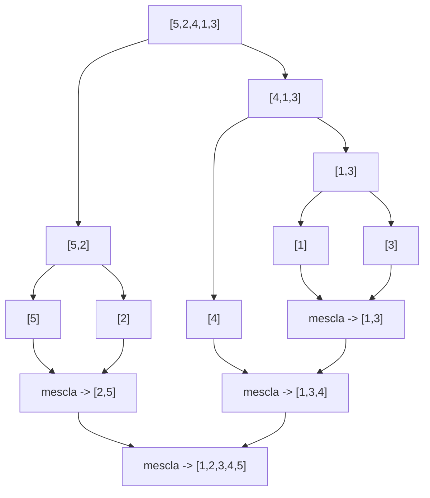

## Objetivos de Aprendizagem

- Explicar por que comparar algoritmos de ordenação pela taxa de crescimento importa mais do que compará-los por uma única execução de benchmark.
- Implementar uma ordenação O(n²) simples (selection sort, e reconhecer a mesma forma em bubble e insertion sort) e uma ordenação O(n log n) por dividir-e-conquistar (merge sort).
- Identificar o padrão O(n²), laços aninhados, cada um sobre a mesma coleção, ao ler ou escrever uma ordenação simples.
- Comparar a troca de tempo/espaço do merge sort com uma ordenação quadrática simples, incluindo onde o algoritmo "melhor" ainda pode perder em entrada pequena.
- Prever qual família de ordenação é apropriada para um dado tamanho de entrada, e reconhecer quando recorrer ao `sorted()` embutido do Python em vez de escrever qualquer um dos dois na mão.

## Contexto e Motivação

Ordenação é um dos lugares mais claros em todo o currículo para ver o Big-O deixar de ser notação abstrata e começar a ser uma consequência observável e prática. Vários métodos de ordenação intuitivos (bubble sort, selection sort, insertion sort) todos fazem aproximadamente `n²` comparações no pior caso, enquanto uma abordagem dividir-e-conquistar como o merge sort faz aproximadamente `n log n`. Numa lista pequena de dez itens, a diferença entre essas duas famílias é invisível: as duas terminam antes de um humano perceber. Numa lista grande, é a diferença entre um programa que termina instantaneamente e um que não termina em nenhuma quantidade razoável de tempo. O 6.100L do MIT coloca ordenação logo depois da apresentação do Big-O exatamente por essa razão: é o primeiro problema no currículo onde a distinção abstrata de taxa de crescimento do conceito anterior se traduz numa diferença que qualquer um consegue observar acontecendo.

Vale a pena ser honesto sobre escopo aqui, porque ordenação também é um problema com o qual as pessoas passam cursos inteiros: este é um primeiro passo, feito para tornar concreta a comparação O(n²)-versus-O(n log n) e para apresentar dividir-e-conquistar como estratégia, não um tour exaustivo por todo algoritmo de ordenação que existe. As três ordenações quadráticas cobertas aqui (bubble, selection, insertion) são ensinadas primeiro, em essencialmente todo curso introdutório de algoritmos, precisamente *porque* são simples o suficiente para escrever e confiar em poucas linhas: essa simplicidade é uma virtude pedagógica real mesmo que venha com um custo real de desempenho. O merge sort é o primeiro exemplo genuíno de dividir-e-conquistar que este currículo apresenta: divida um problema pela metade, resolva cada metade pelo mesmo método, e combine as duas metades resolvidas de forma barata. Essa forma de três passos (dividir, conquistar, combinar) reaparece constantemente no design de algoritmos bem além de ordenação, o que é boa parte da razão pela qual o merge sort ganha um lugar aqui em vez de ser deixado para um curso posterior.

## Teoria Central

### Três ordenações quadráticas, uma forma compartilhada

O selection sort repetidamente encontra o menor valor restante e o move para a posição certa:

```python
def selection_sort(items):
    items = items[:]                       # trabalha num clone, não muta a lista do chamador
    for i in range(len(items)):
        smallest = i
        for j in range(i + 1, len(items)):  # o laço interno varre o restante não ordenado
            if items[j] < items[smallest]:
                smallest = j
        items[i], items[smallest] = items[smallest], items[i]
    return items

selection_sort([5, 2, 4, 1, 3])   # [1, 2, 3, 4, 5]
```

O bubble sort, em vez disso, repetidamente compara elementos *adjacentes* e os troca se estiverem fora de ordem, deixando o maior valor não ordenado "borbulhar" em direção ao fim a cada passagem:

```python
def bubble_sort(items):
    items = items[:]
    n = len(items)
    for i in range(n):
        for j in range(n - 1 - i):          # cada passagem precisa checar um par a menos
            if items[j] > items[j + 1]:
                items[j], items[j + 1] = items[j + 1], items[j]
    return items

bubble_sort([5, 2, 4, 1, 3])   # [1, 2, 3, 4, 5]
```

O insertion sort constrói um prefixo ordenado um elemento de cada vez, inserindo cada novo elemento na posição correta entre os elementos já ordenados:

```python
def insertion_sort(items):
    items = items[:]
    for i in range(1, len(items)):
        key = items[i]
        j = i - 1
        while j >= 0 and items[j] > key:    # desloca elementos maiores à direita para abrir espaço
            items[j + 1] = items[j]
            j -= 1
        items[j + 1] = key
    return items

insertion_sort([5, 2, 4, 1, 3])   # [1, 2, 3, 4, 5]
```

Os três diferem em *como* comparam e movem elementos, mas compartilham a mesma forma subjacente: para cada uma das `n` posições, uma quantidade de trabalho proporcional à porção restante não ordenada precisa acontecer, aproximadamente `n` comparações por passo externo, ao longo de `n` passos externos, dando o mesmo crescimento O(n²) coberto em big-o e complexidade assintótica.

### Uma ordenação dividir-e-conquistar: merge sort

```python
def merge_sort(items):
    if len(items) <= 1:                 # caso base -- uma lista de 0 ou 1 já está ordenada
        return items
    mid = len(items) // 2
    left = merge_sort(items[:mid])       # ordena cada metade recursivamente
    right = merge_sort(items[mid:])
    return merge(left, right)

def merge(left, right):
    result = []
    i = j = 0
    while i < len(left) and j < len(right):
        if left[i] <= right[j]:
            result.append(left[i]); i += 1
        else:
            result.append(right[j]); j += 1
    return result + left[i:] + right[j:]  # anexa o que sobrar de qualquer um dos lados

merge_sort([5, 2, 4, 1, 3])   # [1, 2, 3, 4, 5]
```

O merge sort recursivamente divide a lista pela metade (o "dividir"), ordena cada metade sozinha (o "conquistar"), e combina duas metades já ordenadas numa única passagem linear (o "mesclar"). A divisão recursiva de `[5, 2, 4, 1, 3]` e as mesclagens que a desfazem ficam assim:



Dividir pela metade repetidamente dá aproximadamente `log n` níveis de divisão (a altura da árvore), e cada nível faz aproximadamente `n` de trabalho total mesclando ao longo de todas as mesclagens naquele nível, dando O(n log n) no total, a mesma ideia de dividir o problema pela metade da busca por bisseção, aplicada a ordenação em vez de busca numérica.

### Um par quebrado/corrigido: esquecendo o caso base recursivo

```python
def merge_sort_broken(items):
    mid = len(items) // 2
    left = merge_sort_broken(items[:mid])     # nenhuma checagem para len(items) <= 1 !
    right = merge_sort_broken(items[mid:])
    return merge(left, right)

merge_sort_broken([5])
# RecursionError: maximum recursion depth exceeded
```

Sem caso base, uma lista de um elemento `[5]` tem `mid = 0`, então `items[:mid]` é `[]` e `items[mid:]` é `[5]` de novo: a "metade menor" não é de fato menor para a divisão do lado direito, então a recursão chama a si mesma sobre `[5]` para sempre, exatamente do jeito que uma recursão numérica sem `n == 0` nunca terminaria. A correção é a linha `if len(items) <= 1: return items` que abre o `merge_sort` correto acima: sem ela, a divisão recursiva não tem garantia nenhuma de algum dia alcançar um caso base, porque o "meio" de uma lista de um elemento não encolhe a metade direita de forma alguma.

### Comparando as duas famílias conforme a entrada cresce

A diferença na tabela de Big-O da Teoria Central se torna bem concreta especificamente para ordenação. O selection sort faz aproximadamente `n²/2` comparações; o merge sort faz aproximadamente `n log₂ n` comparações:

| n | selection sort (~n²/2) | merge sort (~n log₂ n) |
|---|---|---|
| 10 | 45 | ~33 |
| 100 | 4.950 | ~664 |
| 10.000 | ~50.000.000 | ~132.900 |

Em `n = 10`, os dois estão perto o suficiente que a sobrecarga de fator constante (alocação extra de lista, sobrecarga de chamada de função na versão recursiva) pode facilmente fazer o merge sort ser o *mais lento* em termos de tempo de relógio, apesar de fazer menos comparações no papel. Em `n = 10.000`, a diferença já se tornou quase 400 vezes maior: uma diferença que fator constante nenhum poderia plausivelmente apagar.

## Exemplos Resolvidos

**Exemplo 1: traçando selection sort em `[5, 2, 4, 1, 3]`.** O invariante do selection sort é: depois de `i` iterações externas, as primeiras `i` posições contêm os `i` menores valores, em ordem. Trace: `i=0`, varre as posições 1 a 4 pelo menor valor (encontra `1` no índice 3), troca para a posição 0 → `[1, 2, 4, 5, 3]`. `i=1`, varre as posições 2 a 4 pelo menor (encontra `2`, já no índice 1, nenhuma troca necessária, ou uma troca com ela mesma) → `[1, 2, 4, 5, 3]`. `i=2`, varre as posições 3 a 4 pelo menor (encontra `3` no índice 4), troca → `[1, 2, 3, 5, 4]`. `i=3`, varre a posição 4 (só um candidato, `4`), troca → `[1, 2, 3, 4, 5]`. `i=4`, nada mais para varrer. Cada passo externo faz estritamente menos varredura que o anterior: o alcance do laço interno encolhe de 4 até 0, que é exatamente o padrão de soma triangular que ainda totaliza O(n²).

**Exemplo 2: traçando merge sort em `[5, 2, 4, 1, 3]`.** Seguindo o diagrama na Teoria Central: a lista se divide em `[5, 2]` e `[4, 1, 3]`; `[5, 2]` se divide em `[5]` e `[2]` (ambos já casos base) e se mescla de volta em `[2, 5]`; `[4, 1, 3]` se divide em `[4]` e `[1, 3]`, e `[1, 3]` se divide em `[1]` e `[3]` e se mescla em `[1, 3]`; então `[4]` se mescla com `[1, 3]` em `[1, 3, 4]`. Por fim, `[2, 5]` se mescla com `[1, 3, 4]`: compara `2` e `1` → pega `1`; compara `2` e `3` → pega `2`; compara `5` e `3` → pega `3`; compara `5` e `4` → pega `4`; só `5` sobra à esquerda → anexa ele. Resultado: `[1, 2, 3, 4, 5]`. Todo passo de mesclagem faz uma passagem linear sobre as duas metades sendo combinadas: nenhuma comparação é jamais repetida ou desperdiçada, que é exatamente o que mantém o trabalho total em cada nível da árvore proporcional a `n`.

**Exemplo 3: tornando o ponto de cruzamento concreto com uma contagem exata.** Para uma lista de `n = 8` elementos, o laço interno do selection sort roda `7 + 6 + 5 + 4 + 3 + 2 + 1 + 0 = 28` vezes no pior caso, calculável diretamente da fórmula de soma triangular `n(n-1)/2`. As comparações do merge sort totalizam aproximadamente `n log₂ n = 8 × 3 = 24` no pior caso: perto o suficiente que qualquer um poderia vencer um benchmark numa máquina real, já que sobrecarga de fator constante (slicing de lista, sobrecarga de chamada recursiva) não é considerada em nenhuma das duas contagens brutas. Escalando `n` até 1.000: as `n(n-1)/2 ≈ 500.000` comparações do selection sort ofuscam as `n log₂ n ≈ 10.000` do merge sort: nesse tamanho, nenhuma diferença realista de fator constante fecha uma diferença de 50 vezes. Esta é a versão concreta do raciocínio abstrato de ponto de cruzamento de big-o e complexidade assintótica: diferenças de taxa de crescimento invisíveis em `n` pequeno se tornam decisivas em `n` grande.

## Equívocos Comuns e Armadilhas

**"O algoritmo assintoticamente melhor é sempre o mais rápido de rodar."** Para uma lista pequena, a sobrecarga de fator constante das chamadas recursivas do merge sort e do slicing repetido de lista pode torná-lo mais lento na prática que uma ordenação O(n²) simples, mesmo sendo assintoticamente melhor: o Big-O descreve crescimento, não o ponto de cruzamento em que a taxa de crescimento melhor de fato começa a vencer, e o Exemplo Resolvido 3 mostrou que esse cruzamento pode ficar bem além do que parece ser uma lista "grande" à mão. É exatamente por isso que o próprio Timsort embutido do Python (documentado no Python Sorting HOWTO) internamente muda para um insertion sort simples em execuções pequenas: a abordagem simples, de aparência quadrática, é genuinamente mais rápida abaixo de certo tamanho, e uma ordenação de nível de produção tira proveito disso em vez de fingir que não é verdade.

**"Simples de escrever" e "ok de usar" são a mesma coisa.** Selection, bubble e insertion sort são simples o suficiente para escrever de memória e confiar sem muito teste: é exatamente por isso que são ensinados primeiro. Mas essa simplicidade vem empacotada com comportamento O(n²) que se torna inutilizável no momento em que a entrada cresce muito, e nada em ser fácil de escrever muda esse custo.

**Esquecer que o merge sort gasta memória para economizar tempo.** O merge sort como escrito acima aloca uma lista totalmente nova em todo passo de mesclagem, usando O(n) de memória extra em cada nível da recursão: uma ordenação O(n²) simples no lugar, como o selection sort, não usa nenhuma além da lista original (afora a troca). Se esse custo de memória vale a pena pela melhor complexidade de tempo depende de quão grande a entrada de fato é e quanta memória de fato está disponível; é uma troca genuína, não uma vitória estritamente unilateral para o merge sort.

**"Eu deveria escrever uma ordenação na mão para trabalho real."** Nada do raciocínio acima é um argumento para escrever uma ordenação na mão na prática. O `sorted()` e o `.sort()` embutidos do Python usam Timsort, um algoritmo O(n log n) altamente ajustado que também detecta e tira proveito de sequências já ordenadas presentes na entrada, algo que nenhum dos quatro algoritmos mostrados aqui faz. Os algoritmos deste conceito existem para construir intuição sobre complexidade e sobre dividir-e-conquistar como estratégia, não para servir de modelo para substituir a biblioteca padrão.

## Resumo

Bubble, selection e insertion sort todos compartilham a mesma forma subjacente O(n²): alguma quantidade de trabalho de varredura proporcional ao que resta, repetida para cada uma das `n` posições, mesmo diferindo exatamente em como comparam e movem elementos. O merge sort rompe com essa forma com dividir-e-conquistar: divida o problema pela metade, resolva cada metade recursivamente, e combine duas metades já ordenadas numa única passagem linear, para um total de aproximadamente `n log n` de trabalho espalhado por `log n` níveis. A diferença entre essas duas famílias é invisível em entrada pequena e frequentemente pequena o suficiente ali para que sobrecarga de fator constante inverta qual dos dois de fato roda mais rápido, mas a diferença se alarga sem limite conforme `n` cresce, exatamente como o raciocínio de Big-O do conceito anterior prevê, e em tamanhos de entrada até moderados se torna decisiva. No código real, nada disso é um argumento para escrever uma ordenação na mão de forma alguma: é um argumento para reconhecer a forma O(n²) quando ela aparece em outro lugar, e para recorrer ao Timsort da biblioteca padrão, que já faz essas trocas bem.

## Documentation Links

- [Python HOWTO: Sorting Techniques](https://docs.python.org/3/howto/sorting.html) (doc)
- [MIT 6.100L: Materials by Lecture](https://ocw.mit.edu/courses/6-100l-introduction-to-cs-and-programming-using-python-fall-2022/pages/material-by-lecture/) (doc)
