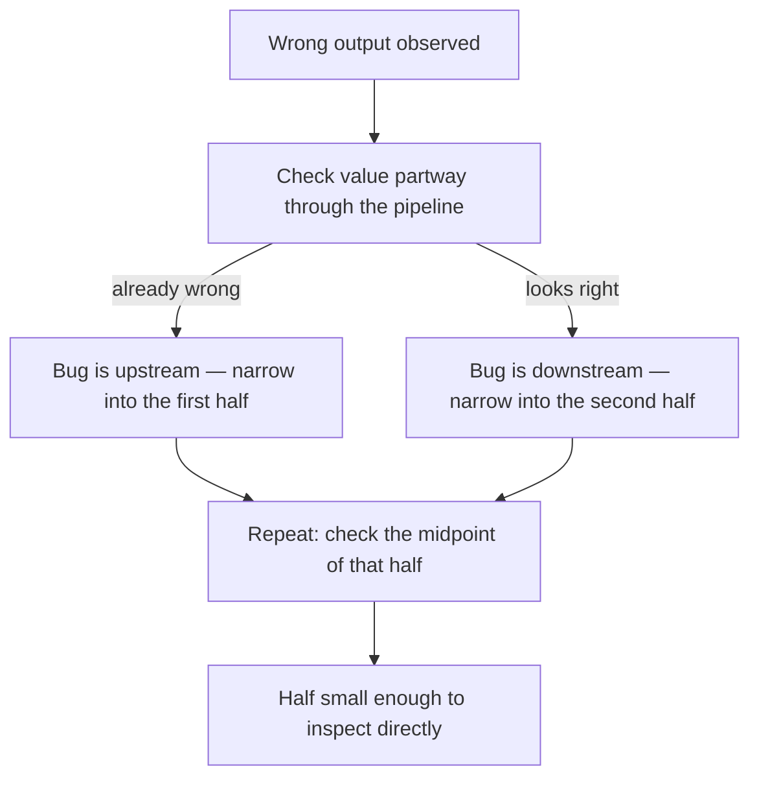

## Learning Objectives

- Explain the distinct roles testing and debugging play, and why "it ran once and looked fine" is not the same claim as "it works."
- Design a set of test cases for a function that deliberately includes boundary conditions, not just one typical example.
- Implement a systematic narrowing process for isolating the location of a bug in a multi-function program.
- Compare ad hoc `print()`-based debugging against a targeted, hypothesis-driven process, and identify when each is appropriate.
- Predict which of several candidate test cases would actually have caught a specific bug, given the bug's description.

## Context & Motivation

Every function written so far in this course has been trusted the same informal way: write it, call it once or twice with an example that seems representative, watch the output look plausible, and move on. That approach scales poorly, and it scales poorly in a specific, predictable direction — the larger and more interconnected a program becomes, the more a bug in one function can hide behind correct-looking behavior in whatever calls it, until the program is doing something wrong far from where the mistake actually lives. ACM/IEEE's CS2013 curriculum guidelines place testing and debugging inside the Software Development Fundamentals knowledge area for exactly this reason: they are not an optional polish applied after "real" programming is done, they are part of what it means to write a function correctly in the first place.

The core idea behind testing is deceptively simple: decide, in advance and in writing, what a function *should* return for a specific input, before ever trusting it to be called from anywhere else. This turns a vague feeling ("I think this works") into a checkable claim ("`average([2, 4, 6])` should equal `4`, and here is code that checks that"). The discipline is not in writing any one test — it's in choosing test cases that would actually catch the ways a function is likely to be wrong, which in practice means paying deliberate attention to *boundary conditions*: the smallest input, the largest, the empty case, the case that sits right at a threshold a conditional depends on. A function that has only ever been tried on "normal" inputs has, in a real sense, not been tested at all — it's been demonstrated once, under favorable conditions.

Debugging is what happens on the other side of a failed test: not "guess a fix and try again," but a systematic process of localization. Given that a program's overall output is wrong, *where* — in which function, at which line, under which condition — does its actual behavior first diverge from the intended one? MIT's 6.100L materials frame this as forming an explicit hypothesis about where the bug lives and designing the smallest check that would confirm or rule it out, rather than changing code speculatively and re-running to see if the symptom happened to go away. That last approach — "change something, run it, see if it looks better" — is seductive precisely because it sometimes works by accident, which is exactly what makes it dangerous: a fix arrived at without understanding *why* the bug happened can just as easily hide the same bug somewhere else, or introduce a new one.

These two skills reinforce each other directly: a good test suite is what tells you a bug exists and roughly what its symptom is, and systematic debugging is what turns that symptom into a specific, fixable location. Neither one, alone, is enough — a program with no tests can have bugs that simply go unnoticed indefinitely, and a program with tests but no debugging discipline just tells you *that* something is broken without ever getting closer to *why*.

## Core Theory

### Writing test cases as a checkable specification

A test case pairs a specific input with the output that input is expected to produce, expressed so it can be checked automatically rather than eyeballed.

```python
def average(numbers):
    return sum(numbers) / len(numbers)

assert average([2, 4, 6]) == 4
assert average([5]) == 5
assert average([-2, 2]) == 0
```

Each `assert` fails loudly (raising `AssertionError`) if its condition is `False`, and does nothing at all if it's `True` — silence is success. Writing these down *before* using `average` elsewhere in a program converts "I believe this function works" into "this function has been checked against three specific claims, and all three held." That is a strictly stronger, and falsifiable, statement.

### Choosing test cases that actually test something: boundary conditions

The three test cases above were not chosen arbitrarily — `[5]` checks a single-element list (the smallest non-empty case), and `[-2, 2]` checks a case where the average is neither the largest nor smallest input, and happens to land on a value (`0`) that could mask certain bugs if chosen carelessly (an implementation that accidentally always returned `0` would still pass a poorly-chosen test). A boundary condition is a deliberately chosen edge: the smallest legal input, the largest, a value right at a threshold a conditional branches on, or an input that is legal but easy to mishandle.

Running the three assertions above reveals nothing wrong — but they were never testing the *empty* list, which is exactly the boundary this function turns out not to handle:

```python
average([])   # ZeroDivisionError: division by zero
```

Nothing in the test cases above would have caught this, because none of them tried it — which is itself the lesson: a passing test suite proves a function is correct *for the cases tested*, not correct in general. The absence of a boundary case in the test suite is precisely why the boundary bug survived unnoticed. Once caught, the missing case forces an explicit design decision — should `average([])` raise an error on purpose, return `0`, or return `None`? — rather than leaving the answer to whatever `ZeroDivisionError` happens to say by accident.

### A systematic process for isolating a bug's location

When a program's *overall* output is wrong but it isn't obvious which function is responsible, the undisciplined approach is to stare at all of it at once. The disciplined approach is to check an intermediate value at some point roughly in the middle of the computation, and use whether that value is already wrong to decide which half of the program to look at next:

```python
def process(data):
    cleaned = clean(data)
    print("DEBUG cleaned:", cleaned)      # checkpoint: is this already wrong?
    result = summarize(cleaned)
    print("DEBUG result:", result)         # checkpoint: did summarize introduce the bug?
    return result
```

If `cleaned` is already wrong, the bug is in `clean` (or in `data` itself) — `summarize` doesn't even need to be examined. If `cleaned` looks right but `result` doesn't, the bug is isolated to `summarize`. Whichever half turns out to be wrong, the same trick can be applied again *inside* that half, checking a value roughly in its middle, narrowing the search again. This is exactly the bisection idea — check the midpoint, then recurse into whichever half is inconsistent — applied not to a numeric search space but to *the sequence of steps a program performs*.



### From `print()` debugging to a debugger's tools

Scattering `print()` statements is a legitimate, low-overhead version of exactly the same checkpoint idea — but it does not scale well: each new hypothesis about where a bug might be requires editing the code, adding another print, re-running, and then remembering to remove it afterward. A real debugger (such as Python's built-in `pdb`, or the debugger built into most editors) achieves the same goal — inspect a value at a specific point in execution — without editing the source at all: it can pause execution at a chosen line, show every variable's current value, and step forward one line at a time. The underlying discipline is identical in both cases — form a hypothesis, check a specific point, narrow based on what's found — only the tooling differs, and the tooling matters more as a program's size and number of execution paths grows.

### Reproducing a bug reliably before trying to fix it

A bug that only shows up "sometimes" is far harder to isolate than one that shows up every time, so an important early step is finding the smallest, most reliable set of conditions that reproduces it — ideally shrinking a large failing input down to the smallest example that still fails:

```python
def buggy_stats(numbers):
    return {"max": max(numbers), "min": min(numbers), "avg": sum(numbers) / len(numbers)}

# Fails somewhere in a 200-element dataset — but does it fail on any small input?
buggy_stats([5])          # works fine
buggy_stats([5, 5])        # works fine
buggy_stats([])            # ZeroDivisionError — reproduced with the smallest possible case
```

Once the bug reproduces on `buggy_stats([])` specifically, there is no need to keep re-running the full 200-element dataset while investigating — the two-line reproduction is faster to test against and just as informative.

## Worked Examples

### Example 1 — designing a test suite for a boundary-prone function, then finding the bug it exposes

**Problem:** write and test a function `clamp(value, low, high)` that returns `value`, unless it's outside the `[low, high]` range, in which case it returns whichever boundary it crossed.

Step 1 — write the function:

```python
def clamp(value, low, high):
    if value < low:
        return low
    if value > high:
        return high
    return value
```

Step 2 — before trusting it, write test cases that include the boundaries on purpose, not just typical middle values:

```python
assert clamp(5, 0, 10) == 5      # ordinary case, inside the range
assert clamp(-3, 0, 10) == 0      # below the low boundary
assert clamp(15, 0, 10) == 10     # above the high boundary
assert clamp(0, 0, 10) == 0        # exactly at the low boundary
assert clamp(10, 0, 10) == 10      # exactly at the high boundary
```

Step 3 — run them. All five pass, which is a real, if partial, guarantee: this function is correct for these five specific claims, including the two trickiest ones (values that sit exactly on a boundary, where an off-by-one mistake like `<=` versus `<` would show up). A test suite that only checked `clamp(5, 0, 10)` would have missed both boundary bugs an implementation like `if value <= low: return low` (with the wrong comparison) could still hide.

### Example 2 — isolating a bug with the narrowing process

**Problem:** a program is supposed to read a list of numbers, remove the negative ones, and report the average of what's left — but it's returning a wrong average.

```python
def remove_negatives(numbers):
    return [n for n in numbers if n > 0]     # bug: drops zero too

def average(numbers):
    return sum(numbers) / len(numbers)

def report(numbers):
    positive = remove_negatives(numbers)
    return average(positive)

report([0, 2, 4, -1, -3])   # returns 3.0 — is that right?
```

Step 1 — decide what the correct answer should be by hand: removing only the *negative* numbers from `[0, 2, 4, -1, -3]` should leave `[0, 2, 4]`, whose average is `2.0` — not the `3.0` the program returned.

Step 2 — add a checkpoint between the two steps, exactly at the midpoint of the pipeline, to see which half is wrong:

```python
def report(numbers):
    positive = remove_negatives(numbers)
    print("DEBUG positive:", positive)     # checkpoint
    return average(positive)

report([0, 2, 4, -1, -3])
# DEBUG positive: [2, 4]
```

Step 3 — `positive` is already wrong — it should be `[0, 2, 4]`, not `[2, 4]` — so the bug is isolated to `remove_negatives`, and `average` doesn't need to be examined at all. Reading `remove_negatives` with that specific mismatch in mind (a `0` that should have stayed got dropped) points directly at the condition: `n > 0` excludes zero, when the intent was to exclude only negatives, which should have been `n >= 0`.

```python
def remove_negatives(numbers):
    return [n for n in numbers if n >= 0]     # fixed

report([0, 2, 4, -1, -3])   # 2.0 — matches the hand-computed expectation
```

### Example 3 — a test suite that passes yet misses a real bug

**Problem:** demonstrate concretely that a passing test suite does not prove general correctness.

```python
def is_even(n):
    return n % 2 == 0     # looks obviously correct

assert is_even(4) is True
assert is_even(7) is False
assert is_even(0) is True
```

All three assertions pass. Now try a case none of them covered:

```python
is_even(-3)   # False — actually correct, since -3 % 2 == 1 in Python
is_even(-4)   # True — also correct
```

In this particular case the function happens to hold up under negative inputs too, precisely because Python's `%` is defined to make it work out — but the point stands independent of this specific function: the three original assertions never tried a negative number, so they could not have told anyone, one way or another, whether negative inputs were handled correctly. "The test suite passed" was never a claim about negative numbers, because negative numbers were never in the test suite. Recognizing that gap — noticing which categories of input a test suite is silent about — is itself a skill distinct from writing any individual test case.

## Common Misconceptions & Pitfalls

- **"Writing test cases is time spent not making progress on the feature."** In the isolation example above, the bug (`n > 0` instead of `n >= 0`) was found in two steps once a checkpoint was added — but without any test case at all, that same bug could easily have shipped silently, to be found much later by a user, at a point where fixing it is far more expensive because other code may have since been built on top of the wrong behavior.
- **"If it ran without crashing, it must be correct."** `report([0, 2, 4, -1, -3])` in Example 2 ran to completion and returned a plausible-looking number, `3.0` — no exception, no crash, nothing that looked obviously broken. It was simply wrong, and would have stayed wrong indefinitely without a specific expected value to compare against.
- **"A passing test suite means the function is correct."** As Example 3 shows directly: a test suite only makes a claim about the specific inputs it actually tries. Choosing which inputs to try — especially boundary cases — is a skill in itself, not a mechanical checklist to complete once and never revisit.
- **"`print()`-debugging and real debugging are the same thing."** Scattering prints everywhere and reading the resulting wall of output is not the same as the narrowing process itself — the value of the process is in *where* the checks are placed (deliberately, at a midpoint, based on a hypothesis) and in stopping to reason about what each result rules in or out, not in the volume of output produced.
- **"A bug that reproduces on a big, complicated input is best debugged on that same big input."** Example: `buggy_stats([])` in Core Theory reproduces the exact same `ZeroDivisionError` a 200-element failing dataset produces, in one line instead of two hundred. Shrinking a failure to its smallest reproducible form, before trying to fix it, makes every subsequent experiment faster and easier to reason about.

## Summary

Testing means writing down, before trusting a function, specific input-output pairs it must satisfy — chosen deliberately to include boundary conditions, since a passing test suite is a claim only about the cases it actually tried, never a general proof of correctness. Debugging is a systematic, hypothesis-driven process of narrowing down where a program's behavior first diverges from what's expected, most effectively done by checking an intermediate value roughly halfway through a computation and recursing into whichever half turns out to be wrong — the same divide-and-narrow idea bisection search applies to numbers, applied here to program structure. `print()` statements and real debuggers both implement this same checkpoint idea; a debugger just does it without editing the source. Reproducing a bug on the smallest input that still triggers it, before attempting a fix, makes every subsequent experiment cheaper and clearer. Together, testing and debugging turn "I think this works" into a checkable, falsifiable, and eventually verified claim.

## Documentation Links

- [ACM/IEEE CS2013 — Software Development Fundamentals KA](https://csed.acm.org/wp-content/uploads/2023/09/SDF-Version-Gamma.pdf) — doc
- [MIT 6.100L — Materials by Lecture](https://ocw.mit.edu/courses/6-100l-introduction-to-cs-and-programming-using-python-fall-2022/pages/material-by-lecture/) — doc
