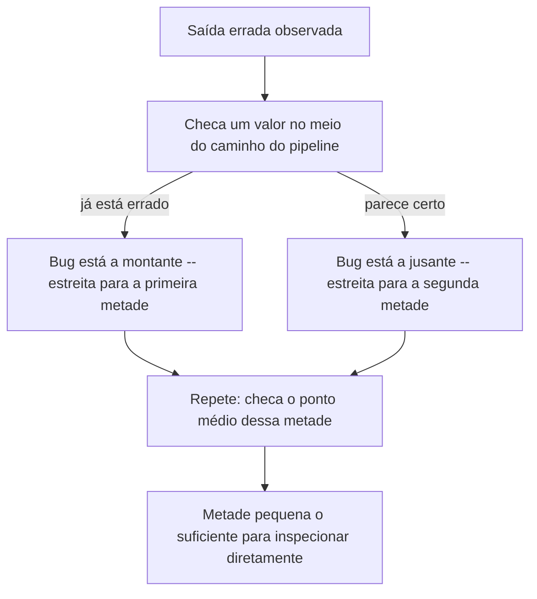

## Objetivos de Aprendizagem

- Explicar os papéis distintos que testes e depuração desempenham, e por que "rodou uma vez e pareceu bem" não é a mesma afirmação que "funciona".
- Projetar um conjunto de casos de teste para uma função que deliberadamente inclui condições de fronteira, não apenas um exemplo típico.
- Implementar um processo sistemático de estreitamento para isolar a localização de um bug num programa de múltiplas funções.
- Comparar depuração ad hoc baseada em `print()` contra um processo direcionado e guiado por hipótese, e identificar quando cada um é apropriado.
- Prever qual dentre vários casos de teste candidatos de fato teria capturado um bug específico, dada a descrição do bug.

## Contexto e Motivação

Toda função escrita até agora neste curso foi confiada da mesma forma informal: escreva-a, chame-a uma ou duas vezes com um exemplo que parece representativo, observe a saída parecer plausível, e siga em frente. Essa abordagem escala mal, e escala mal numa direção específica e previsível: quanto maior e mais interconectado um programa se torna, mais um bug numa função pode se esconder atrás de um comportamento de aparência correta em qualquer coisa que a chame, até o programa estar fazendo algo errado bem longe de onde o erro de fato mora. As diretrizes curriculares CS2013 do ACM/IEEE colocam testes e depuração dentro da área de conhecimento de Fundamentos de Desenvolvimento de Software exatamente por essa razão: eles não são um polimento opcional aplicado depois que a programação "de verdade" está feita, são parte do que significa escrever uma função corretamente para começar.

A ideia central por trás de testes é enganosamente simples: decida, de antemão e por escrito, o que uma função *deveria* retornar para uma entrada específica, antes de jamais confiar que ela seja chamada de qualquer outro lugar. Isso transforma um sentimento vago ("acho que isso funciona") numa afirmação checável ("`average([2, 4, 6])` deveria ser igual a `4`, e aqui está código que checa isso"). A disciplina não está em escrever qualquer teste: está em escolher casos de teste que de fato capturariam as formas pelas quais uma função provavelmente está errada, o que na prática significa prestar atenção deliberada a *condições de fronteira*: a menor entrada, a maior, o caso vazio, o caso que fica exatamente num limiar de que um condicional depende. Uma função que só foi tentada em entradas "normais" não foi, num sentido real, testada de forma alguma: foi demonstrada uma vez, sob condições favoráveis.

Depuração é o que acontece do outro lado de um teste que falhou: não "chute uma correção e tente de novo", mas um processo sistemático de localização. Dado que a saída geral de um programa está errada, *onde* (em qual função, em qual linha, sob qual condição) seu comportamento real primeiro diverge do pretendido? O material do 6.100L do MIT enquadra isso como formar uma hipótese explícita sobre onde o bug mora e projetar a menor checagem que confirmaria ou descartaria isso, em vez de mudar código especulativamente e rodar de novo para ver se o sintoma por acaso sumiu. Essa última abordagem, "mude algo, rode, veja se parece melhor," é sedutora precisamente porque às vezes funciona por acidente, o que é exatamente o que a torna perigosa: uma correção alcançada sem entender *por que* o bug aconteceu pode facilmente esconder o mesmo bug em outro lugar, ou introduzir um novo.

Essas duas habilidades se reforçam diretamente: uma boa suíte de testes é o que diz a você que um bug existe e aproximadamente qual é seu sintoma, e depuração sistemática é o que transforma esse sintoma numa localização específica e corrigível. Nenhuma das duas, sozinha, basta: um programa sem testes pode ter bugs que simplesmente passam despercebidos indefinidamente, e um programa com testes mas sem disciplina de depuração só diz a você *que* algo está quebrado sem jamais chegar mais perto de *por quê*.

## Teoria Central

### Escrevendo casos de teste como uma especificação checável

Um caso de teste combina uma entrada específica com a saída que essa entrada deveria produzir, expressa de forma que possa ser checada automaticamente em vez de observada a olho.

```python
def average(numbers):
    return sum(numbers) / len(numbers)

assert average([2, 4, 6]) == 4
assert average([5]) == 5
assert average([-2, 2]) == 0
```

Todo `assert` falha em voz alta (disparando `AssertionError`) se sua condição é `False`, e não faz nada de forma alguma se é `True`: silêncio é sucesso. Escrever isso *antes* de usar `average` em outro lugar num programa converte "eu acredito que esta função funciona" em "esta função foi checada contra três afirmações específicas, e as três se sustentaram." Isso é uma afirmação estritamente mais forte, e falseável.

### Escolhendo casos de teste que de fato testam algo: condições de fronteira

Os três casos de teste acima não foram escolhidos arbitrariamente: `[5]` checa uma lista de um único elemento (o menor caso não vazio), e `[-2, 2]` checa um caso em que a média não é nem a maior nem a menor entrada, e por acaso cai num valor (`0`) que poderia mascarar certos bugs se escolhido descuidadamente (uma implementação que acidentalmente sempre retornasse `0` ainda passaria num teste mal escolhido). Uma condição de fronteira é uma borda deliberadamente escolhida: a menor entrada legal, a maior, um valor exatamente num limiar de que um condicional se ramifica, ou uma entrada que é legal mas fácil de tratar mal.

Rodar as três afirmações acima não revela nada errado, mas elas nunca testaram a lista *vazia*, que é exatamente a fronteira que esta função acaba não tratando:

```python
average([])   # ZeroDivisionError: division by zero
```

Nada nos casos de teste acima teria capturado isso, porque nenhum deles tentou: essa é, em si, a lição: uma suíte de testes que passa prova que uma função está correta *para os casos testados*, nunca correta em geral. A ausência de um caso de fronteira na suíte de testes é precisamente por que o bug de fronteira sobreviveu despercebido. Uma vez capturado, o caso ausente força uma decisão de design explícita: `average([])` deveria disparar um erro de propósito, retornar `0`, ou retornar `None`? Em vez de deixar a resposta a cargo do que `ZeroDivisionError` por acaso diz.

### Um processo sistemático para isolar a localização de um bug

Quando a saída *geral* de um programa está errada mas não é óbvio qual função é responsável, a abordagem sem disciplina é encarar tudo de uma vez. A abordagem disciplinada é checar um valor intermediário em algum ponto aproximadamente no meio do cálculo, e usar se esse valor já está errado para decidir qual metade do programa olhar em seguida:

```python
def process(data):
    cleaned = clean(data)
    print("DEBUG cleaned:", cleaned)      # checkpoint: isso já está errado?
    result = summarize(cleaned)
    print("DEBUG result:", result)         # checkpoint: summarize introduziu o bug?
    return result
```

Se `cleaned` já está errado, o bug está em `clean` (ou no próprio `data`): `summarize` nem precisa ser examinado. Se `cleaned` parece certo mas `result` não, o bug está isolado em `summarize`. Qualquer que seja a metade que acabe errada, o mesmo truque pode ser aplicado de novo *dentro* daquela metade, checando um valor aproximadamente no meio dela, estreitando a busca de novo. Esta é exatamente a ideia de bisseção (checar o ponto médio, depois recursar na metade que estiver inconsistente) aplicada não a um espaço de busca numérico, mas à *sequência de passos que um programa executa*.



### De depuração com `print()` às ferramentas de um depurador

Espalhar instruções `print()` é uma versão legítima e de baixo custo exatamente da mesma ideia de checkpoint, mas não escala bem: toda nova hipótese sobre onde um bug pode estar exige editar o código, adicionar mais um print, rodar de novo, e depois lembrar de removê-lo. Um depurador real (como o `pdb` embutido do Python, ou o depurador embutido na maioria dos editores) alcança o mesmo objetivo, inspecionar um valor num ponto específico da execução, sem editar o código-fonte de forma alguma: ele pode pausar a execução numa linha escolhida, mostrar o valor atual de toda variável, e avançar uma linha de cada vez. A disciplina subjacente é idêntica nos dois casos (forme uma hipótese, cheque um ponto específico, estreite com base no que for encontrado), só a ferramenta difere, e a ferramenta importa mais conforme o tamanho de um programa e o número de caminhos de execução crescem.

### Reproduzindo um bug de forma confiável antes de tentar corrigi-lo

Um bug que só aparece "às vezes" é muito mais difícil de isolar do que um que aparece toda vez, então um passo inicial importante é encontrar o menor conjunto mais confiável de condições que o reproduz, idealmente encolhendo uma entrada grande que falha até o menor exemplo que ainda falha:

```python
def buggy_stats(numbers):
    return {"max": max(numbers), "min": min(numbers), "avg": sum(numbers) / len(numbers)}

# Falha em algum lugar num conjunto de dados de 200 elementos -- mas falha em alguma entrada pequena?
buggy_stats([5])          # funciona bem
buggy_stats([5, 5])        # funciona bem
buggy_stats([])            # ZeroDivisionError -- reproduzido com o menor caso possível
```

Uma vez que o bug se reproduz especificamente em `buggy_stats([])`, não há necessidade de continuar rodando de novo o conjunto de dados completo de 200 elementos enquanto investiga: a reprodução de duas linhas é mais rápida de testar e igualmente informativa.

## Exemplos Resolvidos

### Exemplo 1: projetando uma suíte de testes para uma função propensa a fronteiras, depois encontrando o bug que ela expõe

**Problema:** escreva e teste uma função `clamp(value, low, high)` que retorna `value`, a menos que esteja fora da faixa `[low, high]`, caso em que retorna qualquer fronteira que ela cruzou.

Passo 1: escreva a função:

```python
def clamp(value, low, high):
    if value < low:
        return low
    if value > high:
        return high
    return value
```

Passo 2: antes de confiar nela, escreva casos de teste que incluam as fronteiras de propósito, não apenas valores típicos do meio:

```python
assert clamp(5, 0, 10) == 5      # caso comum, dentro da faixa
assert clamp(-3, 0, 10) == 0      # abaixo da fronteira inferior
assert clamp(15, 0, 10) == 10     # acima da fronteira superior
assert clamp(0, 0, 10) == 0        # exatamente na fronteira inferior
assert clamp(10, 0, 10) == 10      # exatamente na fronteira superior
```

Passo 3: rode-os. Os cinco passam, o que é uma garantia real, ainda que parcial: esta função está correta para essas cinco afirmações específicas, incluindo as duas mais traiçoeiras (valores que ficam exatamente numa fronteira, onde um erro de um-a-mais como `<=` versus `<` apareceria). Uma suíte de testes que só checasse `clamp(5, 0, 10)` teria perdido os dois bugs de fronteira que uma implementação como `if value <= low: return low` (com a comparação errada) ainda poderia esconder.

### Exemplo 2: isolando um bug com o processo de estreitamento

**Problema:** um programa deveria ler uma lista de números, remover os negativos, e relatar a média do que sobra, mas está retornando uma média errada.

```python
def remove_negatives(numbers):
    return [n for n in numbers if n > 0]     # bug: descarta o zero também

def average(numbers):
    return sum(numbers) / len(numbers)

def report(numbers):
    positive = remove_negatives(numbers)
    return average(positive)

report([0, 2, 4, -1, -3])   # retorna 3.0 -- isso está certo?
```

Passo 1: decida qual deveria ser a resposta correta na mão: remover apenas os números *negativos* de `[0, 2, 4, -1, -3]` deveria deixar `[0, 2, 4]`, cuja média é `2.0`, não o `3.0` que o programa retornou.

Passo 2: adicione um checkpoint entre os dois passos, exatamente no meio do pipeline, para ver qual metade está errada:

```python
def report(numbers):
    positive = remove_negatives(numbers)
    print("DEBUG positive:", positive)     # checkpoint
    return average(positive)

report([0, 2, 4, -1, -3])
# DEBUG positive: [2, 4]
```

Passo 3: `positive` já está errado (deveria ser `[0, 2, 4]`, não `[2, 4]`), então o bug está isolado em `remove_negatives`, e `average` não precisa ser examinado de forma alguma. Ler `remove_negatives` com essa incompatibilidade específica em mente (um `0` que deveria ter ficado foi descartado) aponta diretamente para a condição: `n > 0` exclui zero, quando a intenção era excluir só os negativos, o que deveria ter sido `n >= 0`.

```python
def remove_negatives(numbers):
    return [n for n in numbers if n >= 0]     # corrigido

report([0, 2, 4, -1, -3])   # 2.0 -- combina com a expectativa calculada na mão
```

### Exemplo 3: uma suíte de testes que passa mas perde um bug real

**Problema:** demonstre concretamente que uma suíte de testes que passa não prova corretude geral.

```python
def is_even(n):
    return n % 2 == 0     # parece obviamente correto

assert is_even(4) is True
assert is_even(7) is False
assert is_even(0) is True
```

As três afirmações passam. Agora tente um caso que nenhuma delas cobriu:

```python
is_even(-3)   # False -- na verdade correto, já que -3 % 2 == 1 no Python
is_even(-4)   # True -- também correto
```

Neste caso particular, a função por acaso se sustenta também sob entradas negativas, precisamente porque o `%` do Python é definido de modo a fazer isso funcionar, mas o ponto vale independentemente desta função específica: as três afirmações originais nunca tentaram um número negativo, então não poderiam ter dito a ninguém, de um jeito ou de outro, se entradas negativas eram tratadas corretamente. "A suíte de testes passou" nunca foi uma afirmação sobre números negativos, porque números negativos nunca estiveram na suíte de testes. Reconhecer essa lacuna (notar sobre quais categorias de entrada uma suíte de testes é silenciosa) é, em si, uma habilidade distinta de escrever qualquer caso de teste individual.

## Equívocos Comuns e Armadilhas

- **"Escrever casos de teste é tempo gasto sem avançar na funcionalidade."** No exemplo de isolamento acima, o bug (`n > 0` em vez de `n >= 0`) foi encontrado em dois passos assim que um checkpoint foi adicionado, mas sem caso de teste nenhum, esse mesmo bug poderia facilmente ter sido lançado silenciosamente, para ser encontrado bem mais tarde por um usuário, num ponto em que corrigi-lo é muito mais caro porque outro código pode já ter sido construído em cima do comportamento errado.
- **"Se rodou sem travar, deve estar correto."** `report([0, 2, 4, -1, -3])` no Exemplo 2 rodou até o fim e retornou um número de aparência plausível, `3.0`: nenhuma exceção, nenhuma travada, nada que parecesse obviamente quebrado. Simplesmente estava errado, e teria continuado errado indefinidamente sem um valor esperado específico para comparar.
- **"Uma suíte de testes que passa significa que a função está correta."** Como o Exemplo 3 mostra diretamente: uma suíte de testes só faz uma afirmação sobre as entradas específicas que de fato tenta. Escolher quais entradas tentar, especialmente casos de fronteira, é uma habilidade em si mesma, não uma lista de checagem mecânica a completar uma vez e nunca revisitar.
- **"Depuração com `print()` e depuração de verdade são a mesma coisa."** Espalhar prints por toda parte e ler a parede de saída resultante não é a mesma coisa que o próprio processo de estreitamento: o valor do processo está em *onde* as checagens são colocadas (deliberadamente, num ponto médio, com base numa hipótese) e em parar para raciocinar sobre o que cada resultado inclui ou exclui, não no volume de saída produzido.
- **"Um bug que se reproduz numa entrada grande e complicada é melhor depurado nessa mesma entrada grande."** Exemplo: `buggy_stats([])` na Teoria Central reproduz o exato mesmo `ZeroDivisionError` que um conjunto de dados de 200 elementos que falha produz, em uma linha em vez de duzentas. Encolher uma falha até sua menor forma reproduzível, antes de tentar corrigi-la, torna todo experimento subsequente mais rápido e mais fácil de raciocinar.

## Resumo

Testar significa escrever, antes de confiar numa função, pares específicos de entrada-saída que ela precisa satisfazer, escolhidos deliberadamente para incluir condições de fronteira, já que uma suíte de testes que passa é uma afirmação apenas sobre os casos de fato tentados, nunca uma prova geral de corretude. Depurar é um processo sistemático e guiado por hipótese de estreitar onde o comportamento de um programa primeiro diverge do esperado, feito mais eficazmente checando um valor intermediário aproximadamente na metade de um cálculo e recursando na metade que se revelar errada: a mesma ideia de dividir-e-estreitar que a busca por bisseção aplica a números, aplicada aqui à estrutura do programa. Instruções `print()` e depuradores de verdade ambos implementam essa mesma ideia de checkpoint; um depurador só faz isso sem editar o código-fonte. Reproduzir um bug na menor entrada que ainda o dispara, antes de tentar uma correção, torna todo experimento subsequente mais barato e mais claro. Juntos, testes e depuração transformam "acho que isso funciona" numa afirmação checável, falseável e eventualmente verificada.

## Documentation Links

- [ACM/IEEE CS2013: Software Development Fundamentals KA](https://csed.acm.org/wp-content/uploads/2023/09/SDF-Version-Gamma.pdf) (doc)
- [MIT 6.100L: Materials by Lecture](https://ocw.mit.edu/courses/6-100l-introduction-to-cs-and-programming-using-python-fall-2022/pages/material-by-lecture/) (doc)
