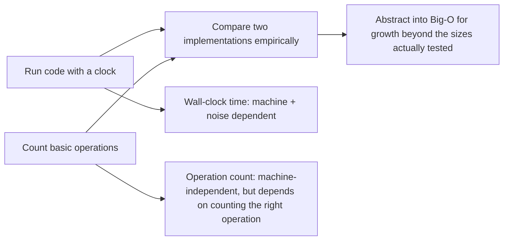

## Learning Objectives

- Explain the difference between measuring running time by wall-clock timing and by counting operations.
- Implement a timing harness with `time.time()` and an operation counter for a given function.
- Predict how a function's operation count changes when its input size doubles, from its loop structure alone.
- Identify why a single wall-clock measurement is unreliable evidence for comparing two algorithms.
- Compare the results of timing and counting on the same function to see what each measurement can and cannot tell you.

## Context & Motivation

Every program written so far in this curriculum has been judged on one axis: does it produce the correct output? That question is necessary but not sufficient — a function can be perfectly correct and still be unusable, because it takes too long to run on the input sizes that actually occur. Before this concept can be discussed in the abstract terms of "growth rate" and "worst case," it has to be grounded in something a student can actually observe: run the code, and watch what happens as the input grows.

There are two complementary ways to make that observation concrete. The first is to time the program directly, with a clock — simple, and directly meaningful, because seconds are seconds. The second is to count how many times some specific operation executes, independent of any particular machine's speed. Neither is "the answer" on its own; the interesting part is what happens when the two are compared. MIT's 6.100L follows exactly this progression, and deliberately so: measure first, empirically, on real code and real numbers, and only then introduce the machine-independent notation (Big-O) that the next concept builds on. That ordering matters pedagogically — Big-O can feel like an arbitrary rule handed down from a textbook if it isn't first anchored in something a student has watched happen with their own eyes: doubling `n` and watching the running time (and the operation count) roughly double, or roughly quadruple, or barely change at all.

This is also the point in the curriculum where "correct" and "efficient" become visibly separate concerns for the first time. Two functions that produce identical output for every test case can behave completely differently as the input grows — and the tools introduced here (a clock, and a counter) are the first, most concrete way to tell those two functions apart before any formal vocabulary exists to describe *why* they differ.

## Core Theory

### Timing a function directly

```python
import time

def sum_to_n(n):
    total = 0
    for i in range(n):
        total += i
    return total

start = time.time()
sum_to_n(10_000_000)
end = time.time()
print(end - start, "seconds")
```

Wall-clock timing is easy to do and directly meaningful, but it's tied to the specific machine, its current load, and even Python's own interpreter overhead — running the same code on a faster machine, or with other programs competing for the CPU, gives a different number for the exact same algorithm. It answers "how long did this take, here, today" — not "how does this scale."

### Reducing noise: don't trust a single run

Because wall-clock time is sensitive to whatever else the machine happens to be doing at that instant, a single measurement can be misleading — a background process stealing CPU time for half a second can make a fast function look slow. The fix is the same one used in any empirical measurement: repeat it, and report a stable summary (commonly the minimum, since noise can only ever slow a run down, never speed it up below its true cost):

```python
import time

def time_it(f, *args, repeats=5):
    times = []
    for _ in range(repeats):
        start = time.time()
        f(*args)
        times.append(time.time() - start)
    return min(times)

time_it(sum_to_n, 10_000_000)
```

Taking the minimum across several runs gives a far more stable number than any single run in isolation, because it filters out the runs that happened to be slowed down by something external to the algorithm itself.

### Counting operations independent of the machine

A more portable measure counts how many times a specific operation (say, the loop body) executes, independent of any particular machine's speed:

```python
def sum_to_n_counted(n):
    total = 0
    steps = 0
    for i in range(n):
        total += i
        steps += 1
    return total, steps

_, steps = sum_to_n_counted(10)
print(steps)   # 10 — the loop body ran exactly n times
```

Because the loop body runs exactly once per element of `range(n)`, `steps` is always exactly `n` — there's no need to run this on ten different machines to know that; the count is a fact about the *code*, not about any particular execution environment. Doubling `n` from 10 to 20 doubles `steps` from 10 to 20 — the operation count grows *linearly* with the input, a relationship that holds regardless of which machine runs the code:

| n | steps |
|---|---|
| 10 | 10 |
| 100 | 100 |
| 1,000 | 1,000 |
| 1,000,000 | 1,000,000 |

This operation count, not the wall-clock time, is what the next concept's Big-O notation is actually describing.

### Picking what to count matters

Counting operations only tells you something useful if you're counting the operation that actually dominates the cost. Consider a function whose outer loop looks small, but whose body hides a linear search:

```python
def count_matches(items, targets):
    outer_steps = 0
    matches = 0
    for item in items:              # naive count: only tracks this loop
        outer_steps += 1
        if item in targets:          # `in` on a list scans it from the start — hidden linear cost!
            matches += 1
    return matches, outer_steps
```

If `items` has `n` elements and `targets` also has roughly `n` elements, `outer_steps` reports exactly `n` — which looks linear — but the `item in targets` check inside the loop scans up to all of `targets` on every single iteration, so the *actual* total work done is closer to `n * n`. Counting only the outer loop's iterations completely misses this: it's counting the wrong operation. Choosing what to count is not a formality; a careless choice can hide the real bottleneck entirely.



## Worked Examples

**Example 1 — timing `sum_to_n` at increasing sizes.** Start with the harness from Core Theory. Run `time_it(sum_to_n, n)` for `n = 1_000_000`, `n = 5_000_000`, and `n = 10_000_000`. The measured times will roughly follow the input: doubling `n` from 5,000,000 to 10,000,000 should roughly double the measured time, because `sum_to_n`'s single loop does proportionally more work as `n` grows. The result won't be an exact doubling — interpreter overhead and system noise mean the ratio will be *close to* 2, not exactly 2 — which is precisely the kind of imprecision that motivates wanting a notation that doesn't depend on exact timings at all.

**Example 2 — counting operations for `sum_to_n_counted` at the same sizes.** Run `sum_to_n_counted(n)` for the same three values of `n` and read off `steps`. Unlike the timing experiment, this result is *exact* and reproducible on any machine: `steps` equals `n`, every time, with no noise to average away. Comparing the two experiments side by side is the point of this concept: timing gives a real but noisy number tied to one machine; counting gives an exact, portable number that captures the same underlying growth pattern (linear) without any of the noise.

**Example 3 — counting operations for a function with two nested loops.** Take a function that checks every pair of elements in a list:

```python
def count_pairs_checked(items):
    steps = 0
    for i in range(len(items)):
        for j in range(len(items)):
            steps += 1
    return steps

_, = (count_pairs_checked([0] * 10),)
```

For a list of 10 elements, `steps` comes out to 100; for a list of 20 elements, `steps` comes out to 400 — quadrupling, not doubling, when the input doubles. Placing this table next to `sum_to_n_counted`'s table makes the qualitative difference between the two functions visible from counts alone, before either function's growth rate has been given a name:

| n | `sum_to_n_counted` steps | `count_pairs_checked` steps |
|---|---|---|
| 10 | 10 | 100 |
| 20 | 20 | 400 |
| 40 | 40 | 1,600 |

## Common Misconceptions & Pitfalls

**"A faster measured time always means a better algorithm."** A single wall-clock reading reflects the state of one machine at one moment, not a property of the algorithm. Timing the exact same function twice in a row, with something else briefly competing for the CPU during one of the runs, can easily produce two noticeably different numbers for identical code — which is exactly why Core Theory's `time_it` takes the minimum over several repeats rather than trusting one run.

**"One run is enough to draw a conclusion."** Related to the above, but worth calling out on its own: a student who runs a timing experiment once, sees a number, and treats it as *the* running time of the algorithm has skipped the step that makes empirical timing trustworthy at all — repetition. The fix costs almost nothing (a small loop and a `min()`), and its absence is one of the most common reasons a timing comparison between two functions gives an inconsistent or contradictory result on a second attempt.

**Counting the wrong operation gives a confidently wrong picture.** As `count_matches` demonstrated, counting only the outer loop's iterations while ignoring a hidden linear scan inside the loop body produces a count that *looks* linear while the real cost is quadratic. The lesson generalizes: before counting, ask "which operation actually happens most, and does my counter sit inside every place that operation can occur?"

**"The operation count equals the running time."** An operation count of `n` doesn't mean the function takes `n` seconds, or `n` milliseconds, or any fixed unit of time at all — the actual time per operation depends on what the operation is and what machine runs it. What the count captures is *how the work scales* as `n` grows, not an absolute duration. Two functions with the same operation count for the same `n` can still have very different wall-clock times, if one operation is inherently more expensive than the other (a single addition versus a database query, for instance) — the count is a proxy for growth, not a stopwatch reading.

## Summary

Wall-clock timing and operation counting answer related but different questions: timing gives a concrete, directly meaningful number that is tied to one machine and noisy enough to need repeated measurement before it can be trusted; counting gives an exact, machine-independent number, but only if the counter is placed around the operation that actually dominates the cost. Both are *empirical* — they describe what was observed on the input sizes actually tested, and neither, on its own, predicts what happens on an input ten times larger than anything measured. That gap — from "here is what I measured" to "here is how this scales, provably, for any input size" — is exactly what the next concept's Big-O notation is built to close.

## Documentation Links

- [MIT 6.100L — Materials by Lecture](https://ocw.mit.edu/courses/6-100l-introduction-to-cs-and-programming-using-python-fall-2022/pages/material-by-lecture/) — doc
- [MIT 6.100L — Syllabus](https://ocw.mit.edu/courses/6-100l-introduction-to-cs-and-programming-using-python-fall-2022/pages/syllabus/) — doc
