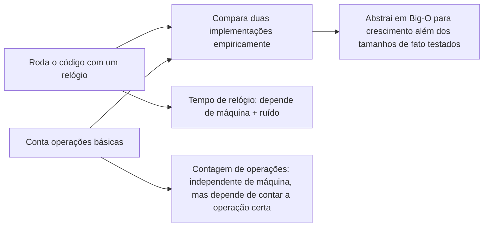

## Objetivos de Aprendizagem

- Explicar a diferença entre medir tempo de execução por cronometragem de relógio e por contagem de operações.
- Implementar um arcabouço de cronometragem com `time.time()` e um contador de operações para uma dada função.
- Prever como a contagem de operações de uma função muda quando o tamanho da sua entrada dobra, só a partir da estrutura de seus laços.
- Identificar por que uma única medição de relógio é evidência pouco confiável para comparar dois algoritmos.
- Comparar os resultados de cronometrar e contar na mesma função para ver o que cada medição consegue e não consegue dizer a você.

## Contexto e Motivação

Todo programa escrito até agora neste currículo foi julgado num eixo: ele produz a saída correta? Essa pergunta é necessária, mas não suficiente: uma função pode estar perfeitamente correta e ainda assim ser inutilizável, porque demora demais para rodar nos tamanhos de entrada que de fato ocorrem. Antes que este conceito possa ser discutido nos termos abstratos de "taxa de crescimento" e "pior caso", ele precisa estar fundamentado em algo que um aluno consiga de fato observar: rode o código, e observe o que acontece conforme a entrada cresce.

Existem duas formas complementares de tornar essa observação concreta. A primeira é cronometrar o programa diretamente, com um relógio: simples, e diretamente significativo, porque segundos são segundos. A segunda é contar quantas vezes alguma operação específica executa, independente da velocidade de qualquer máquina em particular. Nenhuma das duas é "a resposta" sozinha; a parte interessante é o que acontece quando as duas são comparadas. O 6.100L do MIT segue exatamente essa progressão, e deliberadamente: meça primeiro, empiricamente, em código real e números reais, e só depois apresente a notação independente de máquina (Big-O) sobre a qual o próximo conceito se constrói. Essa ordem importa pedagogicamente: o Big-O pode parecer uma regra arbitrária entregue de um livro-texto se não estiver primeiro ancorado em algo que um aluno tenha observado acontecer com os próprios olhos: dobrar `n` e ver o tempo de execução (e a contagem de operações) aproximadamente dobrar, ou aproximadamente quadruplicar, ou mal mudar de forma alguma.

Este também é o ponto no currículo em que "correto" e "eficiente" se tornam visivelmente preocupações separadas pela primeira vez. Duas funções que produzem saída idêntica para todo caso de teste podem se comportar completamente diferente conforme a entrada cresce, e as ferramentas apresentadas aqui (um relógio, e um contador) são a primeira e mais concreta forma de distinguir essas duas funções antes que exista qualquer vocabulário formal para descrever *por que* elas diferem.

## Teoria Central

### Cronometrando uma função diretamente

```python
import time

def sum_to_n(n):
    total = 0
    for i in range(n):
        total += i
    return total

start = time.time()
sum_to_n(10_000_000)
end = time.time()
print(end - start, "seconds")
```

A cronometragem de relógio é fácil de fazer e diretamente significativa, mas está atrelada à máquina específica, sua carga atual, e até à sobrecarga do próprio interpretador Python: rodar o mesmo código numa máquina mais rápida, ou com outros programas competindo pela CPU, dá um número diferente para o exato mesmo algoritmo. Ela responde "quanto tempo isso levou, aqui, hoje", não "como isso escala."

### Reduzindo ruído: não confie numa única execução

Como o tempo de relógio é sensível a qualquer outra coisa que a máquina por acaso esteja fazendo naquele instante, uma única medição pode enganar: um processo em segundo plano roubando tempo de CPU por meio segundo pode fazer uma função rápida parecer lenta. A correção é a mesma usada em qualquer medição empírica: repita, e relate um resumo estável (comumente o mínimo, já que ruído só pode desacelerar uma execução, nunca acelerá-la abaixo de seu custo real):

```python
import time

def time_it(f, *args, repeats=5):
    times = []
    for _ in range(repeats):
        start = time.time()
        f(*args)
        times.append(time.time() - start)
    return min(times)

time_it(sum_to_n, 10_000_000)
```

Pegar o mínimo entre várias execuções dá um número muito mais estável do que qualquer execução isolada, porque filtra as execuções que por acaso foram desaceleradas por algo externo ao próprio algoritmo.

### Contando operações independente da máquina

Uma medida mais portátil conta quantas vezes uma operação específica (digamos, o corpo do laço) executa, independente da velocidade de qualquer máquina em particular:

```python
def sum_to_n_counted(n):
    total = 0
    steps = 0
    for i in range(n):
        total += i
        steps += 1
    return total, steps

_, steps = sum_to_n_counted(10)
print(steps)   # 10 -- o corpo do laço rodou exatamente n vezes
```

Como o corpo do laço roda exatamente uma vez por elemento de `range(n)`, `steps` é sempre exatamente `n`: não há necessidade de rodar isso em dez máquinas diferentes para saber disso; a contagem é um fato sobre o *código*, não sobre nenhum ambiente de execução em particular. Dobrar `n` de 10 para 20 dobra `steps` de 10 para 20: a contagem de operações cresce *linearmente* com a entrada, uma relação que vale independentemente de qual máquina roda o código:

| n | steps |
|---|---|
| 10 | 10 |
| 100 | 100 |
| 1.000 | 1.000 |
| 1.000.000 | 1.000.000 |

Essa contagem de operações, não o tempo de relógio, é o que a notação Big-O do próximo conceito de fato descreve.

### Escolher o que contar importa

Contar operações só diz algo útil se você estiver contando a operação que de fato domina o custo. Considere uma função cujo laço externo parece pequeno, mas cujo corpo esconde uma busca linear:

```python
def count_matches(items, targets):
    outer_steps = 0
    matches = 0
    for item in items:              # contagem ingênua: só rastreia este laço
        outer_steps += 1
        if item in targets:          # `in` numa lista a varre desde o início -- custo linear escondido!
            matches += 1
    return matches, outer_steps
```

Se `items` tem `n` elementos e `targets` também tem aproximadamente `n` elementos, `outer_steps` relata exatamente `n`, que parece linear, mas a checagem `item in targets` dentro do laço varre até todo `targets` em toda iteração, então o trabalho total *real* feito é mais perto de `n * n`. Contar só as iterações do laço externo perde isso completamente: está contando a operação errada. Escolher o que contar não é uma formalidade; uma escolha descuidada pode esconder o verdadeiro gargalo por completo.



## Exemplos Resolvidos

**Exemplo 1: cronometrando `sum_to_n` em tamanhos crescentes.** Comece com o arcabouço da Teoria Central. Rode `time_it(sum_to_n, n)` para `n = 1_000_000`, `n = 5_000_000`, e `n = 10_000_000`. Os tempos medidos vão aproximadamente seguir a entrada: dobrar `n` de 5.000.000 para 10.000.000 deveria aproximadamente dobrar o tempo medido, porque o laço único de `sum_to_n` faz trabalho proporcionalmente maior conforme `n` cresce. O resultado não vai ser uma duplicação exata: sobrecarga de interpretador e ruído do sistema significam que a razão vai ficar *perto de* 2, não exatamente 2, que é precisamente o tipo de imprecisão que motiva querer uma notação que não dependa nada de cronometragens exatas.

**Exemplo 2: contando operações para `sum_to_n_counted` nos mesmos tamanhos.** Rode `sum_to_n_counted(n)` para os mesmos três valores de `n` e leia `steps`. Diferente do experimento de cronometragem, este resultado é *exato* e reproduzível em qualquer máquina: `steps` é igual a `n`, toda vez, sem ruído para tirar a média. Comparar os dois experimentos lado a lado é o ponto deste conceito: cronometragem dá um número real, mas ruidoso, atrelado a uma máquina; contagem dá um número exato e portátil que captura o mesmo padrão de crescimento subjacente (linear) sem nenhum do ruído.

**Exemplo 3: contando operações para uma função com dois laços aninhados.** Pegue uma função que checa todo par de elementos numa lista:

```python
def count_pairs_checked(items):
    steps = 0
    for i in range(len(items)):
        for j in range(len(items)):
            steps += 1
    return steps

_, = (count_pairs_checked([0] * 10),)
```

Para uma lista de 10 elementos, `steps` sai como 100; para uma lista de 20 elementos, `steps` sai como 400: quadruplicando, não dobrando, quando a entrada dobra. Colocar essa tabela ao lado da tabela de `sum_to_n_counted` torna visível a diferença qualitativa entre as duas funções só a partir das contagens, antes mesmo de a taxa de crescimento de qualquer uma das duas ter recebido um nome:

| n | passos de `sum_to_n_counted` | passos de `count_pairs_checked` |
|---|---|---|
| 10 | 10 | 100 |
| 20 | 20 | 400 |
| 40 | 40 | 1.600 |

## Equívocos Comuns e Armadilhas

**"Um tempo medido mais rápido sempre significa um algoritmo melhor."** Uma única leitura de relógio reflete o estado de uma máquina num momento, não uma propriedade do algoritmo. Cronometrar a exata mesma função duas vezes seguidas, com algo mais competindo brevemente pela CPU durante uma das execuções, pode facilmente produzir dois números perceptivelmente diferentes para código idêntico: é exatamente por isso que o `time_it` da Teoria Central pega o mínimo ao longo de várias repetições em vez de confiar numa execução.

**"Uma execução basta para tirar uma conclusão."** Relacionado ao acima, mas vale a pena destacar por si só: um aluno que roda um experimento de cronometragem uma vez, vê um número, e o trata como *o* tempo de execução do algoritmo pulou o passo que torna a cronometragem empírica confiável de forma alguma: a repetição. A correção custa quase nada (um pequeno laço e um `min()`), e sua ausência é uma das razões mais comuns pelas quais uma comparação de cronometragem entre duas funções dá um resultado inconsistente ou contraditório numa segunda tentativa.

**Contar a operação errada dá uma imagem confiantemente errada.** Como `count_matches` demonstrou, contar só as iterações do laço externo enquanto ignora uma varredura linear escondida dentro do corpo do laço produz uma contagem que *parece* linear enquanto o custo real é quadrático. A lição generaliza: antes de contar, pergunte "qual operação de fato acontece mais, e meu contador está dentro de todo lugar em que essa operação pode ocorrer?"

**"A contagem de operações é igual ao tempo de execução."** Uma contagem de operações de `n` não significa que a função leva `n` segundos, ou `n` milissegundos, ou qualquer unidade fixa de tempo de forma alguma: o tempo real por operação depende do que é a operação e de qual máquina a roda. O que a contagem captura é *como o trabalho escala* conforme `n` cresce, não uma duração absoluta. Duas funções com a mesma contagem de operações para o mesmo `n` ainda podem ter tempos de relógio muito diferentes, se uma operação é inerentemente mais cara que a outra (uma única adição versus uma consulta a banco de dados, por exemplo): a contagem é um proxy para crescimento, não uma leitura de cronômetro.

## Resumo

Cronometragem de relógio e contagem de operações respondem perguntas relacionadas, mas diferentes: cronometragem dá um número concreto e diretamente significativo que está atrelado a uma máquina e ruidoso o suficiente para precisar de medição repetida antes de poder ser confiado; contagem dá um número exato e independente de máquina, mas só se o contador for colocado ao redor da operação que de fato domina o custo. As duas são *empíricas*: elas descrevem o que foi observado nos tamanhos de entrada de fato testados, e nenhuma delas, sozinha, prevê o que acontece numa entrada dez vezes maior do que qualquer coisa medida. Essa lacuna, de "aqui está o que eu medi" para "aqui está como isso escala, comprovadamente, para qualquer tamanho de entrada", é exatamente o que a notação Big-O do próximo conceito é construída para fechar.

## Documentation Links

- [MIT 6.100L: Materials by Lecture](https://ocw.mit.edu/courses/6-100l-introduction-to-cs-and-programming-using-python-fall-2022/pages/material-by-lecture/) (doc)
- [MIT 6.100L: Syllabus](https://ocw.mit.edu/courses/6-100l-introduction-to-cs-and-programming-using-python-fall-2022/pages/syllabus/) (doc)
