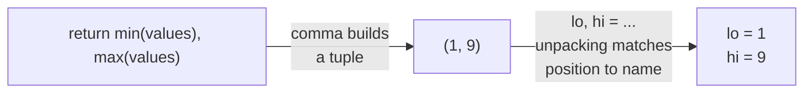

## Learning Objectives

- Explain how a tuple's behavior relates to a list's, and identify exactly which operations a tuple's immutability rules out.
- Implement tuple creation, indexing, and unpacking, and recognize what actually makes a tuple a tuple syntactically.
- Predict which container (list, tuple, or neither) is the right choice for a given piece of data, based on whether it needs to change and whether it needs to be hashable.
- Compare a tuple used as a fixed-position record against a named alternative, and identify the readability cost of the former.
- Use tuple unpacking to return and receive multiple values from a function, in place of manual indexing.

## Context & Motivation

Two lessons ago, mutability was introduced as the property that distinguishes a list from every value studied before it — a list's contents can change in place, while a number or string's cannot. This lesson introduces a type that sits, deliberately, on the *other* side of that same line while still behaving, in almost every other respect, like a list. A tuple — written with parentheses, `(1, 2, 3)` — supports indexing, iteration, `len()`, and membership testing exactly the way a list does, because Python's built-in types reference groups tuples and lists together under a shared "sequence" protocol. What a tuple refuses, categorically, is any operation that would change its contents after creation: no `.append()`, no item assignment, no `.remove()`. Once built, a tuple's shape and contents are permanent.

This might look, at first glance, like a strictly worse list — why would anyone choose a container that can do less? The answer is that immutability isn't a missing feature; it's a guarantee, and guarantees are valuable in their own right, independent of any single feature that comes bundled with them. A tuple's immutability is exactly what makes it usable as a dictionary key or a member of a set — both structures require their contents to be *hashable*, which in turn requires immutability, and a list's very flexibility is what disqualifies it from that role entirely. A tuple's immutability is also a form of documentation: a function signature or a variable that returns a tuple is implicitly promising the caller "this shape and size won't grow or shrink out from under you," a promise a list's design cannot make.

Tuples also show up constantly in a place that's easy to walk past without noticing: whenever a function needs to hand back more than one value. `return min(values), max(values)` is quietly building and returning a tuple — the comma, not any parentheses, is what constructs it — and the unpacking on the receiving end, `lo, hi = bounds(...)`, is what makes that tuple feel like "two return values" rather than one composite object. Understanding this mechanism precisely — and practicing the habit of unpacking instead of indexing by position — pays off in both directions: writing functions that return multiple related values cleanly, and reading code that does the same without needing to trace through what position 0 versus position 1 is supposed to mean.

## Core Theory

### What actually makes a tuple a tuple

```python
point = (3, 4)
also_a_tuple = 3, 4        # the COMMA creates the tuple; parentheses are usually just clarity
single = (5,)               # a ONE-element tuple -- the trailing comma is required
not_a_tuple = (5)            # this is just the int 5 in parentheses, NOT a tuple!
```

This is one of the most consequential syntax details in the entire concept: parentheses alone do not create a tuple — Python already uses parentheses for grouping expressions, so `(5)` is indistinguishable from the plain integer `5` wrapped in redundant parentheses. It's the comma that signals "this is a tuple," which is why a one-element tuple requires a comma even with nothing after it, `(5,)`, and why `return a, b` in a function is already returning a two-element tuple with no parentheses in sight.

### Indexing, length, and immutability, side by side

```python
point = (3, 4)
point[0]         # 3 -- indexing works exactly like a list
len(point)         # 2
point[0] = 5      # TypeError: 'tuple' object does not support item assignment
```

The error message is specific and immediate — attempting to mutate raises an exception the moment the attempt is made, rather than allowing a silent change to occur. This is the same design philosophy behind a string's immutability, extended here to a sequence that can hold arbitrary values rather than just characters.

### Unpacking: assigning every element to its own name at once

```python
point = (3, 4)
x, y = point            # x = 3, y = 4 -- one line, no manual indexing

def min_and_max(values):
    return min(values), max(values)   # builds and returns a tuple

lo, hi = min_and_max([4, 1, 9, 2])     # lo = 1, hi = 9
```

Unpacking on the receiving end mirrors tuple construction on the sending end — `min(values), max(values)` builds the tuple via a comma, and `lo, hi = ...` un-builds it, matching positions to names. This reads far more clearly at the call site than indexing a returned tuple by position (`result = min_and_max(...); result[0]`, `result[1]`), because `lo` and `hi` carry meaning that `result[0]` and `result[1]` do not.



### Why a tuple can be a dictionary key when a list can't

Python dictionaries (covered in a later lesson) require their keys to be *hashable* — a property that depends on being immutable, because a hash value computed once for a mutable object could become wrong the instant that object changed, silently corrupting the dictionary's internal lookup structure. A tuple's immutability guarantees its hash never needs to change after creation, so it qualifies; a list's mutability means it categorically cannot.

```python
distances = {}
distances[(0, 0), (3, 4)] = 5.0    # a tuple of tuples, used as a single composite key
distances[(1, 1), (4, 4)] = 4.24

# distances[[0,0],[3,4]] = 5.0    # TypeError: unhashable type: 'list' -- lists can never do this
```

### Tuples as lightweight, fixed-shape records

A tuple is often used to bundle a handful of related values that travel together by convention — a `(year, month, day)` date, an `(r, g, b)` color, an `(x, y)` coordinate. This works, but it leans entirely on the *reader* remembering what each position means, since a plain tuple carries no field names:

```python
today = (2026, 9, 6)
print(today[1])   # 9 -- but "position 1 means month" is knowledge the reader must supply
```

For a handful of positions used consistently and locally, this convention is manageable. As the number of positions grows, or as the tuple travels further from where it was created, the lack of names becomes a genuine readability cost — one that a more structured alternative (a dictionary, or later in a full curriculum, a dataclass or named tuple) would resolve by attaching a name to each position instead of relying on memorized order.

## Worked Examples

**Example 1 — building a function that returns multiple values, and unpacking them correctly at every call site.** Write a function that computes both the area and the perimeter of a rectangle, given its width and height.

```python
def rectangle_stats(width, height):
    area = width * height
    perimeter = 2 * (width + height)
    return area, perimeter          # builds a two-element tuple

# unpacking cleanly at the call site:
a, p = rectangle_stats(4, 5)
print(f"area={a}, perimeter={p}")    # area=20, perimeter=18

# equivalent, but less readable -- indexing instead of unpacking:
result = rectangle_stats(4, 5)
print(f"area={result[0]}, perimeter={result[1]}")   # same output, harder to read
```

Both versions are functionally identical — `rectangle_stats` always returns the same tuple either way. The difference is entirely at the *call site*: `a, p = rectangle_stats(4, 5)` gives each value a meaningful name immediately, while `result[0]` and `result[1]` force every future reader to either remember or go re-check which position means what.

**Example 2 — using a tuple to guarantee a fixed shape survives being passed around.** A program tracks a set of 2D points that must never change shape (always exactly two coordinates) as they're passed between several functions.

```python
def midpoint(point_a, point_b):
    x = (point_a[0] + point_b[0]) / 2
    y = (point_a[1] + point_b[1]) / 2
    return x, y

def distance(point_a, point_b):
    dx = point_a[0] - point_b[0]
    dy = point_a[1] - point_b[1]
    return (dx ** 2 + dy ** 2) ** 0.5

p1 = (0, 0)
p2 = (3, 4)
print(midpoint(p1, p2))   # (1.5, 2.0)
print(distance(p1, p2))    # 5.0
```

Choosing tuples for `p1` and `p2` here isn't just a stylistic preference — it's a correctness guarantee. If `midpoint` or `distance` were passed lists instead, nothing in the language would prevent a bug elsewhere in the program from accidentally `.append()`-ing a third coordinate onto one of them, silently breaking every function here that assumes exactly two elements. With tuples, that entire category of bug is ruled out at the type level: there is no operation that could grow or shrink `p1` after it's created, so every function that assumes "exactly two coordinates" can rely on that assumption holding for the tuple's entire lifetime.

**Example 3 — deciding between a tuple and a list for the same-looking data, and seeing the decision matter later.** Suppose a function processes a batch of student `(name, score)` pairs and needs to look up, later, whether a given pair has already been seen — using a `set` for fast membership testing.

```python
pairs_as_lists = [["Ada", 92], ["Ben", 88]]
seen = set()
for pair in pairs_as_lists:
    seen.add(pair)   # TypeError: unhashable type: 'list' -- lists can't go in a set
```

This fails immediately, because a `set`'s elements must be hashable, and a list never qualifies. Switching the representation to tuples resolves it, because tuples of immutable elements are hashable:

```python
pairs_as_tuples = [("Ada", 92), ("Ben", 88)]
seen = set()
for pair in pairs_as_tuples:
    seen.add(pair)     # works: tuples are hashable

print(("Ada", 92) in seen)   # True
print(("Cid", 70) in seen)   # False
```

The lesson here isn't "always prefer tuples" — it's that the choice between a list and a tuple is a decision with real, checkable consequences (what operations remain legal, what data structures can hold the value) rather than a purely cosmetic one, and the failure surfaces immediately and clearly (`TypeError: unhashable type`) rather than as a subtle wrong answer later.

## Common Misconceptions & Pitfalls

- **"Wrapping something in parentheses makes it a tuple."** It's the comma that matters, not the parentheses. `(5)` is just the integer `5`; `(5,)` is a one-element tuple. This trips up almost everyone at least once, usually while trying to construct a single-element tuple and being confused about why `type((5))` reports `int`:

  ```python
  print(type((5)))    # <class 'int'>  -- no comma, so no tuple
  print(type((5,)))    # <class 'tuple'> -- the trailing comma is what does it
  print(type(5, ))      # actually a SyntaxError here -- this specific spacing is a function-call-like context
  ```

- **"A tuple is just an immutable list, so it must be strictly less useful."** Immutability is a guarantee that opens doors a list's flexibility closes: a tuple can be a dictionary key or a set member, can be returned from a function with confidence its shape won't be silently altered by whatever the caller does next, and communicates "this won't grow or shrink" to every future reader. These are genuine capabilities, not consolation prizes for lacking `.append()`.

- **"If I need to change even one value inside a tuple, I should just find a workaround to mutate it in place."** There is no workaround — `point[0] = 5` will always raise `TypeError`, by design, and that's not a bug to route around with some clever trick. If the data genuinely needs to change over its lifetime, that's a signal the value should have been a list from the start; the fix is switching the type used to represent that data, not fighting the tuple's immutability.

- **"Tuple unpacking always requires exactly one name per element, so it's inflexible for variable-length data."** Basic unpacking does require a matching count (`x, y = point` fails with `ValueError: too many values to unpack` if `point` has three elements), but Python's starred unpacking (`first, *rest = values`) relaxes this for cases that genuinely need it — a detail worth knowing exists, even if the mechanics of star-unpacking belong to a later, more advanced lesson.

## Summary

A tuple shares almost everything with a list — indexing, iteration, `len()` — except the one property that defines it: once created, a tuple's contents and size are permanent, and any attempt to mutate one raises `TypeError` immediately rather than silently succeeding or silently failing later. It's the comma, not the parentheses, that actually constructs a tuple, which is why `return a, b` already returns a tuple and why a one-element tuple needs a trailing comma to be recognized as one at all. Immutability is what qualifies a tuple as hashable, and therefore usable as a dictionary key or set member — a role a list can never fill. Tuple unpacking (`x, y = point`, or `lo, hi = min_and_max(values)`) is the idiomatic way to both build and consume multiple related values, and reads far more clearly than positional indexing into a returned tuple. The choice between a list and a tuple for a given piece of data is a real design decision — driven by whether the data needs to grow or shrink, and whether it needs to be hashable — not a stylistic afterthought.

## Documentation Links

- [Python Library Reference — Built-in Types](https://docs.python.org/3/library/stdtypes.html) — doc
- [Python Tutorial — Data Structures](https://docs.python.org/3/tutorial/datastructures.html) — doc
