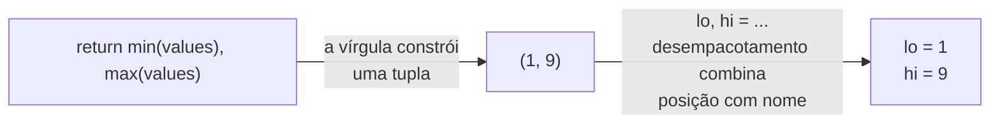

## Objetivos de Aprendizagem

- Explicar como o comportamento de uma tupla se relaciona ao de uma lista, e identificar exatamente quais operações a imutabilidade de uma tupla exclui.
- Implementar criação, indexação e desempacotamento de tupla, e reconhecer o que de fato torna uma tupla uma tupla sintaticamente.
- Prever qual container (lista, tupla, ou nenhum dos dois) é a escolha certa para um dado dado, com base em se ele precisa mudar e se precisa ser hasheável.
- Comparar uma tupla usada como um registro de posição fixa com uma alternativa nomeada, e identificar o custo de legibilidade da primeira.
- Usar desempacotamento de tupla para retornar e receber múltiplos valores de uma função, no lugar de indexação manual.

## Contexto e Motivação

Duas lições atrás, mutabilidade foi apresentada como a propriedade que distingue uma lista de todo valor estudado antes dela: o conteúdo de uma lista pode mudar no lugar, enquanto o de um número ou string não pode. Esta lição apresenta um tipo que fica, deliberadamente, do *outro* lado dessa mesma linha enquanto ainda se comporta, em quase todo outro aspecto, como uma lista. Uma tupla, escrita com parênteses, `(1, 2, 3)`, suporta indexação, iteração, `len()`, e teste de pertencimento exatamente como uma lista faz, porque a referência de tipos embutidos do Python agrupa tuplas e listas juntas sob um protocolo compartilhado de "sequência". O que uma tupla recusa, categoricamente, é qualquer operação que mudaria seu conteúdo depois da criação: nenhum `.append()`, nenhuma atribuição a item, nenhum `.remove()`. Uma vez construída, a forma e o conteúdo de uma tupla são permanentes.

Isso pode parecer, à primeira vista, uma lista estritamente pior: por que alguém escolheria um container que consegue fazer menos? A resposta é que imutabilidade não é um recurso ausente; é uma garantia, e garantias são valiosas por si só, independentemente de qualquer recurso único que venha empacotado com elas. A imutabilidade de uma tupla é exatamente o que a torna utilizável como chave de dicionário ou membro de um conjunto: as duas estruturas exigem que seu conteúdo seja *hasheável*, o que por sua vez exige imutabilidade, e a própria flexibilidade de uma lista é o que a desqualifica desse papel por completo. A imutabilidade de uma tupla também é uma forma de documentação: a assinatura de uma função ou uma variável que retorna uma tupla está implicitamente prometendo a quem chama "essa forma e tamanho não vão crescer ou encolher debaixo de você", uma promessa que o design de uma lista não pode fazer.

Tuplas também aparecem constantemente num lugar fácil de passar despercebido: sempre que uma função precisa entregar de volta mais que um valor. `return min(values), max(values)` está silenciosamente construindo e retornando uma tupla: a vírgula, não parênteses nenhum, é o que a constrói, e o desempacotamento do lado receptor, `lo, hi = bounds(...)`, é o que faz aquela tupla parecer "dois valores de retorno" em vez de um único objeto composto. Entender esse mecanismo com precisão, e praticar o hábito de desempacotar em vez de indexar por posição, compensa nas duas direções: escrever funções que retornam múltiplos valores relacionados de forma limpa, e ler código que faz o mesmo sem precisar rastrear o que a posição 0 versus a posição 1 deveria significar.

## Teoria Central

### O que de fato torna uma tupla uma tupla

```python
point = (3, 4)
also_a_tuple = 3, 4        # a VÍRGULA cria a tupla; parênteses geralmente são só clareza
single = (5,)               # uma tupla de UM elemento -- a vírgula final é obrigatória
not_a_tuple = (5)            # isso é só o int 5 entre parênteses, NÃO uma tupla!
```

Este é um dos detalhes de sintaxe mais consequentes em todo o conceito: parênteses sozinhos não criam uma tupla; o Python já usa parênteses para agrupar expressões, então `(5)` é indistinguível do inteiro puro `5` envolto em parênteses redundantes. É a vírgula que sinaliza "isto é uma tupla", que é por que uma tupla de um elemento exige uma vírgula mesmo sem nada depois dela, `(5,)`, e por que `return a, b` numa função já está retornando uma tupla de dois elementos sem parênteses à vista.

### Indexação, comprimento, e imutabilidade, lado a lado

```python
point = (3, 4)
point[0]         # 3 -- a indexação funciona exatamente como numa lista
len(point)         # 2
point[0] = 5      # TypeError: 'tuple' object does not support item assignment
```

A mensagem de erro é específica e imediata: tentar mutar dispara uma exceção no instante em que a tentativa é feita, em vez de permitir que uma mudança silenciosa ocorra. Esta é a mesma filosofia de design por trás da imutabilidade de uma string, estendida aqui a uma sequência que pode conter valores arbitrários em vez de só caracteres.

### Desempacotamento: atribuindo todo elemento ao seu próprio nome de uma vez

```python
point = (3, 4)
x, y = point            # x = 3, y = 4 -- uma linha, sem indexação manual

def min_and_max(values):
    return min(values), max(values)   # constrói e retorna uma tupla

lo, hi = min_and_max([4, 1, 9, 2])     # lo = 1, hi = 9
```

O desempacotamento do lado receptor espelha a construção de tupla do lado emissor: `min(values), max(values)` constrói a tupla via uma vírgula, e `lo, hi = ...` a desconstrói, combinando posições com nomes. Isso se lê muito mais claramente no ponto de chamada do que indexar uma tupla retornada por posição (`result = min_and_max(...); result[0]`, `result[1]`), porque `lo` e `hi` carregam significado que `result[0]` e `result[1]` não carregam.



### Por que uma tupla pode ser chave de dicionário quando uma lista não pode

Dicionários do Python (cobertos numa lição posterior) exigem que suas chaves sejam *hasheáveis*, uma propriedade que depende de ser imutável, porque um valor de hash calculado uma vez para um objeto mutável poderia se tornar errado no instante em que aquele objeto mudasse, silenciosamente corrompendo a estrutura interna de busca do dicionário. A imutabilidade de uma tupla garante que seu hash nunca precise mudar depois da criação, então ela se qualifica; a mutabilidade de uma lista significa que ela categoricamente não pode.

```python
distances = {}
distances[(0, 0), (3, 4)] = 5.0    # uma tupla de tuplas, usada como uma única chave composta
distances[(1, 1), (4, 4)] = 4.24

# distances[[0,0],[3,4]] = 5.0    # TypeError: unhashable type: 'list' -- listas nunca podem fazer isso
```

### Tuplas como registros leves e de forma fixa

Uma tupla é frequentemente usada para agrupar um punhado de valores relacionados que viajam juntos por convenção: uma data `(year, month, day)`, uma cor `(r, g, b)`, uma coordenada `(x, y)`. Isso funciona, mas se apoia inteiramente em quem *lê* lembrar o que cada posição significa, já que uma tupla comum não carrega nomes de campo:

```python
today = (2026, 9, 6)
print(today[1])   # 9 -- mas "posição 1 significa mês" é conhecimento que quem lê precisa fornecer
```

Para um punhado de posições usadas consistentemente e localmente, essa convenção é administrável. Conforme o número de posições cresce, ou conforme a tupla viaja mais longe de onde foi criada, a falta de nomes se torna um custo genuíno de legibilidade, um que uma alternativa mais estruturada (um dicionário, ou mais adiante num currículo completo, uma dataclass ou tupla nomeada) resolveria anexando um nome a cada posição em vez de depender de ordem memorizada.

## Exemplos Resolvidos

**Exemplo 1: construindo uma função que retorna múltiplos valores, e desempacotando-os corretamente em todo ponto de chamada.** Escreva uma função que calcula tanto a área quanto o perímetro de um retângulo, dados sua largura e altura.

```python
def rectangle_stats(width, height):
    area = width * height
    perimeter = 2 * (width + height)
    return area, perimeter          # constrói uma tupla de dois elementos

# desempacotando de forma limpa no ponto de chamada:
a, p = rectangle_stats(4, 5)
print(f"area={a}, perimeter={p}")    # area=20, perimeter=18

# equivalente, mas menos legível -- indexando em vez de desempacotar:
result = rectangle_stats(4, 5)
print(f"area={result[0]}, perimeter={result[1]}")   # mesma saída, mais difícil de ler
```

As duas versões são funcionalmente idênticas: `rectangle_stats` sempre retorna a mesma tupla de qualquer jeito. A diferença está inteiramente no *ponto de chamada*: `a, p = rectangle_stats(4, 5)` dá a cada valor um nome significativo imediatamente, enquanto `result[0]` e `result[1]` forçam todo leitor futuro a ou lembrar ou ir checar de novo o que cada posição significa.

**Exemplo 2: usando uma tupla para garantir que uma forma fixa sobrevive a ser passada adiante.** Um programa rastreia um conjunto de pontos 2D que nunca devem mudar de forma (sempre exatamente duas coordenadas) enquanto são passados entre várias funções.

```python
def midpoint(point_a, point_b):
    x = (point_a[0] + point_b[0]) / 2
    y = (point_a[1] + point_b[1]) / 2
    return x, y

def distance(point_a, point_b):
    dx = point_a[0] - point_b[0]
    dy = point_a[1] - point_b[1]
    return (dx ** 2 + dy ** 2) ** 0.5

p1 = (0, 0)
p2 = (3, 4)
print(midpoint(p1, p2))   # (1.5, 2.0)
print(distance(p1, p2))    # 5.0
```

Escolher tuplas para `p1` e `p2` aqui não é apenas uma preferência estilística: é uma garantia de corretude. Se `midpoint` ou `distance` recebessem listas em vez disso, nada na linguagem impediria um bug em outro lugar do programa de acidentalmente fazer `.append()` de uma terceira coordenada numa delas, silenciosamente quebrando toda função aqui que assume exatamente dois elementos. Com tuplas, essa categoria inteira de bug é descartada no nível do tipo: não há operação que pudesse crescer ou encolher `p1` depois de criado, então toda função que assume "exatamente duas coordenadas" pode confiar que essa suposição vale durante toda a vida da tupla.

**Exemplo 3: decidindo entre uma tupla e uma lista para dados de aparência parecida, e vendo a decisão importar depois.** Suponha que uma função processe um lote de pares `(name, score)` de estudantes e precise buscar, depois, se um dado par já foi visto, usando um `set` para teste rápido de pertencimento.

```python
pairs_as_lists = [["Ada", 92], ["Ben", 88]]
seen = set()
for pair in pairs_as_lists:
    seen.add(pair)   # TypeError: unhashable type: 'list' -- listas não podem entrar num set
```

Isso falha imediatamente, porque os elementos de um `set` precisam ser hasheáveis, e uma lista nunca se qualifica. Trocar a representação para tuplas resolve isso, porque tuplas de elementos imutáveis são hasheáveis:

```python
pairs_as_tuples = [("Ada", 92), ("Ben", 88)]
seen = set()
for pair in pairs_as_tuples:
    seen.add(pair)     # funciona: tuplas são hasheáveis

print(("Ada", 92) in seen)   # True
print(("Cid", 70) in seen)   # False
```

A lição aqui não é "sempre prefira tuplas": é que a escolha entre uma lista e uma tupla é uma decisão com consequências reais e checáveis (quais operações permanecem legais, quais estruturas de dados conseguem conter o valor), não uma puramente cosmética, e a falha aparece imediata e claramente (`TypeError: unhashable type`) em vez de como uma resposta sutilmente errada mais tarde.

## Equívocos Comuns e Armadilhas

- **"Envolver algo em parênteses o torna uma tupla."** É a vírgula que importa, não os parênteses. `(5)` é só o inteiro `5`; `(5,)` é uma tupla de um elemento. Isso confunde quase todo mundo pelo menos uma vez, geralmente ao tentar construir uma tupla de um único elemento e ficando confuso sobre por que `type((5))` relata `int`:

  ```python
  print(type((5)))    # <class 'int'>  -- sem vírgula, então sem tupla
  print(type((5,)))    # <class 'tuple'> -- a vírgula final é o que faz isso
  print(type(5, ))      # na verdade um SyntaxError aqui -- este espaçamento específico é um contexto parecido com chamada de função
  ```

- **"Uma tupla é só uma lista imutável, então deve ser estritamente menos útil."** Imutabilidade é uma garantia que abre portas que a flexibilidade de uma lista fecha: uma tupla pode ser chave de dicionário ou membro de um conjunto, pode ser retornada de uma função com confiança de que sua forma não será silenciosamente alterada por qualquer coisa que quem chama faça em seguida, e comunica "isso não vai crescer nem encolher" a todo leitor futuro. Essas são capacidades genuínas, não prêmios de consolação por não ter `.append()`.

- **"Se eu preciso mudar até um único valor dentro de uma tupla, deveria só encontrar uma solução alternativa para mutá-la no lugar."** Não há solução alternativa: `point[0] = 5` sempre vai disparar `TypeError`, por design, e isso não é um bug para contornar com algum truque esperto. Se o dado genuinamente precisa mudar ao longo de sua vida, isso é um sinal de que ele deveria ter sido uma lista desde o início; a correção é trocar o tipo usado para representar aquele dado, não lutar contra a imutabilidade da tupla.

- **"Desempacotamento de tupla sempre exige exatamente um nome por elemento, então é inflexível para dados de comprimento variável."** O desempacotamento básico de fato exige uma contagem correspondente (`x, y = point` falha com `ValueError: too many values to unpack` se `point` tem três elementos), mas o desempacotamento com asterisco do Python (`first, *rest = values`) relaxa isso para casos que genuinamente precisam, um detalhe que vale a pena saber que existe, mesmo que a mecânica do desempacotamento com asterisco pertença a uma lição posterior e mais avançada.

## Resumo

Uma tupla compartilha quase tudo com uma lista (indexação, iteração, `len()`), exceto a única propriedade que a define: uma vez criada, o conteúdo e o tamanho de uma tupla são permanentes, e qualquer tentativa de mutá-la dispara `TypeError` imediatamente em vez de silenciosamente ter sucesso ou silenciosamente falhar mais tarde. É a vírgula, não os parênteses, que de fato constrói uma tupla, que é por que `return a, b` já retorna uma tupla e por que uma tupla de um elemento precisa de uma vírgula final para ser reconhecida como tal de forma alguma. Imutabilidade é o que qualifica uma tupla como hasheável, e portanto utilizável como chave de dicionário ou membro de conjunto: um papel que uma lista nunca pode preencher. Desempacotamento de tupla (`x, y = point`, ou `lo, hi = min_and_max(values)`) é a forma idiomática de tanto construir quanto consumir múltiplos valores relacionados, e se lê muito mais claramente que indexação posicional numa tupla retornada. A escolha entre uma lista e uma tupla para um dado dado é uma decisão de design real, guiada por se o dado precisa crescer ou encolher, e se precisa ser hasheável, não uma reflexão tardia estilística.

## Documentation Links

- [Python Library Reference: Built-in Types](https://docs.python.org/3/library/stdtypes.html) (doc)
- [Python Tutorial: Data Structures](https://docs.python.org/3/tutorial/datastructures.html) (doc)
