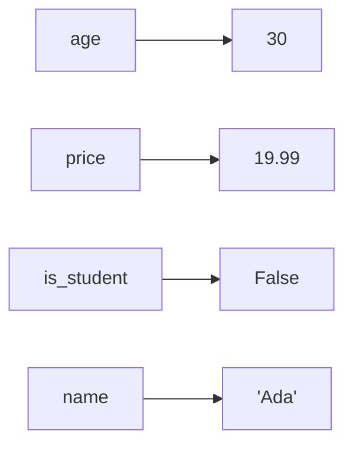
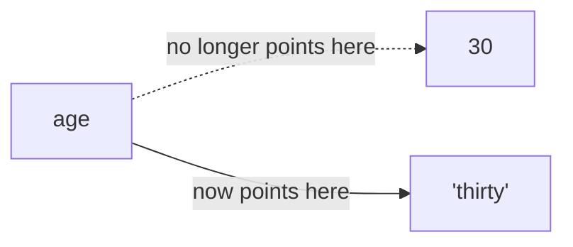

## Learning Objectives

- Explain what a variable is as a name bound to a value, and distinguish binding from the mathematical notion of a variable.
- Identify the four primitive types covered here (`int`, `float`, `bool`, `str`) and state what distinguishes each.
- Predict the result type of an arithmetic expression that mixes `int` and `float`, including `/` versus `//`.
- Explain why Python is described as dynamically typed and what consequence that has for when a type error is caught.
- Choose the correct primitive type for a given value (a count, a measurement, a flag, a piece of text) and justify the choice.

## Context & Motivation

Every programming language needs some way to refer to a piece of data without re-deriving or re-typing it every time it is used, and the mechanism nearly every language provides for this is the variable: a name, chosen by the programmer, bound to a value stored somewhere in the computer's memory. This sounds almost too simple to deserve its own lesson, and in one sense it is simple — but the *specific* rules a language uses for binding names to values, and for tracking what kind of value a name currently refers to, turn out to shape nearly everything that follows in that language, including some of its most common bugs.

Python's official tutorial introduces this material as "an informal introduction to Python" for a deliberate reason: rather than beginning with a formal grammar for declarations, it lets the interactive interpreter show, example by example, what happens when a name is bound to a number, a piece of text, or a boolean. MIT's 6.100L follows the same order in its syllabus, treating "objects, expressions, and variables" as the very first technical content students see, ahead of any control flow. That ordering is not arbitrary: control flow (branching, looping) only makes sense once there is something — a variable holding a value — for a condition to test or a loop to update. Variables and the primitive types they hold are the atoms this entire curriculum's molecules are built from.

What makes Python's variables worth a dedicated lesson, rather than a single paragraph, is a decision that differs from many other widely taught languages: Python does not require — or even allow, in the usual sense — declaring a variable's type ahead of time. A name is bound to whatever value it is assigned, and the *type* travels with the value itself, not with the name that refers to it. This is called dynamic typing, and it has real, observable consequences: the same name can be rebound to a value of a completely different type over the life of a program, and a type mismatch that a different kind of language would catch before the program even starts is, in Python, only discovered the moment the offending line actually runs. Understanding this distinction precisely — rather than picking it up by accident from error messages — is the point of this lesson.

## Core Theory

### Naming and binding

```python
age = 30             # int
price = 19.99        # float
is_student = False   # bool
name = "Ada"         # str
```

Each line *binds* a name to a value: after the first line runs, `age` refers to the integer `30`. Python determines the type from the value on the right-hand side of the assignment — this is precisely what "dynamically typed" means: the type is associated with the value and checked while the program runs, not declared and checked before the program runs. The type of any value can be inspected directly, at any point:

```python
type(age)          # <class 'int'>
type(price)        # <class 'float'>
type(is_student)   # <class 'bool'>
type(name)         # <class 'str'>
```

Rebinding a name to a value of a completely different type is legal in Python — `age = "thirty"` would make `age` refer to a `str` instead of an `int`, and Python raises no error for this. Doing so deliberately, as a genuine change in what a name represents, is a normal part of programming; doing so *by accident*, because of a typo or a forgotten conversion, is one of the more common sources of confusing bugs for a beginner, and is examined below.

### The binding model, visualized

It helps to picture a variable not as a labeled box holding a value directly, but as a name pointing at a value that exists independently:



Rebinding `age = "thirty"` does not change the integer `30` — it changes what `age` points at:



This picture becomes essential later, when lists and other mutable structures are introduced, because it is what distinguishes "rebinding a name" from "mutating the value a name refers to" — a distinction that does not yet matter for the four primitive types in this lesson, since none of them can be mutated in place, but matters a great deal once compound data is introduced.

### The four primitive types

```python
count = 7             # int   — whole numbers, arbitrary precision in Python
average = 7 / 2        # float — 3.5, has a fractional part
passed = average > 5   # bool  — True or False, the result of a comparison
label = "quiz 3"       # str   — a sequence of characters
```

`int` and `float` are both numeric types, but they are not interchangeable even in simple arithmetic. Python provides two different division operators specifically because "divide" is genuinely ambiguous between two different operations: `7 / 2` is `3.5`, a `float` — true division, which always produces a value with a fractional part when there is one. `7 // 2` is `3`, an `int` — floor division, which discards the fractional part entirely rather than rounding it. Mixing an `int` and a `float` anywhere in an arithmetic expression always produces a `float`; Python automatically promotes the less precise type up to the more precise one, never the other direction, because doing the reverse (silently truncating a `float` to fit an `int`) would silently lose information.

```python
7 / 2     # 3.5   (float — true division)
7 // 2    # 3     (int   — floor division, fraction discarded)
7.0 // 2  # 3.0   (float — same floor-division rule, but result keeps float type)
3 + 2.5   # 5.5   (int promoted to float automatically)
```

`bool` deserves particular attention because it is, technically, a specialized subtype of `int` in Python — `True` behaves as `1` and `False` behaves as `0` in arithmetic contexts — but it is conceptually its own primitive here because its intended use is entirely different: naming the two-valued result of a logical condition, not participating in arithmetic. `str` is a sequence of characters and, unlike the three numeric/logical types, supports operators (like `+` for concatenation) that mean something completely different than they do for numbers — a distinction explored fully in the next lesson on expressions.

### Dynamic typing: when errors are caught

Because Python checks types while the program runs rather than before, a type error involving a variable is invisible until the specific line using it incorrectly is actually executed:

```python
def double(value):
    return value * 2

print(double(21))     # 42 — fine, value is an int
print(double("21"))   # "2121" — no error! string repetition, not doubling
print(double([1,2]))  # [1, 2, 1, 2] — no error! list repetition
```

None of these three calls raises an error, because `*` is defined for `int`, `str`, and `list` alike — just with different meanings. A genuine type mismatch, such as trying to add a `str` and an `int` directly, does raise an error, but only at the moment that specific expression is evaluated:

```python
"5" + 3
# TypeError: can only concatenate str (not "int") to str
```

If this line lived inside a function that was never called, or inside a branch of an `if` that never executed, the type error would never surface at all — the program would run to completion having never noticed the mistake. This is the direct, practical consequence of dynamic typing: correctness with respect to types is a property of the specific execution path taken, not a property the interpreter can verify for the whole program in advance.

## Worked Examples

**Example 1 — Choosing the right type for each piece of data in a small program.** A program records a student's roll number, GPA, and whether they have passed:

```python
roll_number = 214           # int   — a discrete identifier, never has a fraction
gpa = 3.72                  # float — inherently a measured, fractional quantity
has_passed = gpa >= 2.0     # bool  — the *result* of a comparison, named for reuse

print(type(roll_number), type(gpa), type(has_passed))
# <class 'int'> <class 'float'> <class 'bool'>
```

Notice `has_passed` is not typed by writing `True`/`False` directly — it is computed from a comparison and *stored*, so that later code can read `has_passed` as a named decision instead of re-evaluating `gpa >= 2.0` every time it's needed. This is a small but real instance of the abstraction pillar from *What Is Computation*: naming the result of a condition hides the specific threshold (`2.0`) behind a meaningful name.

**Example 2 — Predicting the type and value of a mixed arithmetic expression.** Given:

```python
items = 3
price_each = 4.5
tax_rate = 0.08

subtotal = items * price_each      # int * float -> float: 13.5
tax = subtotal * tax_rate           # float * float -> float: 1.08
total_cents = int((subtotal + tax) * 100)   # explicit conversion to int
```

Walking through this step by step: `items * price_each` multiplies an `int` by a `float`, so Python promotes `items` to `3.0` internally and the result, `13.5`, is a `float`. `subtotal * tax_rate` is `float * float`, staying a `float`: `1.08`. The final line deliberately converts to `int` with an explicit call, because `total_cents` is meant to represent a whole number of cents — leaving it as a `float` would invite the approximation issues covered in floating-point arithmetic, where a value that should be exactly `1458` might print as `1457.9999999999998`.

**Example 3 — A typo that creates a bug without an error.** A student intends to accumulate a running total across three updates but misspells the variable name on one line:

```python
total = 0
total = total + 10
totl = total + 5     # typo: creates a NEW variable "totl", doesn't touch "total"
total = total + 20

print(total)   # 30 — the +5 silently never happened
```

Because Python does not require declaring variables ahead of time, `totl = total + 5` is not a syntax error and not a runtime error — it is a perfectly legal statement that creates a brand-new, unrelated variable named `totl`. The bug is entirely silent: the program runs to completion and prints a plausible-looking but wrong number, `30` instead of the intended `35`. Finding this kind of bug requires checking every variable name against its intended spelling, since Python's type and binding rules provide no automatic protection against it.

## Common Misconceptions & Pitfalls

- **"A variable is a labeled box that holds its value."** The more accurate mental model, shown in the diagram above, is a name that *points at* a value; this distinction is invisible for `int`/`float`/`bool`/`str` because none of them are mutable, but it becomes essential once lists and other mutable structures are introduced, where two different names can point at the *same* value.
- **"Since Python doesn't require type declarations, type mistakes just can't happen."** They can — they are simply deferred to run time and only affect the code paths actually executed, as shown in the `double(value)` example above. Dynamic typing does not mean type-*safe*; it means type-checked *late*.
- **"A misspelled variable name will cause an error, the same way a misspelled function name does."** It usually will not. Assigning to a new name (`totl = ...`) silently creates that name rather than raising an error, which is exactly why the bug in the third worked example produces a wrong number instead of a crash — there is nothing to catch unless the *read* of the misspelled name happens before it was ever assigned, which does raise `NameError`.
- **"Choosing `float` instead of `int` for a whole-number count is a harmless stylistic choice."** It is not harmless: a loop counter, an index, or a count of discrete items should be `int` specifically because `float` values carry the approximation behavior discussed in floating-point arithmetic — comparing two `float` counts for exact equality can fail even when, mathematically, they should be equal.

## Summary

A variable in Python is a name bound to a value; the type travels with the value, not with the name, which is what "dynamically typed" means in practice — and it means type errors surface only when the specific offending line actually executes, not before. The four primitive types covered here split cleanly by purpose: `int` for exact whole quantities, `float` for measured or fractional quantities (with the tradeoff that `/` and `//` mean genuinely different operations), `bool` for the named result of a logical condition, and `str` for text. Rebinding a name to a different type is legal and sometimes intentional, but an accidental typo that creates an unrelated new name is a real, silent-bug-producing hazard precisely because Python raises no error for it. Choosing the type that matches what a value actually represents — a count as `int`, not `float`; a flag as `bool`, not a raw comparison re-evaluated everywhere — is a small discipline that prevents several classes of bugs covered in later lessons.

## Documentation Links

- [Python Tutorial — An Informal Introduction to Python](https://docs.python.org/3/tutorial/introduction.html) — doc
- [MIT 6.100L — Syllabus](https://ocw.mit.edu/courses/6-100l-introduction-to-cs-and-programming-using-python-fall-2022/pages/syllabus/) — doc
