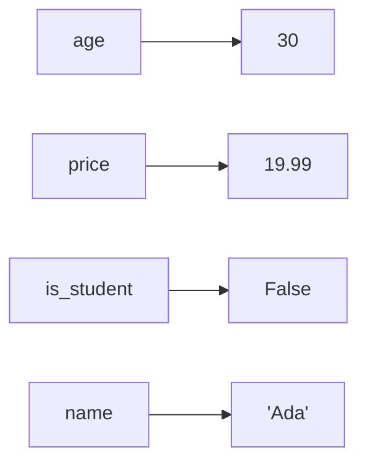
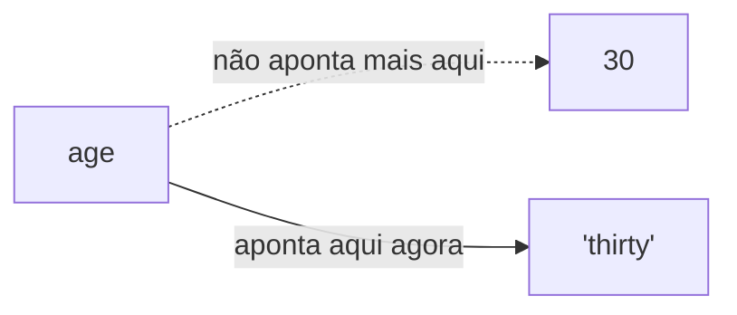

## Objetivos de Aprendizagem

- Explique o que é uma variável como um nome vinculado a um valor, e diferencie essa vinculação (binding) da noção matemática de variável.
- Identifique os quatro tipos primitivos abordados aqui (`int`, `float`, `bool`, `str`) e explique o que distingue cada um.
- Preveja o tipo resultante de uma expressão aritmética que mistura `int` e `float`, incluindo `/` versus `//`.
- Explique por que Python é descrito como uma linguagem de tipagem dinâmica e qual a consequência disso para o momento em que um erro de tipo é detectado.
- Escolha o tipo primitivo correto para um determinado valor (uma contagem, uma medida, um sinalizador, um texto) e justifique a escolha.

## Contexto e Motivação

Toda linguagem de programação precisa de alguma forma de se referir a um dado sem precisar recalculá-lo ou redigitá-lo cada vez que ele é usado, e o mecanismo que quase toda linguagem oferece para isso é a variável: um nome, escolhido pelo programador, vinculado a um valor armazenado em algum lugar da memória do computador. Isso soa simples demais para merecer uma lição própria e, em certo sentido, é simples mesmo. Porém, as regras *específicas* que uma linguagem usa para vincular nomes a valores, e para rastrear que tipo de valor um nome representa em determinado momento, acabam moldando quase tudo o que vem depois nessa linguagem, incluindo alguns dos bugs mais comuns dela.

O tutorial oficial de Python apresenta esse material como "uma introdução informal ao Python" por um motivo deliberado: em vez de começar com uma gramática formal de declarações, ele deixa o interpretador interativo mostrar, exemplo por exemplo, o que acontece quando um nome é vinculado a um número, a um texto ou a um booleano. O 6.100L do MIT segue a mesma ordem em sua ementa, tratando "objetos, expressões e variáveis" como o primeiríssimo conteúdo técnico que os alunos veem, antes de qualquer estrutura de controle de fluxo. Essa ordem não é arbitrária: o controle de fluxo (ramificação, repetição) só faz sentido quando já existe algo (uma variável guardando um valor) para uma condição testar ou um laço atualizar. Variáveis e os tipos primitivos que elas guardam são os átomos a partir dos quais as moléculas de todo este currículo são construídas.

O que torna as variáveis em Python merecedoras de uma lição dedicada, e não apenas um parágrafo, é uma decisão que difere de muitas outras linguagens amplamente ensinadas: Python não exige, nem sequer permite, no sentido usual, declarar o tipo de uma variável com antecedência. Um nome é vinculado a qualquer valor que lhe seja atribuído, e o *tipo* viaja junto com o próprio valor, não com o nome que o referencia. Isso se chama tipagem dinâmica, e tem consequências reais e observáveis: o mesmo nome pode ser revinculado a um valor de tipo completamente diferente ao longo da vida de um programa, e uma incompatibilidade de tipo que outro tipo de linguagem detectaria antes mesmo do programa começar a rodar só é descoberta, em Python, no instante em que a linha problemática é de fato executada. Entender essa distinção com precisão, em vez de aprendê-la por acidente a partir de mensagens de erro, é o objetivo desta lição.

## Teoria Central

### Nomeação e vinculação

```python
age = 30             # int
price = 19.99        # float
is_student = False   # bool
name = "Ada"         # str
```

Cada linha *vincula* um nome a um valor: depois que a primeira linha executa, `age` se refere ao inteiro `30`. Python determina o tipo a partir do valor do lado direito da atribuição: é exatamente isso que "tipagem dinâmica" significa, o tipo é associado ao valor e verificado enquanto o programa roda, não declarado e verificado antes de o programa começar. O tipo de qualquer valor pode ser inspecionado diretamente, a qualquer momento:

```python
type(age)          # <class 'int'>
type(price)        # <class 'float'>
type(is_student)   # <class 'bool'>
type(name)         # <class 'str'>
```

Revincular um nome a um valor de tipo completamente diferente é permitido em Python: `age = "thirty"` faria `age` passar a se referir a uma `str` em vez de um `int`, e Python não gera nenhum erro por isso. Fazer isso deliberadamente, como uma mudança genuína no que um nome representa, é parte normal da programação; fazer isso *por acidente*, por causa de um erro de digitação ou de uma conversão esquecida, é uma das fontes mais comuns de bugs confusos para iniciantes, e é examinado mais adiante.

### O modelo de vinculação, visualizado

Ajuda imaginar uma variável não como uma caixa rotulada que guarda um valor diretamente, mas como um nome que aponta para um valor que existe de forma independente:



Revincular `age = "thirty"` não altera o inteiro `30`: isso muda para onde `age` aponta:



Essa imagem se torna essencial mais adiante, quando listas e outras estruturas mutáveis forem introduzidas, porque é ela que distingue "revincular um nome" de "mutar o valor ao qual um nome se refere". Essa distinção ainda não importa para os quatro tipos primitivos desta lição, já que nenhum deles pode ser mutado no lugar, mas importa muito assim que dados compostos forem introduzidos.

### Os quatro tipos primitivos

```python
count = 7             # int: números inteiros, precisão arbitrária em Python
average = 7 / 2        # float: 3.5, tem parte fracionária
passed = average > 5   # bool: True ou False, resultado de uma comparação
label = "quiz 3"       # str: uma sequência de caracteres
```

`int` e `float` são ambos tipos numéricos, mas não são intercambiáveis nem mesmo em aritmética simples. Python oferece dois operadores de divisão diferentes justamente porque "dividir" é genuinamente ambíguo entre duas operações distintas: `7 / 2` é `3.5`, um `float` (divisão verdadeira, que sempre produz um valor com parte fracionária quando ela existe). `7 // 2` é `3`, um `int` (divisão inteira, que descarta a parte fracionária por completo em vez de arredondá-la). Misturar um `int` e um `float` em qualquer ponto de uma expressão aritmética sempre produz um `float`; Python promove automaticamente o tipo menos preciso para o mais preciso, nunca o contrário, porque fazer o inverso (truncar silenciosamente um `float` para caber em um `int`) perderia informação silenciosamente.

```python
7 / 2     # 3.5   (float, divisão verdadeira)
7 // 2    # 3     (int, divisão inteira, descarta a fração)
7.0 // 2  # 3.0   (float, mesma regra de divisão inteira, mas o resultado mantém o tipo float)
3 + 2.5   # 5.5   (int promovido a float automaticamente)
```

`bool` merece atenção especial porque é, tecnicamente, um subtipo especializado de `int` em Python (`True` se comporta como `1` e `False` se comporta como `0` em contextos aritméticos), mas aqui é tratado conceitualmente como um primitivo próprio, porque seu uso pretendido é totalmente diferente: nomear o resultado de dois valores de uma condição lógica, não participar de contas aritméticas. `str` é uma sequência de caracteres e, diferente dos outros três tipos numéricos/lógicos, aceita operadores (como `+` para concatenação) que significam algo completamente diferente do que significam para números, uma distinção explorada por completo na próxima lição sobre expressões.

### Tipagem dinâmica: quando os erros são detectados

Como Python verifica tipos enquanto o programa roda, e não antes, um erro de tipo envolvendo uma variável fica invisível até que a linha específica que a usa incorretamente seja de fato executada:

```python
def double(value):
    return value * 2

print(double(21))     # 42: tudo certo, value é um int
print(double("21"))   # "2121": sem erro! repetição de string, não dobra
print(double([1,2]))  # [1, 2, 1, 2]: sem erro! repetição de lista
```

Nenhuma dessas três chamadas gera um erro, porque `*` é definido tanto para `int` quanto para `str` e `list`, só que com significados diferentes. Uma incompatibilidade de tipo genuína, como tentar somar diretamente uma `str` e um `int`, de fato gera um erro, mas só no momento em que essa expressão específica é avaliada:

```python
"5" + 3
# TypeError: can only concatenate str (not "int") to str
```

Se essa linha estivesse dentro de uma função nunca chamada, ou dentro de um ramo de um `if` que nunca executou, o erro de tipo jamais viria à tona: o programa rodaria até o fim sem nunca notar o problema. Essa é a consequência direta e prática da tipagem dinâmica: a correção em relação a tipos é uma propriedade do caminho de execução específico percorrido, não uma propriedade que o interpretador consiga verificar para o programa inteiro de antemão.

## Exemplos Resolvidos

**Exemplo 1: escolhendo o tipo certo para cada dado em um programa pequeno.** Um programa registra o número de matrícula de um aluno, sua média (GPA) e se ele foi aprovado:

```python
roll_number = 214           # int: um identificador discreto, nunca tem fração
gpa = 3.72                  # float: quantidade inerentemente medida e fracionária
has_passed = gpa >= 2.0     # bool: o *resultado* de uma comparação, nomeado para reutilização

print(type(roll_number), type(gpa), type(has_passed))
# <class 'int'> <class 'float'> <class 'bool'>
```

Note que `has_passed` não é digitado escrevendo `True`/`False` diretamente: ele é calculado a partir de uma comparação e *armazenado*, de forma que o código posterior possa ler `has_passed` como uma decisão nomeada, em vez de reavaliar `gpa >= 2.0` toda vez que for necessário. Essa é uma instância pequena, mas real, do pilar de abstração de *What Is Computation*: nomear o resultado de uma condição esconde o limiar específico (`2.0`) atrás de um nome significativo.

**Exemplo 2: prevendo o tipo e o valor de uma expressão aritmética mista.** Dado:

```python
items = 3
price_each = 4.5
tax_rate = 0.08

subtotal = items * price_each      # int * float -> float: 13.5
tax = subtotal * tax_rate           # float * float -> float: 1.08
total_cents = int((subtotal + tax) * 100)   # conversão explícita para int
```

Passo a passo: `items * price_each` multiplica um `int` por um `float`, então Python promove `items` para `3.0` internamente, e o resultado, `13.5`, é um `float`. `subtotal * tax_rate` é `float * float`, permanecendo `float`: `1.08`. A última linha converte deliberadamente para `int` com uma chamada explícita, porque `total_cents` deve representar um número inteiro de centavos; deixá-lo como `float` convidaria os problemas de aproximação abordados em aritmética de ponto flutuante, onde um valor que deveria ser exatamente `1458` pode ser exibido como `1457.9999999999998`.

**Exemplo 3: um erro de digitação que cria um bug sem gerar erro.** Um aluno pretende acumular um total corrente ao longo de três atualizações, mas escreve errado o nome da variável em uma linha:

```python
total = 0
total = total + 10
totl = total + 5     # erro de digitação: cria uma NOVA variável "totl", não altera "total"
total = total + 20

print(total)   # 30: o +5 silenciosamente nunca aconteceu
```

Como Python não exige declarar variáveis com antecedência, `totl = total + 5` não é um erro de sintaxe nem um erro em tempo de execução: é uma instrução perfeitamente legal que cria uma variável nova e sem relação nenhuma, chamada `totl`. O bug é totalmente silencioso: o programa roda até o fim e imprime um número que parece plausível, mas está errado, `30` em vez do esperado `35`. Encontrar esse tipo de bug exige conferir cada nome de variável contra sua grafia pretendida, já que as regras de tipo e vinculação de Python não oferecem nenhuma proteção automática contra isso.

## Equívocos Comuns e Armadilhas

- **"Uma variável é uma caixa rotulada que guarda seu valor."** O modelo mental mais preciso, mostrado no diagrama acima, é o de um nome que *aponta para* um valor; essa distinção é invisível para `int`/`float`/`bool`/`str`, porque nenhum deles é mutável, mas se torna essencial assim que listas e outras estruturas mutáveis são introduzidas, onde dois nomes diferentes podem apontar para o *mesmo* valor.
- **"Como Python não exige declarações de tipo, erros de tipo simplesmente não podem acontecer."** Podem sim: eles simplesmente ficam adiados para o tempo de execução e só afetam os caminhos de código efetivamente executados, como mostrado no exemplo `double(value)` acima. Tipagem dinâmica não significa *segura* quanto a tipos; significa verificada *tarde*.
- **"Um nome de variável escrito errado vai causar um erro, da mesma forma que um nome de função escrito errado causa."** Geralmente não vai. Atribuir a um nome novo (`totl = ...`) cria esse nome silenciosamente, em vez de gerar um erro, e é exatamente por isso que o bug no terceiro exemplo resolvido produz um número errado em vez de uma quebra do programa: não há nada a ser capturado, a menos que a *leitura* do nome escrito errado aconteça antes de ele ter sido atribuído alguma vez, o que aí sim gera um `NameError`.
- **"Escolher `float` em vez de `int` para uma contagem de números inteiros é uma escolha estilística inofensiva."** Não é inofensiva: um contador de laço, um índice ou uma contagem de itens discretos deve ser `int` justamente porque valores `float` carregam o comportamento de aproximação discutido em aritmética de ponto flutuante; comparar duas contagens `float` quanto à igualdade exata pode falhar mesmo quando, matematicamente, elas deveriam ser iguais.

## Resumo

Uma variável em Python é um nome vinculado a um valor; o tipo viaja com o valor, não com o nome, e é isso que "tipagem dinâmica" significa na prática: erros de tipo só vêm à tona quando a linha específica problemática de fato executa, não antes. Os quatro tipos primitivos abordados aqui se dividem claramente por finalidade: `int` para quantidades inteiras exatas, `float` para quantidades medidas ou fracionárias (com o detalhe de que `/` e `//` significam operações genuinamente diferentes), `bool` para o resultado nomeado de uma condição lógica, e `str` para texto. Revincular um nome a um tipo diferente é permitido e às vezes intencional, mas um erro de digitação acidental que cria um nome novo e sem relação é um risco real, capaz de produzir bugs silenciosos, justamente porque Python não gera erro nenhum por isso. Escolher o tipo que corresponde ao que um valor realmente representa (uma contagem como `int`, não `float`; um sinalizador como `bool`, não uma comparação bruta reavaliada em todo lugar) é uma pequena disciplina que evita várias classes de bugs abordadas em lições posteriores.

## Documentation Links

- [Python Tutorial: uma introdução informal ao Python](https://docs.python.org/3/tutorial/introduction.html) (doc)
- [MIT 6.100L: ementa do curso](https://ocw.mit.edu/courses/6-100l-introduction-to-cs-and-programming-using-python-fall-2022/pages/syllabus/) (doc)
